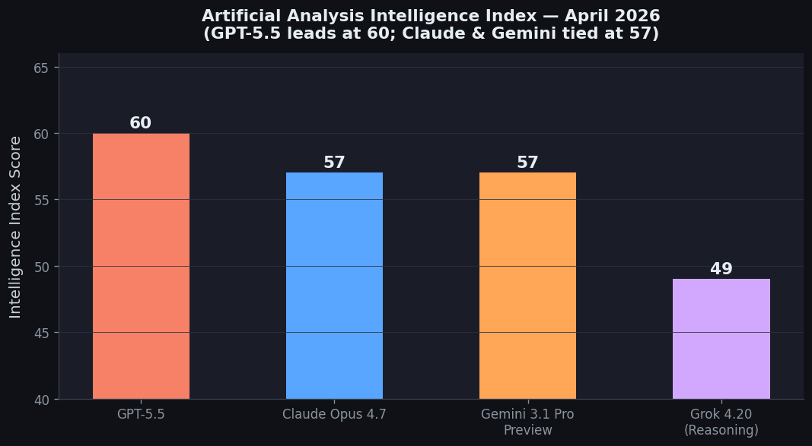
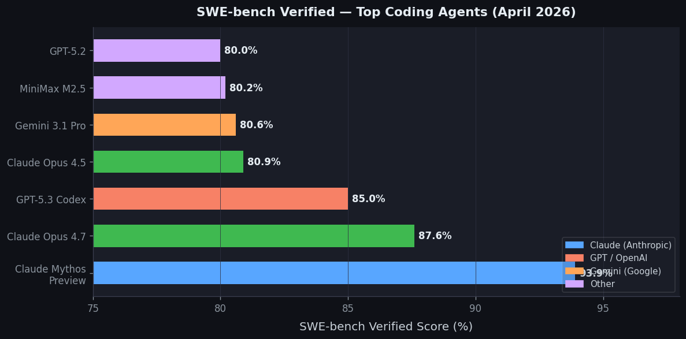
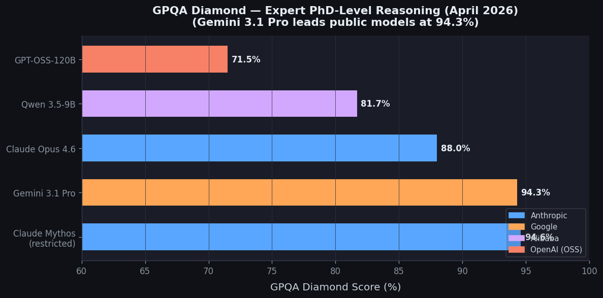
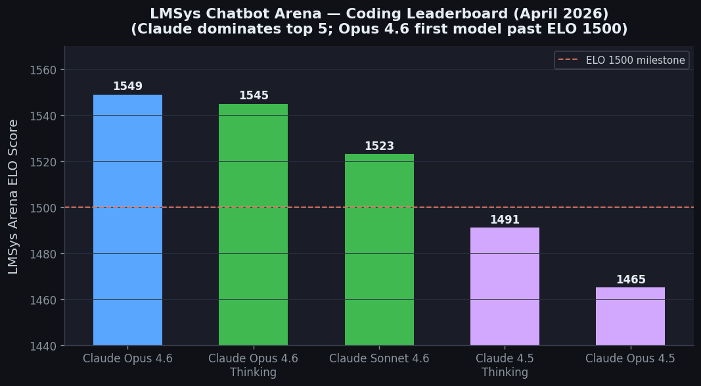
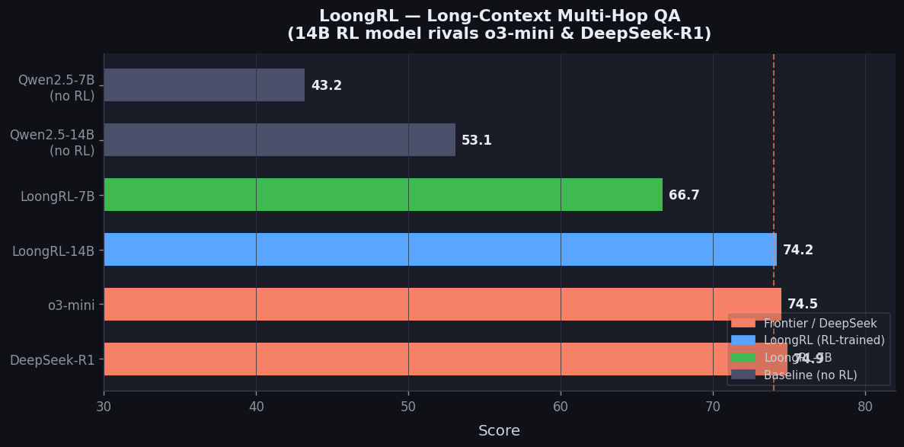
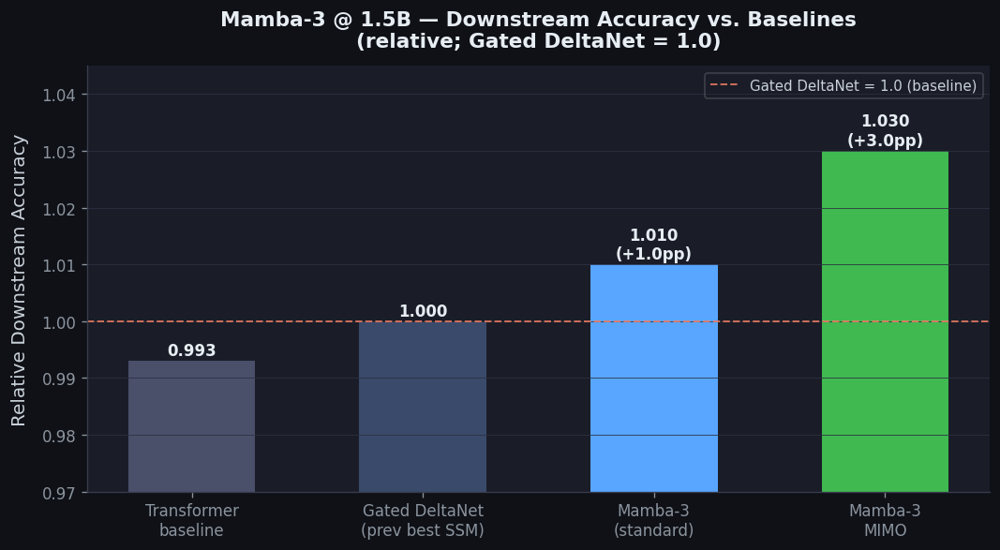
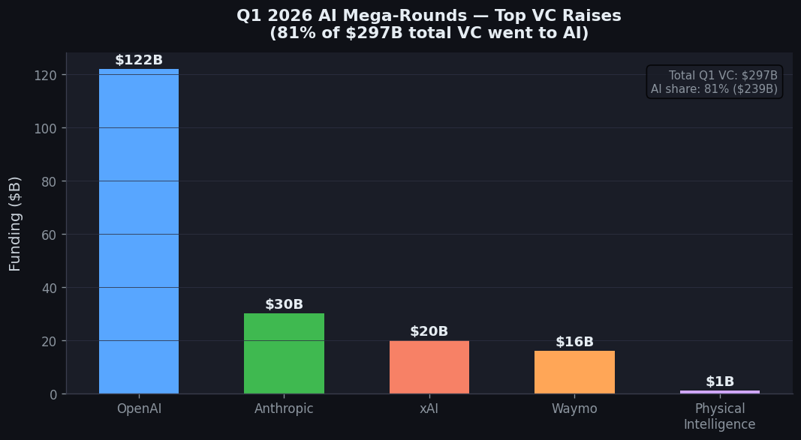
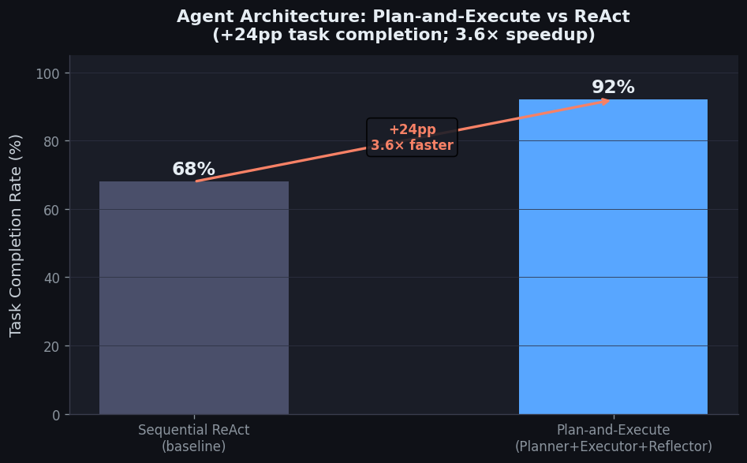
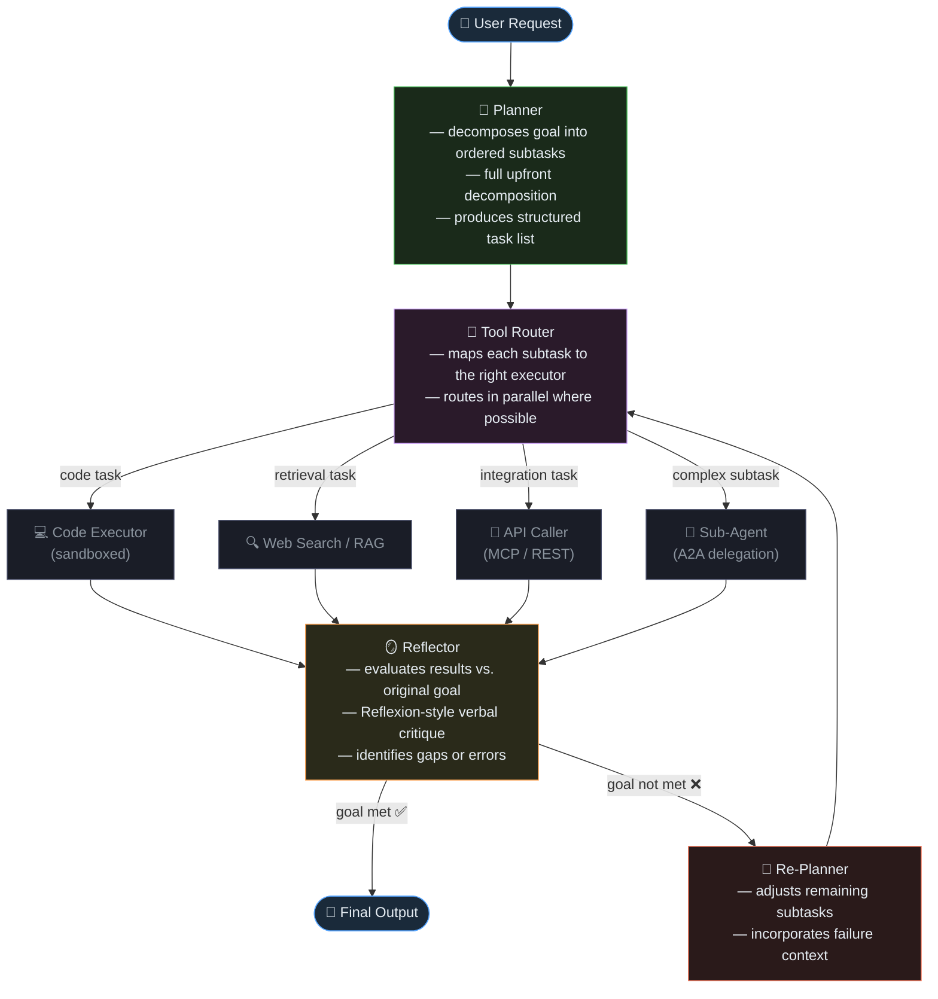

# AI News Daily Digest — 2026-04-23
*Compiled by OMAR for ML Research & Agentic Engineering*

---

## At a Glance (TL;DR)

- **GPT-5.5 launched today** — OpenAI's fully retrained agentic model tops the Intelligence Index (60), ARC-AGI-2 (85%), and Terminal-Bench 2.0 (82.7%); available to ChatGPT Plus/Pro/Enterprise now, API coming soon at $5/$30 per 1M tokens
- **ICLR 2026 opens in Rio** (April 23–27) — ParaRNN (Apple) trains 7B-parameter RNNs 665× faster via parallel Newton iterations, resurrecting classical RNNs as a large-scale architecture candidate with O(1) inference
- **Mamba-3 (CMU/Princeton/Together AI)** — complex-valued states + MIMO decoding delivers 7× faster inference than Transformers and +1.8pp downstream accuracy at 1.5B scale
- **LoongRL-14B (Microsoft Research, ICLR Oral)** — RL + synthetic KeyChain curriculum pushes a 14B model to 74.2 on long-context reasoning, on par with o3-mini (74.5) and DeepSeek-R1 (74.9)
- **ICLR Outstanding Paper** — "Transformers are Inherently Succinct" proves Transformers exponentially more concise than RNNs/SSMs, doubly-exponentially more concise than finite automata; property verification is EXPSPACE-complete
- **Google went full-stack agentic** — Vertex AI rebranded as Gemini Enterprise Agent Platform with Agent Studio, Registry, Identity, Gateway, and Observability; A2A v1.2 in production at 150+ orgs, now Linux Foundation governed
- **Anthropic's Claude Mythos is real but permanently gated** — autonomously identified a 17-year-old RCE in FreeBSD; only ~50 vetted orgs get access via Project Glasswing; Anthropic revenue now exceeds $30B annualized
- **Q1 2026 VC shattered records** — $297B total, 81% ($239B) captured by AI; OpenAI's $122B is the largest single VC round in history; four mega-rounds alone exceeded all of 2024's activity
- **MCP has a critical unpatched RCE vulnerability** affecting 7,000+ public servers and 150M+ downloads; Anthropic considers sanitization the developer's responsibility — govern your MCP servers now
- **Tesla raised 2026 capex to $25B** (3× last year) for Optimus humanoid robots, Cybercab, and a new AI chip fab; SpaceX separately plans to manufacture its own GPUs
- **Claude Opus 4.6 still rules coding** — #1 LMSys Arena overall (Elo 1504) and coding (Elo 1549); 80.8% SWE-bench Verified; first model to break ELO 1500 on code
- **Open-source is within striking distance** — Llama 4 Scout (10M context, $0.08/1M), Qwen 3.5 (Apache 2.0, 397B MoE), GLM-5.1 (MIT, beats frontier on SWE-Bench Pro)

---

## What This Means For Your Work

### For ML Research

- **ParaRNN is the architecture paper to read this week.** If you work on latency-critical or memory-constrained inference (edge, mobile, streaming), this opens classical RNNs as a viable billion-parameter architecture class — the last obstacle (sequential training) is now solved. Download the [open-source codebase](https://github.com/apple/ml-pararnn) and experiment with your sequence modeling tasks.
- **RL + synthetic curriculum is underexplored relative to architecture search.** LoongRL's KeyChain — converting short multi-hop QA into 128K-token tasks with UUID chains — induced emergent *plan→retrieve→reason→recheck* behavior in a 14B model, reaching o3-mini quality. Try reward shaping + curriculum design before scaling your model.
- **Theory of Transformer expressiveness is now rigorous.** "Transformers are Inherently Succinct" (ICLR Outstanding Paper) gives safety/interpretability researchers a formal framework: property verification is EXPSPACE-complete. This bounds what is and isn't computationally tractable to prove about Transformer behavior.
- **HyperP/Muon makes scaling experiments cheaper.** Learning rate transferability across width, depth, and token count means you can run proxy experiments at small scale and reliably extrapolate hyperparameter choices to larger models — critical if you don't have frontier compute.
- **The inference-efficiency frontier is moving fast.** Mamba-3 (7× faster) and ParaRNN (O(1) per-token) both point the same direction: as deployment costs dominate, inference efficiency is becoming a first-class design criterion alongside quality.

### For Agentic Engineering

- **Adopt MCP + A2A as your interoperability baseline now.** With A2A at 150+ orgs (Linux Foundation governed) and every major cloud natively supporting MCP, these two protocols are the de-facto enterprise agent interop stack. MCP = agent↔tool; A2A = agent↔agent. Expect senior agentic engineers to need both by H2 2026.
- **Shift to Plan-and-Execute architectures over pure ReAct.** Benchmarks show 92% vs 68% task completion and 3.6× speedup. LangGraph's StateGraph is the most production-mature framework: use it for anything requiring checkpointing, time-travel debugging, or error recovery.
- **Treat sandboxed execution as non-negotiable.** The MCP RCE vulnerability (150M+ downloads affected) is a live threat. Budget for isolated container environments from day one — both OpenAI Agents SDK and Claude Managed Agents have moved here; follow them.
- **SWE-bench Pro (not Verified) is now the honest benchmark signal.** Claude Opus 4.5 scores 80.9% on Verified but only 45.9% on Pro. If evaluating coding agents for real-world use, use Pro-grade evals or build internal eval sets against your actual codebase.
- **Design agent identity from day one.** Google's Agent Identity, A2A v1.2 signed cards, and Cloudflare's MCP governance architecture all signal that agents in regulated environments will require OAuth-style delegation, capability scopes, and audit trails. Retrofitting identity is painful.

---

## Best Models Snapshot

*Artificial Analysis Intelligence Index, April 2026: GPT-5.5 leads at 60; Claude Opus 4.7 and Gemini 3.1 Pro tied at 57.*

### Model Comparison Table

| Model | Provider | Context Window | Input $/1M | Output $/1M | Modalities |
|---|---|---|---|---|---|
| **GPT-5.5** | OpenAI | 1M | $5.00 | $30.00 | Text, Image |
| **GPT-5.4** | OpenAI | 1M | $2.50 | $15.00 | Text, Image |
| **Claude Opus 4.7** | Anthropic | 1M (beta) | $5.00 | $25.00 | Text, Image |
| **Claude Opus 4.6** | Anthropic | 1M (beta) | $5.00 | $25.00 | Text, Image |
| **Claude Sonnet 4.6** | Anthropic | 200K | $3.00 | $15.00 | Text, Image |
| **Gemini 3.1 Pro** | Google | 1M | $2.00/$4.00† | $12.00/$18.00† | Text, Image, Audio, Video |
| **Grok 4.20** | xAI | 2M | $2.00 | ~$10.00 | Text, Image, Tools |
| **Llama 4 Maverick** | Meta | 1M | $0.17 | $0.60 | Text, Image |
| **Llama 4 Scout** | Meta | 10M | $0.08 | $0.30 | Text, Image |
| **Qwen 3.5-397B-A17B** | Alibaba | 256K | Open weights | Open weights | Text (201 languages) |
| **Mistral Large 3** | Mistral | 128K | Open weights | Open weights | Text (40+ languages) |
| **DeepSeek R1** | DeepSeek | 128K | Open weights | Open weights | Text (reasoning) |
| **GLM-5.1** | Zhipu AI | TBD | Open (MIT) | Open (MIT) | Text |

†Gemini 3.1 Pro: $2/$12 for ≤200K tokens; $4/$18 for >200K tokens

---

## Benchmark Highlights

### SWE-bench Verified — Coding Agents

Claude Mythos Preview leads at 93.9%, with Claude Opus 4.7 next at 87.6%. Note: SWE-bench **Pro** (harder, anti-overfitting) tells a more honest story — Claude Opus 4.7 scores 64.3% on Pro vs. 87.6% on Verified. Always prefer Pro-grade evals for real-world coding capability assessment.

---

### GPQA Diamond — PhD-Level Expert Reasoning

Gemini 3.1 Pro leads public models at 94.3% on this elite benchmark of graduate-level STEM problems, essentially tied with restricted Claude Mythos (94.6%). For cutting-edge scientific reasoning pipelines, Gemini 3.1 Pro is the most cost-effective public option.

---

### LMSys Arena — Coding Leaderboard

Claude completely dominates the coding arena. Claude Opus 4.6 (Elo 1549) is the first model ever to break ELO 1500 on coding — a significant milestone reflecting genuine human preference at scale, not just benchmark tuning.

---

### LoongRL — Long-Context Multi-Hop QA

Microsoft's RL framework with synthetic KeyChain curriculum brings a 14B model to frontier-level long-context reasoning — within 0.3 points of o3-mini and 0.7 of DeepSeek-R1 — without any architecture advantages.

---

### Mamba-3 — Downstream Accuracy @ 1.5B Parameters

Mamba-3's MIMO variant adds +1.8pp over Gated DeltaNet and even edges out the Transformer baseline at this scale, while running 7× faster at inference. Complex-valued state updates are the key innovation enabling richer dynamics at half the state size of Mamba-2.

---

### Q1 2026 Venture Capital — AI Mega-Rounds

The scale of capital flowing into frontier AI is historic. OpenAI's $122B round alone exceeds many nations' annual R&D budgets. The four mega-rounds together ($188B) roughly equal the GDP of New Zealand.

---

### Agent Architecture: Plan-and-Execute vs ReAct

The most impactful pattern shift in production agentic engineering: upfront decomposition + parallel execution + Reflexion-style critique yields a 24-percentage-point improvement in task completion and 3.6× speedup over the traditional sequential ReAct loop.

---

## Architecture / Pattern of the Day

### Plan-and-Execute with Reflection — The Production-Grade Agentic Pattern

The dominant production architecture for complex multi-step agents in 2026: separate the planning, execution, and reflection concerns into discrete components, enabling parallelism in execution and structured recovery from failures.

**Framework recommendations by use-case:**

| Framework | Best For |
|---|---|
| **LangGraph** | Production; complex error recovery; checkpointing/time-travel debugging |
| **CrewAI** | Rapid prototyping; role-assignment workflows |
| **AutoGen / AG2** | Research; dynamic conversational agent groups |
| **OpenAI Agents SDK** | Sandboxed code execution; long-horizon tasks |
| **Claude Managed Agents** | Secure, audited autonomous deployments with memory |

**Key insight from today's Google announcement:** Agents are becoming software principals — they carry cryptographic identity (signed agent cards, akin to X.509 certs), OAuth-style delegation tokens, and capability scopes. The Gemini Enterprise Agent Platform's Agent Identity layer is the first production-grade implementation of this pattern at cloud scale.

---

## Section: Machine Learning Research

> **Note:** ICLR 2026 opens today (April 23–27) in Rio de Janeiro, Brazil — the dominant source of today's ML research news. Outstanding Paper Awards were also announced today.

---

### 1. ICLR 2026 Outstanding Papers Announced — "Transformers are Inherently Succinct" Wins Top Honor
**Source:** [ICLR Blog — Announcing the ICLR 2026 Outstanding Papers](https://blog.iclr.cc/2026/04/23/announcing-the-iclr-2026-outstanding-papers/)

On opening day of ICLR 2026, the program chairs announced the Outstanding Papers, with two papers earning top recognition. The headline winner is **"Transformers are Inherently Succinct"** by Pascal Bergsträßer, Ryan Cotterell, and Anthony Widjaja Lin. The paper introduces *succinctness* as a formal measure of expressive power, proving that Transformers can represent formal languages exponentially more succinctly than LTL formulas and classical RNNs/SSMs, and doubly-exponentially more succinctly than finite automata.

**Key technical details:**
- Proves Transformer succinctness advantage is exponential over Linear Temporal Logic (LTL) and RNN-class models (including SSMs)
- Proves Transformer succinctness advantage is *doubly-exponential* over finite automata
- Shows that verifying properties of Transformers is **EXPSPACE-complete** — a concrete computational hardness result with implications for interpretability and safety
- Paper arXiv: [2510.19315](https://arxiv.org/abs/2510.19315) | [OpenReview](https://openreview.net/pdf?id=Yxz92UuPLQ)

---

### 2. ParaRNN: Apple Achieves 665× Speedup for Training Nonlinear RNNs at Scale (ICLR 2026 Oral)
**Source:** [Apple ML Research — ParaRNN](https://machinelearning.apple.com/research/pararnn) | [arXiv 2510.21450](https://arxiv.org/abs/2510.21450) | [GitHub](https://github.com/apple/ml-pararnn)

Apple researchers presented **ParaRNN**, a framework that unlocks parallel training of nonlinear RNNs, enabling the first 7-billion-parameter classical RNNs to be trained competitively against Transformers. Historically, the sequential dependency of RNN hidden states made large-scale training impractical; ParaRNN resolves this by recasting the recurrence as a system of equations solved via Newton's iterations with custom parallel reductions.

**Key technical details:**
- Achieves **665× wall-clock speedup** over sequential training on the same hardware
- Successfully trains **7B-parameter LSTM and GRU** adaptations to perplexity competitive with Transformers and Mamba-2 at the same scale
- Mathematical core: treats `h_t = f(h_{t-1}, x_t)` as a fixed-point system `F(H) = 0` solved in parallel via Newton's method
- Particularly relevant for **on-device / resource-constrained inference**, where RNNs' O(1) per-token inference cost is a major advantage over Transformers' O(n) KV-cache growth

**The core mathematical insight:**

Given a nonlinear recurrence `h_t = f(h_{t-1}, x_t)`, the full trajectory `H = [h_1, ..., h_T]` satisfies `F(H) = 0` where `F_t(H) = h_t - f(h_{t-1}, x_t)`. This is solved via Newton's iterations: `H^{k+1} = H^k - [J_F(H^k)]^{-1} · F(H^k)`. Each Newton step computes in parallel across all `t` using custom parallel scan/reduction — convergence in O(log T) iterations.

---

### 3. Mamba-3: Inference-First SSM Beats Transformers by ~4%, Runs 7× Faster (ICLR 2026)
**Source:** [OpenReview — Mamba-3](https://openreview.net/forum?id=HwCvaJOiCj) | [arXiv 2603.15569](https://arxiv.org/abs/2603.15569)

From Carnegie Mellon, Princeton, and Together AI, **Mamba-3** targets inference efficiency. Three improvements over Mamba-2: (1) improved SSM discretization, (2) **complex-valued state updates** enabling richer dynamics, and (3) **multi-input multi-output (MIMO)** decoding. Result: 7× faster than Transformers at long sequences with +1.8pp accuracy at 1.5B scale.

**Key technical details:**
- Mamba-3 MIMO: +1.8pp over Gated DeltaNet at 1.5B scale
- Comparable perplexity to Mamba-2 using **half the state size**
- MIMO increases decoding FLOPs by up to 4× relative to Mamba-2 at fixed state size, same wall-clock latency

---

### 4. LoongRL: RL-Trained 14B Model Matches o3-mini on Long-Context Reasoning (ICLR 2026 Oral)
**Source:** [LoongRL Project](https://loongrl.github.io/) | [arXiv 2510.19363](https://arxiv.org/abs/2510.19363) | [Microsoft Research](https://www.microsoft.com/en-us/research/publication/loongrl-reinforcement-learning-for-advanced-reasoning-over-long-contexts/)

Microsoft Research's **LoongRL** uses **KeyChain** — a data synthesis technique converting short multi-hop QA into 128K-token tasks via UUID-linked chains through distractor document pools. RL training induces emergent *plan→retrieve→reason→recheck* behavior.

**Key technical details:**
- Improves long-context multi-hop QA on Qwen2.5-7B by **+23.5% absolute** and 14B by **+21.1% absolute**
- **LoongRL-14B scores 74.2** — rivaling o3-mini (74.5) and DeepSeek-R1 (74.9)
- Trained at **16K context, generalizes to 128K** without full-length rollout costs

---

### 5. HyperP / Muon Optimizer: Transferable Scaling Laws via Hypersphere Parameterization
**Source:** [Microsoft Research — HyperP](https://www.microsoft.com/en-us/research/publication/rethinking-language-model-scaling-under-transferable-hypersphere-optimization/)

**HyperP** constrains weight matrices to a fixed-norm hypersphere under the **Muon optimizer**, enabling optimal learning rates to transfer across model width, depth, training token count, and MoE granularity. **SLDAgent** can autonomously discover scaling laws more accurately than human-derived counterparts.

---

### Analysis & Impact for ML Researchers

- **RNNs are credible at scale again.** ParaRNN removes the last major obstacle to billion-parameter classical RNNs. O(1) per-token inference makes them compelling for edge, mobile, and streaming.
- **Theory of Transformer expressiveness has sharply advanced.** EXPSPACE-completeness of property verification bounds what safety/interpretability research can tractably prove.
- **RL with synthetic curriculum is high-leverage.** LoongRL shows carefully designed synthetic tasks can unlock qualitative capability jumps without architecture advantages.
- **The inference-efficiency frontier is moving fast.** Mamba-3 and ParaRNN both push toward cheaper serving at scale.
- **Scaling law transferability reduces empirical overhead.** HyperP/Muon lets teams run scaling experiments at small scale and extrapolate reliably — valuable for teams without frontier compute.

---

## Section: AI Industry & General News

### 1. OpenAI Releases GPT-5.5 — Fully Retrained Agentic Model
**Source:** [TechCrunch](https://techcrunch.com/2026/04/23/openai-chatgpt-gpt-5-5-ai-model-superapp/) · [CNBC](https://www.cnbc.com/2026/04/23/openai-announces-latest-intelligence-model.html) · [Bloomberg](https://www.bloomberg.com/news/articles/2026-04-23/openai-unveils-gpt-5-5-to-field-tasks-with-limited-instructions) · [MarkTechPost](https://www.marktechpost.com/2026/04/23/openai-releases-gpt-5-5-a-fully-retrained-agentic-model-that-scores-82-7-on-terminal-bench-2-0-and-84-9-on-gdpval/)

OpenAI dropped GPT-5.5 today — a fully retrained agentic model available immediately to ChatGPT Plus, Pro, Business, and Enterprise users. Scores 82.7% on Terminal-Bench 2.0 and 84.9% on GDPval. GPT-5.5 Pro notched 39.6% on FrontierMath Tier 4 — nearly double Claude Opus 4.7's 22.9%.

**Key details:**
- Released just 6 weeks after GPT-5.4, reflecting the accelerating pace of frontier competition
- API pricing: $5/$30 per million tokens (standard); $30/$180 (GPT-5.5 Pro)
- Outscores Gemini 3.1 Pro and Claude Opus 4.5 on all major benchmarks per OpenAI

---

### 2. Google Rebrands Vertex AI → Gemini Enterprise Agent Platform; A2A Protocol Hits v1.2
**Source:** [The Next Web](https://thenextweb.com/news/google-cloud-next-ai-agents-agentic-era) · [Google Cloud Blog](https://cloud.google.com/blog/products/ai-machine-learning/agent2agent-protocol-is-getting-an-upgrade)

At Google Cloud Next 2026, Google unveiled a full-stack agentic platform under the new "Gemini Enterprise Agent Platform" brand. A2A v1.2 is now governed by the Linux Foundation's Agentic AI Foundation, uses cryptographic agent-card signing, and runs in production at 150 organizations.

**Key details:**
- Google Cloud backlog at $240B; $750M committed to partner ecosystem
- A2A complements MCP: MCP handles tool/data connections; A2A handles cross-org agent communication
- Gemini 3.1 Pro, Lyria 3, 3.1 Flash Image, and Gemma 4 also launched at the event
- Project Mariner (web-browsing agent) moved to GA; managed MCP servers launched across GCP

---

### 3. Anthropic's Claude Mythos & Project Glasswing — Controlled Cybersecurity Release
**Source:** [TechCrunch](https://techcrunch.com/2026/04/07/anthropic-mythos-ai-model-preview-security/) · [Fortune](https://fortune.com/2026/04/07/anthropic-claude-mythos-model-project-glasswing-cybersecurity/) · [Anthropic](https://www.anthropic.com/glasswing)

Claude Mythos won't see public release. ~50 organizations get gated access via Project Glasswing to harden critical infrastructure. The model autonomously identified CVE-2026-4747, a 17-year-old FreeBSD RCE, and discovered thousands of previously unknown zero-days across every major OS and browser.

**Key details:**
- Partners: AWS, Apple, Broadcom, Cisco, CrowdStrike, Google, JPMorganChase, Microsoft, NVIDIA
- Anthropic annualized revenue now exceeds $30B (up from ~$9B at end-2025)
- Reflects emerging strategy: capability-gate frontier models with extreme offensive potential

---

### 4. Tesla Raises 2026 Capex to $25B for AI & Robotics
**Source:** [TechCrunch](https://techcrunch.com/2026/04/22/tesla-just-increased-its-capex-to-25b-heres-where-the-money-is-going/)

Tesla lifted its full-year capex forecast to $25B — nearly 3× its $8.5B 2025 spend — covering Optimus humanoid robot scale-up, Cybercab robotaxi, a new AI chip fab, and doubling compute capacity within 6 months. TSLA closed -3.59% at $373.60.

---

### 5. Q1 2026 VC Shatters Records: $297B Total, 81% Captured by AI
**Source:** [Crunchbase](https://news.crunchbase.com/venture/record-breaking-funding-ai-global-q1-2026/) · [TechCrunch](https://techcrunch.com/2026/04/01/startup-funding-shatters-all-records-in-q1/)

Global venture funding hit $297B in Q1 2026, up 150%+ year-over-year, with AI capturing $239B (81%). Four mega-rounds — OpenAI ($122B), Anthropic ($30B), xAI ($20B), Waymo ($16B) — equaled 63% of all global VC. 47 new unicorns minted in Q1.

---

### Analysis & Impact

- **Agentic architecture is now table stakes.** Add Terminal-Bench 2.0 and GDPval to your eval suite; MMLU and HumanEval are no longer predictive of real-world agentic capability.
- **A2A + MCP is becoming the enterprise interoperability stack.** Invest now in understanding both protocols.
- **Safety-gated frontier capability is a new paradigm.** Architect your pipelines to accommodate tiered model access.
- **The Physical AI wave is real and accelerating.** Tesla's $25B capex, Physical Intelligence's $1B raise, and SpaceX's GPU fab plans signal a structural shift.
- **Watch the federal preemption battle on AI regulation.** The outcome will determine your compliance stack for the next decade.

---

## Section: Agentic AI

### 1. Google Unveils Gemini Enterprise Agent Platform at Cloud Next '26
**Source:** [Google Cloud Blog](https://cloud.google.com/blog/products/ai-machine-learning/introducing-gemini-enterprise-agent-platform) | [The Next Web](https://thenextweb.com/news/google-cloud-next-ai-agents-agentic-era)

Google rebranded Vertex AI as the **Gemini Enterprise Agent Platform** — consolidating Agent Studio, A2A Orchestration, Agent Registry, Agent Identity, Agent Gateway, and Agent Observability under one roof. $750 million committed to the 120,000-member partner ecosystem.

**Platform layers:**
1. **Agent Studio** — visual workflow builder + Model Garden (200+ models)
2. **A2A Orchestration** — native Agent2Agent Protocol for cross-vendor agent delegation
3. **Agent Registry** — catalog for discovering, versioning, and auditing agents
4. **Agent Identity** — signed agent cards, OAuth-style delegation tokens, capability scopes
5. **Agent Gateway** — rate limiting, routing, credential injection, audit logging
6. **Agent Observability** — tracing, performance metrics, cost attribution, session replay

---

### 2. OpenAI Agents SDK Gets Sandboxed Execution & Long-Horizon Harness
**Source:** [OpenAI Blog](https://openai.com/index/the-next-evolution-of-the-agents-sdk/)

Updated April 15–16, the Agents SDK now supports **sandboxed code execution** (siloed workspaces, scoped file/code access) and a **long-horizon harness** that keeps agents on task across multi-step workflows. Supports 100+ non-OpenAI LLMs.

---

### 3. Salesforce Headless 360: Entire CRM Becomes Agent Infrastructure
**Source:** [VentureBeat](https://venturebeat.com/ai/salesforce-launches-headless-360-to-turn-its-entire-platform-into-infrastructure-for-ai-agents)

Announced at TDX 2026, **Salesforce Headless 360** exposes every platform capability as an API, MCP tool, or CLI command. Over **60 MCP tools** and **30+ coding skills** grant external agents (Claude Code, Cursor, Codex, Windsurf) live structured access to Salesforce data and workflows.

---

### 4. Critical MCP Security Flaw Exposes 150 Million Downloads
**Source:** [The Hacker News](https://thehackernews.com/2026/04/anthropic-mcp-design-vulnerability.html)

Researchers disclosed a **"critical, systemic" flaw** rooted in STDIO execution enabling arbitrary RCE on vulnerable MCP servers. 7,000+ publicly accessible servers and 150M+ downloads affected. Anthropic considers sanitization the developer's responsibility. Cloudflare's reference enterprise architecture: centralized governance + remote server infrastructure + policy controls.

---

### 5. A2A Protocol Surpasses 150 Organizations, Enters Linux Foundation
**Source:** [PR Newswire](https://www.prnewswire.com/news-releases/a2a-protocol-surpasses-150-organizations-lands-in-major-cloud-platforms-and-sees-enterprise-production-use-in-first-year-302737641.html)

A2A v1.2: signed agent cards with cryptographic signatures, deep integration with AWS, Azure, and Google Cloud. Active production deployments across retail, finance, and healthcare.

---

### Architecture: MCP + A2A Dual Protocol Stack

The de-facto interoperability stack of 2026:
- **MCP (Anthropic):** agent ↔ tool / data source connectivity (vertical connections)
- **A2A (Google/Linux Foundation):** agent ↔ agent messaging, delegation, and orchestration (horizontal connections)
- Together: the "TCP/IP stack of agents"

### Framework Matrix

| Framework | Core Abstraction | Graph Type | Best For |
|---|---|---|---|
| **LangGraph** | StateGraph with typed channels | Directed graph + conditional edges | Production; complex error recovery; checkpointing |
| **CrewAI** | Role-based Crews + Process types | Hierarchical or sequential | Rapid prototyping; role-assignment workflows |
| **AutoGen / AG2** | ConversableAgent + GroupChat | Conversational multi-agent | Research; dynamic agent conversations |
| **OpenAI Agents SDK** | Agent + Handoffs + Guardrails + Sandbox | Tool-use + handoff graph | Sandboxed code execution; long-horizon tasks |
| **Claude Managed Agents** | Managed harness + SessionStore + Memory | SSE streaming | Secure, audited autonomous deployments |

---

### Analysis & Impact for Agentic Engineers

- **Adopt MCP + A2A as the interoperability baseline.** With 150+ organizations on A2A and every major cloud provider supporting MCP, building agents that speak both protocols is now a baseline requirement.
- **Shift to Plan-and-Execute over pure ReAct.** 92% task completion vs 68%, 3.6× speedup. LangGraph StateGraph is the most mature production framework.
- **Treat sandboxed execution as non-negotiable.** Both OpenAI and Anthropic have moved here. The MCP RCE vulnerability doubles the urgency.
- **SWE-bench Pro is the honest coding benchmark.** 80.9% Verified vs 45.9% Pro for Claude Opus 4.5 — build internal evals against your actual tasks.
- **Build for agent identity from the start.** Design OAuth-style delegation, capability scopes, and audit trails as first-class concerns.

---

## Section: Best Models & Benchmarks

### 1. OpenAI Releases GPT-5.5 — "Super App" Engine
**Source:** [TechCrunch](https://techcrunch.com/2026/04/23/openai-chatgpt-gpt-5-5-ai-model-superapp/) | [OpenAI Official](https://openai.com/index/introducing-gpt-5-5/)

GPT-5.5 is the defining release of April 23, 2026 — the first "fully retrained" base model since GPT-4.5. 1M token context, three compute tiers (Standard/High/xHigh), simultaneous launch of the **Codex** agentic coding agent.

| Benchmark | GPT-5.5 | Previous Best |
|---|---|---|
| Artificial Analysis Intelligence Index | **60** | 57 (Claude Opus 4.7 / Gemini 3.1 Pro) |
| ARC-AGI-2 | **85%** | 83.3% (GPT-5.4 Pro) |
| Terminal-Bench 2.0 | **82.7%** | 75.1% (GPT-5.4) |
| BrowseComp (Pro) | **90.1%** | — |
| FrontierMath Tier 1–3 (Pro) | **52.4%** | — |
| Factual claim errors vs. GPT-5.2 | **-33%** | baseline |

---

### 2. Meta Llama 4 Scout & Maverick — Open-Weight MoE with Massive Context
**Source:** [Llama.com](https://www.llama.com/models/llama-4/)

Released April 5, 2026, Llama 4 uses MoE (17B active parameters). **Scout** (109B total) hits a stunning **10M token context window** at $0.08/1M tokens. **Maverick** (402B total, 128 experts): MMLU 85.5%, MMLU-Pro 80.5%, LiveCodeBench 43.4%.

---

### 3. Claude Opus 4.6 — Coding Crown & Arena #1
**Source:** [llm-stats.com](https://llm-stats.com/models/claude-opus-4-6)

**#1 LMSys Arena** overall (Elo 1504) and **coding (Elo 1549)** — first model to break 1500 on coding. SWE-bench Verified: 80.8%. MMLU: 91.3%. AIME 2026: 93.3%. 1M token context (beta), 128K output, adaptive thinking.

---

### 4. Google Gemini 3.1 Pro — Multimodal Powerhouse
**Source:** [artificialanalysis.ai](https://artificialanalysis.ai/models/gemini-3-1-pro-preview)

Leads **GPQA Diamond (94.3%)** — toughest expert reasoning benchmark. Only top-tier model natively processing video, audio, images, and text. Pricing at 40–60% of Claude/GPT equivalents.

---

### 5. Zhipu GLM-5.1 — MIT-Licensed Open Weights
**Source:** [buildfastwithai.com](https://www.buildfastwithai.com/blogs/best-ai-models-april-2026)

MIT license, fully open weights. Reportedly beats Claude Opus 4.6 and GPT-5.4 on SWE-Bench Pro — the strongest fully open and commercially unrestricted coding model as of April 2026.

---

### Analysis & Impact

- **For coding:** Claude Opus 4.6 and 4.6 Thinking own the top 5 LMSys coding slots and lead SWE-bench Verified. GPT-5.5's Codex launch makes this a two-horse race.
- **For frontier reasoning/math/science:** GPT-5.5 leads ARC-AGI-2 (85%) and Intelligence Index (60). Grok 4 Heavy: perfect 100% on AIME 2025. Gemini 3.1 Pro tops GPQA Diamond.
- **For multimodal/video/audio:** Gemini 3.1 Pro is the only top-tier model natively processing video. It wins unambiguously for multimedia pipelines.
- **For cost-sensitive/open-source:** Llama 4 Scout at $0.08/1M with 10M context is the best price-performance ratio in history. Qwen 3.5 and GLM-5.1 (MIT) are excellent self-hosted options.
- **"Thinking" is now table stakes:** Every top model uses test-time compute scaling. Inference compute budget is the new differentiator between tiers.

---

## Sources

All unique source URLs cited across the four sections:

**ML Research (ICLR 2026)**
- https://blog.iclr.cc/2026/04/23/announcing-the-iclr-2026-outstanding-papers/
- https://arxiv.org/abs/2510.19315
- https://openreview.net/pdf?id=Yxz92UuPLQ
- https://machinelearning.apple.com/research/pararnn
- https://arxiv.org/abs/2510.21450
- https://github.com/apple/ml-pararnn
- https://openreview.net/forum?id=HwCvaJOiCj
- https://arxiv.org/abs/2603.15569
- https://aidailypost.com/news/mamba3-halves-state-size-matches-mamba2-perplexity-4-lm-gain-lower
- https://loongrl.github.io/
- https://arxiv.org/abs/2510.19363
- https://www.microsoft.com/en-us/research/publication/loongrl-reinforcement-learning-for-advanced-reasoning-over-long-contexts/
- https://www.microsoft.com/en-us/research/publication/rethinking-language-model-scaling-under-transferable-hypersphere-optimization/
- https://francisbach.com/scaling-laws-of-optimization/

**AI Industry**
- https://techcrunch.com/2026/04/23/openai-chatgpt-gpt-5-5-ai-model-superapp/
- https://www.cnbc.com/2026/04/23/openai-announces-latest-intelligence-model.html
- https://www.bloomberg.com/news/articles/2026-04-23/openai-unveils-gpt-5-5-to-field-tasks-with-limited-instructions
- https://www.marktechpost.com/2026/04/23/openai-releases-gpt-5-5-a-fully-retrained-agentic-model-that-scores-82-7-on-terminal-bench-2-0-and-84-9-on-gdpval/
- https://siliconangle.com/2026/04/23/openai-releases-gpt-5-5-advanced-math-coding-capabilities/
- https://fortune.com/2026/04/23/openai-releases-gpt-5-5/
- https://blogs.nvidia.com/blog/openai-codex-gpt-5-5-ai-agents/
- https://thenextweb.com/news/google-cloud-next-ai-agents-agentic-era
- https://cloud.google.com/blog/products/ai-machine-learning/agent2agent-protocol-is-getting-an-upgrade
- https://www.webpronews.com/googles-agentic-cloud-gambit-240-billion-backlog-fuels-ai-agent-onslaught-at-cloud-next-2026/
- https://www.anthropic.com/glasswing
- https://techcrunch.com/2026/04/07/anthropic-mythos-ai-model-preview-security/
- https://fortune.com/2026/04/07/anthropic-claude-mythos-model-project-glasswing-cybersecurity/
- https://www.schneier.com/blog/archives/2026/04/on-anthropics-mythos-preview-and-project-glasswing.html
- https://techcrunch.com/2026/04/22/tesla-just-increased-its-capex-to-25b-heres-where-the-money-is-going/
- https://thenextweb.com/news/tesla-25-billion-capex-2026-optimus-robotaxi-ai-chip-fab
- https://www.fool.com/coverage/stock-market-today/2026/04/23/stock-market-today-april-23-tesla-falls-after-lifting-2026-capex-guidance-for-ai-and-robotics/
- https://news.crunchbase.com/venture/record-breaking-funding-ai-global-q1-2026/
- https://greyjournal.net/news/q1-2026-venture-capital-record-funding/
- https://techcrunch.com/2026/04/01/startup-funding-shatters-all-records-in-q1/
- https://www.hklaw.com/en/insights/publications/2026/04/ai-regulation-the-new-compliance-frontier
- https://www.whitehouse.gov/wp-content/uploads/2026/03/03.20.26-National-Policy-Framework-for-Artificial-Intelligence-Legislative-Recommendations.pdf
- https://www.bloomberg.com/news/articles/2026-04-06/openai-anthropic-google-unite-to-combat-model-copying-in-china
- https://abcnews.com/Politics/ai-industry-2026-midterms-government-regulations-looming/story?id=131610305
- https://www.pymnts.com/artificial-intelligence-2/2026/physical-intelligence-seeks-1-billion-as-robotics-interest-grows/

**Agentic AI**
- https://cloud.google.com/blog/products/ai-machine-learning/introducing-gemini-enterprise-agent-platform
- https://www.googlecloudpresscorner.com/2026-04-22-Google-Cloud-Commits-750-Million-to-Accelerate-Partners-Agentic-AI-Development
- https://www.hpcwire.com/aiwire/2026/04/23/google-unveils-gemini-enterprise-agent-platform/
- https://openai.com/index/the-next-evolution-of-the-agents-sdk/
- https://techcrunch.com/2026/04/15/openai-updates-its-agents-sdk-to-help-enterprises-build-safer-more-capable-agents/
- https://www.helpnetsecurity.com/2026/04/16/openai-agents-sdk-harness-and-sandbox-update/
- https://venturebeat.com/ai/salesforce-launches-headless-360-to-turn-its-entire-platform-into-infrastructure-for-ai-agents
- https://www.theregister.com/2026/04/15/salesforce_headless_360/
- https://www.salesforce.com/news/stories/salesforce-headless-360-announcement/
- https://thehackernews.com/2026/04/anthropic-mcp-design-vulnerability.html
- https://www.infosecurity-magazine.com/news/systemic-flaw-mcp-expose-150/
- https://www.infoq.com/news/2026/04/cloudflare-mcp/
- https://www.prnewswire.com/news-releases/a2a-protocol-surpasses-150-organizations-lands-in-major-cloud-platforms-and-sees-enterprise-production-use-in-first-year-302737641.html
- https://developers.googleblog.com/en/a2a-a-new-era-of-agent-interoperability/
- https://stellagent.ai/insights/a2a-protocol-google-agent-to-agent
- https://tokenmix.ai/blog/swe-bench-2026-claude-opus-4-7-wins
- https://pricepertoken.com/leaderboards/benchmark/swe-bench-lite
- https://www.morphllm.com/swe-bench-pro
- https://hal.cs.princeton.edu/gaia
- https://releasebot.io/updates/anthropic
- https://platform.claude.com/docs/en/agent-sdk/overview
- https://explore.n1n.ai/blog/5-ai-agent-design-patterns-master-2026-2026-03-21
- https://medium.com/@dewasheesh.rana/agentic-ai-design-patterns-2026-ed-e3a5125162c5
- https://thenewstack.io/model-context-protocol-roadmap-2026/
- https://gurusup.com/blog/best-multi-agent-frameworks-2026
- https://github.com/VoltAgent/awesome-ai-agent-papers
- https://aiagentstore.ai/ai-agent-news/2026-april
- https://www.crescendo.ai/news/agentic-ai-news-and-developments

**Best Models & Benchmarks**
- https://openai.com/index/introducing-gpt-5-5/
- https://venturebeat.com/ai/openais-gpt-5-5-is-here-and-its-no-potato-narrowly-beats-anthropics-claude-mythos-preview-on-terminal-bench-2-0/
- https://9to5mac.com/2026/04/23/openai-upgrades-chatgpt-and-codex-with-gpt-5-5-a-new-class-of-intelligence-for-real-work/
- https://www.llama.com/models/llama-4/
- https://llm-stats.com/models/llama-4-maverick
- https://anotherwrapper.com/tools/llm-pricing/llama-4-scout
- https://llm-stats.com/models/claude-opus-4-6
- https://aidevdayindia.org/blogs/lmsys-chatbot-arena-current-rankings/lmsys-chatbot-arena-leaderboard-current-top-models.html
- https://aidevdayindia.org/blogs/lmsys-chatbot-arena-current-rankings/lmsys-chatbot-arena-coding-leaderboard-2026.html
- https://artificialanalysis.ai/models/gemini-3-1-pro-preview
- https://llm-stats.com/blog/research/gemini-3.1-pro-launch
- https://docs.cloud.google.com/vertex-ai/generative-ai/docs/models/gemini/3-1-pro
- https://www.buildfastwithai.com/blogs/best-ai-models-april-2026
- https://llm-stats.com/ai-news
- https://artificialanalysis.ai/models/gpt-5-5
- https://llm-stats.com/blog/research/gpt-5-5-vs-gpt-5-4
- https://af.net/realtime/best-ai-models-april-2026-ranked-by-benchmarks/
- https://benchlm.ai/benchmarks/arcAgi2
- https://arcprize.org/leaderboard
- https://techie007.substack.com/p/qwen-35-the-complete-guide-benchmarks
- https://designforonline.com/ai-models/xai-grok-4-20/
- https://dev.to/techsifted/grok-43-review-whats-new-in-xais-latest-model-april-2026-4l2l
- https://medium.com/@sanjeevpatel3007/april-2026-ai-models-every-major-release-reviewed-6ea03d7bc0b7
- https://platform.claude.com/docs/en/about-claude/pricing

---

*Next digest: tomorrow at 12:00 PM PST.*
