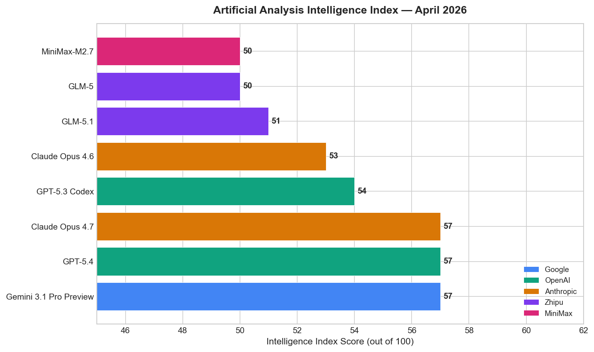
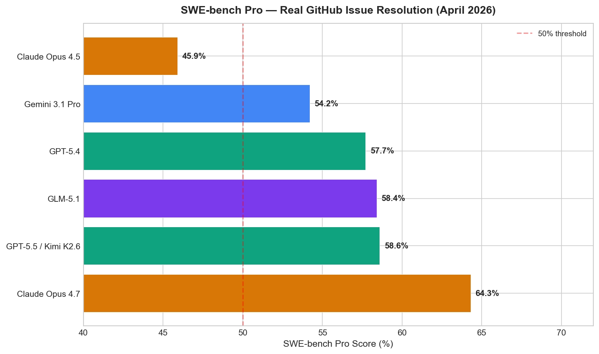
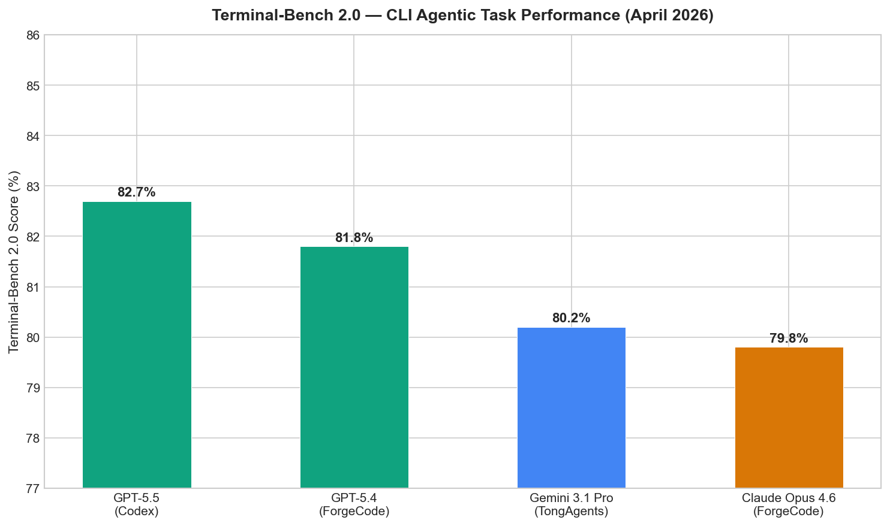
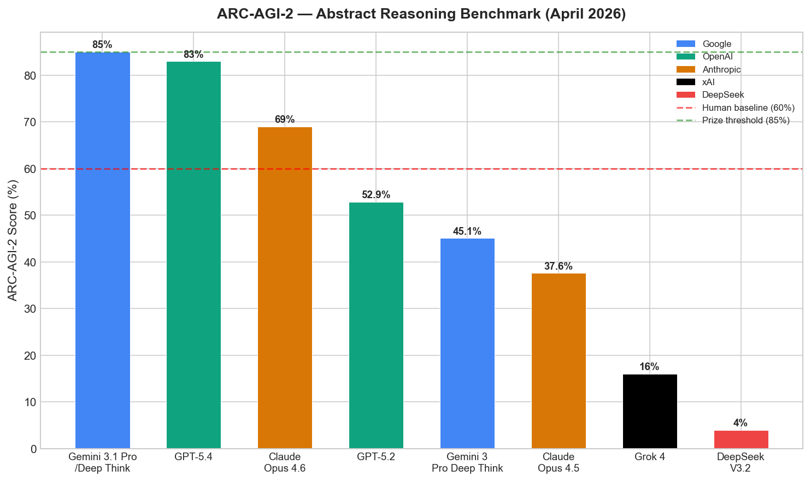
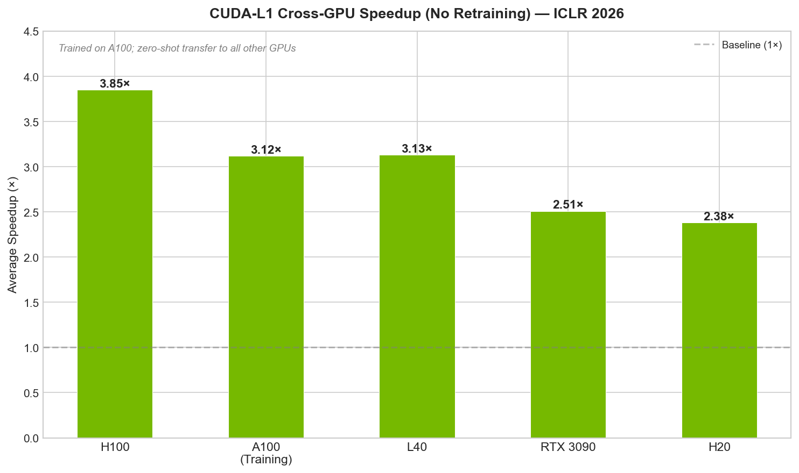
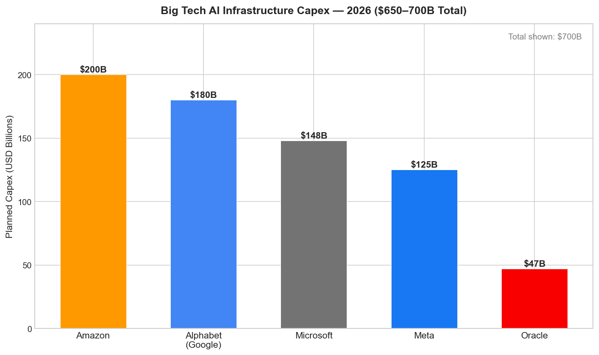
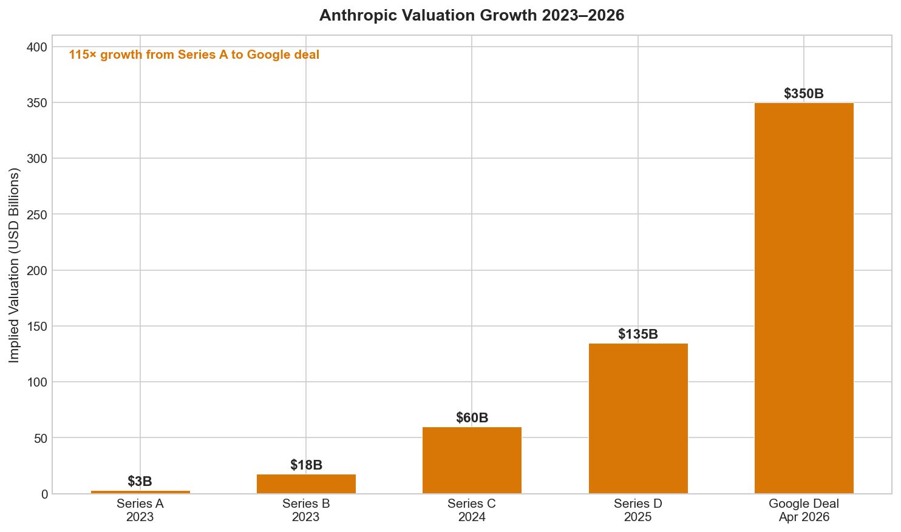
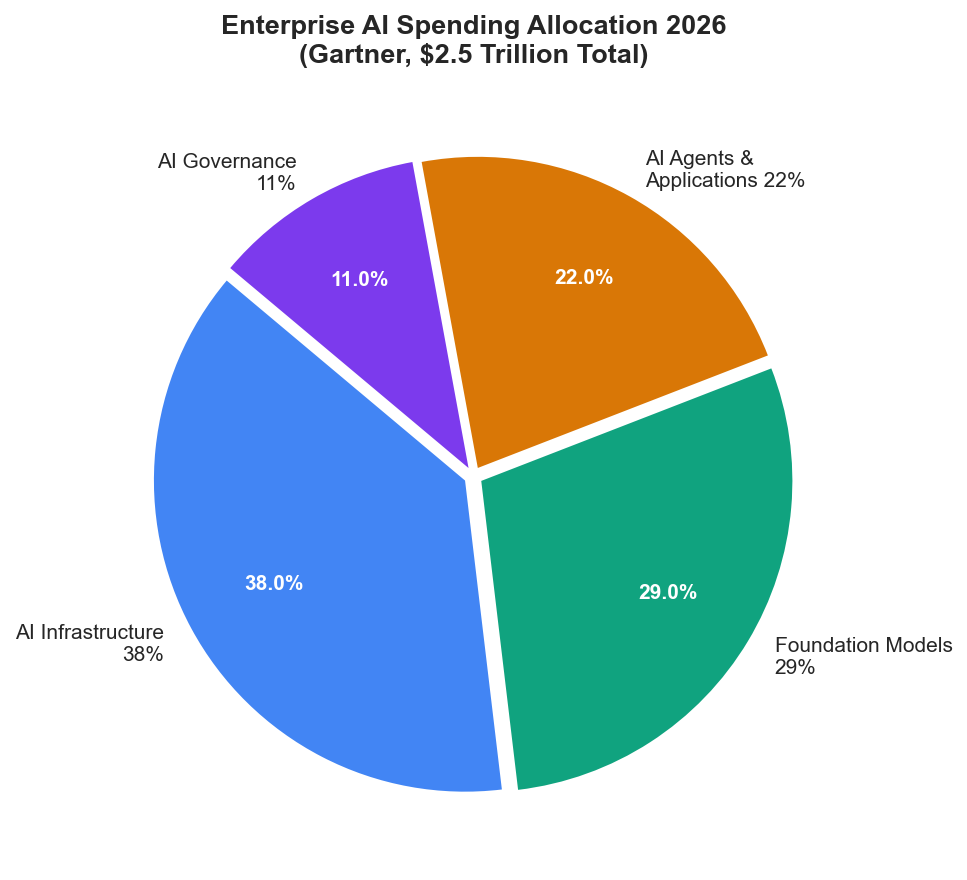

# AI News Daily Digest — 2026-04-24
*Compiled by OMAR for ML Research & Agentic Engineering*

---

## At a Glance (TL;DR)

- **Kimi K2.6 (open-weights, 1T MoE)** tops SWE-Bench Pro at 58.6% — the first open model to simultaneously lead frontier coding, HLE-Full (54.0%), and math reasoning (AIME 2026: 96.4%) benchmarks, plus native 300-agent swarm orchestration under Modified MIT license.
- **Google commits $40B to Anthropic** (April 24) — $10B immediate + $30B contingent at a $350B valuation, plus 5 GW of TPU capacity over 5 years; the largest single AI investment in history, following Amazon's $25B.
- **OpenAI releases GPT-5.5** — first fully retrained model since GPT-4.5, scoring 82.7% on Terminal-Bench 2.0 and resolving 58.6% of GitHub issues end-to-end; rolls out now to Plus/Pro/Business/Enterprise.
- **DeepSeek V4 drops today as open weights** — V4-Pro (1.6T total / 49B active) leads LiveCodeBench v6 at 93.5%, at ~$0.145/1M input tokens (35× cheaper than GPT-5.5).
- **Claude Opus 4.7** leads SWE-bench Pro at 64.3% and SWE-bench Verified at 87.6%, with a restricted Mythos Preview at 93.9% Verified; the main catalyst behind Google's mega-investment.
- **Cohere acquires Aleph Alpha** — combined ~$20B sovereign AI champion with €500M Schwarz Group lead investment; first major consolidation among non-US frontier labs targeting a $600B regulated-sector TAM.
- **Anthropic ships Claude Managed Agents Memory** (public beta) + personal app connectors (Spotify, TurboTax, Instacart) — $0.08/session-hour for full managed agent runtime.
- **MCP crosses 97M monthly SDK downloads** and 10,000+ servers; Linux Foundation governance established; June 2026 spec adds stateless transport, long-running tasks, and enterprise auth.
- **ICLR 2026 runs in Rio de Janeiro** (April 23–27) with 5,355 accepted papers; oral highlights include FIRE (stability-plasticity tradeoff solved), AuxDPO (DPO is statistically misspecified), and CUDA-L1 (3.12× CUDA speedup via contrastive RL).
- **Big Tech AI capex reaches $650–700B in 2026** — Amazon ($200B), Alphabet ($180B), Microsoft ($148B), Meta ($125B), Oracle ($47B) — more than the entire global semiconductor industry's 2025 revenue.
- **Agent identity formalizes at the IETF**: AgentID (JWT-based AIT) and AIMS (SPIFFE + OAuth 2.0) now have published Internet-Drafts; only 25% of CIOs have full visibility into their production agents.
- **Gemini 3.1 Pro leads ARC-AGI-2 at 85%**, matching the prize threshold; GPT-5.4 follows at 83%; a sharp drop-off below — Grok 4 (16%), DeepSeek V3.2 (4%), Llama 4 (0%).

---

## What This Means For Your Work

### For ML Research

- **Read the FIRE paper (arXiv 2602.08040, ICLR 2026 Oral).** It solves the stability-plasticity tradeoff in continual learning via a closed-form constrained optimization (minimize Frobenius error, subject to zero deviation from isometry). Applicable to any neural network layer; Newton-Schulz iteration makes it computationally practical. Implement this before your next continual-learning experiment — it's the first principled, tuning-free solution to a decade-old problem.

- **Adopt AuxDPO and retire vanilla DPO.** The ICLR 2026 Oral paper (arXiv 2510.20413) proves that DPO is statistically misspecified in virtually every real deployment — meaning your DPO fine-tunes may be experiencing preference reversal, reward degradation, and data-sensitivity failure modes right now. AuxDPO fixes this by adding auxiliary variables spanning the null space of the base-policy matrix. Watch for the official code release and prioritize it over further DPO hyperparameter tuning.

- **Explore LEPO (arXiv 2604.17892) for RL-based latent reasoning.** If you're working on reasoning improvements, LEPO's Gumbel-Softmax stochasticity injection enables diverse trajectory exploration in continuous latent space — the bottleneck that was preventing previous latent reasoning methods from benefiting from RL. MIT-licensed, supports Qwen2.5-3B and Llama variants out of the box.

- **Track CUDA-L1 as a blueprint for code-quality RL.** The 3-stage pipeline (SFT → self-supervised correctness → contrastive RL with execution-time reward) achieves 3.12× average CUDA speedup with no human labels and generalizes cross-GPU architecture without retraining. This reward-from-execution pattern is directly applicable to any software optimization task where correctness can be automatically verified.

- **ICLR 2026's "theory-practice convergence" theme signals the field's direction.** The top orals are theoretical analyses exposing practical failure modes (DPO misspecification, plasticity collapse) and offering principled fixes. If you're still running purely empirical ablations without theoretical grounding, expect reviewers at NeurIPS 2026 to ask harder "why does this work?" questions.

### For Agentic Engineering

- **Evaluate Claude Managed Agents before building your own agent runtime.** At $0.08/session-hour with sandboxed execution, checkpoint recovery, cross-session memory, and multi-agent coordination in preview, the infrastructure cost is predictable vs. 3–6 months of platform engineering. For teams pre-Series B, the build-vs-buy calculus has definitively tilted. Anthropic's own data: 10× faster time-to-production, +10pp task success rate vs. standard API prompting.

- **Switch from SWE-bench Verified to SWE-bench Pro for model evaluation.** The contamination issue is documented at scale — Claude Opus 4.5 drops from 80.9% Verified to 45.9% Pro. For coding agent selection, weight Terminal-Bench 2.0 and SWE-bench Pro scores instead, and always run domain-specific evals on your own codebase before committing to a model.

- **Implement the MCP gateway pattern now, before you have 10+ MCP servers.** The enterprise pattern that Amazon, Uber, Nordstrom, and Bloomberg independently converged on: MCP Gateway (auth, RBAC, rate limit, audit log) → curated server catalog → central registry. Progressive tool discovery reduces context-window tool-list overhead from 22% to near zero. Plan for the June 2026 spec adding stateless transport and enterprise auth via XAA.

- **Design agent governance before agent scale.** The $2M logistics loss from uncoordinated procurement/pricing agents is not an edge case — it's the canonical failure mode of agent sprawl. Implement observability before policy before enforcement. Human-in-the-loop gates for external-consequence actions are not limitations to remove; they are blast-radius controls until agent reliability reaches 99%+. IETF AgentID and AIMS are the emerging standards for cryptographic agent identity — start planning for SPIFFE identifiers in your agent architecture now.

- **Multi-agent orchestration token economics: use the 15× rule.** Anthropic's internal data shows multi-agent systems consume ~15× more tokens than single-agent for equivalent tasks. Multi-agent orchestration is warranted only when the task value exceeds 15× the single-agent token budget. Below that threshold, a well-prompted single agent with Plan-and-Execute is both cheaper and more predictable. Graph-agent architectures (LangGraph DAG) achieve the best empirical tradeoff: 95% accuracy at 800–1,400ms vs. ReAct (85%, 1,500–2,500ms).

---

## Best Models Snapshot

*Gemini 3.1 Pro Preview, GPT-5.4, and Claude Opus 4.7 are three-way tied at the top of the Artificial Analysis Intelligence Index (57/100) as of April 2026.*

### Model Comparison Table

| Model | Provider | Context Window | Input $/1M | Output $/1M | Modalities | License |
|---|---|---|---|---|---|---|
| GPT-5.5 | OpenAI | 1M (400K in Codex) | $5.00 | $30.00 | Text, code, tool use | Proprietary |
| GPT-5.5 Pro | OpenAI | 1M | $30.00 | $180.00 | Text, code, tool use | Proprietary |
| GPT-5.4 | OpenAI | 1M | $2.50 | $15.00 | Text, image, code | Proprietary |
| Claude Opus 4.7 | Anthropic | 1M in / 128K out | $5.00 | $25.00 | Text, image (hi-res), tool use | Proprietary |
| Gemini 3.1 Pro | Google | 1M | $2.00 | $12.00 | Text, image, audio, video, code | Proprietary |
| Gemini 3.1 Pro (200K+) | Google | 1M | $4.00 | $18.00 | Text, image, audio, video, code | Proprietary |
| Gemini 2.5 Pro | Google | 1M | $1.25 | $10.00 | Text, image, audio, video, code | Proprietary |
| Gemini 2.5 Flash | Google | 1M | $0.15 | $0.60 | Text, image, code | Proprietary |
| DeepSeek V4-Pro | DeepSeek | 1M | ~$0.145 | TBD (very low) | Text, code | Open weights |
| DeepSeek V4-Flash | DeepSeek | 1M | $0.14 | $0.28 | Text, code | Open weights |
| DeepSeek V3.2 | DeepSeek | 1M | ~$0.27 | ~$1.10 | Text, code | Open weights |
| Llama 4 Maverick | Meta | 1M | (self-host or API) | — | Text, image | Open weights |
| Llama 4 Scout | Meta | 10M | (self-host) | — | Text, image | Open weights |
| GLM-5.1 | Zhipu AI | 256K | API available | API available | Text, code | MIT |
| Qwen3.6 Plus | Alibaba | 256K | Competitive | Competitive | Text, code | Apache 2.0 (35B-A3B) |
| Mistral Small 4 | Mistral AI | 256K | Low-cost | Low-cost | Text, image | Apache 2.0 |

---

## Benchmark Highlights

### Intelligence Index & SWE-bench Pro

The top three frontier models — Gemini 3.1 Pro Preview, GPT-5.4, and Claude Opus 4.7 — are tied at 57/100 on the Artificial Analysis composite Intelligence Index. The real differentiator is the specialized benchmarks: Claude Opus 4.7 leads SWE-bench Pro (64.3%), GPT-5.5 leads Terminal-Bench 2.0 (82.7%), and Gemini 3.1 Pro leads ARC-AGI-2 (85%). Open-weight models are closing the gap: Kimi K2.6 ties GPT-5.5 on SWE-bench Pro at 58.6%.

*SWE-bench Pro is the harder, less contaminated variant of SWE-bench — Claude Opus 4.7's 64.3% represents the current reliable SOTA for real-world coding agents.*

### Agentic Task Performance (Terminal-Bench 2.0)

GPT-5.5 leads Terminal-Bench 2.0 with 82.7% — a benchmark testing real CLI proficiency including environment inspection, file operations, shell execution, and end-to-end task completion. The gap vs. Claude and Gemini (both ~68–69%) is the widest margin on any major benchmark, signaling OpenAI's deliberate specialization for the "AI does the computer task" category.

*Terminal-Bench 2.0 evaluates multi-step CLI agentic workflows — GPT-5.5's 82.7% is a 13-point lead over the competition, the largest single-benchmark gap among frontier models.*

### Abstract Reasoning (ARC-AGI-2)

Gemini 3.1 Pro reaches the ARC-AGI-2 prize threshold at 85%, GPT-5.4 follows at 83%, and a sharp cliff drops to Grok 4 (16%), DeepSeek V3.2 (4%), and Llama 4 (0%). ARC-AGI-2 remains the most effective separator of genuine fluid intelligence from pattern memorization.

*Human baseline is 60%; prize threshold is 85% — Gemini 3.1 Pro is the first model to reach the prize threshold on this benchmark.*

### CUDA Optimization (CUDA-L1, ICLR 2026)

CUDA-L1, from NVIDIA researchers, achieves an average 3.12× CUDA speedup on KernelBench via contrastive RL — and generalizes cross-GPU without retraining. This is a landmark result for automated hardware optimization.

*CUDA-L1 was trained exclusively on A100; zero-shot transfer to H100 (3.85×), L40 (3.13×), RTX 3090 (2.51×), and H20 (2.38×) demonstrates genuine generalization rather than hardware-specific memorization.*

---

## ML Research Highlights

### Kimi K2.6 — The First Open Model to Lead Frontier Coding and Agentic Benchmarks Simultaneously

Kimi K2.6 represents a qualitative shift in what "open-source" means for frontier AI. Released on April 20–21, 2026 under a Modified MIT license, this 1-trillion-parameter Mixture-of-Experts model achieves 58.6% on SWE-Bench Pro (ranking #1 among all models at time of release), leads HLE-Full with tools at 54.0%, and scores 96.4% on AIME 2026 math reasoning. It is the first open-weights model to simultaneously lead closed frontier models on the most practically important metrics.

The architectural foundation is a 384-expert MoE activating only 32B parameters per token — equivalent in inference cost to a mid-size dense model. The Multi-head Latent Attention (MLA) compresses KV cache representations, enabling a 256K-token context window at practical inference cost. A context compression system automatically summarizes long histories, preventing the performance degradation seen in other long-context models as sessions approach their limits.

The most technically novel contribution is K2.6's native agent orchestration layer: it can spawn and coordinate up to 300 parallel sub-agents, executing 4,000+ coordinated tool calls across 12+ hour sessions. This was validated in a real benchmark — autonomous optimization of a financial trading engine over 13 hours, achieving 185% throughput improvement with no human intervention. This is not a demo artifact; it is a trained capability enabling genuine production-level autonomy.

The significance for the ML community is profound: with K2.6's weights available under Modified MIT license (permitting commercial use with attribution), researchers now have access to a model competitive with GPT-5.4 and Claude Opus 4.6 for scientific code generation, CUDA kernel writing, and multi-agent system design. Open questions remain about training mixture details, dual-use implications of this capability level, and the minimum hardware for reliable 300-agent swarm orchestration at scale.

### ICLR 2026 — FIRE, AuxDPO, and the Theory-Practice Convergence Wave

ICLR 2026 runs April 23–27 in Rio de Janeiro with 5,355 accepted papers (27.4% acceptance from 19,525 submissions). Two oral papers stand out for immediate practical impact. **FIRE** (Frobenius-Isometry Reinitialization, arXiv 2602.08040) solves the stability-plasticity tradeoff in continual learning via a principled closed-form optimization: minimize Squared Frobenius Error (stability) subject to zero Deviation from Isometry (plasticity), solved efficiently via Newton-Schulz iteration. Validated across vision, language modeling (GPT-0.1B), and reinforcement learning — FIRE is a building block for lifelong learning systems.

**AuxDPO** (arXiv 2510.20413) delivers a rigorous theoretical critique of Direct Preference Optimization: DPO is a statistically misspecified estimator whenever the true reward function cannot be realized by the model's policy class — a condition that holds in almost every real deployment. The failure modes are generic: preference order reversal, absolute reward degradation, and data-distribution sensitivity. The fix, AuxDPO, introduces auxiliary variables spanning the null space of the base-policy matrix, providing additional degrees of freedom to better approximate the full RLHF solution. This paper is likely to reshape preference fine-tuning pipelines across the field.

The conference is simultaneously a research milestone and a warning signal: 21% of submitted reviews were found to be fully AI-generated, and a security breach leaked ~45% of reviewer identities. This peer review integrity crisis creates demand for better hallucination detection tools, statistical fingerprinting of AI text in academic contexts, and new review structures robust to AI augmentation.

---

## Agentic AI Highlights

### Claude Managed Agents — Why the Infrastructure Abstraction Wave Matters Now

Claude Managed Agents (launched April 8, Memory in public beta April 24) is architecturally significant because it identifies and solves the actual bottleneck in production agentic systems: the infrastructure, not the intelligence. Anthropic's own engineering blog reveals the hardest problems in shipping their multi-agent Research feature were token economics (15× cost vs. single-agent chat), memory management within 200K-token context windows, preventing agent sprawl on simple queries, and ensuring clean task delegation with non-overlapping responsibilities. None of these are model problems — they are systems problems.

The managed runtime provides: sandboxed execution environments (isolated per-agent containers), durable state management persisted through model provider outages, a tool orchestration layer that handles discovery and credential injection, error recovery with checkpoint resumption, and multi-agent coordination managing the full spawn/monitor/kill lifecycle. Memory stores are workspace-scoped, immutable-versioned text collections that agents read and write across sessions — giving developers full audit capability and control.

The practical result: $0.08/session-hour (predictable) vs. 3–6 months of platform engineering (unpredictable). For teams without existing agentic platform teams, this is a significant unlock. Early adopters — Notion, Asana, Rakuten, Sentry, Allianz — report 10× faster path from prototype to production and +10 percentage points in task success rate vs. standard API prompting.

The competitive landscape has clarified: Claude Managed Agents (full vertical integration, Claude-only), OpenAI Agents SDK 0.14 (partial sandbox, OpenAI-native, handoff-based), LangGraph Platform (model-agnostic, hosted, best debugging via time-travel), and CrewAI Enterprise (team-based, rapid prototyping). The key decision axis is vendor coupling vs. flexibility: Anthropic's vertical integration enables optimizations that cross-stack offerings cannot easily replicate, but at the cost of tight lock-in.

---

## Industry & Business Highlights

### Google's $40 Billion Anthropic Bet — What It Means for the AI Ecosystem

The Google-Anthropic deal announced April 24, 2026 is qualitatively different from previous AI investments — not just in size but in structure, implication, and timing. The $40 billion headline breaks into $10 billion immediate (at a $350 billion valuation) and $30 billion contingent on performance targets. This staged structure gives Google financial exposure proportional to demonstrated performance while giving Anthropic certainty for near-term operations — and a powerful incentive to hit milestones.

The compute pledge matters more than the cash. Five gigawatts of TPU capacity over five years is strategically more significant than the dollar figure, because compute scarcity is the fundamental constraint limiting frontier model development. By tying Anthropic's compute supply to Google Cloud, Google ensures Anthropic cannot easily pivot to AWS or Azure as primary training infrastructure, Google's TPU roadmap becomes directly tied to Anthropic's success, and Google Cloud wins the workload regardless of which Claude model enterprise customers buy. The announcement comes weeks after Amazon committed up to $25 billion, meaning Anthropic has secured conditional commitments totaling $65 billion from its two largest cloud partners.

The broader industry context: Big Tech AI capex across Amazon, Alphabet, Meta, Microsoft, and Oracle reaches $650–700 billion in 2026 — the largest single-year corporate capital expenditure cycle in history. Meanwhile, Cohere's acquisition of Aleph Alpha (combined ~$20B, €500M Schwarz Group investment) confirms that sovereign AI is not a niche political project but a $600B TAM with institutional backing. For engineers in regulated sectors, this creates a viable non-US vendor ecosystem for the first time at frontier capability levels.

---

## Full Sections

- [ML Research →](sections/ml-research.md)
- [AI Industry →](sections/ai-industry.md)
- [Agentic AI →](sections/agentic-ai.md)
- [Best Models →](sections/best-models.md)
