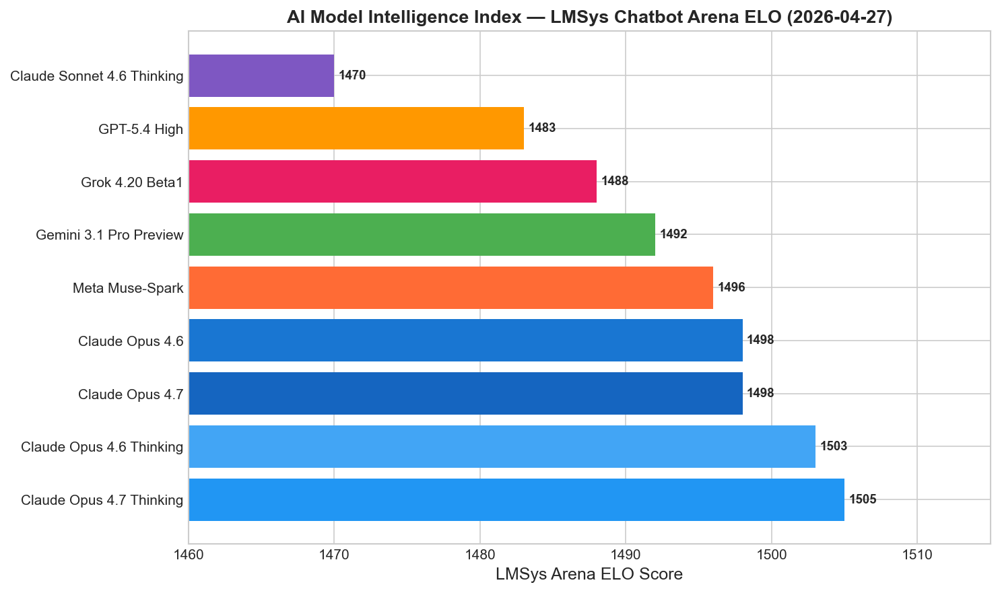
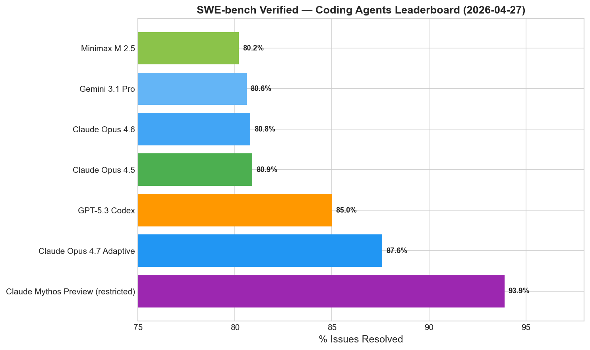
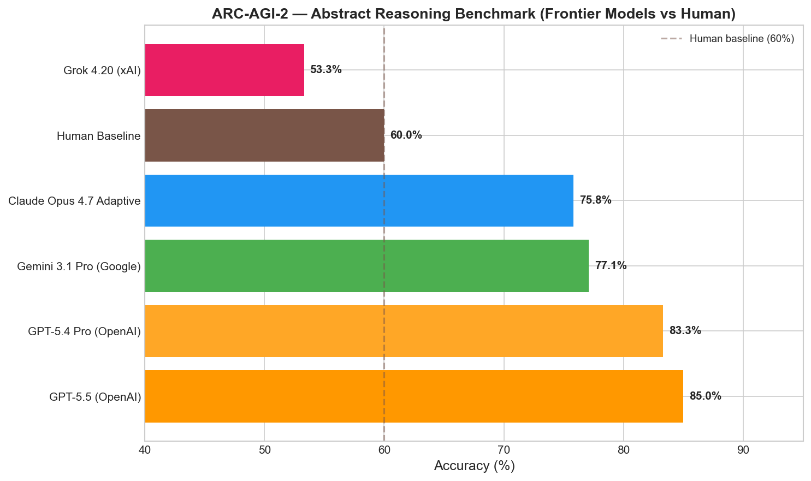
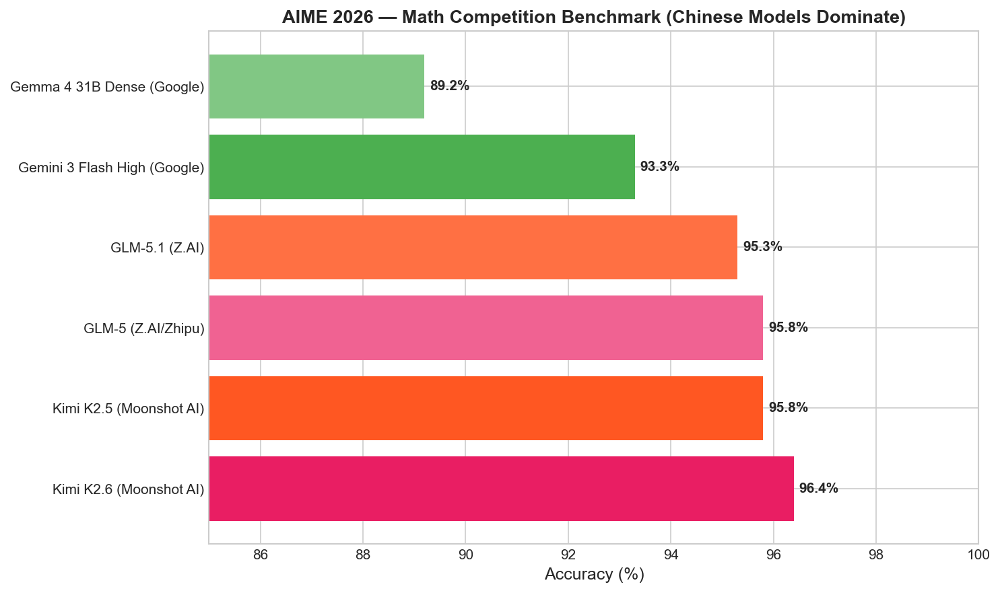
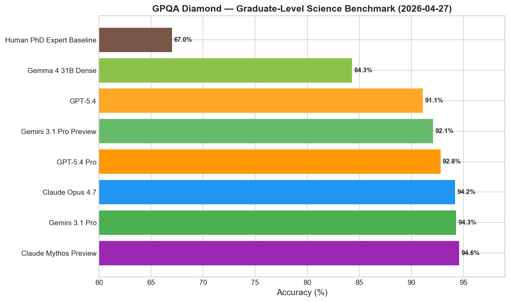
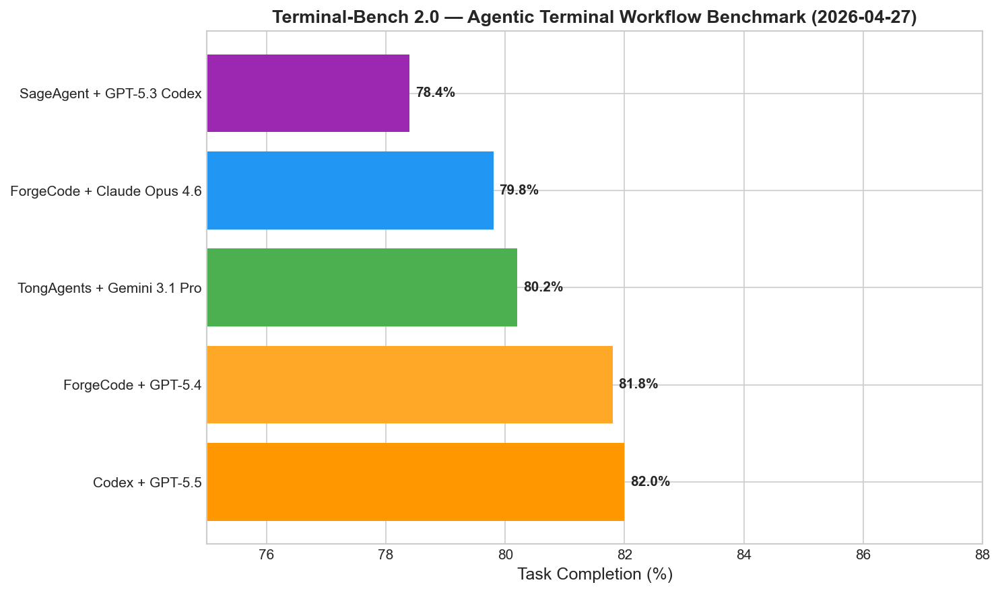

# AI News Daily Digest — 2026-04-27
*Compiled by OMAR for ML Research & Agentic Engineering*

---

## At a Glance (TL;DR)

- **OpenAI-Microsoft exclusivity ends** — OpenAI can now deploy on any cloud (AWS, GCP); Azure retains first-ship rights but loses monopoly; Microsoft stops paying revenue share immediately
- **Claude Opus 4.7 leads coding benchmarks** with 87.6% SWE-bench Verified and 64.3% SWE-bench Pro, but has a sharp long-context retrieval regression at 256K–1M tokens
- **GPT-5.5 released April 23** as a fully-retrained agentic model: 82.0% Terminal-Bench 2.0, 84.9% GDPval, 58.6% SWE-bench Pro single-pass
- **Ineffable Intelligence raises $1.1B seed at $5.1B valuation** — Europe's largest ever seed, no product, founded by AlphaGo creator David Silver, backed by Sequoia, Lightspeed, Nvidia
- **Cohere acquires Aleph Alpha** in a $20B transatlantic merger with Canadian and German government backing; Schwarz Group (Lidl parent) commits €500M
- **T² scaling laws prove Chinchilla is suboptimal** when inference sampling is used — optimal pretraining is 2–4× smaller models trained 2–4× longer, with k>1 inference samples
- **ICLR 2026 Outstanding Paper**: "Transformers are Inherently Succinct" — transformers represent star-free languages exponentially more compactly than automata; verification is EXPSPACE-complete
- **Microsoft Agent Governance Toolkit (AGT)** is open-source runtime security for agents: covers all 10 OWASP Agentic AI risks at <0.1ms latency, 0% policy violations vs 26.67% for prompt-based guardrails
- **Decoupled DiLoCo reduces inter-datacenter training bandwidth 236×** (198 Gbps → 0.84 Gbps), enabling multi-datacenter LLM training over standard internet links
- **MCP crosses 97M monthly downloads** and A2A joins the Linux Foundation's Agentic AI Foundation (AAIF) — protocol-layer standardization under neutral governance is complete
- **Accel raises $5B AI fund**; Q1 2026 global VC hits record $297B; Anthropic now ~$800B valuation, Cursor ~$50B
- **BCR achieves 62.6% token reduction** on 4B reasoning models with N=8 concurrent problems, maintaining math benchmark accuracy — a practical throughput multiplier
- **Chinese models dominate AIME 2026**: Kimi K2.6 at 96.4%, GLM-5 at 95.8%, marking a clear bifurcation from Western frontier model strengths
- **Gemma 4 31B (Apache 2.0)** is the best open-weight release of 2026: AIME 89.2%, GPQA Diamond 84.3%, full multimodal, 256K context

---

## What This Means For Your Work

### For ML Research

- **Revise your pretraining compute allocation using T² scaling laws.** The paper at arXiv:2604.01411 formally proves that Chinchilla-optimal training is suboptimal whenever you use multi-sample inference (best-of-k, chain-of-thought, beam search). Estimate your production inference sample count k, compute your inference budget fraction, and use the T²-Acc framework to find the jointly optimal (N, D) pair. For most production settings with k≥4, the optimal model is 2–4× smaller and trained 2–4× longer than Chinchilla prescribes. This has immediate implications for any pretraining project planning in 2026.

- **Consider Value Gradient Flow (VGF) as a drop-in RLHF alternative.** arXiv:2604.14265 eliminates the need for an explicit policy parameterization distinct from the base model — the core engineering pain point when applying RLHF to 70B+ models. The optimal transport framing provides cleaner theoretical guarantees than policy gradient methods, and the test-time scaling knob (adjustable transport budget τ) is especially valuable for inference-time alignment tuning. The method achieves SOTA on both D4RL and OGBench.

- **Track the Muon optimizer (Polar Express) carefully.** The ICLR 2026 Honorable Mention (OpenReview:yRtgZ1K8hO) provides the first theoretically grounded, GPU-native matrix polar decomposition algorithm, consistently improving GPT-2 training loss over Adam/Nesterov/Shampoo across a wide range of learning rates on 1–10B FineWeb tokens. Muon-family optimizers are gaining empirical momentum; Polar Express supplies the missing theoretical justification for production trust.

- **BCR's task-scaling law offers a practical 2–5× inference throughput multiplier.** Training with Batched Contextual Reinforcement (arXiv:2604.02322) and batching N=4–8 problems per forward pass yields 62.6% token reduction at N=8 with maintained accuracy on MATH, AMC, AIME, and GSM8K. The only engineering constraint is a context window large enough to fit N complete problem+solution pairs — trivially satisfied by 128K+ context models. Read the paper if you operate reasoning model inference at scale.

- **Decoupled DiLoCo makes multi-datacenter training viable without bespoke networking.** For organizations with compute spread across cloud regions or co-lo facilities, github.com/google-deepmind/asyncdiloco achieves 0.84 Gbps inter-datacenter bandwidth (vs 198 Gbps for synchronous data-parallel training) — a 236× reduction — and 88% goodput under high hardware failure rates. If you run distributed training across multiple facilities, evaluate DiLoCo as your outer-loop synchronization strategy.

### For Agentic Engineering

- **Deploy Microsoft's Agent Governance Toolkit immediately for regulated-industry workloads.** AGT's kernel-level policy engine enforces YAML/OPA Rego/Cedar policies at <0.1ms latency with zero policy violations in testing (vs 26.67% for prompt-based guardrails). Its automated compliance mapping covers EU AI Act, HIPAA, SOC2, and all 10 OWASP Agentic AI risks. The EU AI Act's high-risk obligations take effect August 2026 — don't wait. AGT is MIT-licensed, framework-agnostic, and production-proven (473 blocked unauthorized actions at a real customer over 11 days).

- **Migrate to Claude Managed Agents (public beta) to eliminate custom orchestration infrastructure.** Server-side orchestration, automatic context compaction for 40+ turn conversations, 30-day session persistence, and built-in memory stores eliminate approximately 60–70% of the infrastructure code in a typical Claude agent deployment. Enable with the `managed-agents-2026-04-01` beta header. Infrastructure costs are free during beta at standard token rates.

- **Upgrade your MCP integration to Streamable HTTP for horizontal scalability.** The 2026 MCP roadmap removes the sticky session requirement that prevented stateless horizontal scaling behind load balancers. If you expect >10K concurrent agent sessions, this is a prerequisite. With 97M monthly downloads and AAIF neutral governance, MCP + A2A is now the durable standard for tool and agent-to-agent communication.

- **Switch to GPT-5.5 for OpenAI-stack long-horizon coding agents.** The 58.6% SWE-bench Pro single-pass resolution rate and 82.0% Terminal-Bench 2.0 score make GPT-5.5 viable for autonomous PR-level coding tasks. Pair it with Sandbox Agents (Agents SDK v0.13) for persistent filesystem and Git access across multi-hour sessions.

- **Adopt Graph-Based Stateful Agent Workflows as your default architecture.** LangGraph v1.1.3, Google ADK 2.0, and Salesforce Agent Fabric all independently converged on explicit state machines with deterministic edge conditions and human-in-the-loop checkpoints. Migrate from linear chain-of-thought pipelines to graph-based workflows with explicit state persistence — this is what enables interruption, resumption, and auditable governance for production agents.

---

## Best Models Snapshot

*LMSys Chatbot Arena ELO as of 2026-04-27: Claude Opus 4.7 in Thinking mode (1505) holds the top position, with Gemini 3.1 Pro Preview and Grok 4.20 Beta competitive in the 1485–1492 range.*

### Model Comparison Table

| Model | Provider | Context Window | Input $/1M | Output $/1M | Modalities |
|---|---|---|---|---|---|
| Claude Opus 4.7 | Anthropic | 1,000,000 | $5.00 | $25.00 | Text, Image |
| Claude Opus 4.6 | Anthropic | 1,000,000 | $5.00 | $25.00 | Text, Image |
| GPT-5.4 | OpenAI | 1,050,000 | $2.50 | $15.00 | Text, Image |
| GPT-5.4 Pro | OpenAI | 1,050,000 | $30.00 | $180.00 | Text, Image |
| Gemini 3.1 Pro | Google | 1,000,000 | $2.00 | $12.00 | Text, Image, Audio, Video, Code |
| Grok 4.20 | xAI | 2,000,000 | $2.00 | $6.00 | Text, Image |
| Meta Muse-Spark | Meta | 262,000 | Free (consumer) | Free (consumer) | Text, Image, Voice |
| DeepSeek V4-Pro | DeepSeek | 1,000,000 | $0.14 | ~$0.56 | Text, Code |
| Qwen 3.5 (397B MoE) | Alibaba | 256,000 | Open-weight | Open-weight | Text, Image |
| Gemma 4 31B Dense | Google | 256,000 | Open-weight (Apache 2.0) | Open-weight | Text, Image, Video, Audio |
| Gemma 4 26B MoE | Google | 256,000 | Open-weight (Apache 2.0) | Open-weight | Text, Image, Video, Audio |
| GPT-5 nano | OpenAI | ~128,000 | $0.05 | $0.40 | Text |
| Mistral Small 3.2 | Mistral | ~128,000 | $0.06 | $0.18 | Text, Code |
| Claude Sonnet 4.6 | Anthropic | 200,000 | $3.00 | $15.00 | Text, Image |
| Gemini 3.1 Flash | Google | 1,000,000 | $0.10 | $0.40 | Text, Image, Audio, Video |

---

## Benchmark Highlights

### SWE-bench Verified — Coding Agents

Claude Opus 4.7 leads all publicly available models at 87.6% on SWE-bench Verified (human-validated subset), up from 80.8% on Opus 4.6 — a 6.8-point gain in a single generation. The restricted Claude Mythos Preview pushes to 93.9%. For SWE-bench Pro (harder, production-closer variant), Claude Opus 4.7 leads at 64.3% followed by GPT-5.5 (58.6%) and GPT-5.4 (57.7%).

### Abstract Reasoning — ARC-AGI-2

The ARC-AGI-2 barrier is effectively broken: GPT-5.5 achieves 85.0%, GPT-5.4 Pro 83.3%, and Gemini 3.1 Pro 77.1% — all exceeding the 60% human baseline. Claude Opus 4.7 sits at 75.8%, well above human performance. This benchmark, once considered the frontier's hardest general reasoning test, is saturating at the top.

### AIME 2026 — Competition Math

Chinese models now dominate competition mathematics: Kimi K2.6 at 96.4% and GLM-5 at 95.8% lead all Western frontier models. Gemma 4 31B Dense (Google's open-weight release) achieves a remarkable 89.2% — a 68-point improvement over Gemma 3 (20.8%) and competitive with the best closed-source Western models.

### GPQA Diamond — Graduate-Level Science

Four models now exceed 92% on GPQA Diamond, effectively saturating the benchmark's discriminative power at the frontier. Claude Mythos Preview leads at 94.6%, followed by Gemini 3.1 Pro (94.3%), Claude Opus 4.7 (94.2%), and GPT-5.4 Pro (92.8%). The Human PhD expert baseline of 67.0% has been exceeded by every major frontier model.

### Terminal-Bench 2.0 — Agentic Terminal Workflows

OpenAI's Codex + GPT-5.5 agent system leads at 82.0%, narrowly ahead of ForgeCode + GPT-5.4 (81.8%) and TongAgents + Gemini 3.1 Pro (80.2%). This benchmark measures real terminal workflow completion: filesystem inspection, file editing, command execution, and error recovery without human prompting — the most practically relevant agentic benchmark.

---

## ML Research Highlights

### Train-to-Test (T²) Scaling Laws: Overtraining Is Now Compute-Optimal

The most consequential ML research of the week is "Test-Time Scaling Makes Overtraining Compute-Optimal" (arXiv:2604.01411), which formally supersedes the Chinchilla scaling law — the dominant guide for LLM pretraining compute allocation since 2022.

Chinchilla's prescription (train to N* ∝ sqrt(C), D* ∝ sqrt(C)) is optimal only when you ignore inference cost. T² shows that when inference cost is included in the total compute budget C_total = C_train + k·C_infer, the optimal pretraining point shifts dramatically: train a significantly smaller model on far more tokens, then apply k>1 inference samples (best-of-k, majority vote, chain-of-thought) to compensate. The cross-over point is well within practical regimes — at k≥4 samples, heavily overtrained small models consistently outperform Chinchilla-optimal large models under equal total compute.

The authors validated this empirically by actually training models in the T²-optimal compute region at 3–10× Chinchilla token counts, then evaluating with k=1, 4, 16, 64 samples. Across 8 downstream tasks, T²-Acc predictions were accurate to within ~2%. The result holds through SFT and RLHF post-training stages. At 10²³ total FLOPs with k=64 samples, the optimal model is ~3× smaller but trained ~3× longer than Chinchilla-optimal.

The practical implication is immediate: any organization running production LLMs at scale with repeated inference (which is virtually all of them) should reassess their pretraining compute allocation. Overtraining smaller models and serving with moderate test-time compute likely dominates Chinchilla-optimal training at fixed total compute+inference budget. This shifts the optimal point toward what TinyLlama and MiniCPM teams had intuited empirically but never formally justified.

**ICLR 2026 Outstanding Paper** went to "Transformers are Inherently Succinct" (arXiv:2510.19315), proving fixed-precision transformers can describe formal languages exponentially more compactly than automata or LTL formulas. The verification hardness result (EXPSPACE-complete) is an important new formal barrier for AI safety. The Honorable Mention, "Polar Express" (OpenReview:yRtgZ1K8hO), improves the Muon optimizer with GPU-native polar decomposition, consistently improving GPT-2 training loss on 1–10B token runs.

---

## Agentic AI Highlights

### Microsoft Agent Governance Toolkit: The First Runtime Security Primitive

The most architecturally significant agentic AI development of the week is Microsoft's Agent Governance Toolkit (AGT), released April 2, 2026 as MIT-licensed open source. It introduces a new infrastructure category: the **Agent Security Plane** — a deterministic, kernel-level runtime layer that governs agent behavior beneath agent frameworks, analogous to what SELinux or eBPF brought to OS security.

AGT's seven components address the complete spectrum of production agent risks. The Agent OS intercepts every agent action before execution, enforcing YAML, OPA Rego, or Cedar policies at <0.1ms latency — achieving 0% policy violations versus 26.67% for prompt-based guardrails. The Agent Mesh provides Ed25519 cryptographic identity for agents via decentralized identifiers (DIDs) and a dynamic trust scoring system (0–1000 across 5 tiers). The Agent Runtime provides CPU privilege ring-inspired isolation and saga orchestration for reversible multi-step workflows. Agent SRE brings reliability engineering (SLOs, error budgets, circuit breakers) to agent deployments. Agent Compliance provides automated regulatory mapping to EU AI Act, HIPAA, SOC2, and all 10 OWASP Agentic AI Top 10 risks.

The timing is non-accidental: EU AI Act high-risk obligations take effect August 2026, and the Colorado AI Act becomes enforceable June 2026. Organizations deploying autonomous agents for consequential decisions need demonstrable compliance evidence — AGT provides it via its automated mapping and audit trail infrastructure. Its multi-framework integration (LangChain, CrewAI, AutoGen, OpenAI Agents SDK, AWS Bedrock, Google ADK, Azure AI) means it layers beneath existing stacks without requiring rewrites.

**Other key developments:** GPT-5.5 (April 23) is the new benchmark leader for OpenAI-stack agentic workflows (82.0% Terminal-Bench 2.0). Claude Managed Agents entered public beta with server-side orchestration and 30-day persistent memory stores. MCP hit 97M monthly SDK downloads and A2A joined the Linux Foundation's Agentic AI Foundation — both tool-access and agent-to-agent delegation protocols now have neutral governance.

---

## Industry & Business Highlights

### OpenAI-Microsoft Partnership Restructured — Exclusivity Ends

The most consequential industry news of the week is the sweeping revision to the OpenAI-Microsoft partnership, announced April 27, 2026. Microsoft's exclusive IP license — which had made Azure the only cloud for enterprise OpenAI deployments since 2019 — is now non-exclusive. OpenAI can serve products through AWS, Google Cloud, and any other provider. Microsoft stops paying OpenAI revenue share immediately; OpenAI continues paying Microsoft approximately 20% through 2030, now capped. AGI contingency clauses — which had tied contractual obligations to declaring AGI — have been removed, reflecting a pragmatic shift from techno-eschatological scenarios to commercial reality.

For developers and enterprises, the practical consequences unfold over months: AWS customers will gain native OpenAI model access (likely via Bedrock), and Google Cloud customers may see GPT-5 on Vertex AI alongside Gemini. This reshapes the cloud AI marketplace from exclusive partnership to model-bazaar competition, where AWS Bedrock, Google Vertex AI, and Azure AI Foundry compete on integration tooling, latency, and pricing rather than exclusive access. OpenAI gains infrastructure optionality and multi-cloud pricing leverage; Microsoft retains first-ship status on Azure and major shareholder position.

Simultaneously: **Ineffable Intelligence** raised a $1.1B seed at a $5.1B valuation (Europe's largest ever seed) with David Silver (AlphaGo creator) targeting a pure RL-based "superlearner" — betting DeepMind's RL heritage can scale to superintelligence. **Cohere acquired Aleph Alpha** to form a $20B transatlantic sovereign AI entity backed by Canadian and German governments, targeting EU enterprises demanding data residency and non-US IP. **Accel raised a $5B fund** on the back of Anthropic (~$800B valuation, $30B ARR) and Cursor (~$50B) returns; Q1 2026 global VC hit a record $297B — 2.5× the prior quarter.

---

## Full Sections

- [ML Research](sections/ml-research.md)
- [AI Industry](sections/ai-industry.md)
- [Agentic AI](sections/agentic-ai.md)
- [Best Models](sections/best-models.md)
