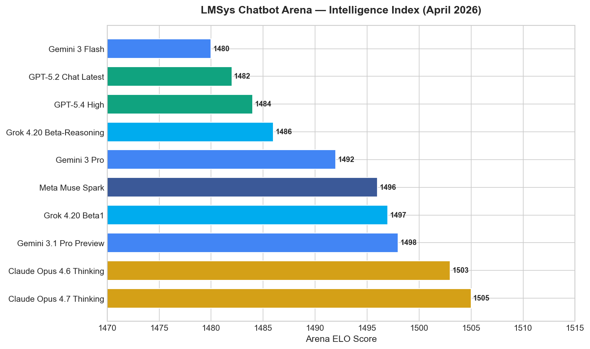
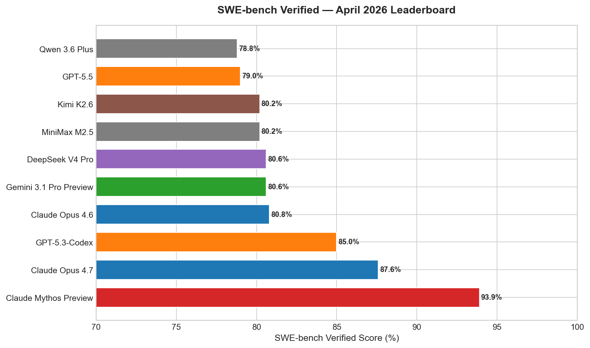
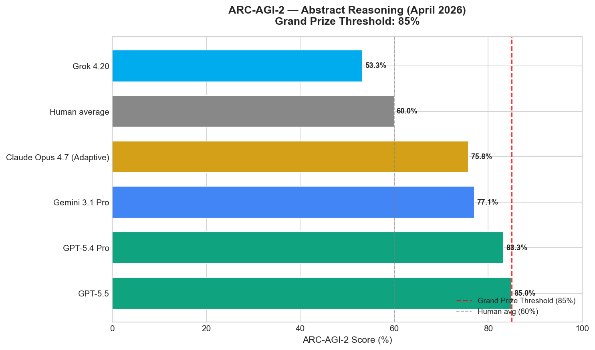
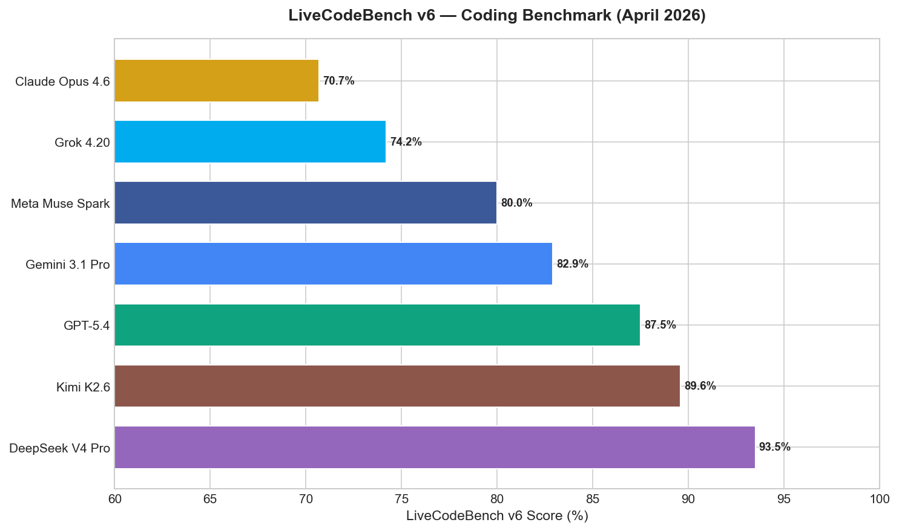
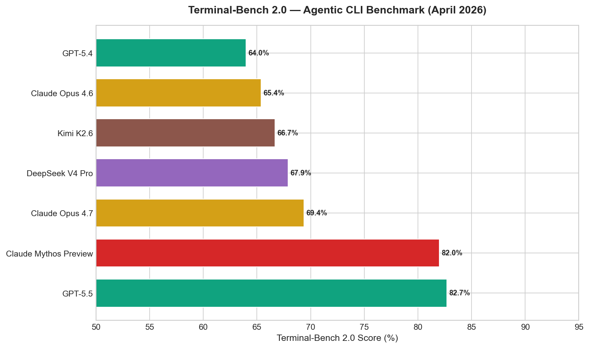
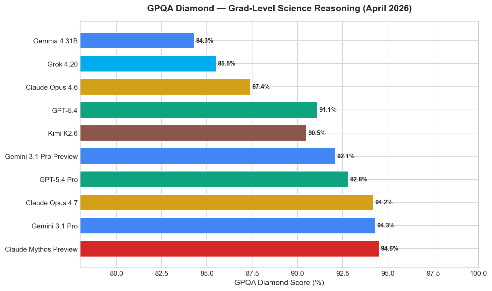
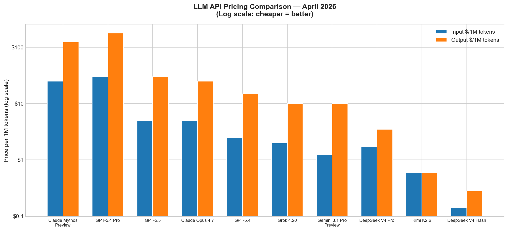

# AI News Daily Digest — 2026-04-28
*Compiled by OMAR for ML Research & Agentic Engineering*

---

## At a Glance (TL;DR)

- **DeepSeek V4 Pro (MIT, 1.6T/49B active)** launches as the strongest open-weight model ever — #1 LiveCodeBench (93.5%), #1 Codeforces (3206), 80.6% SWE-bench Verified at just $1.74/M input (3× cheaper than GPT-5.5)
- **OpenAI lands on AWS Bedrock** — GPT-5.5 and GPT-5.4 now in limited preview; Microsoft exclusivity is structurally over; Codex and Managed Agents on Bedrock launch simultaneously
- **Google Cloud Next '26**: Gemini Enterprise Agent Platform declared the "agentic OS for enterprise" — full-stack build/scale/govern/optimize platform with TPU 8 (3× Ironwood), $750M partner fund, India AI hub groundbreaking
- **Claude Mythos Preview** (restricted access, ~40 orgs) holds the all-time SWE-bench record at 93.9%, 100% Cybench CTF pass rate, and autonomously found a 27-year-old OpenBSD zero-day and $4.6M in smart contract exploits
- **GPT-5.5 crossed the ARC-AGI-2 Grand Prize threshold at 85%** — first model ever to surpass human-average (60%) by 25 points on abstract reasoning; also leads Terminal-Bench 2.0 (82.7%)
- **Kimi K2.6** (open-weight, ~$0.60/M): 96.4% AIME 2026, 80.2% SWE-bench Verified, 300 concurrent sub-agent capacity — strongest open alternative for agentic coding
- **OpenAI Symphony**: open-source Linear-as-control-plane orchestration yielded a 500% increase in landed PRs internally; reference Elixir implementation patterns the multi-tenant Codex App Server ecosystem
- **Anthropic releases 9 MCP-based Claude connectors** for creative professionals — Adobe CC (50+ apps), Blender, Ableton, Autodesk Fusion, SketchUp, and more; targets the ~50M global creative professional market
- **MegaTrain** enables 120B-param full-FP32 training on a single H200 GPU at 1.84× DeepSpeed ZeRO-3 throughput via host-memory offloading and pipelined CUDA streams
- **xAI/SpaceX holds a $60B acquisition option on Cursor**, is already training Cursor's Composer 2.5 on Colossus GPUs, and is negotiating a three-way alliance with Mistral to close the gap with Anthropic and OpenAI
- **Enterprise AI has crossed the mainstream threshold**: 78% of Global 2000 companies have AI in production (up from 41% in Q1 2024); OpenAI holds 42% enterprise spend share; EU AI Act high-risk enforcement deadline is August 2, 2026
- **Graph-based multi-agent orchestration is the dominant production pattern** — Google ADK, AWS Strands, LangGraph all converge on typed stateful DAGs; harness-compute separation (OpenAI v0.14 + AWS AgentCore) commoditizes the execution layer
- **AEL two-timescale agent learning** (Thompson bandit + LLM reflection) beats 5 published self-improving methods at Sharpe 2.13 — and finds that adding 7 more modules *all* hurt performance ("less is more")
- **1M token context is now table stakes** across every tier-1 frontier model; the competitive battle has shifted to what models can reliably *do* within that context

---

## What This Means For Your Work

### For ML Research

- **Prioritize hybrid sparse attention over dense long-context approximations.** DeepSeek V4 Pro's CSA+HCA design achieves 10% KV-cache footprint at 1M tokens and 27% FLOPs vs. its predecessor — not despite the long context window but *because* of the architectural sparsity. Researchers building long-context models should design for sparsity from the ground up rather than retrofitting approximations (linear attention, SSMs) onto dense baselines after the fact. The performance-efficiency Pareto frontier has moved.

- **Single-H200 training of 100B+ models is now viable.** MegaTrain's host-memory offloading with pipelined double-buffered CUDA streams achieves 1.84× DeepSpeed ZeRO-3 throughput at 120B-parameter scale on one H200. University labs and small teams without cluster access can now iterate on full-precision 100B-scale experiments, run 512K-context 7B training on a single GH200, and meaningfully contribute to large-scale architecture and optimizer research. Renting a single H200 node is now a competitive research setup.

- **The Muon optimizer has theory-and-production validation simultaneously.** ICLR 2026's "Polar Express" (Honorable Mention) provides mathematically optimal minimax polynomial approximations to the matrix sign function at the heart of Muon's orthogonalized gradient updates — and DeepSeek V4 Pro deployed Muon at production scale within months of that paper. This sub-year theory-to-production cycle is unprecedented. Researchers in optimizer design should treat polar decomposition in bfloat16 as the practically important regime and study the Polar Express implementation directly.

- **AEL's "less is more" finding is an empirical warning against over-engineering agentic systems.** Adding memory + reflection to a stateless LLM agent baseline yielded 58% cumulative improvement on portfolio management; every additional mechanism tested (planner evolution, per-tool selection, skill extraction, credit assignment, cold-start init) degraded Sharpe ratio. Agent system designers should rigorously ablate every proposed component rather than assuming compound modules compound capabilities. The two-timescale framing (fast Thompson bandit selection, slow LLM reflection) is worth replicating across other sequential decision domains.

- **ICLR 2026 confirms multi-turn evaluation as the next benchmark frontier.** One Outstanding Paper found "marked decreases in LLM aptitude and reliability" in multi-turn settings with underspecified instructions — the dominant deployment mode. Single-turn benchmarks systematically overestimate real-world model quality. RLHF/DPO pipelines should incorporate multi-turn preference data at a higher fraction; evaluation practitioners should weight multi-turn benchmarks heavily in model selection.

### For Agentic Engineering

- **The three major clouds all shipped managed agent harnesses this week — the infrastructure gap is closing.** Google ADK/Runtime, AWS AgentCore Managed Harness, and OpenAI Agents SDK v0.14.0 Sandbox collectively mean that bespoke orchestration infrastructure built in Q1 2026 may already be commoditized. Audit your custom orchestration code against what AgentCore's 3-API-call harness or OpenAI's Sandbox Agents ship natively. The differentiator is shifting to agent logic, prompting strategy, and evaluation pipelines.

- **Design for cryptographic agent identity from day one.** Google GEAP, Salesforce Agent Fabric (Trusted Agent Identity + RBAC), and Oasis AAM independently converged on per-agent cryptographic IDs as the governance foundation. Alcon's 900-siloed-agent mistake is the canonical cautionary tale: agents without auditable identity create compliance exposure that is expensive to retrofit. New production systems should treat IAM-compatible agent identity as a first-class requirement, not a post-launch addition.

- **Benchmark your specific workload — model leadership is task-specific.** GPT-5.5 leads Terminal-Bench 2.0 (82.7%) but trails Claude Opus 4.7 on SWE-bench Verified (79.0% vs 87.6%) and Pro (58.6% vs 64.3%). DeepSeek V4 Pro leads LiveCodeBench (93.5%) at 3× lower cost. Kimi K2.6 leads AIME math (96.4%) and matches GPT-5.5 on SWE-bench Pro at $0.60/M. There is no universally best model for agentic work; the right choice is workload-dependent. Build task-specific evaluation harnesses before committing to a model.

- **Symphony's Linear-as-control-plane pattern will proliferate rapidly.** The architectural insight — one persistent agent per issue, project management tool as control plane, decoupled from session lifetime — is a generalizable pattern for any issue tracker (Jira, GitHub Issues, Asana). The Elixir reference implementation shows safe dynamic tool injection (GraphQL, no token leakage to sub-agents). Expect Symphony forks targeting Jira and GitHub Issues before May ends; evaluate whether your team's Codex/coding agent workflow maps onto this pattern now.

- **MCP + Agent Registry is solving the governance problem at the infrastructure layer.** Google Agent Registry, Salesforce Agent Fabric Scanner, and the MCP Bridge are converging on governed tool discovery: agents query a registry that enforces access control, version pinning, and audit logging at discovery time rather than relying on prompt-layer guardrails. For teams building multi-agent systems, MCP is now the de facto integration wire protocol; invest in registry-compatible tool packaging rather than hardcoding tool URLs into prompts.

---

## Best Models Snapshot

*LMSys Chatbot Arena ELO as of April 2026; Claude Opus 4.7 Thinking leads at 1505 ELO, with the top 10 compressed within a 25-point band.*

### Model Comparison Table

| Model | Provider | Context Window | Input $/1M | Output $/1M | Modalities |
|---|---|---|---|---|---|
| Claude Mythos Preview | Anthropic | Not disclosed (est. ≥1M) | $25.00 | $125.00 | Text, code, vision |
| GPT-5.5 | OpenAI | 1,050,000 | $5.00 | $30.00 | Text, vision, audio, code |
| Claude Opus 4.7 | Anthropic | 1,000,000 | $5.00 | $25.00 | Text, code, vision |
| GPT-5.4 Pro | OpenAI | 1,000,000 | $30.00 | $180.00 | Text, vision, audio, code |
| GPT-5.4 | OpenAI | 1,000,000 | $2.50 | $15.00 | Text, vision, audio, code |
| Gemini 3.1 Pro Preview | Google | 2,000,000 | $1.25 | $10.00 | Text, vision, audio, video |
| Grok 4.20 | xAI | 2,000,000 | $2.00 | $10.00 | Text, vision, code |
| Claude Opus 4.6 | Anthropic | 1,000,000 | $5.00 | $25.00 | Text, code, vision |
| DeepSeek V4 Pro | DeepSeek | 1,000,000 | $1.74 | $3.48 | Text, code |
| DeepSeek V4 Flash | DeepSeek | 1,000,000 | $0.14 | $0.28 | Text, code |
| Kimi K2.6 | Moonshot AI | 256,000 | ~$0.60 | ~$0.60 | Text, code |
| Llama 4 Maverick | Meta | 1,000,000 | Free (self-host) | Free | Text, vision, code |
| Llama 4 Scout | Meta | 10,000,000 | Free (self-host) | Free | Text, vision, code |
| Gemma 4 31B | Google | 256,000 | Free (self-host) | Free | Text, vision, audio, video |
| Qwen 3.5 (397B MoE) | Alibaba | 256,000 | Free (self-host) | Free | Text, vision, code |

---

## Benchmark Highlights

### SWE-bench Verified — Code Repair at Scale

SWE-bench Verified measures single-pass resolution of real GitHub issues across open-source codebases. The leaderboard has fractured into three tiers: Claude Mythos Preview (93.9%, restricted) is a category apart; Claude Opus 4.7 (87.6%) and GPT-5.3-Codex (85.0%) lead among broadly accessible proprietary models; and a cluster of open/cheap models — DeepSeek V4 Pro, Kimi K2.6, Gemini 3.1 Pro Preview — all score around 80.6%, making frontier-tier coding accessible at a fraction of the cost.

### ARC-AGI-2 — Abstract Reasoning Threshold Crossed

GPT-5.5 became the first model to cross the ARC-AGI-2 Grand Prize threshold at 85%, exceeding the human average of 60% by 25 points. The benchmark tests fluid reasoning through visual grid transformation puzzles and had been considered beyond current AI capability. GPT-5.4 Pro follows at 83.3%; Gemini 3.1 Pro at 77.1%; Claude Opus 4.7 Adaptive at 75.8%.

### LiveCodeBench v6 — Competitive Programming

DeepSeek V4 Pro tops LiveCodeBench v6 at 93.5% Pass@1 — a fully open-weight model ranking #1 on one of the most demanding real-world coding benchmarks. Kimi K2.6 follows at 89.6%, both exceeding GPT-5.4 (87.5%) and Gemini 3.1 Pro (82.9%). This result is the most striking demonstration that open-weight models have reached proprietary-frontier coding performance.

### Terminal-Bench 2.0 & GPQA Diamond — Agentic CLI and Scientific Reasoning

Terminal-Bench 2.0 tests complex CLI workflows in real terminal environments, where GPT-5.5 (82.7%) and Claude Mythos Preview (82.0%) co-lead — both well ahead of Claude Opus 4.7 (69.4%), illustrating that model leadership is task-specific. GPQA Diamond (grad-level science) is now saturated at 92–95%: Mythos 94.5%, Gemini 3.1 Pro 94.3%, Claude Opus 4.7 94.2% — the benchmark can no longer cleanly discriminate frontier models.

### API Pricing — Open-Weight Disruption

DeepSeek V4 Flash at $0.14/M input is the cheapest frontier-adjacent option. V4 Pro at $1.74/M and Kimi K2.6 at ~$0.60/M both achieve ~80% SWE-bench Verified at 3–7× lower cost than GPT-5.5 ($5/M) or Claude Opus 4.7 ($5/M). The economic case for open-weight models in high-volume agentic production workloads has never been stronger.

---

## ML Research Highlights

### DeepSeek V4 Pro — Open-Weight Frontier via Hybrid Sparse Attention

DeepSeek V4 Pro is the most technically significant open-weight model release since DeepSeek-V3. Released April 24, 2026 under the MIT license, it achieves #1 rankings on both LiveCodeBench (93.5% Pass@1) and Codeforces (3206 rating) while supporting a 1-million-token context window — all at $0.145/M input tokens and with inference FLOPs reduced to just 27% of its predecessor.

The core technical breakthrough is a hybrid attention scheme: **Compressed Sparse Attention (CSA)** handles local dependencies within a sliding window with a constant KV footprint of `O(W × d_kv)` regardless of sequence length, while **Heavily Compressed Attention (HCA)** provides global receptive field by projecting K and V into a heavily compressed bottleneck (`d_kv/r` dimensions), yielding `O(n × d_kv/r)` cost for long-range dependencies. Together they reduce the KV cache to just 10% of DeepSeek-V3.2's footprint at 1M tokens — making long-context inference economically viable rather than merely technically possible.

Post-training follows a two-phase pipeline: domain-expert cultivation (SFT + GRPO RL to produce specialist checkpoints for coding, math, reasoning, and tool use), followed by unified consolidation via on-policy distillation that blends all specialists into a single model. This is model merging via distribution matching rather than weight interpolation — preserving sharp specialist capabilities rather than averaging them away. The model also adopts the **Muon optimizer** with mHC residual connections, mirroring the ICLR 2026 Honorable Mention theory work that formally validated Muon's polar decomposition in bfloat16.

The MIT license means any organization can fine-tune, self-host (requiring ~24×H100 80GB for BF16), or build products on top of V4 Pro immediately. For GPU-equipped enterprises, effective per-token cost drops to hardware electricity — below $0.01/M tokens. This is the third time in 14 months that a DeepSeek release has disrupted the frontier model cost curve.

### MegaTrain — 100B+ Full-Precision Training on a Single GPU

MegaTrain (Yuan et al., April 2026, Apache 2.0) reframes the GPU's role in training from memory store to stateless compute engine: all parameters and optimizer states live in host CPU RAM (up to 1.5TB on H200 systems), streamed layer-by-layer for computation via a pipelined double-buffered CUDA stream architecture. While layer N computes, layer N+1 prefetches and layer N-1's gradients offload asynchronously — near-zero idle cycles throughout.

A second key innovation is stateless layer templates with dynamic weight binding: instead of maintaining persistent PyTorch autograd graphs that accumulate metadata proportional to model depth, MegaTrain creates and destroys computation graphs per layer, eliminating the graph metadata overhead that previously made 100B+ scale autograd prohibitively expensive. The result: 1.84× throughput over DeepSpeed ZeRO-3 with CPU offloading on a single H200, with 120B parameters trainable in full FP32. Academic labs without cluster access can now run 100B-scale full-precision experiments competitively.

---

## Agentic AI Highlights

### Google Gemini Enterprise Agent Platform — The First Full-Stack Agent OS

Google's Gemini Enterprise Agent Platform, announced at Cloud Next '26, is architecturally significant as the first hyperscaler offering to unify all four dimensions of the production agent problem — **build, scale, govern, and optimize** — into a single coherent platform. Competitors have addressed at most two dimensions; Google ships all four end-to-end.

The governance architecture is the standout differentiation. **Agent Identity** issues cryptographic IDs per agent, creating auditable trails mapped to IAM authorization policies. **Agent Gateway** acts as fleet-wide "air traffic control" enforcing security policies and detecting prompt injection at the infrastructure layer. **Agent Registry** makes it structurally impossible for agents to access unapproved tools — policy is enforced at discovery time, not runtime. This answers the canonical 2026 enterprise cautionary tale: Alcon's 900 siloed agents deployed without governance, creating compliance exposure that is costly to retrofit.

The improvement loop that closes the platform: **Agent Simulation** pre-tests agents on synthetic workloads, **Agent Evaluation** continuously scores live agents, and **Agent Optimizer** automatically refines system instructions. No other platform ships this end-to-end: agents become continuously improving systems rather than static deployed artifacts. The platform includes access to 200+ models via Model Garden (Gemini 3.1 Pro, Gemma 4, Claude Opus 4.7, Lyria 3, and third-party options) and a sub-second cold-start Agent Runtime supporting multiday workflows — long-horizon autonomous agents rather than request-response handlers.

GE Appliances, an early adopter, deployed 800+ agents using the platform and cut backorders by 25% via a Supplier Collaboration Agent managing 600+ vendors — a concrete production-scale validation of the platform's capacity.

### AWS AgentCore Managed Harness & OpenAI Agents SDK v0.14.0

AWS and OpenAI both shipped the same architectural insight this week: **harness-compute separation**. The control plane (orchestration, tool selection, context management, security policies) should be decoupled from the execution substrate (filesystem, git, container isolation, network). Switching from local → Docker → cloud hosted becomes a config change, not a code rewrite.

AWS AgentCore's Managed Harness collapses agent infrastructure to 3 API calls (declare model, tools, instructions; receive a running agent). MicroVM isolation per agent run provides a stronger security boundary than container-only approaches. The AgentCore CLI manages the full prototype-to-production lifecycle with CDK/Terraform IaC support. Framework neutrality (LangGraph, CrewAI, LlamaIndex, Google ADK, OpenAI Agents SDK all supported) makes it the natural home for enterprises already on AWS.

OpenAI Agents SDK v0.14.0's Sandbox Agents give agents persistent filesystem access (read/write/navigate), git integration (clone/branch/commit/push), and snapshot/resume for checkpoint recovery across seven hosted compute providers (E2B, Modal, Blaxel, Runloop, Daytona, Vercel, Cloudflare). The SDK now supports 100+ LLMs via Chat Completions API, breaking its previous implicit OpenAI model lock-in. The `AGENTS.md` workspace manifest standard signals intent to establish a cross-tool portable agent configuration format.

---

## Industry & Business Highlights

### OpenAI's Multi-Cloud Pivot — Bedrock + Symphony Complete the Enterprise Stack

OpenAI's dual announcement on April 28 — formal availability on Amazon Bedrock and the release of Symphony — represents a structural inflection point in enterprise AI distribution. Azure's three-year monopoly on managed, compliant GPT-5.x access is over. Microsoft retains first-ship rights and a nonexclusive IP license through 2032, but immediately stopped paying revenue share — signaling that exclusivity no longer justifies the cost from Microsoft's side.

For the enterprise market, the practical implication is immediate: GPT-5.5 and GPT-5.4 are now accessible via boto3 with IAM role-based access control, CloudTrail audit logging, and VPC endpoint support. Organizations with organizational mandates to avoid Azure or that are AWS-native now have a first-class path to OpenAI's frontier models. Amazon Bedrock's unified model catalog — previously covering Anthropic, Meta, Mistral, and Amazon Nova — now includes OpenAI, making it the broadest frontier model marketplace in the industry.

Symphony transforms this distribution into a complete agentic development stack. The open-source Elixir reference implementation assigns each Linear issue a dedicated Codex agent workspace, monitors for crashes and stalls, and restarts agents automatically — engineers interact at the issue level rather than supervising individual sessions. The 500% internal PR increase in three weeks is striking. The Safe dynamic GraphQL tool injection (no token leakage to sub-agents) is the design pattern to study and replicate for Jira, GitHub Issues, and Asana integrations that will follow within weeks.

### xAI-Cursor-Mistral Triangle and the $60B Strategic Option

SpaceX holds a $60 billion acquisition option on Cursor — one of the most aggressive strategic options in recent tech history. xAI is already supplying tens of thousands of Colossus GPUs to train Cursor's Composer 2.5, generating revenue while creating infrastructure dependency. Devendra Chaplot (Mistral co-founder) joined xAI to lead pretraining in March 2026; xAI also hired Cursor product leads Milich and Ginsburg reporting directly to Musk.

xAI President Michael Nicolls acknowledged the company is "clearly behind" Anthropic and OpenAI, framing these partnerships as an acceleration strategy. The proposed cluster — European model architecture (Mistral), dominant developer tool (Cursor, ~$50B valuation), and massive owned compute (Colossus) — would give Musk's entities a competitive position without needing to win on model benchmarks organically. Regulatory complications around European data sovereignty rules and Mistral's EU government relationships remain significant.

---

## Full Sections

- [ML Research](sections/ml-research.md)
- [AI Industry](sections/ai-industry.md)
- [Agentic AI](sections/agentic-ai.md)
- [Best Models](sections/best-models.md)
