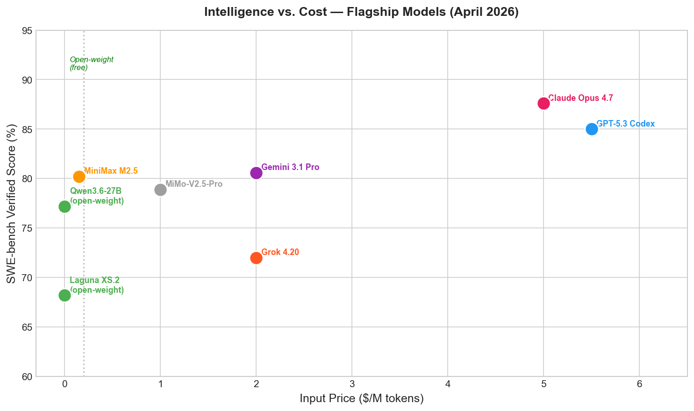
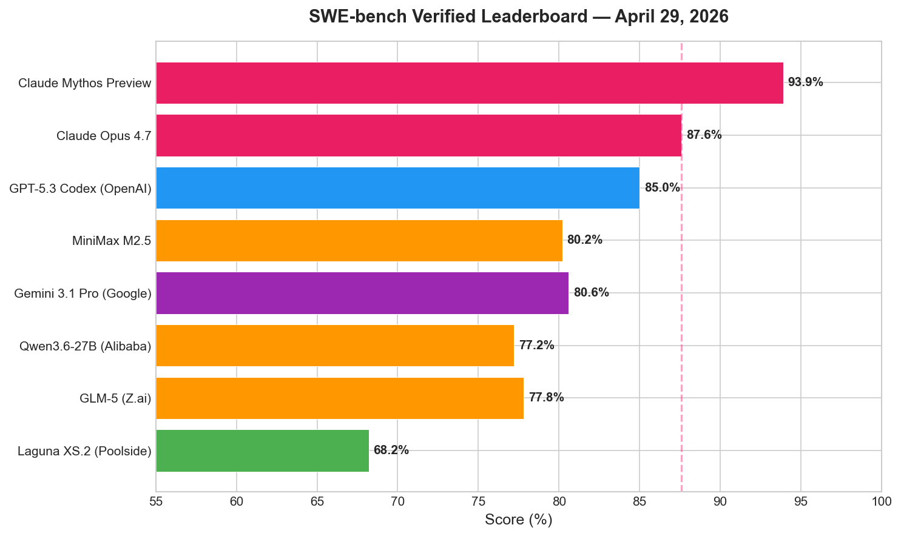
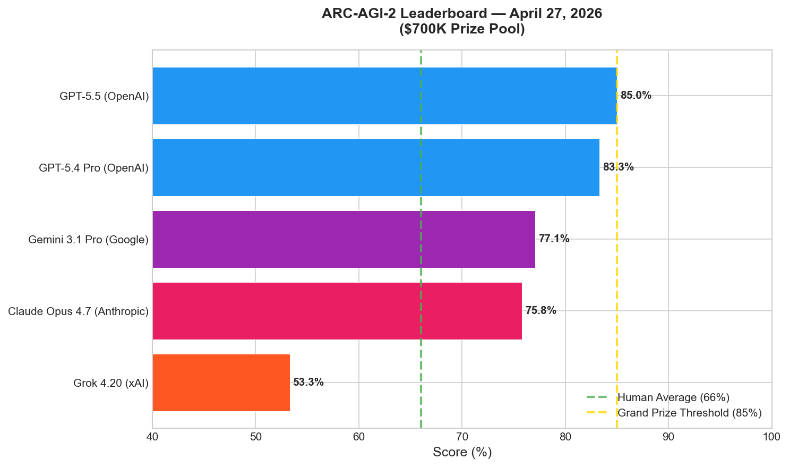
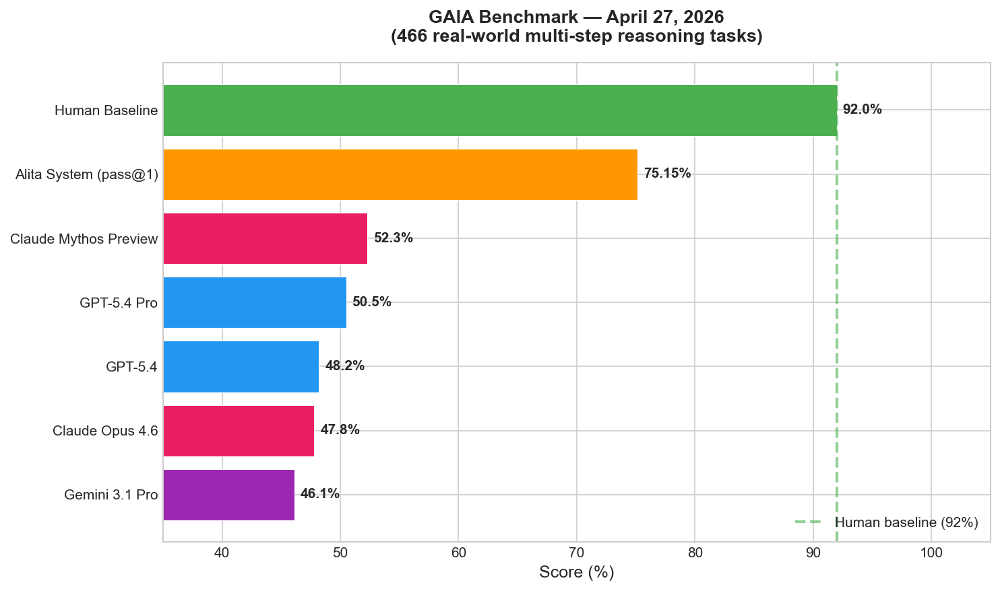

# AI News Daily Digest — 2026-04-29
*Compiled by OMAR for ML Research & Agentic Engineering*

---

## At a Glance (TL;DR)

- **ICLR 2026 wrapped** in Rio (5,355 papers, 27.4% acceptance): Outstanding Papers proved transformers are provably more succinct than RNNs/automata, and that LLMs systematically degrade in multi-turn underspecified interactions — a critical training blind spot.
- **Big Tech Q1 2026 earnings confirmed a $630B+ AI capex supercycle** — AWS +28% YoY, Google Cloud +63%, Azure +40%; free cash flows compressed as capex hit $59B+ for Amazon alone.
- **Google committed up to $40B to Anthropic** (valued at $350B), providing ~10 GW of combined AWS + Google Cloud compute — the largest single AI investment in history.
- **EU AI Act high-risk delay is dead** — the Digital Omnibus trilogue collapsed April 28–29; August 2, 2026 Annex III compliance deadline now legally binding with no relief mechanism.
- **Claude Opus 4.7** (April 16): 87.6% SWE-bench Verified (+6.8 pp), new `xhigh` thinking mode, 3.3× higher-resolution vision, 1M context; intentionally reduced cyber capabilities with Cyber Verification Program.
- **IBM Granite 4.1** released today (April 29): 3B/8B/30B Apache 2.0 family, 512K context, 15T training tokens; 8B model matches prior 32B MoE — resets enterprise open-weight efficiency bar.
- **NVIDIA Nemotron 3 Nano Omni** (April 28): 30B-A3B Mamba-MoE processes text + image + video + audio in one pass at 9× higher throughput — most capable open omnimodal model.
- **Qwen3.6-27B** (April 22): Dense 27B outperforms Alibaba's own 397B MoE on coding (77.2% SWE-bench Verified); introduces "Thinking Preservation" for agentic multi-turn efficiency.
- **A2A Protocol v1.0** went production-stable (April 24) with backing from AWS, Cisco, Google, IBM, Microsoft, Salesforce, SAP, ServiceNow — standardizing cross-vendor agent communication.
- **GPT-5.5 crossed ARC-AGI-2's 85% Grand Prize threshold** — first model to surpass average human performance on the hardest abstract reasoning benchmark ($700K prize pool).
- **GAIA frontier gap remains ~40 points** (52.3% for best model vs. 92% human); GAIA2 at ICLR adds asynchronous environments — real-world agent difficulty remains unsolved.
- **FinePhrase** (HuggingFace): 486B-token synthetic dataset from 90 controlled experiments shows structured formats (FAQ, Math, Tables, Tutorials) outperform curated web data at 30× lower cost.
- **Poolside Laguna XS.2** (April 28): Open-weight, Apache 2.0, only 3B active parameters, 68.2% SWE-bench Verified — most efficient open model per active compute on coding.
- **Guild.ai launched** (April 29) with $44M Series A from Google Ventures as the "first agent control plane" — centralized identity, audit logging, cost tracking, and Agent Hub across all frameworks.

---

## What This Means For Your Work

### For ML Research

- **ICLR 2026's theoretical signal is clear: transformers deserve formal study.** "Transformers are Inherently Succinct" gives the first principled proof for *why* transformers outperform classical models — not expressiveness alone but compactness of representation. The flip side (EXPSPACE-complete verification) means formal analysis tools for transformers are years behind their deployment pace. Expect a wave of follow-up theoretical work.

- **RL scaling is now a principled engineering discipline, not empirical art.** ScaleRL (Meta, 400K GPU-hours) and IsoCompute (UC San Diego/CMU) together provide a complete playbook: fit sigmoidal compute-performance curves at small scale, extrapolate to large, allocate compute based on asymptotic-performance targets not recipe intuition. The key finding — design choices affect *compute efficiency* but not the *asymptotic ceiling* — means recipe selection must come before scaling.

- **Synthetic pretraining data is the next frontier, not raw data volume.** FinePhrase (486B tokens, 90 experiments, 12.7 GPU-years) establishes that structured reformatting with a 1B-parameter generator outperforms curated web data at 30× lower cost. Combined with "Pre-training under Infinite Compute" (Stanford, 17.5× math data efficiency via ensemble distillation), the message is clear: the next generation of pre-training wins will come from data methodology, not dataset scale.

- **Sparse MoE has crossed into image generation.** Nucleus-Image (17B total, 2B active, Apache 2.0) is the first open-source frontier image generation model with sparse MoE architecture, matching GPT Image 1 and Imagen 4 without RL fine-tuning. The decoupled routing design solving the timestep-collapse problem may become a template for future MoE diffusion work across modalities.

- **The Muon optimizer is transitioning from research novelty to production tool.** Polar Express (ICLR Honorable Mention) gives Muon's polar decomposition subroutine the same rigorous treatment previously reserved for Adam's foundational components — GPU-native, bfloat16-stable, minimax-optimal polynomial approximation. Expect more large-scale training runs to adopt Muon in H2 2026.

### For Agentic Engineering

- **Harness-compute separation is now the dominant production architecture.** OpenAI's Sandbox Agents (v0.14), AWS AgentCore, and Microsoft Hyperlight CodeAct all converge on the same pattern: separate orchestration from execution, externalize state, make sandboxes portable across providers. This pattern enables cost-transparent auditing, cross-provider portability, and resume semantics simultaneously. Adopt it for any production agent with more than 2–3 chained tool calls.

- **A2A v1 removes the multi-vendor integration tax.** With backing from 8 major cloud and enterprise vendors, A2A v1's standardized discovery (`.well-known/agent-card.json`) and dual transport bindings (HTTP+JSON, JSON-RPC 2.0) mean remote agents are now first-class objects in code — no custom glue. For teams building cross-org or cross-vendor agent pipelines, the migration from v0.3 is a breaking change in 3 areas; prioritize it before integrating new partner agents.

- **Agent governance is the new infrastructure layer.** Three releases in one week — Microsoft's Agent Governance Toolkit (OWASP Agentic Top 10 full coverage, <0.1ms deterministic policy enforcement), Microsoft Entra Agent ID (agents as first-class identities), and Guild.ai's control plane ($44M, vendor-neutral) — signal that the industry has accepted ungoverned agent sprawl as an existential enterprise risk. The pattern is identity → policy → observability. Implement all three before scaling agent counts beyond 10.

- **CodeAct pattern delivers 50% latency + 60% token savings in production.** Microsoft Hyperlight CodeAct and OpenHands both demonstrate that collapsing N-turn tool-call loops into a single Python program executing in a sandboxed micro-VM dramatically outperforms the observe→reason→act×N pattern. For any agent with ≥3 chained tool calls, data wrangling, or report generation tasks, this is the most straightforward production optimization available today.

- **Structured memory graphs are replacing flat context + naive RAG for long-horizon agents.** Both APEX-MEM (88.88% QA accuracy, property graph with temporal reasoning) and Microsoft PlugMem (distills raw interactions into structured knowledge units before storage) point to the same conclusion: retrieval should target compact, curated facts indexed by entity and time — not raw transcript chunks. 15–30% of agentic failures in deployed systems trace to retrieval quality, not model reasoning.

---

## Best Models Snapshot

*Intelligence vs. cost scatter for flagship models (April 2026). Open-weight models (green) at zero cost, proprietary models spread from $0.15–$5/M input tokens. Claude Opus 4.7 leads GA models at 87.6% SWE-bench Verified; MiniMax M2.5 leads value at $0.15/M for 80.2%.*

### Model Comparison Table

| Rank | Model | Org | SWE-bench Verified | LMArena Elo | ARC-AGI-2 | Price ($/M in) |
|------|-------|-----|--------------------|-------------|-----------|----------------|
| 1 | Claude Mythos Preview | Anthropic | 93.9% | — | — | Restricted (~40 orgs) |
| 2 | GPT-5.5 | OpenAI | — | — | 85.0% | — |
| 3 | Claude Opus 4.7 | Anthropic | 87.6% | 1497–1505 | 75.8% | $5.00 |
| 4 | GPT-5.3 Codex | OpenAI | 85.0% | — | — | — |
| 5 | GPT-5.4 Pro | OpenAI | — | 1482 | 83.3% | — |
| 6 | Gemini 3.1 Pro | Google | 80.6% | 1492 | 77.1% | $2.00 |
| 7 | MiniMax M2.5 | MiniMax | 80.2% | — | — | $0.15 |
| 8 | MiMo-V2.5-Pro | Xiaomi | 78.9% | — | — | $1.00 |
| 9 | GLM-5 | Z.ai | 77.8% | — | — | Open (MIT) |
| 10 | Qwen3.6-27B | Alibaba | 77.2% | — | — | Open (Apache 2.0) |
| 11 | Qwen3.6-35B-A3B | Alibaba | 73.4% | — | — | Open (Apache 2.0) |
| 12 | Laguna M.1 | Poolside | 72.5% | — | — | API preview |
| 13 | Grok 4.20 | xAI | 72.0% | 1484 | 53.3% | $2.00 |
| 14 | Laguna XS.2 | Poolside | 68.2% | — | — | Open (Apache 2.0) |

---

## Benchmark Highlights

### SWE-bench Verified — The Real-World Coding Standard

SWE-bench Verified (500 human-validated GitHub issues from real Python repos) has become the primary signal for real-world software engineering capability. The leaderboard has shifted dramatically: the proprietary-to-open-weight gap has narrowed to just 6.3 percentage points (Claude Opus 4.7 at 87.6% vs. MiniMax M2.5 at 80.2%), down from 20–30 pp a year ago. Poolside's Laguna XS.2 achieves 68.2% with only 3B active parameters — redefining the efficiency frontier.

*SWE-bench Verified scores as of April 29, 2026. Claude Mythos (restricted release) leads at 93.9%; Laguna XS.2 (open-weight, 3B active) demonstrates the efficiency frontier at 68.2%.*

### ARC-AGI-2 — Abstract Reasoning at Human Level

ARC-AGI-2 is the hardest publicly-run benchmark for abstract fluid intelligence, specifically designed to resist pattern-matching. GPT-5.5 became the first model to cross the 85% Grand Prize threshold (surpassing the 66% human average), claiming $700K. Only 10 models have been evaluated, and the spread (53.3%–85.0%) reflects genuine differentiation at the frontier.

*ARC-AGI-2 scores as of April 27, 2026. GPT-5.5 first to cross the 85% Grand Prize threshold. Human baseline at 66% shown in green.*

### GAIA — Real-World Multi-Step Agent Reasoning

GAIA tests 466 real-world tasks requiring multi-step reasoning, tool use, and information synthesis. Despite superhuman performance on narrow coding benchmarks, the frontier sits at 52.3% — a 40-point gap from the 92% human baseline. GAIA2 (ICLR 2026) adds asynchronous environments that evolve independently of agent actions, making the benchmark even closer to real-world conditions.

*GAIA leaderboard (April 27, 2026). Alita generalist agent system at 75.15% pass@1 uses multi-agent orchestration. Human baseline at 92%. The frontier gap remains ~40 points.*

---

## ML Research Highlights

### ICLR 2026: Two Outstanding Papers That Reframe Core Assumptions

ICLR 2026 wrapped in Rio de Janeiro (April 23–27) with 5,355 accepted papers from 19,525 submissions. The Outstanding Paper Committee—chaired by Gautam Kamath—recognized two papers that address orthogonal but equally important gaps in how the field understands and evaluates language models.

**"Transformers are Inherently Succinct"** (Bergsträßer, Cotterell, Lin) provides the first principled theoretical explanation for why transformers outperform RNNs, finite automata, and Linear Temporal Logic formulas — not just expressiveness but *compactness of representation*. The flip side is stark: verifying even simple properties of transformers is EXPSPACE-complete, meaning formal analysis is provably harder for transformers than for any of the classical alternatives they replaced. After a decade of empirical dominance, there is now a formal argument for *why* transformers win.

**"Multi-Turn LLM Evaluation"** (Laban, Hayashi, Zhou, Neville — Salesforce AI Research) establishes with rigorous methodology that LLMs trained largely on single-turn completions show marked degradation under multi-turn, underspecified-instruction interactions — precisely the conditions of real-world deployment. The committee called the experimental design "exceptional," noting the findings reveal a systemic optimization blind spot in RLHF/preference-tuning pipelines. Models optimized for single-turn benchmarks are being deployed in multi-turn settings; this paper quantifies the gap.

The Honorable Mention, **"The Polar Express"** (Amsel, Persson, Musco, Gower), gives the Muon optimizer's polar decomposition subroutine formal theoretical grounding: GPU-native, bfloat16-stable polynomial approximations using minimax optimization. This signals that Muon is transitioning from a niche research optimizer to a production-grade alternative to Adam for LLM pre-training.

The Test of Time Awards recognized DCGAN (the paper that started learned image generation as a subfield) and DDPG (the first RL algorithm for continuous physical actions from raw sensor data).

---

### IBM Granite 4.1 and the Enterprise Efficiency Signal

IBM's Granite 4.1 family (released today, April 29) is architecturally significant beyond its headline numbers. The 8B-Instruct model matching a 32B MoE on enterprise benchmarks — with a dense architecture that avoids routing overhead — points to a maturing in training methodology, not model scale.

The broader implications: the 512K context window positions Granite 4.1 for enterprise document workflows that most consumer-facing models still struggle with. Apache 2.0 licensing across the full family (language, speech, vision, embedding, Guardian safety) lowers the integration and compliance barrier for regulated industries significantly. IBM's reported 20× output token efficiency advantage over Qwen3.5 9B on the Intelligence Index adds a cost dimension that will become increasingly important as enterprises scale to millions of API calls.

---

## Agentic AI Highlights

### A2A v1: The Protocol Layer the Agent Ecosystem Was Missing

The Agent-to-Agent protocol reaching v1 stability (April 24) backed by eight major vendors is the kind of quiet infrastructure event that determines which architectural patterns become default over the next 3–5 years. HTTP/REST for the web; A2A for agent meshes.

The practical impact is immediate: a procurement agent can now call a compliance agent on a completely different stack — different vendor, different cloud, different language — without any custom integration code. The remote agent appears as a standard `AIAgent` object. The v1 additions — signed Agent Cards for cryptographic identity verification, multi-tenancy support for regulated environments, dual transport bindings — address the specific enterprise objections (trust, isolation, compatibility) that prevented v0.x adoption at scale.

The broader signal: the eight-vendor consortium (AWS, Cisco, Google, IBM, Microsoft, Salesforce, SAP, ServiceNow) represents the enterprise software stack. When all eight agree on a communication protocol, adoption is not optional for enterprise AI teams.

### The Governance Stack Matures in One Week

Three parallel governance announcements in a single week represent a maturation phase: agentic AI is moving from "can we build this" to "can we govern this at scale."

**Microsoft's Agent Governance Toolkit v3.3.0** (MIT, April 27) provides deterministic sub-millisecond policy enforcement (<0.1ms) across all 10 OWASP Agentic AI risks. The 2-line `govern()` wrapper drops into any existing LangChain, AutoGen, CrewAI, or LangGraph deployment. The multi-stage policy pipeline (pre_input → pre_tool → post_tool → pre_output) covers every interception point in an agent's lifecycle.

**Microsoft Entra Agent ID** (Preview) treats agents as first-class identities — same Conditional Access policies, lifecycle management, and risk-based controls as human identities. The three pillars (manage via Agent 365, govern via Blueprints, protect via Conditional Access) establish a governance pattern that will likely influence how other cloud vendors structure agent identity.

**Guild.ai's launch** ($44M Series A, Google Ventures) addresses a different layer: the organizational control plane above individual frameworks. The "gremlins" problem — engineers burning entire monthly AI budgets in 12 hours with no centralized monitoring — is a real enterprise failure mode. Guild's Agent Hub ("GitHub for agents") and immutable audit logging address the discovery and accountability gaps that existing frameworks leave open.

---

## Industry & Business Highlights

### $630B AI Capex Supercycle — The Biggest Synchronized Tech Investment in History

Q1 2026 earnings confirmed what was anticipated: the four major hyperscalers are collectively committing $630–700B to AI infrastructure in 2026, nearly double 2025 levels. The bull case rests on extraordinary demand signals — AWS's $244B backlog (up 40% YoY) and Google Cloud's $460B+ backlog provide multi-year visibility that prior tech capex cycles (mobile, cloud, IoT) never had. Google Cloud's first $20B+ quarter at 63% YoY growth, Azure at 40% YoY with $37B AI ARR growing 123% YoY, and AWS at $37.6B quarterly revenue are real revenue — not speculative.

The bear case is equally real: Amazon's free cash flow dropped from $25.9B to $1.2B in one year due to $59.3B in property/equipment capex. Meta's FCF is effectively negative on an infrastructure-adjusted basis. The depreciation cliff arrives in 2027–2028; the question is whether AI revenue compound growth will outrun it. Meta's stock dropped ~6% after-hours and Microsoft slid ~2.5% on the earnings — investors are not yet convinced.

### Google's $40B Anthropic Bet Redefines Lab Economics

At $350B, Anthropic is now valued higher than many Fortune 100 companies despite having no public financials. The deal structure — $10B immediate cash, up to $30B contingent on milestones, 5 gigawatts of Google Cloud TPU capacity over 5 years — combined with Amazon's prior commitments gives Anthropic ~10 gigawatts of reserved compute across two hyperscalers. This dual-hyperscaler arrangement is unprecedented and establishes a new blueprint: frontier labs negotiate separately for training compute (TPU/GPU cost efficiency) and inference hosting (enterprise distribution), reducing single-cloud lock-in risk.

Sergey Brin's candid acknowledgment that Google "needs to catch up to Anthropic on AI coding agents" underscores how the $40B investment is as much about competitive positioning as it is about compute access.

---

## Full Sections

- [ML Research](sections/ml-research.md)
- [AI Industry](sections/ai-industry.md)
- [Agentic AI](sections/agentic-ai.md)
- [Best Models](sections/best-models.md)
