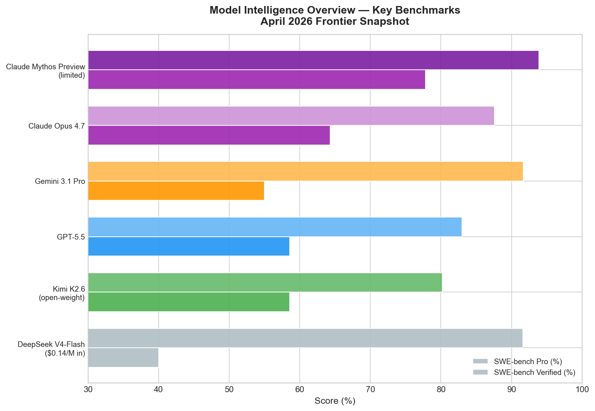
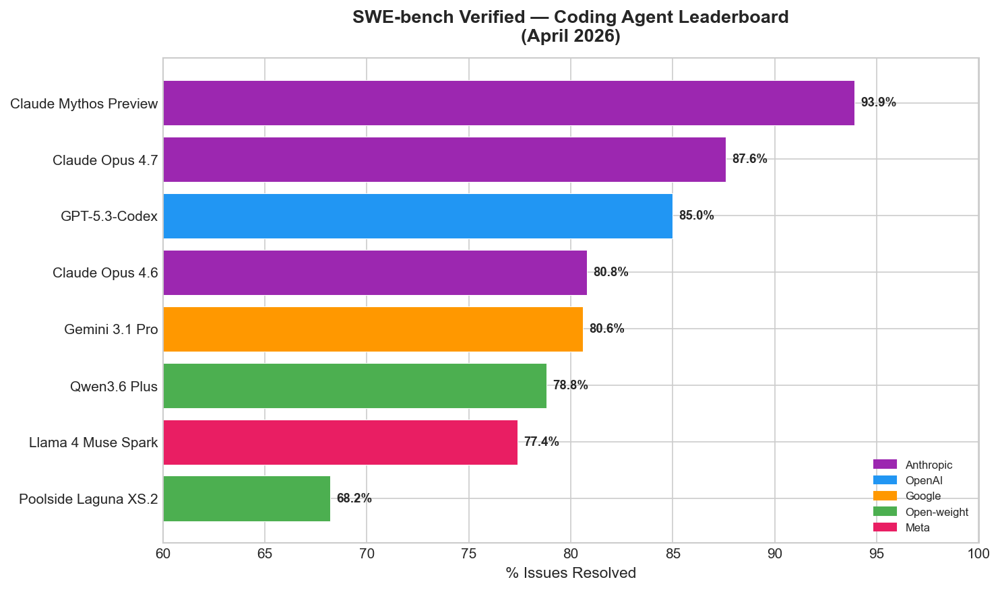
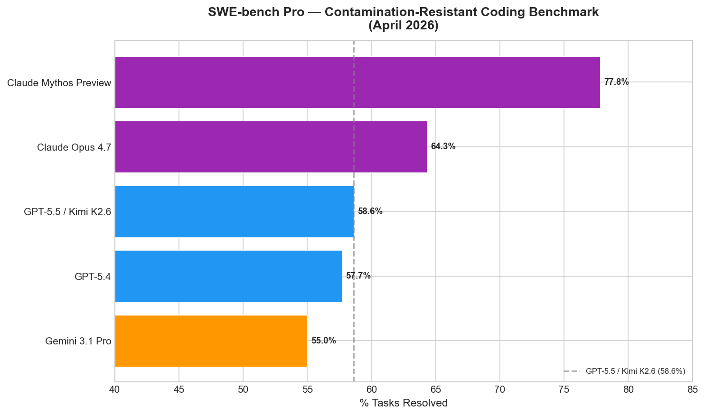
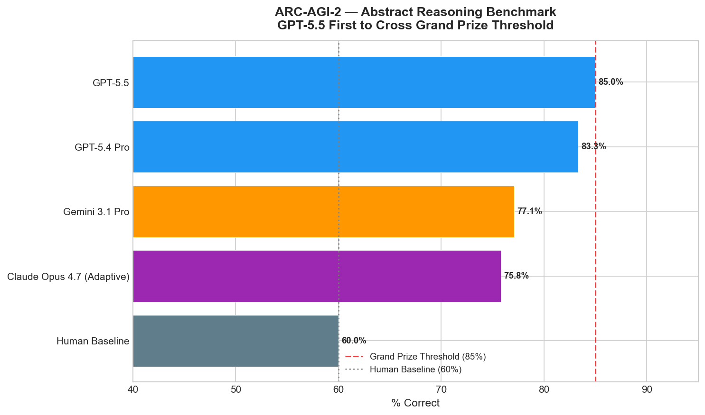
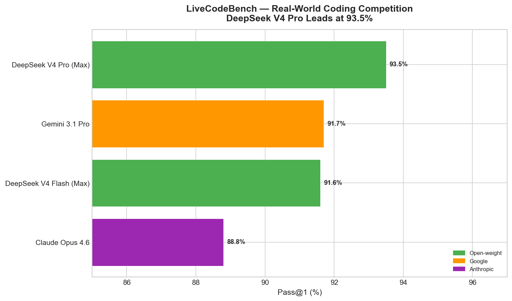
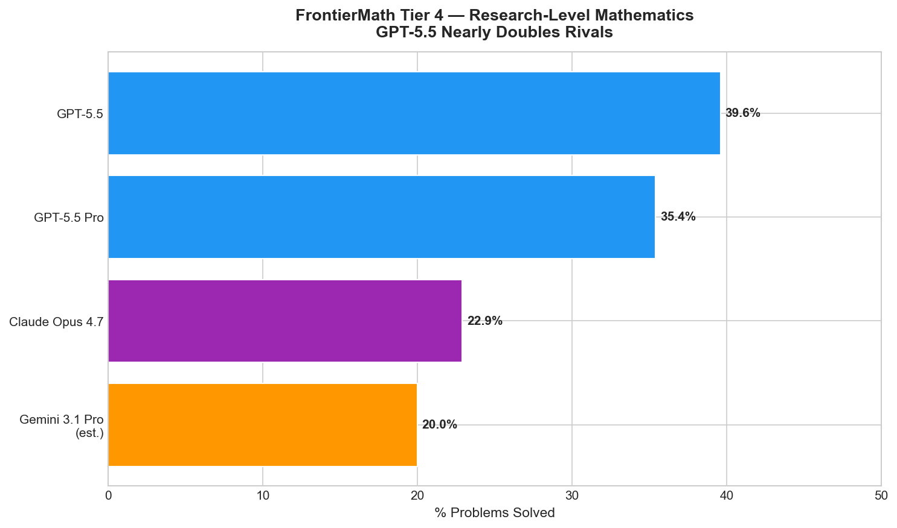
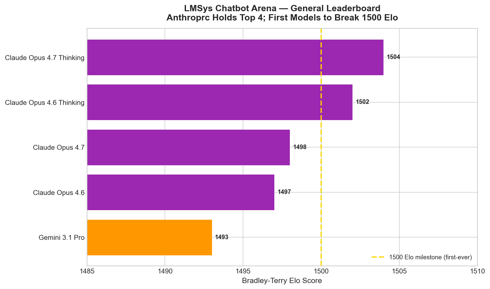
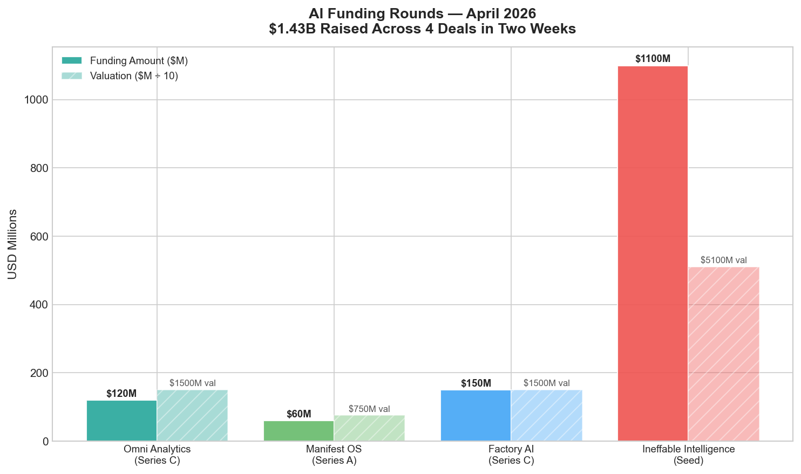

# AI News Daily Digest — 2026-04-30
*Compiled by OMAR for ML Research & Agentic Engineering*

---

## At a Glance (TL;DR)

- **Meta kills Llama** — Muse Spark is proprietary, cloud-only; 200,000+ developers face platform uncertainty with no migration path offered.
- **Microsoft-OpenAI go non-exclusive** — OpenAI can now deploy on AWS and Google Cloud; Microsoft collects 20% of OpenAI's rival-cloud revenue through 2030.
- **GPT-5.5 crosses ARC-AGI-2's 85% grand prize threshold** — first model in history to do so; costs doubled to $5/$30 per M tokens.
- **Claude Mythos Preview** (93.9% SWE-bench, 100% Cybench, ~10T params) restricted to 52 security research partners; NSA confirmed user per Bloomberg.
- **DeepSeek V4 Pro** (1.6T params, MIT, $0.14/M input) tops LiveCodeBench at 93.5% with 73% fewer inference FLOPs vs. V3.2 — the most infrastructure-efficient open-weight coding model.
- **Kimi K2.6** (1T params, Modified MIT) ties GPT-5.5 on SWE-bench Pro at 58.6%; purpose-built for 12-hour autonomous runs and 300-agent swarms.
- **Google Cloud Next '26** unveils Gemini Enterprise Agent Platform with cryptographic agent identity, persistent memory, $750M partner fund, and 8th-gen TPUs.
- **Ineffable Intelligence raises $1.1B seed** (David Silver, ex-DeepMind AlphaGo lead) at $5.1B valuation — largest seed round in European history; bets RL-without-human-data is the next frontier.
- **T² scaling laws prove Chinchilla is wrong** for deployed models: when test-time inference costs are included, optimal training shifts deep into the overtraining regime.
- **LPSR** achieves 44% MATH-500 accuracy on an 8B model — beating a standard 70B — by correcting reasoning errors mid-generation via KV-cache rollback with no fine-tuning.
- **White House mandates multi-vendor AI** for federal agencies; DoD contractors must respect military chain of command; stops short of "all lawful use" clauses.
- **SWE-bench Verified credibility crisis**: 35-point gap vs. SWE-bench Pro indicates widespread contamination — prior leaderboard rankings need recalibration.
- **A2A protocol turns one year**: 150+ organizations, production at supply chain/finance/ITSM scale, v1.0 with cryptographic Signed Agent Cards.
- **$1.43B raised in two weeks** across Factory AI, Manifest OS, Ineffable Intelligence, and Omni Analytics — all domain-specialized vertical agents, not general-purpose models.

---

## What This Means For Your Work

### For ML Research

- **Retrain your Chinchilla intuitions.** The T² scaling laws framework (arXiv 2604.01411) demonstrates that models deployed with test-time scaling (best-of-N, chain-of-thought) should be trained well into the overtraining regime relative to Chinchilla prescriptions. If you are designing pretraining runs for models intended for agentic deployment, the optimal point has shifted: smaller models on more tokens outperform Chinchilla-optimal models under equalized end-to-end compute.

- **LPSR is the inference-time trick worth studying.** Achieving 44.0% MATH-500 on an 8B model — beating a standard 70B and Best-of-16 sampling at 5.4× lower token cost — by monitoring residual stream phase shifts and rolling back the KV cache is a result that will spawn follow-up work. The layer-level dissociation (detection peaks at layer 14, correction at layer 16) suggests distinct internal mechanisms that may be exploitable across model families.

- **Open-weight models are now within one training cycle of closed frontier on coding.** DeepSeek V4 Pro leads LiveCodeBench over all closed models; Kimi K2.6 ties GPT-5.5 on SWE-bench Pro. The convergence is fastest on domains with abundant training signal (competitive programming, GitHub issues). If this trend continues, the commercial moat from closed frontier models may be limited to benchmarks with scarcer training signal — math Olympiad, novel reasoning, and agentic long-horizon tasks.

- **Benchmark saturation is accelerating.** MMLU-Pro is within 1.7 points across all frontier models; ARC-AGI-2's grand prize threshold was just breached. SWE-bench Verified has a 35-point contamination gap vs. Pro. The academic community needs to move faster on contamination-resistant evaluation — the current cycle from "hard benchmark" to "saturated benchmark" is compressing toward 12–18 months.

- **DeepSeek's architectural efficiency results are exceptional and deserve replication.** Running 1M-token context at 27% of prior-generation inference FLOPs and 10% of KV cache memory — via CSA/HCA hybrid attention — changes the economics of long-context agentic deployment. Architecturally, this is the most interesting result of the week; whether it generalizes to other attention variants is an open research question.

### For Agentic Engineering

- **Harness/compute separation is the pattern to adopt in 2026.** OpenAI's Agents SDK v0.14 and Microsoft's Hyperlight CodeAct both codify the same architectural principle: agent state, credentials, and orchestration live in the harness; model-generated code executes in isolated sandboxes. This eliminates the largest security failure mode (credential leakage into code execution), enables durable execution via snapshotting, and allows horizontal scaling. If you are building production agents and running code execution directly in the agent process, this is the architectural debt to address first.

- **SWE-bench Pro is the benchmark to cite, not Verified.** A 35-point gap between the two benchmarks — consistent across Claude Opus 4.5, GPT-5.4, and Kimi K2.6 — means Verified scores are inflated by training data contamination. When evaluating coding agents for production use, weight Pro scores significantly more heavily. Claude Opus 4.7's 64.3% Pro score (vs. 87.6% Verified) is the accurate capability signal.

- **MCP and A2A have reached production infrastructure status.** MCP hit 97M monthly SDK downloads and 10,000+ active servers; A2A has 150+ organizations and production deployments in financial services and supply chain. These are no longer experimental protocols — build new agent integrations on MCP for tool access and A2A for inter-agent communication, and expect governance tooling (Kong, Salesforce, Microsoft) to enforce them at the control plane level.

- **Context density, not context length, is the real bottleneck.** GenericAgent's 89.6% token reduction by maximizing information density — not increasing context budget — is a result that directly challenges the assumption that longer context windows solve long-horizon agent failures. Before reaching for a 1M-token context model, assess whether your agent's context contains mostly irrelevant history; structured retrieval (agentic-db's five-mode search) may solve the same problem at 6× lower token cost.

- **Governance tooling is no longer optional.** EU AI Act Annex III obligations activate August 2026; Colorado AI Act enforcement starts June 2026. The OWASP Agentic Top 10 2026 formalizes the attack surface: uncontrolled autonomy, goal hijacking, identity abuse, memory poisoning, and cascading multi-agent failures are all production risks with active exploits. Microsoft's Agent Governance Toolkit (covering all 10 OWASP risks at <0.1ms policy latency) and Akeyless's intent-aware authorization are the practical starting points.

---

## Best Models Snapshot

*Side-by-side SWE-bench Pro and SWE-bench Verified scores across the April 2026 frontier. DeepSeek V4-Flash offers open-weight performance at $0.14/M input; Claude Mythos Preview remains restricted to 52 partners.*

### Model Comparison Table

| Model | Org | Input ($/M) | Output ($/M) | Context | Notes |
|---|---|---|---|---|---|
| Claude Mythos Preview | Anthropic | N/A | N/A | 500K–1M | Restricted; 52 orgs only |
| GPT-5.5 Pro | OpenAI | $30.00 | $180.00 | 272K+ | Priority tier |
| GPT-5.5 | OpenAI | **$5.00** | **$30.00** | 128K | Standard; batch: $2.50/$15 |
| Claude Opus 4.7 | Anthropic | **$5.00** | **$25.00** | 1M | Cache reads: $0.50/M; new tokenizer adds ~35% tokens |
| o3 (reasoning) | OpenAI | $10.00 | $40.00 | 200K | |
| Claude Sonnet 4.6 | Anthropic | $3.00 | $15.00 | 200K | |
| Gemini 3.1 Pro | Google | $1.25–$2.00 | $10.00–$12.00 | 1M | |
| DeepSeek V4-Pro | DeepSeek | $0.145 | $3.48 | 1M | Open-weight; OSS |
| Kimi K2.6 | Moonshot AI | $0.60–$0.95 | TBD | 262K | Open-weight; MIT-like |
| Mistral Large 3 | Mistral | $0.50 | $1.50 | 256K | Apache 2.0; OSS |
| DeepSeek V4-Flash | DeepSeek | **$0.14** | **$0.28** | 1M | Cheapest capable model |
| Gemini 3 Flash | Google | $0.50 | $3.00 | 1M | |
| Claude Haiku 4.5 | Anthropic | $1.00 | $5.00 | 200K | |
| GPT-4o mini / Gemini 2.5 Flash | OpenAI / Google | $0.15 | $0.60 | 128K | Budget tier parity |
| GPT-4.1 nano | OpenAI | $0.10 | $0.40 | 128K | Cheapest OpenAI model |

---

## Benchmark Highlights

### Coding Agent Benchmarks — SWE-bench Verified vs. Pro

The SWE-bench ecosystem is undergoing a credibility transition. SWE-bench Verified (resolving real GitHub issues) has historically been the de facto coding agent standard, but a consistent 25–35 point gap between Verified and Pro scores reveals widespread training data contamination. Claude Opus 4.5 scores 80.9% Verified but only 45.9% Pro — a 35-point collapse that signals leaderboard inflation. The community is migrating trust to SWE-bench Pro as the authoritative benchmark. Notably, Claude Mythos Preview at 77.8% Pro represents a genuine capability ceiling; public models cluster between 55–65% on the harder test.

### Abstract Reasoning — ARC-AGI-2 Grand Prize Crossed

GPT-5.5 became the first model in history to cross the 85% ARC-AGI-2 grand prize threshold — designed to represent human-level abstract reasoning (human baseline: 60%). Prior frontier models (Claude Opus 4.7 at 75.8%, Gemini 3.1 Pro at 77.1%) were stuck in the 75–77% range. The prize architects are already planning ARC-AGI-3, which has an even harder constraint: as of March 2026, frontier AI solves fewer than 1% of its 135 environments while humans solve all of them.

### Competitive Coding — LiveCodeBench

DeepSeek V4 Pro leads LiveCodeBench at 93.5% pass@1 — the highest score across all evaluated models, including all closed-source frontier models. Its Codeforces rating of 3,206 places it 23rd among all human competitors globally. This open-weight model with $0.14/M input pricing outperforms every closed model on this benchmark, demonstrating that the open-weight frontier has converged with or surpassed closed models on competitive programming.

### Math Reasoning — FrontierMath Tier 4

FrontierMath Tier 4 tests novel research-level mathematics designed to resist memorization. GPT-5.5 at 39.6% nearly doubles Claude Opus 4.7's 22.9% — a rare case where one model has a dominant lead. This gap suggests GPT-5.5's architectural changes (first full retrain since GPT-4.5) produced meaningful gains specifically on hard mathematical reasoning, not just benchmark optimization.

### Human Preference — LMSys Arena

Anthropic holds the top 4 positions on the LMSys Chatbot Arena general leaderboard, with Claude Opus 4.7 Thinking at 1504 Elo — the first model in the benchmark's history to exceed 1,500. With 5.8M+ votes across 635 models, this is the largest continuous human preference dataset in existence. The top 4 positions are statistically indistinguishable within confidence intervals (±5–11 Elo), but Anthropic's clean sweep signals strong user preference across diverse conversation types.

---

## ML Research Highlights

### DeepSeek V4 Pro: 1.6T Parameters, 1M Context, Trained on Huawei Chips

DeepSeek V4 Pro is the week's most architecturally significant open-source release. At 1.6 trillion total parameters with 49 billion active per token, it introduces two novel attention mechanisms that fundamentally change the efficiency calculus for long-context inference. **Compressed Sparse Attention (CSA)** compresses KV entries by 4× via softmax-gated pooling; **Heavily Compressed Attention (HCA)** compresses by 128× using dense attention over the compressed stream. These alternate across the 61-layer stack with sliding-window attention for recent tokens.

The results are remarkable: at 1M token context, V4 Pro uses only 27% of single-token inference FLOPs and 10% of KV cache compared to DeepSeek-V3.2 — roughly 2% of the KV cache of standard GQA architectures. Additional architectural choices include Manifold-Constrained Hyper-Connections replacing standard residual skip connections, and the Muon optimizer (not AdamW) — the same optimizer theoretically analyzed in ICLR 2026's Polar Express honorable mention. The model was trained on 32–33 trillion tokens, largely on Huawei Ascend 950PR chips, not NVIDIA hardware.

Benchmark performance: 80.6% SWE-bench Verified, 93.5% LiveCodeBench (best overall), 90.1% GPQA Diamond, Codeforces rating 3,206 (23rd among all human competitors). MIT license, weights on HuggingFace, API at api.deepseek.com. This is the most capable open-weight model for long-context agentic coding as of this date.

### T² Scaling Laws: Chinchilla Is Wrong When You Factor In Inference

Roberts et al. from Wisconsin-Madison and Stanford close a fundamental gap in pretraining scaling law literature: Chinchilla and its successors optimize for pretraining compute, but modern LLMs are deployed with test-time scaling (repeated sampling, best-of-N). When inference cost is included in the end-to-end compute budget, the optimal training decisions shift dramatically. The T² framework jointly optimizes model size N, training tokens D, and inference samples k under a fixed total compute budget.

Key finding: optimal pretraining now lies well into the overtraining regime relative to Chinchilla's prescription. Smaller models trained on substantially more tokens outperform larger Chinchilla-optimal models under equalized end-to-end compute. The result holds empirically across two variants (T²-NLL and T²-Acc) and 8 downstream tasks. Post-training via RLHF or SFT does not invalidate T² predictions. This reframes the canonical question "how big a model, how many tokens?" to include a third variable: how many inference samples?

### LPSR: Inference-Time Error Correction Without Fine-Tuning

Latent Phase-Shift Rollback (arXiv 2604.18567) is a notable inference-time intervention: it detects and corrects reasoning errors during generation by monitoring residual streams and rolling back the KV cache with steering vectors — no gradient computation, no additional forward passes, no fine-tuning required.

The mechanism monitors the residual stream at a target layer, detects abrupt directional reversals ("phase shifts") using a dual gate (cosine-similarity drop + entropy spike), rolls back the KV cache to the pre-error state, and injects a pre-computed steering vector to redirect generation. On MATH-500, an 8B model with LPSR achieves 44.0% — beating a standard 70B model (35.2%) by 8.8 points at 8.75× fewer parameters, and beating Best-of-16 sampling (36.2%) at 5.4× lower token cost. The detection-correction dissociation (detection peaks at layer 14, correction at layer 16) is a novel mechanistic finding.

---

## Agentic AI Highlights

### The Infrastructure Consolidation Wave

Three distinct signals converge this week into a single pattern: enterprise agentic infrastructure is consolidating into unified control planes. OpenAI shipped a vertically integrated harness+sandbox SDK (v0.14) with native sandbox support across seven providers and architectural separation of credentials from code execution. Kong AI Gateway 3.14 added A2A traffic governance alongside its existing LLM and MCP gateway capabilities — completing what it calls the "AI Data Path" with centralized auth, rate limiting, and audit logging across the full agent communication stack. Microsoft shipped Agent Governance Toolkit v3.1.0 with quantum-safe ML-DSA-65 cryptographic signing, shadow AI discovery, EU AI Act risk classification, and <0.1ms policy enforcement covering all 10 OWASP Agentic risks.

The common thread is control plane consolidation: enterprises do not want five separate tools for agent observability, security, routing, and compliance. The winning infrastructure vendors are those who can govern API calls, LLM calls, MCP tool calls, and A2A inter-agent RPCs through a single policy layer with end-to-end audit trails.

### A2A at One Year: 150+ Organizations, Protocol Family Expanding

The Agent-to-Agent (A2A) protocol marks its first anniversary with substantial production traction: 150+ organizations supporting the standard, production deployments in supply chain, financial services, insurance, and IT operations, and deep platform integration across Google Cloud, Microsoft Azure, and AWS. The v1.0 release (March 2026) introduced Signed Agent Cards for cryptographic identity verification, multi-tenancy, and modernized OAuth2/mTLS security flows.

More significant for long-term infrastructure: Google surfaced the broader A2Family of protocols — AP2 (Agent Payment Protocol), A2UI (Agent to User Interface), and UCP (Universal Commerce Protocol) — as A2A extensions using its open extensibility model. If these standardize, A2A becomes foundational infrastructure for the "agentic internet," not just cross-enterprise coordination. The Technical Steering Committee spans AWS, Cisco, Google, IBM Research, Microsoft, Salesforce, SAP, and ServiceNow — broad enough to represent a genuine industry consensus rather than a vendor-specific protocol.

### Constructive agentic-db: Postgres as Agent Brain

Constructive's open-source `agentic-db` (April 28, MIT license) is the most architecturally interesting infrastructure release of the week. It provides a complete Postgres schema serving as memory and operational layer for AI agents: episodic long-term memory with vector, BM25, and spatial (PostGIS) search; conversation and tool call event log (fully replayable); skills, tools, and prompt registry; rules and behavioral policy layer; and a "world model" spanning CRM, projects, calendars, goals, and habits with 25+ cross-domain junctions.

The core insight is that file-based agent memory (dumping markdown history into context windows) is an architectural antipattern, not a limitation of current models. By moving to structured retrieval with five complementary search modes, agents can query exactly the information needed without context window bloat. Auto-embedding via Postgres triggers and Ollama means no separate vector database infrastructure. Tested across Claude, Cursor, Devin, Copilot, Windsurf, Codex, and 40+ other AI assistants.

---

## Industry & Business Highlights

### Meta's Llama Pivot: The Biggest Open-Source Reversal in AI History

Meta's launch of Muse Spark — fully proprietary, cloud-only, no open weights — is the most consequential strategic move of the week. For three years, Meta's open-source Llama strategy forced frontier labs to compete on a commoditized model layer, pressured closed-model pricing, and accelerated ecosystem adoption. By closing the weights on Muse Spark (developed from scratch under Meta Superintelligence Labs in nine months, not derived from Llama), Meta signals that open-source strategy either reached its limit or is no longer strategically necessary for competitive differentiation.

The immediate consequences are significant: 200,000+ developers who built production systems on Llama now face platform uncertainty with no migration path offered. The beneficiaries are clear: Mistral, Qwen, and IBM Granite are the most likely destinations for displaced Llama ecosystem developers. Muse Spark's current benchmark position (4th on Artificial Analysis Intelligence Index, strong in multimodal and health, weak in coding) means it is not yet at parity with Anthropic or OpenAI's frontier — making the strategic risk of this reversal higher than the technical results justify.

### AI Funding: $1.43B in Two Weeks, All Vertical Agents

The most striking pattern in April 2026 AI funding is the domain specialization of every major investment: Factory AI ($150M Series C, $1.5B valuation) for autonomous software development; Manifest OS ($60M Series A, largest in legal tech history) for AI-native law firm software; Ineffable Intelligence ($1.1B seed, $5.1B valuation, largest European seed ever) for RL-without-human-data research; Omni Analytics ($120M Series C, $1.5B valuation) for AI-powered business intelligence. No general-purpose assistant companies closed in this window. The market thesis is clear: vertical depth — not model breadth — is the sustainable moat in 2026.

David Silver's $1.1B seed at $5.1B valuation for a company with no product, no revenue, and no public roadmap is the outlier. Nvidia's $250M+ stake signals infrastructure alignment: RL-based training is dramatically more compute-intensive than supervised learning, directly beneficial to Nvidia's hardware sales. Google's participation is strategically notable given their simultaneous investments in Anthropic — systematic hedging across paradigms, not conviction bets.

---

## Full Sections

- [ML Research](sections/ml-research.md)
- [AI Industry](sections/ai-industry.md)
- [Agentic AI](sections/agentic-ai.md)
- [Best Models](sections/best-models.md)

---

*Generated by OMAR compiler agent | 2026-04-30*
