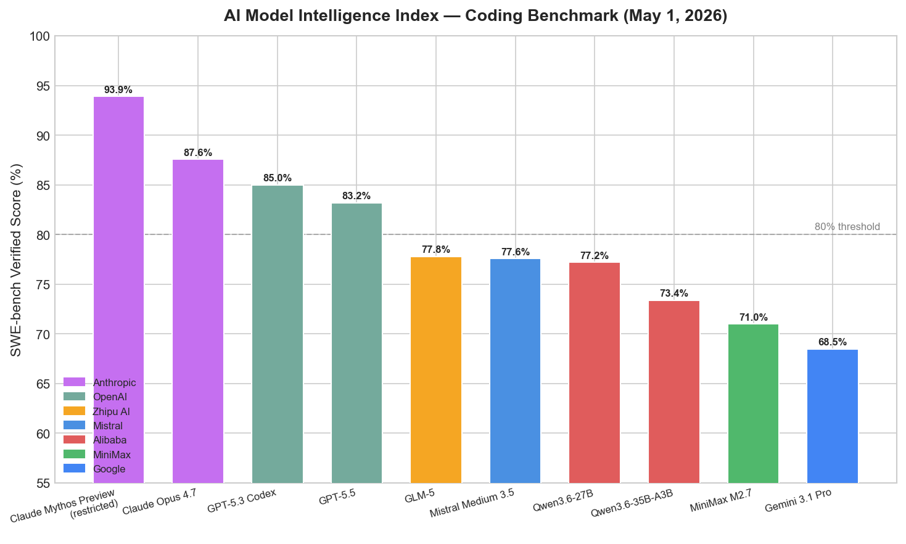
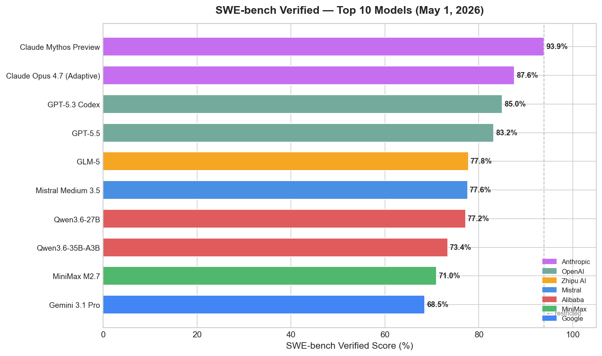
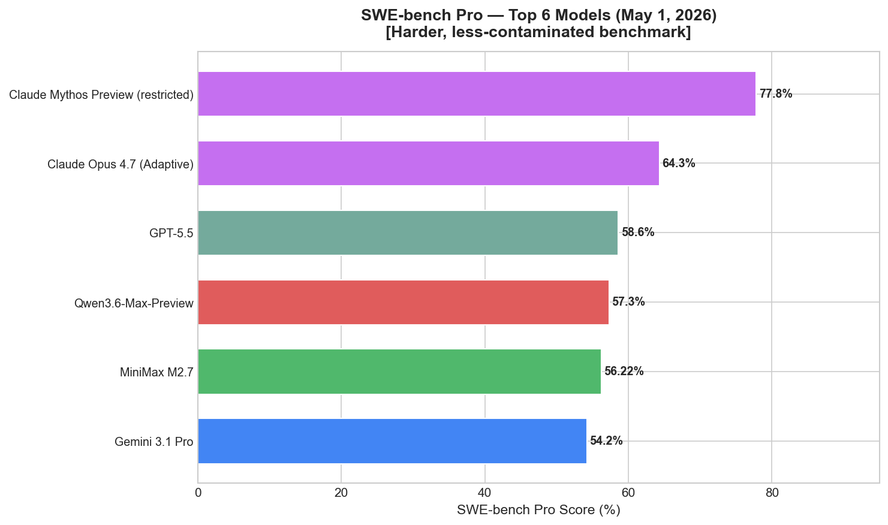
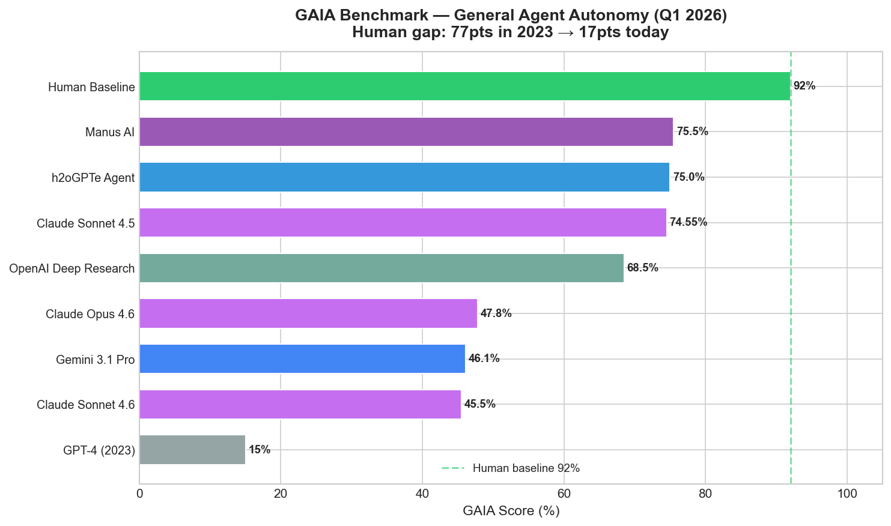
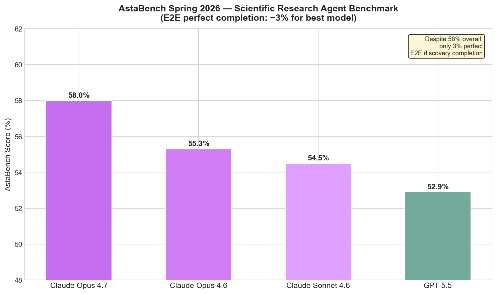
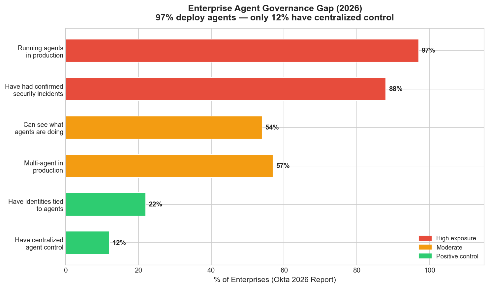
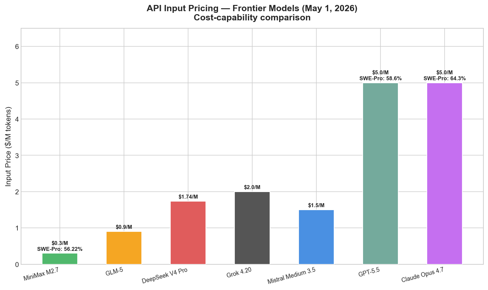
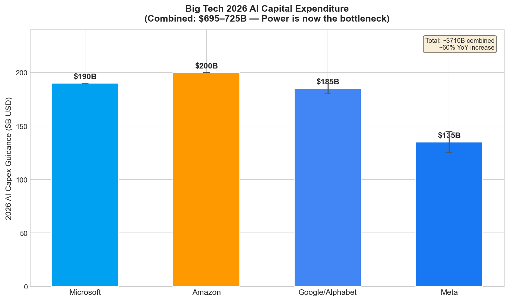

# AI News Daily Digest — 2026-05-01
*Compiled by OMAR for ML Research & Agentic Engineering*

---

## At a Glance (TL;DR)

- **Claude Opus 4.7 tops coding benchmarks** — 87.6% SWE-bench Verified (+6.8pp), 64.3% SWE-bench Pro (+10.9pp), unchanged pricing at $5/$25 per M tokens; also leads AstaBench scientific agents at 58%.
- **ARC-AGI-3 resets the goalposts** — interactive turn-based environments expose a 225× gap between best AI (0.37%, Gemini 3.1 Pro) and humans (100%); pattern recognition is solved, open-ended exploration is not.
- **Alibaba goes closed-weights** — Qwen3.6-Max-Preview (1T MoE) claims 6 benchmark #1s including SWE-bench Pro; open-source pivot now limited to 27–128B efficient models.
- **Anthropic launches Claude Security** (April 30, public beta) — multi-agent codebase vulnerability scanning using Opus 4.7; scan-to-patch in a single session for Enterprise customers.
- **OpenAI lands on AWS Bedrock** — GPT-5.5, Codex, and Managed Agents now available on non-Azure cloud for the first time; Azure exclusivity era is officially over.
- **Big Tech 2026 AI capex: $695–725B combined** — power and cooling (>60% of spend), not chips, are now the primary bottleneck; Google Cloud hit $20B Q1 (+63% YoY) but remains compute-constrained.
- **Anthropic ARR surged $9B → $30B in 4 months**, driven by Claude Code ($2.5B ARR as of Feb); 8 of Fortune 10 are customers; IPO possible October 2026 at $380B valuation.
- **ICLR 2026 Outstanding Paper proves** transformers are exponentially more succinct than RNNs/automata — and that verifying them is EXPSPACE-complete, formalizing the difficulty of transformer interpretability.
- **Agent identity is now infrastructure** — DigiCert AI Trust, Keeper Agent Kit, Okta for AI Agents (GA), Microsoft Entra Agent ID, and A2A v1 all shipped within a ~3-week window; 97% of enterprises run agents in production but only 12% have centralized control.
- **Salesforce Agentforce Operations launched** — back-office automation (finance, supply chain, compliance) with 30+ blueprints; 50–70% cycle time reductions in pilots; $800M ARR (+169% YoY).
- **Meta HyperAgents prove ROI at hyperscale** — hundreds of megawatts recovered, 10-hour performance investigations automated to 30 minutes, ready-to-merge PRs generated automatically.
- **NVIDIA Nemotron 3 Nano Omni released** (April 28) — 30B/3B active Mamba2-MoE omnimodal model unifying vision/audio/text in one open checkpoint with 9× throughput gains.
- **ScaleRL establishes first predictive RL scaling laws** — 400K GPU-hours of experiments reveal sigmoidal compute-performance curves, enabling extrapolation before committing full training budget.
- **MiniMax M2.7 at $0.30/M input** — 56.22% SWE-bench Pro at 1/17th the cost of frontier models, lowest hallucination rate recorded; forces cost-capability rethink for production deployments.

---

## What This Means For Your Work

### For ML Research

- **Revisit your RL training infrastructure.** ScaleRL's sigmoidal scaling laws mean you can now run small-scale RL experiments and extrapolate to full-scale compute requirements with reasonable confidence. Before committing to a large RL run, fit the curve at 1–5% compute to predict final performance. LlamaRL's 10.7× speedup and sub-2-second 405B weight sync via NVLINK are now the benchmark for distributed RL frameworks — if your infrastructure doesn't support asynchronous policy/trainer separation, you're leaving significant efficiency on the table.

- **Embrace progressive model scaling with Nexusformer's approach.** The 41.5% compute reduction from nonlinear projections + zero-init expansion is actionable today: instead of retraining from scratch when you want a larger model, expand an existing checkpoint. The key insight is that zero-initialized new blocks preserve pretrained representations exactly, giving you a stable convergence trajectory from day one.

- **Rethink your fine-tuning data strategy using the token-efficiency scaling law.** Total token count is insufficient as a data variable — you need to track `V = N × L` (dataset volume as example count × average length). Two datasets with identical token counts can yield drastically different performance. Additionally, FinePhrase shows that structured synthetic formats (tables, FAQs, math problems) beat raw web text, and generator model quality plateaus at ~1B parameters, meaning you don't need frontier models for synthetic data generation.

- **Track AstaBench as your scientific agent benchmark.** The Ai2 AstaBench update shows that despite reaching 58% overall (Claude Opus 4.7), end-to-end perfect task completion remains at ~3%. If you're building scientific reasoning agents, this benchmark covers literature understanding, code execution, and data analysis across 2,400+ problems — it's the most rigorous evaluation of long-horizon scientific capability currently available.

- **ICLR 2026's "Transformers are Inherently Succinct" has implications for interpretability work.** The EXPSPACE-completeness of transformer verification isn't just a theoretical curiosity — it formalizes why mechanistic interpretability is fundamentally hard. Plan your interpretability roadmap around empirical analysis rather than formal verification; the complexity barrier is real and not a tooling gap.

### For Agentic Engineering

- **Implement agent identity before your next deployment.** The Okta data is alarming: 97% production deployment but only 12% centralized control, 88% reporting security incidents. The tooling is now available — A2A v1 Signed Agent Cards, DigiCert AI Agent Trust, Okta for AI Agents (GA), and Microsoft Entra Agent ID all shipped this month. Prioritize discovery → identity assignment → behavioral baseline → runtime policy enforcement, in that sequence. Don't skip steps.

- **Use Keeper Agent Kit to fix the credentials-in-chat problem today.** If your agents are interacting with production systems, there's a significant risk that API keys and credentials are appearing in chat history and logs. Keeper's open-source Agent Kit (Apache 2.0) integrates with Claude Code, Cursor, Codex, and GitHub Copilot, resolving secrets at runtime without exposing raw credentials to the agent session. The MCP server integration works with Docker and Node.js orchestration environments.

- **Adopt A2A v1 as your inter-agent communication standard.** With 150+ organizations including all major cloud providers, 5-language SDKs, and integration into Azure AI Foundry, Amazon Bedrock, and Google Vertex AI, the protocol war is over. A2A v1's signed Agent Cards give you cryptographic agent identity at the protocol level, backward-compatible with v0.3 agents. Design new multi-agent systems against v1 from day one.

- **Evaluate MiniMax M2.7 for high-volume agentic tasks.** At $0.30/M input tokens and 56.22% SWE-bench Pro, it's 1/17th the cost of GPT-5.5 (58.6%) for comparable coding performance. For production pipelines making millions of LLM calls, the cost differential compounds dramatically. The lowest recorded hallucination rate (34%) is an additional production reliability signal worth evaluating empirically for your use case.

- **Study Meta's HyperAgents architecture pattern for infrastructure automation.** The Planner-Executor pattern (planning agent decomposes to DAG → executors handle steps → verification agent checks outputs) with shared tools and divergent "defensive" vs. "offensive" skills is the cleanest production example of multi-agent systems delivering measurable ROI. The key design insight: encode senior engineer reasoning patterns as reusable agent skills rather than building separate systems for each workflow type.

---

## Best Models Snapshot

*SWE-bench Verified scores for top 10 models as of May 1, 2026 — Claude Mythos Preview leads at 93.9% (restricted), with Claude Opus 4.7 as the top publicly accessible model at 87.6%.*

### Model Comparison Table

| Model | Org | Input $/M | Output $/M | Context | SWE-Verified | SWE-Pro | Notes |
|-------|-----|-----------|------------|---------|--------------|---------|-------|
| GPT-5.5 | OpenAI | $5.00 | $30.00 | 1050K | 83.2% | 58.6% | — |
| Claude Opus 4.7 | Anthropic | $5.00 | $25.00 | 1000K | 87.6% | 64.3% | Top public model |
| Gemini 3.1 Pro | Google | — | — | — | 68.5% | 54.2% | Pricing unconfirmed |
| Grok 4.20 | xAI | $2.00 | $6.00 | 2000K | — | — | — |
| DeepSeek V4 Pro | DeepSeek | $1.74 | $3.48 | 1000K | — | — | #1 LiveCodeBench 93.5% |
| Qwen3.6-Max-Preview | Alibaba | — | — | 256K | ~80%* | 57.3% | Closed-weights, 6 #1s |
| Mistral Medium 3.5 | Mistral AI | $1.50 | $7.50 | 256K | 77.6% | — | Modified MIT license |
| MiniMax M2.7 | MiniMax | $0.30 | $1.20 | 200K | 71.0% | 56.22% | Lowest hallucination |
| GLM-5 | Zhipu AI | $0.90 | $3.60 | 200K | 77.8% | — | MIT license |

*\*Qwen3.6-Max-Preview SWE-Verified score inferred from benchmark claims; official figure not published.*

---

## Benchmark Highlights

### Coding Agents — SWE-bench Verified & Pro

SWE-bench Verified tests models on real GitHub issues from open-source repositories. With top models now clustered at 77–88% on Verified (showing contamination saturation), SWE-bench Pro — with harder, unseen issues — has become the meaningful differentiator, where scores range 54–78% and the contamination wedge is smaller.

The 35-point gap between SWE-bench Verified and Pro scores (e.g., Claude Opus 4.7: 87.6% vs. 64.3%) is the clearest signal of benchmark contamination. Real-world coding capability improvements show up amplified on Pro relative to saturating Verified scores.

---

### General Agent Autonomy — GAIA Benchmark

GAIA (466 questions, 3 difficulty levels) measures real-world agent capability: multi-step web research, cross-tool reasoning, and long-horizon planning — the skills that determine economic value. The gap to human performance has collapsed from 77 points (2023) to 17 points today.

---

### Scientific Research Agents — AstaBench Spring 2026

AstaBench covers 2,400+ research problems across literature understanding, code execution, data analysis, and end-to-end discovery. The 58% frontier score (Claude Opus 4.7) masks a hard reality: only 3% of end-to-end research tasks are completed perfectly.

---

### Enterprise Agent Governance — The 97/12 Gap

Okta's 2026 enterprise survey reveals the starkest data point in agentic AI: deployment has massively outpaced governance. 97% of enterprises run agents in production; only 12% have centralized control over them.

---

### Cost vs. Capability — API Pricing (May 1, 2026)

The pricing gradient from frontier ($5/M input) to efficient open-weight ($0.30/M) has widened dramatically. For production agentic deployments making millions of LLM calls, this differential is the primary adoption driver.

---

### AI Infrastructure Investment — Big Tech Capex 2026

Combined Big Tech AI capex guidance for 2026 has reached $695–725B — a ~60% YoY increase. Power and cooling infrastructure (>60% of spend), not chip availability, are now the binding constraint.

---

## ML Research Highlights

### "Transformers are Inherently Succinct" — ICLR 2026 Outstanding Paper

The ICLR 2026 Outstanding Paper award went to Bergsträßer, Cotterell, and Lin for a result that reshapes the theoretical foundation of transformer understanding. The paper proposes *succinctness* as a principled measure of expressive power: transformers can encode formal languages and concept classes **exponentially more succinctly** than RNNs, SSMs, and finite automata. This means transformers require exponentially fewer parameters to represent the same functions — a theoretical vindication of why scaling transformers works better than scaling alternatives.

The most consequential corollary: verifying even simple properties of a trained transformer is **EXPSPACE-complete**. This is not a tooling problem — it is a fundamental computational complexity result. Formal safety verification of LLMs is mathematically hard in the same way certain NP-complete problems are hard, and this paper formalizes that barrier. The interpretability community now has a theoretical bound on what can be achieved through formal methods.

The ICLR 2026 Honorable Mention, "The Polar Express," strengthens the Muon optimizer with minimax-optimal polynomial approximations of the polar decomposition, operating purely in matrix-matrix multiplications (GPU-friendly) and achieving consistent validation-loss improvements when training GPT-2 class models. Muon is gaining momentum as an Adam alternative, and this work puts it on rigorous theoretical footing.

### ScaleRL — Predictive Scaling Laws for RL Training of LLMs

In the largest systematic RL scaling study to date (>400,000 GPU-hours), a team established the first predictive scaling laws for reinforcement learning of large language models. The core finding: stable RL training recipes follow **sigmoidal compute-performance curves**, enabling extrapolation from small-scale runs to full-scale predictions before committing GPU budget. This mirrors the role Chinchilla played for pretraining — moving from empirical guesswork to principled design.

The study also found that implementation details (loss aggregation, normalization, curriculum) primarily affect compute *efficiency*, not asymptotic performance. The "what" ceiling is set by the training recipe; the "when" is set by implementation quality. The ScaleRL recipe successfully scaled to 100,000 GPU-hours while maintaining predicted performance, demonstrating gains on AIME24. Complementary work from Meta (LlamaRL, 10.7× speedup for 405B RL training via async MoE execution) and PrimeIntellect (INTELLECT-2, first globally decentralized 32B RL training) signals that RL infrastructure has become a first-class research area.

---

## Agentic AI Highlights

### The Agent Identity Crisis — 97% Deploy, 12% Govern

The defining story of agentic AI in May 2026 is not a new model or benchmark — it's the governance gap made visible. Okta's enterprise whitepaper documents that 97% of enterprises are running agents in production, 88% have experienced confirmed or suspected security incidents, yet only 12% have centralized agent control and only 22% have identities tied to their agents.

The market response has been immediate: DigiCert launched AI Trust architecture (PKI-backed identities for agents, models, and content), Keeper Security released Agent Kit (open-source secrets management for coding agents), Okta's AI Agents platform reached GA, Microsoft formalized Entra Agent ID, and A2A v1 introduced Signed Agent Cards at the protocol level — all within a ~3-week window. This convergence is not coincidence. The vendors who solved PKI, PAM, and IAM for human identities recognize that the AI agent stack needs the same infrastructure, and they are racing to extend it before the next major incident.

The governance sequencing emerging from industry practice: Discovery → Identity Assignment → Behavioral Baseline → Runtime Policy Enforcement → Audit & Compliance. Only 30% of organizations have reached maturity level 3. The tools now exist to accelerate — but deployment velocity continues to outrun governance velocity.

### Salesforce Agentforce Operations — Back-Office Automation at Scale

Salesforce's expansion of Agentforce from CRM into back-office operations (finance, supply chain, compliance, procurement) represents the largest product pivot in the platform's agentic strategy. The platform's 30+ pre-built blueprints cover invoice auditing, vendor onboarding, purchase order rescheduling, compliance verification, and approval routing — delivered as no-code configuration for business users, not engineering projects.

Pilot results are significant: 50–70% cycle time reductions for auditing and onboarding workflows, 80% reduction in manual data entry. With $800M ARR (+169% YoY) and 2.4 billion agentic work units processed, Agentforce is transitioning from a CRM feature to a general-purpose enterprise process automation layer competing with ServiceNow, SAP Business AI, and Microsoft Power Automate. The back-office automation TAM is potentially larger than the CRM TAM Salesforce built its business on — which is why this launch matters beyond the product announcement.

---

## Industry & Business Highlights

### The Cloud Exclusivity Era Ends — OpenAI on AWS

The April 28 OpenAI-AWS partnership formally closes the era of exclusive cloud-model relationships. GPT-5.5 and OpenAI's full model suite are now accessible on Amazon Bedrock alongside Codex CLI and Bedrock Managed Agents — each with their own identity, action logging, and customer-environment isolation. The deal counts toward existing AWS committed spend, making it immediately practical for enterprises with AWS contracts.

This is strategically significant for two reasons. First, enterprise buyers no longer need to commit to a single hyperscaler to access frontier AI capabilities. Second, it creates direct competitive pressure on Azure, which built substantial go-to-market advantage from OpenAI exclusivity since 2023. Microsoft's response will likely be deeper Copilot+Azure integration — features that are harder to replicate on competing platforms.

The broader context: Anthropic secured $65B in compute commitments from Amazon and Google in a 17-day window in April 2026, growing its ARR from $9B to $30B in four months driven by Claude Code and enterprise adoption. With 8 of the Fortune 10 as customers and 1,000+ companies spending $1M+/year, Anthropic is on a trajectory toward an October 2026 IPO at the $380B valuation established in February's Series G round. The competitive landscape has consolidated around four frontier labs, but the infrastructure layer beneath them is rapidly democratizing access.

---

## Full Sections

- [ML Research →](sections/ml-research.md)
- [AI Industry →](sections/ai-industry.md)
- [Agentic AI →](sections/agentic-ai.md)
- [Best Models →](sections/best-models.md)
