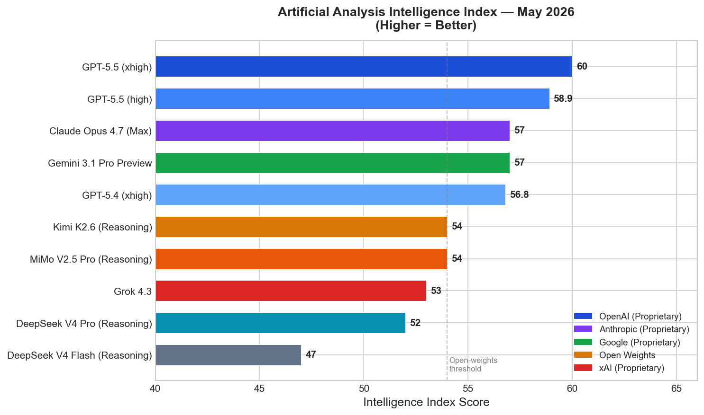
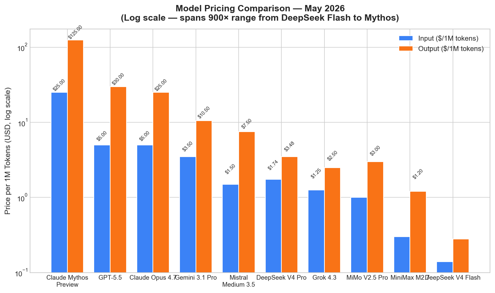
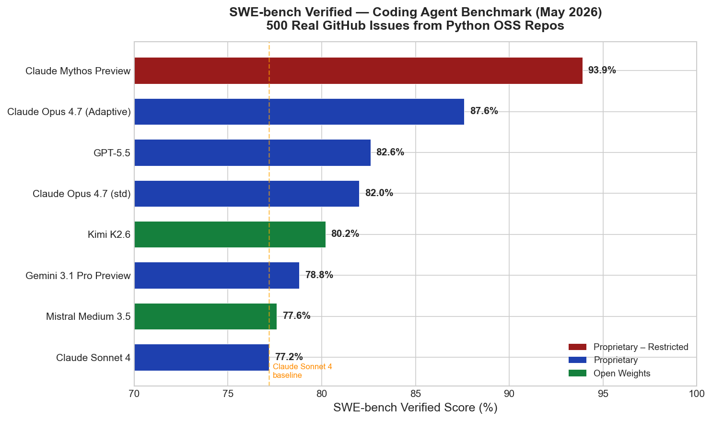
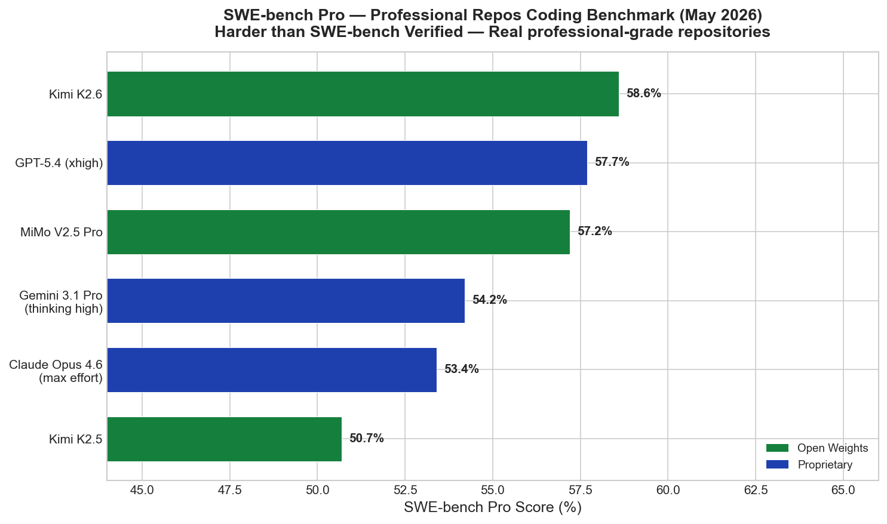
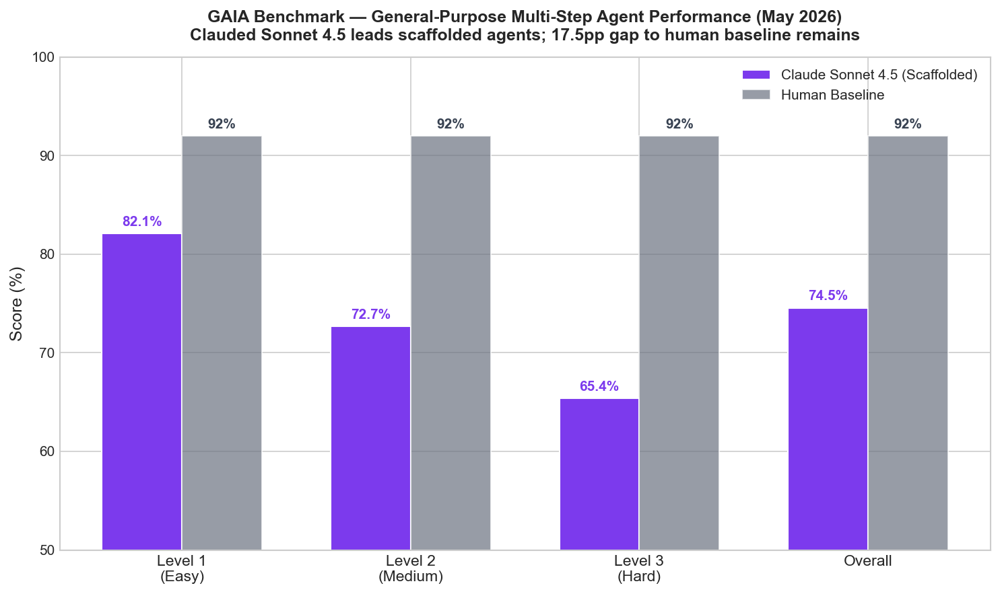
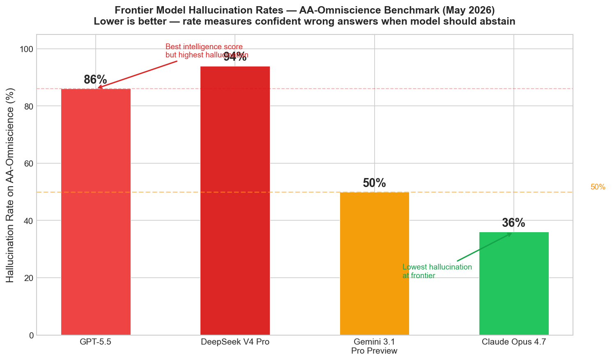
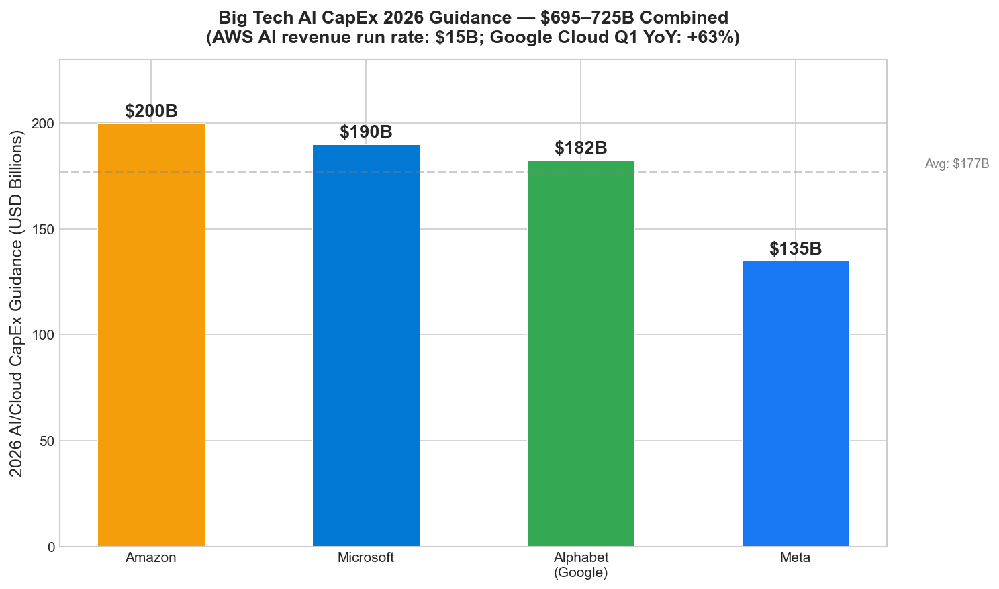
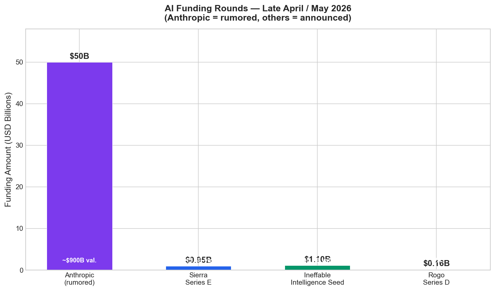

# AI News Daily Digest — 2026-05-04
*Compiled by OMAR for ML Research & Agentic Engineering*

---

## At a Glance (TL;DR)

- **GPT-5.5 tops the Intelligence Index at 60** — 3-point lead over Claude Opus 4.7 and Gemini 3.1 Pro Preview, but carries the highest hallucination rate at the frontier (86%); pricing doubled to $5/$30 per 1M tokens.
- **Open-weights models within 6 points of proprietary leaders** — Kimi K2.6, MiMo V2.5 Pro, and DeepSeek V4 Pro cluster at 52–54 on the Intelligence Index; all trillion-parameter MoE, all permissively licensed.
- **Mistral Medium 3.5 sets open-weights SWE-bench Verified record at 77.6%** — beats Claude Sonnet 4, self-hostable on 4× H100s at $1.50/M input; ships with Vibe async remote coding agents.
- **Sierra raises $950M at $15.8B** (today) — customer-service AI reaches $150M ARR in 8 quarters serving 40%+ of Fortune 50; Bret Taylor predicts industry culling in 2–3 years.
- **Anthropic in talks for $900B round** — would surpass OpenAI's March valuation; $30–40B ARR; round reportedly close; complicated by Pentagon blacklist and blocked Mythos deployment.
- **SAP acquires Prior Labs + Dremio** — €1B+ bet on tabular foundation models (TabPFN, 3M+ downloads) and data lakehouse; full-stack enterprise agentic AI strategy with Yann LeCun on advisory board.
- **ICLR 2026 Outstanding Papers** — "Transformers are Inherently Succinct" proves interpretability is EXPSPACE-complete; multi-turn LLM evaluation gets its first rigorous benchmark revealing marked reliability degradation.
- **OpenAI Symphony open-sourced** — issue-tracker-as-control-plane for Codex agents; 500% PR increase in early internal trials; requires harness engineering prerequisites.
- **IBM Bob GA** — full-SDLC agent with multi-model routing; 80K internal users, 45% average productivity gain; 30-day Java modernization completed in 3 days.
- **MCP context bloat crisis** — 3 servers consume 72% of a 200K-token context before the first query; Perplexity dropped MCP internally; schema compression and lazy-loading now urgent.
- **DeepSeek V4 Pro** — 1.6T MoE, 1M context, Muon optimizer, 10% of prior KV cache cost at 1M context; #1 on LiveCodeBench at 93.5%; MIT license.
- **Enterprise multi-agent adoption at 57%** — up from 12% in 2024; 40% of pilots fail within 6 months; orchestrator single-point-of-failure and context overflow are leading causes.
- **Pentagon signs AI deals with 7 vendors explicitly excluding Anthropic** — Mythos cyber-AI blocked from expanded deployment; Anthropic–DoD lawsuit ongoing.
- **OpenAI–Microsoft AGI clause eliminated** — non-exclusive through 2032; OpenAI now multi-cloud with GPT-5.5/Codex live on AWS Bedrock.

---

## What This Means For Your Work

### For ML Research

- **Re-benchmark your reasoning pipeline with adaptive compute allocation.** Three concurrent papers (arXiv:2604.14853, arXiv:2604.10739, TRACE) show that uniform token budgets hurt: the "overthinking" effect causes models to abandon previously correct answers at extended budgets. Adaptive allocation yielded +12.8% relative accuracy on MATH with no compute increase; TRACE achieves 25–30% token savings at <2% accuracy loss. If you are running any reasoning-heavy eval, switching from uniform to adaptive budgets is a free accuracy and cost win.

- **Adopt Muon if you are training models at >1B parameters.** DeepSeek V4 Pro validated Muon at 1.6T parameters — the largest-scale public confirmation to date — and ICLR 2026 provided formal theoretical backing. Newton-Muon cuts iteration count by 6%, Muon2 cuts Newton-Schulz iterations by 40%. The practical case (~2× compute efficiency at compute-optimal training, better large-batch scaling) combined with two frontier-scale production validations makes this the strongest case yet to replace AdamW in new training runs.

- **Use active parameter count (not total) for MoE efficiency comparisons.** Three new empirical scaling papers (arXiv:2604.09175, arXiv:2604.04230, arXiv:2603.21862) converge on this finding. The three-phase routing analysis (surge → stabilization → relaxation) also explains why late-training load-imbalance corrections hurt final quality — revise your training schedules accordingly. The holistic optimization paper shows hyperparameter sensitivity *decreases* at large scale, reducing search burden.

- **Target MLA + MoE as the architecture baseline for new trillion-parameter designs.** Kimi K2.6, DeepSeek V4 Pro, and Ant Ling-2.6 all converge on Multi-head Latent Attention + Mixture-of-Experts. MLA's KV cache compression and MoE's sparse activation make this the dominant design for memory-efficient long-context inference. OOMB's 4M-token single-H200 training result confirms the architectural problems are largely solved — the remaining challenge is economic.

- **Factor in multi-turn degradation when evaluating production LLMs.** The ICLR 2026 Outstanding Paper on multi-turn evaluation reveals marked reliability degradation when instructions are distributed across turns — a setting that describes almost every real deployment. Until a standardized multi-turn benchmark is adopted, your internal evals should include multi-turn underspecified-instruction scenarios, especially for agent workflows.

### For Agentic Engineering

- **Use the Symphony pattern before building custom orchestration.** OpenAI's open-sourced Symphony (Elixir daemon, available on GitHub) gives you issue-tracker-as-control-plane for free — persistent state in your existing project management tool, automatic crash recovery, and human override via issue comments. The 500% PR increase in early internal use is a strong signal. The prerequisite: agent-friendly repo structure and automated test suites. If your codebase lacks these, prioritize harness engineering first.

- **Enforce per-session context budgets at the orchestrator layer.** The MCP context bloat finding (3 servers = 72% context consumed before first query) and the orchestrator single-point-of-failure failure mode (40% of pilots fail within 6 months) both point to the same fix: strict context budget enforcement. Use summarization checkpoints before worker handoffs, give workers only their subtask context, and implement lazy tool schema loading. This is the highest-leverage reliability improvement for teams already in production.

- **Use Salesforce Agent Script's declarative pattern for audit and compliance.** Whether or not you adopt Agent Script itself, the pattern — annotating each decision point as `deterministic` or `llm`, compiling behavior to a diffable text file, enforcing explicit state variables — is immediately adoptable in any agent architecture. It mirrors how safety-critical software has always been built. Version-controlled behavior specs that can be reviewed in PRs dramatically reduce the governance burden.

- **Implement server-side credential injection (the Lens Agents pattern) for any agent touching internal systems.** Agent identity + ACL + sandboxed execution + credential vault is now the production-grade security baseline. Short-lived tokens injected at runtime prevent credential exfiltration even from compromised agents. Lens Agents, Microsoft Agent Framework 1.0, and Google's Agent Identity all ship this pattern — it's converging to a standard.

- **Evaluate Kimi K2.6 (open weights) for long-horizon coding agents before committing to proprietary APIs.** With 58.6% SWE-bench Pro (highest open-weights score), 80.2% SWE-bench Verified, 300-agent swarm support, and 4,000+ coordinated tool calls at 12+ hours of sustained execution, K2.6 covers the capability tier that previously required Claude Opus. It's deployable via vLLM/SGLang under Modified MIT and costs ~$948 to run the full AA benchmark suite versus $4,811 for Claude Opus 4.7 (Max).

---

## Best Models Snapshot

*The Artificial Analysis Intelligence Index for May 2026, showing GPT-5.5 leading at 60 with a 3-point gap over Claude Opus 4.7 and Gemini 3.1 Pro Preview (both 57), while open-weights models Kimi K2.6 and MiMo V2.5 Pro reach 54 — halving the proprietary gap versus one year ago.*

### Model Comparison Table

| Model | Type | Input $/1M | Output $/1M | Context | AA Index |
|---|---|---|---|---|---|
| **Claude Mythos Preview** | Proprietary (restricted) | $25.00 | $125.00 | 200K | — |
| **Claude Opus 4.7** | Proprietary | $5.00 | $25.00 | 200K | 57 |
| **GPT-5.5** | Proprietary | $5.00 | $30.00 | 128K | 60 |
| **Gemini 3.1 Pro Preview** | Proprietary | ~$3.50 | ~$10.50 | 1M | 57 |
| **Mistral Medium 3.5** | Open weights (API) | $1.50 | $7.50 | 256K | — |
| **DeepSeek V4 Pro** | Open weights | $1.74 | $3.48 | 1M | 52 |
| **Grok 4.3** | Proprietary | $1.25 | $2.50 | 1M | 53 |
| **MiMo V2.5 Pro** | Open weights | $1.00 | $3.00 | 1M | 54 |
| **MiniMax M2.7** | Open weights | $0.30 | ~$1.20 | 1M | — |
| **DeepSeek V4 Flash** | Open weights | $0.14 | $0.28 | 1M | 47 |

*V4 Flash and M2.7 represent extreme value tiers. Cached input pricing is often 10–20% of base input. Claude Mythos Preview restricted to ~52 vetted critical infrastructure organizations.*

*Pricing spans nearly 900× from DeepSeek V4 Flash ($0.14/M input) to Claude Mythos Preview ($25/M input); log scale required to show full range.*

---

## Benchmark Highlights

### Coding Agents — SWE-bench Verified

SWE-bench Verified tests models on 500 human-verified real GitHub issues from Python open-source repositories. It is the industry standard for measuring whether an AI can autonomously resolve real bugs and feature requests — not synthetic problems. A score above 80% puts a model firmly in the "production agentic coding" tier.

*Claude Mythos Preview leads at 93.9% (restricted access only), with Claude Opus 4.7 (Adaptive) at 87.6% as the best generally-available model. Kimi K2.6 (80.2%) and Mistral Medium 3.5 (77.6%) represent the new open-weights frontier — the latter beats Claude Sonnet 4 at a fraction of the cost.*

---

### Professional Coding — SWE-bench Pro

SWE-bench Pro uses harder, professional-grade repositories, making it a better proxy for enterprise software work. The benchmark was introduced because SWE-bench Verified was approaching saturation at the top. Notably, open-weights models dominate the leaderboard here — Kimi K2.6 takes #1.

*Kimi K2.6 leads at 58.6%, edging out GPT-5.4 (xhigh) at 57.7% and MiMo V2.5 Pro at 57.2% — open-weights models hold 3 of the top 6 spots on the hardest coding benchmark available.*

---

### General-Purpose Agents — GAIA Benchmark

GAIA (General AI Agent benchmark) measures multi-step reasoning across web browsing, tool use, code execution, and multimodal tasks — the most comprehensive test of general agent capability. The 17.5-percentage-point gap to human performance (92%) shows how far frontier agents remain from human-level general intelligence.

*Claude Sonnet 4.5 leads scaffolded agents at 74.55% overall; Level 3 (hardest) tasks remain the primary challenge at 65.4%. HAL leaderboard paused for reliability audit due to possible public validation set contamination.*

---

### Hallucination Risk at the Frontier

The AA-Omniscience benchmark measures confident wrong answers — hallucination rate. This matters independently of intelligence scores: a model that answers confidently when it doesn't know is a liability in RAG pipelines, legal, medical, and financial applications. The frontier divergence is striking.

*DeepSeek V4 Pro (94%) and GPT-5.5 (86%) carry the highest hallucination rates at the frontier — despite both scoring well on intelligence benchmarks. Claude Opus 4.7 (36%) and Gemini 3.1 Pro (50%) show substantially more calibrated abstention behavior.*

---

## ML Research Highlights

### ICLR 2026: Transformers Are Provably Hard to Interpret

ICLR 2026 — 19,525 submissions, 27.4% acceptance rate — named two Outstanding Papers that together redraw the frontier of what we formally know about transformers.

The first Outstanding Paper, *"Transformers are Inherently Succinct"* (Bergsträßer, Cotterell, Lin), reframes transformer expressiveness through succinctness theory rather than language recognition. The core result: transformers can represent formal languages **exponentially more succinctly** than RNNs, finite automata, or Linear Temporal Logic formulas, and as a direct consequence, verifying even simple transformer properties is provably **EXPSPACE-complete**. This isn't merely an empirical observation — it is a complexity-theoretic lower bound on interpretability. Any mechanistic interpretability approach must contend with a hardness ceiling that is not an engineering problem but a mathematical one. The committee noted this formalizes the "why are transformers so powerful" question and provides the interpretability community a precise theoretical target.

The second Outstanding Paper (title undisclosed) addresses the multi-turn evaluation gap: LLMs are trained primarily on single-turn completions but deployed in multi-turn interactive sessions with underspecified, distributed instructions. The paper introduces the first scalable evaluation methodology for this setting and demonstrates **marked degradation in LLM aptitude and reliability** when instructions span turns. This is the first rigorous diagnostic framework for a failure mode that every production agent deployment encounters daily.

ICLR 2026 also recognized the **Muon optimizer** with an Honorable Mention for "The Polar Express" — optimal polynomial approximations for polar decomposition optimized for GPU and low-precision arithmetic. This theoretical work provides the principled foundation for what has become a production training optimizer: DeepSeek V4 Pro (1.6T parameters) and Moonlight both shipped Muon in April 2026, and two follow-on variants (Newton-Muon: 6% fewer iterations; Muon2: 40% fewer Newton-Schulz iterations) have already improved on the original. The Test of Time awards went to DCGAN and DDPG from ICLR 2016 — both now credited as foundational to image generation and continuous-action RL respectively.

**For practitioners:** NeurIPS 2026 abstract deadline is today (May 4 AOE), with full papers due May 6. If you have results on MoE scaling, adaptive compute, or multi-turn evaluation, this is the submission window.

---

### Trillion-Parameter Open Weights: The April 2026 Wave

Three labs simultaneously released trillion-parameter open-weight models in the final week of April 2026, marking a structural shift in the accessibility of frontier-class AI.

**Kimi K2.6** (Moonshot AI, April 20) is a 1T / 32B-active MoE with 384 experts, MLA attention, 256K context, and a 400M-parameter MoonViT encoder. Its 58.6% SWE-bench Pro score is the highest open-weights result on that benchmark, and it sustains 12+ hour, 4,000+ tool-call agentic sessions with up to 300 sub-agents via the Claw Groups swarm architecture. The Modified MIT license and vLLM/SGLang compatibility make it immediately deployable.

**DeepSeek V4 Pro** (April 24) is the most architecturally ambitious: 1.6T total / 49B active parameters, genuine 1M-token context (not marketing), Hybrid CSA + HCA attention that achieves 10% of V3.2's KV cache memory at 1M context, Manifold-Constrained Hyper-Connections replacing standard residual connections, and Muon optimizer replacing AdamW. It scores #1 on LiveCodeBench at 93.5% and 80.6% on SWE-bench under MIT license. Its 94% hallucination rate is a deployment risk for knowledge-intensive applications.

**Ant Group Ling-2.6** brings a distinctive MLA + Linear Attention hybrid enabling "fast thinking" — quadratic attention cost avoided for long contexts. The 1T variant achieves ~1/4 the token consumption of comparable models; the 104B flash variant hits 340 tokens/second on H20 GPU at ~1/10 the token cost. FP8 end-to-end mixed-precision training at 1T scale (30–40% throughput improvement over BF16) is the infrastructure highlight.

---

## Agentic AI Highlights

### OpenAI Symphony: Making Your Issue Tracker the Agent Control Plane

OpenAI's open-sourced Symphony (April 28) is the clearest crystallization of a pattern emerging independently across engineering teams: instead of building bespoke orchestration infrastructure, treat your existing issue tracker as the durable state store and control plane for autonomous agent work.

Symphony is an Elixir daemon that continuously polls a project management tool (Linear in the reference implementation, but any issue tracker works). For each open issue, it creates an isolated per-issue workspace, spawns a Codex agent session, and monitors for completion or stall. Crashed or stuck agents are automatically restarted. The human interface is entirely familiar: commenting on an issue, changing its status, or closing it as "won't fix" are all valid overrides. Workflow policy lives in a `WORKFLOW.md` file version-controlled alongside the codebase.

The 500% increase in merged PRs reported by early OpenAI internal teams is the headline metric, but the underlying insight is arguably more important: the bottleneck was not agent capability but context-switching overhead. Engineers managing 3–5 concurrent agent sessions hit a coordination ceiling; Symphony removes that ceiling by making agent management a background process rather than an active cognitive load.

The prerequisite is significant: Symphony requires agent-friendly repository structure, automated test suites, and execution guardrails. Teams without these should treat harness engineering as the blocker. The spec (`SPEC.md`) and reference implementation are MIT-licensed on GitHub.

**The broader platform landscape is converging on the same governance gap.** Google's Gemini Enterprise Agent Platform (cryptographic agent identity, Agent Registry, Memory Bank for persistent cross-session context, Agent Runtime for days-long stateful execution) and Microsoft Agent Framework 1.0 (Semantic Kernel + AutoGen unified, stable APIs, A2A + MCP native, DevUI debugger) both GA'd this week targeting the same enterprise void: agents deployed without centralized governance, identity, or cost control. IBM Bob (80K internal users, 45% average productivity gain, full-SDLC from planning through deployment) and Lens Agents (runtime-agnostic governance, server-side credential injection, SOC 2 / ISO 27001) complete the picture of a market now competing on governance infrastructure rather than raw capability.

---

## Industry & Business Highlights

### Sierra, Anthropic, and the Valuation Spiral

Two funding events today define the state of AI capital markets. Sierra — the customer-service AI agent startup co-founded by OpenAI chairman Bret Taylor and former Google exec Clay Bavor — closed a $950M Series E led by Tiger Global and Google Ventures at a $15.8B post-money valuation, a 58% jump from its $10B valuation just seven months ago. The company serves 40%+ of Fortune 50, has reached $150M ARR in 8 quarters (unprecedented velocity for enterprise software), and addresses a market Bret Taylor estimates at $400B annually in customer service spend.

Simultaneously, Anthropic is reportedly in advanced talks — potentially days from closing — on a round of approximately $50 billion at a $900 billion valuation. That would surpass OpenAI's $852B March 2026 round and make Anthropic the most valuable private company in history. The company's $30–40B ARR run rate and $65B in committed cloud compute from Amazon and Google underpin the figure, but the round carries a novel risk profile: a DoD blacklist, a blocked Mythos deployment, and an active lawsuit against the Trump administration create government headwinds at a scale private AI companies have not previously faced.

SAP's double acquisition on May 4 — Prior Labs (€1B+ over four years, tabular foundation models, Yann LeCun advisory board) plus Dremio (Apache Iceberg data lakehouse) — is the strategically underrated move of the week. While hyperscaler model races dominate headlines, the real enterprise AI battleground in 2026 is data readiness and domain-specific models for structured business data. TabPFN's 3M+ downloads confirm market pull; SAP's integration path through AI Core, Business Data Cloud, and the Joule agentic layer gives it a full stack that pure-LLM vendors cannot replicate. This is SAP's largest AI push since its $8B Qualtrics acquisition.

The backdrop is a $695–725B combined 2026 capex commitment from Amazon, Microsoft, Alphabet, and Meta. AWS AI revenue is on a $15B run rate; Google Cloud grew 63% year-over-year in Q1 2026 and is still compute-constrained. The OpenAI–Microsoft restructuring — AGI clause eliminated, non-exclusive through 2032, OpenAI now live on AWS Bedrock — marks the end of the Azure-exclusivity era and formally decouples AI capability milestones from commercial obligations, a necessary step before any IPO.

*Combined 2026 AI/cloud capex guidance from the four major US hyperscalers: $695–725B total, with Amazon at $200B and Meta the smallest at $135B.*

---

## AI Funding Context

*Major AI funding rounds in late April / early May 2026: Anthropic's rumored $50B dominates, but Sierra's $950M at $15.8B valuation and Ineffable Intelligence's $1.1B seed (David Silver, ex-DeepMind) indicate a broad market still raising aggressively.*

---

## Full Sections

- [ML Research →](sections/ml-research.md)
- [AI Industry →](sections/ai-industry.md)
- [Agentic AI →](sections/agentic-ai.md)
- [Best Models →](sections/best-models.md)
