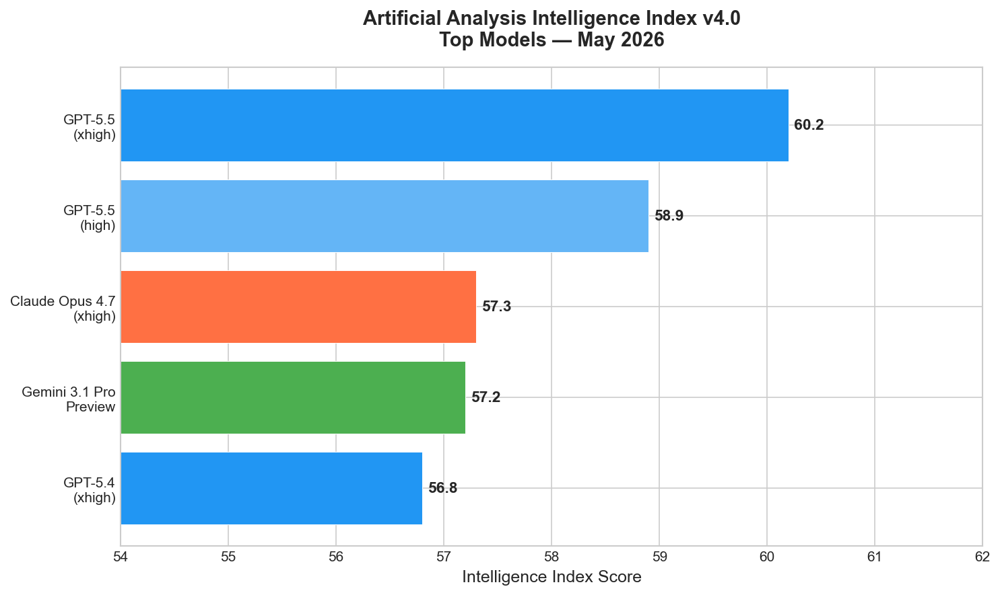
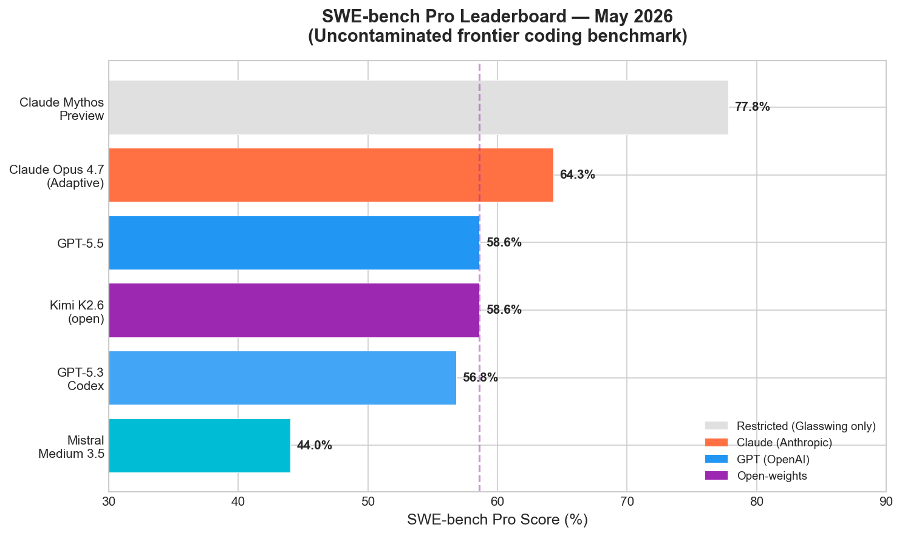
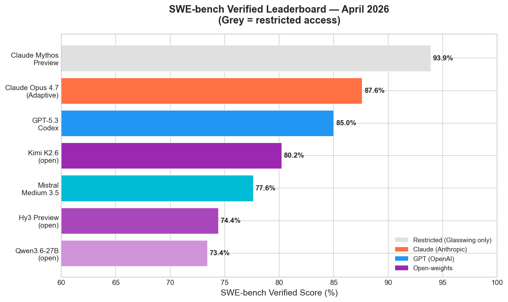
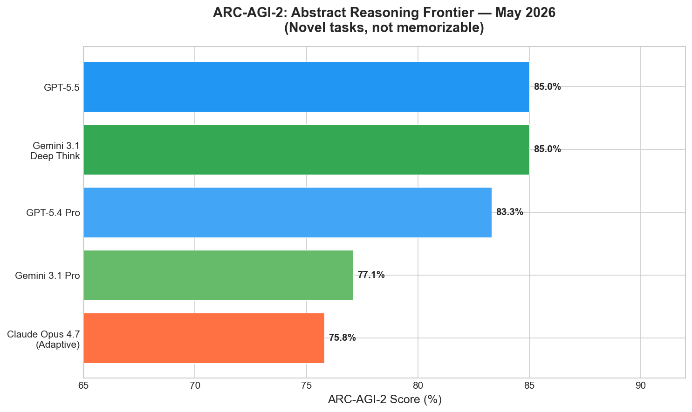
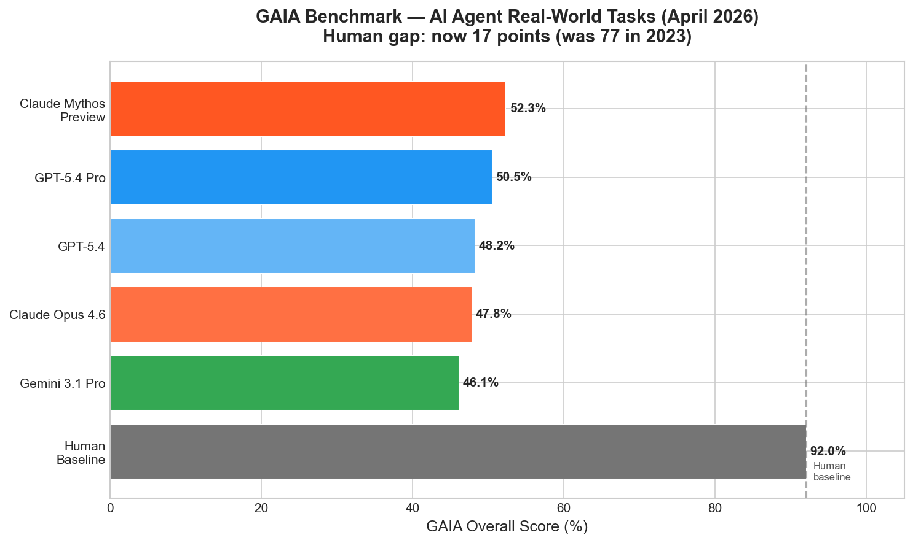
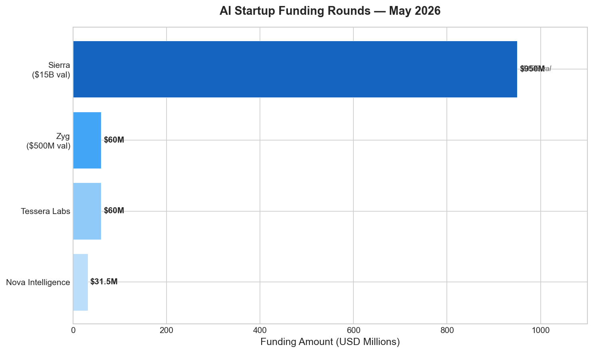
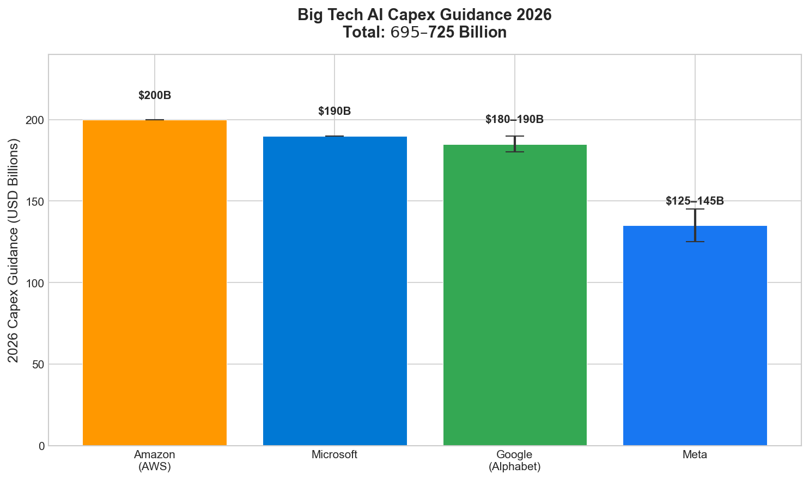

# AI News Daily Digest — 2026-05-06
*Compiled by OMAR for ML Research & Agentic Engineering*

---

## At a Glance (TL;DR)

- **Kimi K2.6 (open-weight MoE, 32B active)** hits 58.6% SWE-bench Pro — the first open-source model to edge past a closed frontier model (GPT-5.4 at 57.7%) on the hardest uncontaminated coding benchmark.
- **Claude Mythos Preview** (restricted, Glasswing only) is the world's best coding model at 93.9% SWE-bench Verified / 77.8% Pro, but withheld from general release due to autonomous zero-day discovery capability.
- **GPT-5.5** (April 23) leads agentic/computer-use benchmarks: Terminal-Bench 82.7%, OSWorld 78.7%, ARC-AGI-2 85% — at $5/$30/M tokens, 2× the price of GPT-5.4.
- **Claude Opus 4.7** is the best publicly available coding model (SWE-bench Pro 64.3%, Verified 87.6%) at the same price as Opus 4.6 — a free upgrade for API users with new self-verification and xhigh reasoning.
- **Sierra AI raises $950M at $15B** — $150M ARR in 8 quarters, serving 40%+ of Fortune 50 — the clearest proof that enterprise AI agent revenue is real and compounding.
- **Microsoft Agent 365 + M365 E7** (GA May 1) create a premium governance tier at $15–$99/seat, positioning Microsoft as the enterprise control plane for the multi-agent era.
- **Anthropic ships Dreaming + Outcomes + Multiagent Orchestration** — Harvey reports 6× completion rate improvement using Dreaming for cross-session legal drafting; Netflix, Spiral, Wisedocs also in production.
- **A2A Protocol v1.0** is now the de facto inter-agent communication standard; Microsoft, Google, Salesforce, IBM all shipping support.
- **Big Tech 2026 AI capex: $695–$725B** (Amazon $200B, Microsoft $190B, Google $180–190B, Meta $125–145B) — GPU scarcity, not demand, is now the binding constraint.
- **Condensate Theorem** (arXiv:2602.06317) claims O(n) transformer attention with bit-exact equivalence at 159× speedup — extraordinary claim requiring community verification before adoption.
- **DeepSeek V4 Pro** (MIT, $0.87/M output, 1M context) + Huawei Ascend training signals China assembling a vertically integrated, Nvidia-independent AI stack.
- **MCP ecosystem audit**: 177,000 tools, 35× growth in 16 months — but 65% are action-type (file writes, payments, email) and auth coverage is near zero; payment servers grew 33× with no auth.
- **GAIA human gap is now 17 points** (down from 77 in 2023); Google I/O May 19–20 expected to bring Remy personal agent and Gemini 3.2 previews.
- **ScaleRL** (400K GPU-hours, ICLR 2026 Oral) proves RL training follows predictable sigmoid curves per recipe — asymptotic ceilings are recipe-determined, enabling reliable small-run extrapolation.

---

## What This Means For Your Work

### For ML Research

- **Benchmark your RL recipe early.** ScaleRL's finding that sigmoid scaling curves are reproducible within a recipe means you can run 500 GPU-hours, fit the curve, and predict your 50K-hour ceiling before committing budget. The caveat: recipe selection still requires empirical judgment — different recipes have different asymptotes that small runs cannot distinguish.

- **Horizon scheduling is now a principled practice, not a hack.** Kim et al. (ICML 2026, arXiv:2605.02572) give a formal account of why long-horizon RL training fails: exponential error compounding + state-action explosion + credit assignment ambiguity. Training at reduced horizons and evaluating at longer ones (horizon generalization) is now the recommended practice for coding and agentic model RL runs.

- **InfoLaw replaces Chinchilla for quality-weighted data recipes.** If you are upsampling high-quality sources, standard Chinchilla scaling laws break down. InfoLaw (arXiv:2605.02364, 0.15% MAE) gives you a way to predict loss from {tokens, model size, mixture weights, repetition} without running full-scale ablations. Validated to 7B/425B tokens; worth integrating into your data recipe pipeline.

- **Machine unlearning is not a deletion mechanism.** The ICML 2026 paper "Unlearning Isn't Deletion" shows all six standard unlearning methods are reversible via minimal fine-tuning. If you are using unlearning as a safety or compliance mechanism, you need representational analysis (not just accuracy/perplexity metrics) to verify effectiveness — and should treat current unlearning techniques as surface erasure, not guaranteed deletion.

- **GKA provides a new efficiency–accuracy Pareto point.** Gaussian Kernel Attention (arXiv:2605.02144) eliminates Q/K/V projections with a single bandwidth parameter per head, achieving 0.42× parameters at only slightly higher bits-per-byte. Useful for efficiency-constrained settings where the locality inductive bias is a feature, not a limitation.

### For Agentic Engineering

- **Adopt A2A v1.0 now for multi-vendor agent orchestration.** With Google, Microsoft, Salesforce, and IBM all shipping A2A v1.0 support, it is safe to build cross-vendor agent delegation on this protocol. The Signed Agent Cards + multi-binding support (HTTP/gRPC/JSON-RPC) + MCP composability gives you a complete interop story. Delay on proprietary agent communication interfaces will create migration debt.

- **Treat the MCP authentication gap as a supply-chain security risk today.** The AISI study documents 177,000 tools with near-zero auth coverage — and 33× growth in payment MCP servers. Until APS (IETF draft) and AgentROA are widely deployed, audit every MCP server your agents call: prefer servers with explicit auth, limit scope via capability tokens, and log all external actions. Assume unauthenticated servers can be compromised or injected.

- **Implement tiered memory architecture for any agent operating >10 sessions.** MemTier research (+33pp on long-horizon benchmarks) and Anthropic's Dreaming (Harvey: 6× completion rate) both confirm that memory architecture — not model capability — is the primary performance bottleneck for persistent agents. Implement episodic/semantic/procedural memory separation, or use Anthropic Managed Agents with Dreaming enabled, before scaling agent fleets.

- **Add deterministic rails to probabilistic agent decision nodes.** Salesforce's Agent Script and Anthropic's Outcomes grader embody the same pattern: identify the highest-variance decision nodes in your agent workflow, then replace model inference at those nodes with rule-based code or a separate grader pass. Anthropic's +8.4%/+10.1% gains on docx/pptx generation demonstrate this pattern's value even on mature model outputs.

- **Be cautious about team size scaling without memory investment.** LLMA-Mem's finding of non-monotonic scaling — larger agent teams can underperform smaller ones over long horizons without adequate memory — means raw parallelism is not a safe default for fleet expansion. Validate that your memory architecture supports experience reuse before adding agents. MonoScale's familiarization task approach provides a tested recipe for monotonically safe fleet expansion.

---

## Best Models Snapshot

*Artificial Analysis Intelligence Index v4.0 — GPT-5.5 leads at 60.2 overall, followed closely by Claude Opus 4.7 (57.3) and Gemini 3.1 Pro Preview (57.2). No single model dominates all use cases.*

### Model Comparison Table

| Model | SWE-bench Pro | SWE-bench Verified | ARC-AGI-2 | Input $/M | Output $/M | Context | License |
|-------|--------------|-------------------|-----------|-----------|------------|---------|---------|
| Claude Mythos Preview | **77.8%** | **93.9%** | — | $25 | $125 | 200K | Glasswing only |
| Claude Opus 4.7 | **64.3%** | **87.6%** | 75.8% | $5 | $25 | 200K | Proprietary |
| GPT-5.5 | 58.6% | — | **85%** | $5 | $30 | 1,050K | Proprietary |
| GPT-5.3 Codex | 56.8% | 85.0% | — | — | — | 400K | Proprietary |
| Gemini 3.1 Pro | — | 80.6% | 77.1% | — | — | 1,000K | Proprietary |
| Kimi K2.6 | 58.6% | 80.2% | — | $0.95 | $0.95 | 256K | Modified MIT |
| Mistral Medium 3.5 | — | 77.6% | — | $1.50 | $7.50 | 256K | Modified MIT |
| DeepSeek V4 Pro | — | — | — | $0.435 | **$0.87** | 1,000K | **MIT** |
| Qwen3.6-35B-A3B | — | 73.4% | — | $0.325 | $1.95 | 1,010K | Apache 2.0 |
| MiniMax M2.7 | — | 80.2% | — | $0.30 | **$0.30** | 200K | Open |

---

## Benchmark Highlights

### SWE-bench Pro (Coding Agents — Uncontaminated)

SWE-bench Pro is the credible frontier coding benchmark as of 2026 — SWE-bench Verified is now widely considered saturated and contamination-affected. The ~35-point score drop between Verified and Pro scores reveals how much contamination inflates Verified numbers.

*Claude Mythos Preview leads at 77.8% (restricted), followed by Claude Opus 4.7 at 64.3%. Kimi K2.6 and GPT-5.5 tie for open/proprietary frontier at 58.6% — a historic milestone for open-weights.*

### SWE-bench Verified (Coding Agents — Full Leaderboard)

*On the broader SWE-bench Verified leaderboard, scores are significantly higher but less reliable as a frontier indicator. Claude Mythos leads at 93.9%; Qwen3.6 achieves 73.4% on a single consumer GPU (22GB VRAM).*

### Abstract Reasoning: ARC-AGI-2

ARC-AGI-2 tests novel fluid reasoning tasks that are deliberately designed to resist memorization. GPT-5.5 and Gemini 3.1 Deep Think co-lead at 85%, while Claude Opus 4.7 lags slightly at 75.8%.

*ARC-AGI-2 is the strongest currently-unsaturated general capability signal. The 85% ceiling for both GPT-5.5 and Gemini 3.1 Deep Think suggests convergence at the frontier.*

### GAIA: Real-World Agent Tasks

The GAIA benchmark gap to human performance has closed from 77 points in 2023 to just 17 points today, with top scaffolded systems reaching 92%+ on test sets.

*Claude Mythos Preview leads at 52.3% overall, but the human baseline of ~92% remains the reference target for production-grade general agents.*

---

## ML Research Highlights

### Kimi K2.6: Open-Weights Catches Closed Frontier on Coding

Moonshot AI's Kimi K2.6 (released April 20, 2026) is the most significant open-weight model release since DeepSeek-R1. At 1T total parameters with 32B active (MoE, 384 experts, top-8 routing), it achieves 58.6% on SWE-bench Pro — narrowly edging GPT-5.4's 57.7% on the same benchmark. This is the first time an open-weight model has led a closed frontier model on the hardest uncontaminated public coding benchmark.

The architectural innovations that explain its performance go beyond raw scale. K2.6 builds automatic context compression (summarizing long histories to prevent truncation-induced drift), native agent swarm orchestration (up to 300 sub-agents across 4,000 coordinated steps baked into training objectives), and proactive autonomy (fine-tuned to recognize when stuck and replan) directly into the base model. These are not scaffold-layer additions — they are training-time capabilities.

At $0.95/M input and $4.00/M output tokens under a modified MIT license, K2.6 is now the strongest price-performance option for agentic coding workloads where you want near-frontier coding performance without paying proprietary model premiums. Its 262K context window is the only significant limitation versus DeepSeek V4 Pro's 1M context.

### ScaleRL: RL Training Is Now Predictable Engineering

The ICLR 2026 Oral paper "The Art of Scaling Reinforcement Learning Compute for LLMs" (400,000+ GPU-hours) fundamentally changes how teams should approach RL training for LLMs. The core finding: each RL recipe follows a sigmoid-shaped compute-performance curve that is reproducible and extrapolatable from early-stage runs. Recipe selection sets the asymptotic ceiling; implementation details (normalization, curriculum) modulate efficiency without shifting ceilings.

This is practically transformative. Teams can now run small-scale pilot RL experiments (~hundreds of GPU-hours), fit the sigmoid, and reliably predict whether a recipe will reach production targets before committing to full compute budgets. The ScaleRL recipe itself outperforms DeepSeek-GRPO, Qwen2.5-DAPO, Magistral, and MiniMax-M1 at scale. The caveat: different recipes truly have different ceilings, and the sigmoid shape only becomes visible after the initial improvement phase — very early runs (pre-inflection) are insufficient for extrapolation.

### Condensate Theorem: O(n) Attention Needs Verification

arXiv:2602.06317 by Jorge L. Ruiz Williams claims to prove that transformer attention is fundamentally O(n), not O(n²) — with the quadratic cost being an implementation artifact rather than an inherent property. The paper identifies a "Condensate Manifold" where attention mass concentrates, comprising an anchor position, a local window, and dynamic top-k elements. Projection onto this manifold supposedly achieves bit-exact output equivalence at 159× measured speedup for 131K-token sequences.

The claim is extraordinary and deserves cautious engagement. Bit-exact equivalence (not approximation) would mean today's long-context inference costs are fundamentally unnecessary — a trillion-dollar implication. The paper is a single-author work without peer review, validated across a limited set of model families. The community should pressure-test the bit-exactness claim on diverse architectures and tasks before treating it as settled. Independent replication of the 159× speedup on FlashAttention-2 baselines is the immediate need.

---

## Agentic AI Highlights

### Anthropic's Three-Pillar Managed Agent Update: Dreaming, Outcomes, Multiagent

Today's Anthropic Managed Agents launch is arguably the most complete capability bundle since the platform launched. **Dreaming** introduces scheduled background consolidation of cross-session memories across entire agent fleets — not just within a single agent. Harvey (legal AI) reports 6× completion rate improvement in production; Netflix uses it to surface cross-build patterns from hundreds of log analysis sessions. Critically, Dreaming operates as an offline population-level learning mechanism: the managed-cloud equivalent of LoRA fine-tuning, with structured text memories in place of gradient updates.

**Outcomes** adds a separate grader pass: developers write a plain-language rubric, and a grader evaluates output against it in an isolated context window. Failed outputs get targeted feedback and trigger re-runs. The +8.4% and +10.1% gains on docx and pptx generation — with the largest gains on the hardest problems — suggest the pattern is most valuable precisely where model uncertainty is highest. This is architecturally similar to process reward models but specified in prose, making it accessible without reward model training.

**Multiagent Orchestration** enables a lead agent to break tasks into pieces and delegate each to specialist subagents with independent model, system prompt, and tool configurations. Specialists work in parallel on a shared filesystem with an asynchronous event log for the lead to check progress without blocking. Combined with webhooks for async session completion notifications, this gives developers a production-ready multi-agent runtime without building orchestration infrastructure from scratch.

### The Agent Identity Stack Crystallizes

Three layers of agent identity are converging into a coherent stack in 2026. A2A v1.0's Signed Agent Cards handle discovery and verification. The Agent Identity Protocol (AIP, arXiv:2603.24775) introduces Invocation-Bound Capability Tokens (IBCTs) — short-lived, per-invocation tokens carrying delegation chain, capability scope, and time bounds — that bridge A2A and MCP boundaries at 0.22ms overhead. AgentROA (IETF draft, April 2026) provides per-hop cryptographic attestation at MCP tool boundaries with monotonic scope narrowing.

The end state this stack enables: every action taken by an agent fleet is cryptographically traceable to a delegating human credential, with each intermediate hop's capability scope preserved in a tamper-evident audit trail. For enterprises facing EU AI Act GPAI enforcement (August 2026, proceeding regardless of high-risk deadline delays), this audit trail may be the minimum viable compliance infrastructure.

---

## Industry & Business Highlights

### Sierra's $950M Round: Enterprise Agent Revenue Is Real

Sierra AI's $950M Series E at $15B valuation — $150M ARR in 8 quarters, 40%+ Fortune 50 penetration — is the definitive proof that enterprise AI agent revenue is compounding rather than converging. At a 100× ARR multiple, the market is pricing in winner-take-most dynamics in the customer experience AI layer. The participation of Google Ventures (alongside Tiger Global, Benchmark, and Sequoia) signals Google views Sierra as critical infrastructure rather than a competitive threat. Sierra's Ghostwriter "agent-as-a-service" tool (natural language → specialized agent, launched April 2026) is the product innovation worth watching: it takes the deployment complexity out of enterprise agent adoption and addresses the $400B/year customer service market directly.

*May 2026 AI funding: Sierra's $950M round dwarfs other deals, but Zyg ($60M at $500M valuation) and Tessera Labs ($60M, a16z) signal continued activity across the stack.*

### Big Tech AI Capex Keeps Climbing

*Total 2026 Big Tech AI capex guidance: $695–$725B. Google Cloud's $460B backlog and 63% YoY growth provide the strongest demand signal. GPU scarcity — not demand — is now the binding constraint on cloud AI revenue growth.*

The Microsoft Agent 365 + M365 E7 launch (GA May 1) deserves attention as a business model signal: Microsoft is successfully creating a premium governance tier above base enterprise, pricing AI governance at $15/seat standalone and bundling it at $99/seat. With $37B annualized AI revenue, Microsoft has established AI as a sustainably monetizable enterprise layer, not just a cloud cost center.

---

## Full Sections
- [ML Research →](sections/ml-research.md)
- [AI Industry →](sections/ai-industry.md)
- [Agentic AI →](sections/agentic-ai.md)
- [Best Models →](sections/best-models.md)
