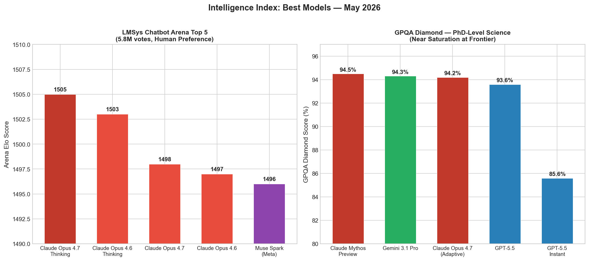
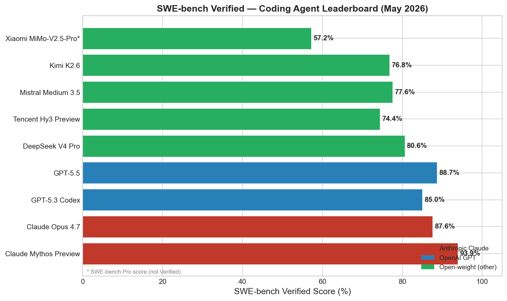
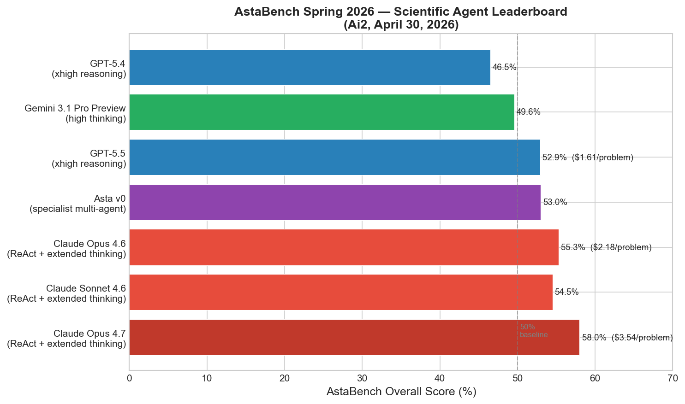
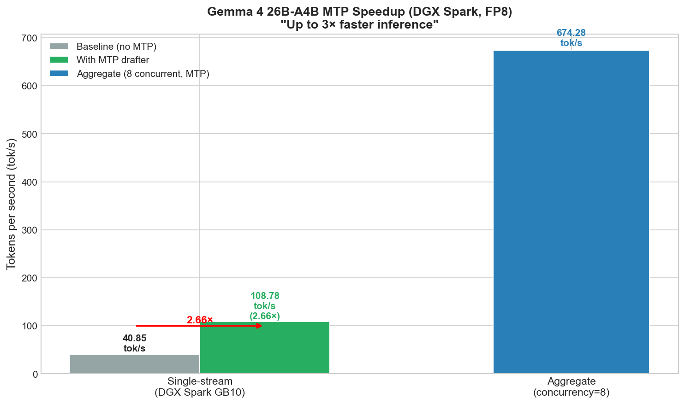
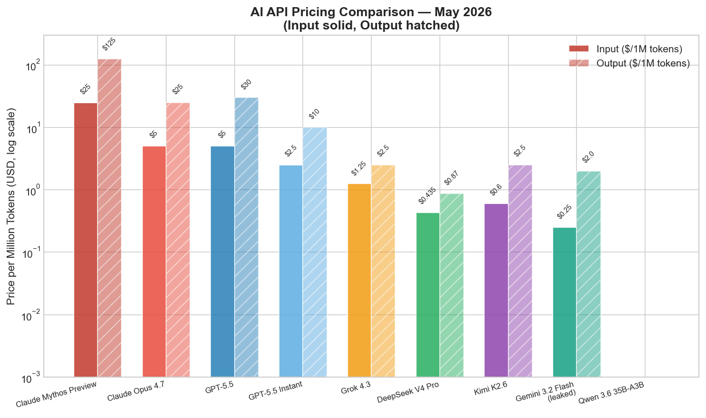
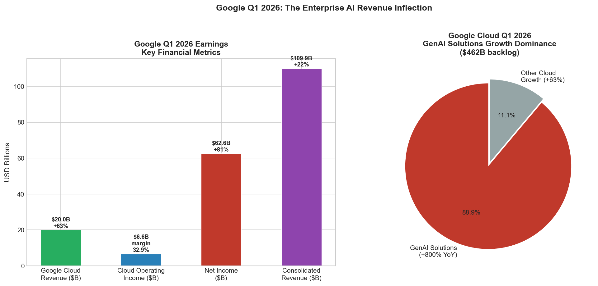

# AI News Daily Digest — 2026-05-07
*Compiled by OMAR for ML Research & Agentic Engineering*

---

## At a Glance (TL;DR)

- **Anthropic × SpaceX: 300 MW, 220K GPUs** — Claude Code rate limits doubled immediately; Anthropic exploring orbital compute, targeting $850–900B valuation on $30B+ ARR
- **GPT-5.5 Instant is ChatGPT's new default** — 52.5% fewer hallucinations on high-stakes prompts, +15.8pp AIME vs. GPT-5.3 Instant; memory sources give users visible personalization control
- **GPT-Realtime-2 launched today** — first voice model with GPT-5-class reasoning, 128K context, +15pp Big Bench Audio; Zillow reports 26-point call success lift in production
- **Kimi K2.6 beats GPT-5.5 and Claude Opus 4.7** in a live coding tournament at 1/25th the cost of Opus 4.7 ($0.60/$2.50 per M tokens) — open-weight frontier closes on closed models
- **ICLR 2026 outstanding papers** — Transformers provably the most succinct formal-language encoders (verifying them is EXPSPACE-complete); LLMs drop 39% in multi-turn conversations due to early-commitment errors
- **Gemma 4 MTP drafters (May 5)** — 2.66–3× inference speedup at zero quality loss, paired with `-it` fine-tuned targets; MTP-as-speculative-decoding is now production standard
- **xAI Grok 4.3 cuts prices 37–58%** — $1.25/$2.50 per M tokens, 1M context, always-on reasoning; adds voice cloning and external connectors
- **SAP pays €1B+ for Prior Labs** — Europe's only frontier AI lab; Tabular Foundation Models (TabPFN) bring AutoML-speed structured-data intelligence into enterprise ERP/CRM
- **Google Q1: $20B Cloud revenue (+63%), 800% GenAI solutions growth, $462B backlog** — enterprise AI is producing real margin-positive revenue (Cloud operating margin 17.8% → 32.9%)
- **MLPerf Training v6.0 adds DeepSeek-V3 MoE benchmark** — first sparse-compute training standard; hardware competition now rewards all-to-all networking, not just GEMM throughput
- **AstaBench Spring 2026**: Claude Opus 4.7 leads at 58%; only ~3% of hard end-to-end scientific tasks complete perfectly — workflow coherence is the next agent frontier
- **Muon optimizer ecosystem matures** — Newton-Muon + Polar Express + FlashOptim + DeMo collectively production-ready; 85× inter-node comms reduction (DeMo), 50%+ memory savings (FlashOptim)
- **GPQA Diamond near saturation** (<1pp separates top 4 frontier models); MultiHaystack reveals ~30pp cliff when models must retrieve from large corpora vs. having evidence handed to them
- **57% of enterprises now run multi-agent systems in production** (up from 12% in 2024); CodeAct via Hyperlight micro-VMs delivers ~50% latency / ~60% token reduction in tool-heavy agents

---

## What This Means For Your Work

### For ML Research

- **Revisit your multi-turn evaluation setup.** The ICLR 2026 finding that LLMs drop 39% on multi-turn benchmarks due to early-commitment errors affects any pipeline with iterative refinement. Test your models specifically under multi-turn conditions — single-turn evals are systematically optimistic for agentic workloads. Measure unreliability, not just average accuracy.

- **GPQA is no longer a useful procurement signal.** All top-4 frontier models cluster within 1pp on GPQA Diamond. Shift evaluations to SWE-bench Pro (still below 80% for all models), AstaBench End-to-End Discovery (~3% perfect completion), MultiHaystack, and Terminal-Bench. These separate models where GPQA can't.

- **Muon is production-ready — start migration planning.** With Polar Express (optimal orthogonalization), Newton-Muon (theoretical grounding), FlashOptim (7 bytes/param vs 16 for AdamW), and DeMo (85× comms reduction), the remaining barriers are framework support and hyperparameter defaults. DeepSeek already used Muon for V4 Pro. Evaluate on your next pretraining run.

- **Curriculum scheduling of horizon length matters for RL training.** The ICML 2026 paper on long-horizon tasks shows that starting with short horizons and extending them during training — not just adjusting task difficulty — is necessary for stable optimization. This applies to any RLHF or self-play training setup, including SPIRAL-style self-play curricula.

- **Encoder-free multimodal architectures are validated at scale.** SenseNova U1's NEO-Unify removes both the visual encoder and VAE, achieving open-source SOTA on both understanding and generation with 8B parameters. Expect encoder-free designs to dominate multimodal research at ICML/NeurIPS 2026.

### For Agentic Engineering

- **Treat multi-turn degradation as a first-class bug in your agent design.** The 39% average drop documented at ICLR is not a benchmark artifact — it's a mechanism: early partial solutions anchor model reasoning in subsequent turns. Design agents to externalize and re-evaluate intermediate state, not just continue from prior output. This is especially critical for coding and analysis agents that operate across many turns.

- **The agent trust stack is converging — adopt it now.** Google's Agent Identity (cryptographic IDs + auditable trails), A2A's Signed Agent Cards + governance metadata proposals, and AP2 Mandates for payments form a coherent emerging standard. Build your agents with cryptographic identity and auditable action trails from the start; retrofitting these is expensive and the regulatory pressure will make them mandatory in H2 2026.

- **CodeAct via isolated micro-VMs is the new latency baseline.** Microsoft's Hyperlight CodeAct integration achieves ~50% latency reduction and ~60% token reduction by emitting code blocks instead of N sequential tool calls. If your agent runs N sequential tool invocations per task, you are leaving significant performance on the table. Evaluate CodeAct-style execution for your tool-heavy workflows.

- **Long-context retrieval is still broken — don't trust model-side RAG at scale.** MultiHaystack shows a ~30pp accuracy cliff when retrieving from 46K-item corpora vs. being handed evidence. Production RAG pipelines that rely on the model to do retrieval will fail significantly more often than controlled benchmarks suggest. Use embedding-based retrieval with explicit top-k injection, and measure multi-hop retrieval accuracy, not just single-document recall.

- **Self-hosted agent governance is now a real product requirement.** Coder Agents beta and OpenAI's sandbox/harness separation address the same enterprise need: regulated industries cannot accept SaaS data paths for coding agents. If you're building for healthcare, finance, or government, design your agent architecture with separated harness (governance) and execution (your infrastructure) from day one.

---

## Best Models Snapshot

*LMSys Arena top 5 (5.8M votes) vs. GPQA Diamond scores — Claude dominates human preference; frontier GPQA is saturated at ~94%*

### Model Comparison Table

| Model | Type | SWE-Bench Verified | SWE-Bench Pro | Price (In/Out per 1M) | Context |
|---|---|---|---|---|---|
| Claude Mythos Preview | Closed | 93.9% | 77.8% | $25/$125 | — (restricted) |
| Claude Opus 4.7 | Closed | 87.6% | 64.3% | $5/$25 | 1M |
| GPT-5.5 | Closed | 88.7% | 56.8% | $5/$30 | 400K |
| GPT-5.3 Codex | Open-weight | 85.0% | 77.3% | — | — |
| DeepSeek V4 Pro | Open-weight | 80.6% | 55.4% | $0.44/$0.87 | 1M |
| Mistral Medium 3.5 | Open-weight | 77.6% | — | $1.50/$7.50 | 256K |
| Kimi K2.6 | Open-weight | 76.8% | 58.6% | $0.60/$2.50 | 256K |
| Tencent Hy3 Preview | Open-weight | 74.4% | — | ¥1.2/M input | 256K |
| Grok 4.3 | Closed | — | — | $1.25/$2.50 | 1M |
| Gemini 3.2 Flash (leaked) | Closed | — | — | $0.25/$2.00 | — |
| GPT-5.5 Instant | Closed | — | — | $2.50/$10 | — |

---

## Benchmark Highlights

### Coding Agents: SWE-bench Verified (May 2026)

The coding benchmark landscape is reshaping fast — Claude Mythos Preview leads at 93.9% but remains restricted (Glasswing-only). Among publicly accessible models, GPT-5.5 (88.7%) and Claude Opus 4.7 (87.6%) lead closed-weight; DeepSeek V4 Pro (80.6%), Mistral Medium 3.5 (77.6%), and Kimi K2.6 (76.8%) form a tight open-weight pack. Critically, Kimi K2.6 achieves this at $0.60/$2.50 — roughly 1/25th the cost of Opus 4.7.

### Scientific Agent Performance: AstaBench Spring 2026

AstaBench (Ai2, April 30) is the most demanding real-world agent benchmark — 2,400+ problems across Literature Search, Code & Execution, Data Analysis, and End-to-End Discovery. The hard ceiling: even the best agent (Claude Opus 4.7 ReAct + extended thinking at 58%) achieves only ~3% perfect completion on End-to-End Discovery. Models routinely complete 60–70% of individual steps but fail to synthesize a complete workflow. Workflow coherence, not individual capability, is the next architecture frontier.

### Gemma 4 MTP Inference Speedup

Google's Multi-Token Prediction drafters (released May 5) deliver 2.66× single-stream speedup and aggregate 674 tok/s at concurrency=8 — zero quality regression. The pattern: MTP heads trained during pretraining become speculative decoding drafters at inference, eliminating the cost of training a separate draft model. One deployment constraint: drafters must pair with `-it` (instruction-tuned) targets; base-model pairing collapses acceptance rates.

### API Pricing: The Commoditization Front

Grok 4.3 at $1.25/$2.50 with 1M context and always-on reasoning signals the frontier pricing floor is dropping fast. DeepSeek V4 Pro at $0.44/$0.87, Kimi K2.6 at $0.60/$2.50, and the leaked Gemini 3.2 Flash at $0.25/$2.00 collectively compress the mid-tier pricing band. The practical implication: cost-sensitive coding and agentic workloads can now run on frontier-class open-weight models at near-order-of-magnitude cost reduction vs. closed flagship models.

---

## ML Research Highlights

### ICLR 2026: The "Powerful But Brittle" Paradox

ICLR 2026 (Singapore, April 22–26) awarded two Outstanding Papers that simultaneously validate and challenge LLM confidence. **"Transformers are Inherently Succinct"** provides the first formal proof that transformers encode formal languages substantially more succinctly than RNNs, finite automata, or LTL formulas — establishing transformers as efficient *representers* as a theoretical result, not just empirical observation. The corollary is sobering: verifying transformer properties is provably EXPSPACE-complete, meaning model verification is intractable even in principle.

The counterpoint is immediate: **"LLMs Get Lost in Multi-Turn Conversation"** analyzed 200,000+ simulated conversations and documented a 39% average performance drop across six generation tasks vs. single-turn baselines. The mechanism is not random — LLMs make early assumptions, generate premature partial solutions, then fail to recover when given corrective follow-up. This anchoring failure accounts for ~31% of enterprise AI agent pilot failures. Both results are true simultaneously: transformers are theoretically powerful, and they catastrophically fail in the most common real-world usage pattern.

The ICLR Honorable Mention **"The Polar Express"** provides the theoretical capstone to the Muon optimizer ecosystem: the matrix sign function computation inside Muon's orthogonalization step is now provably optimal via minimax polynomial approximation. Prior implementations used heuristic Newton-Schulz iterations; Polar Express solves the minimax problem exactly at each step, achieving better convergence at identical compute cost and running stably in bfloat16.

### The Muon Optimizer Ecosystem: From Research to Production-Ready

The Muon optimizer (orthogonalized gradient updates) is rapidly accumulating the production engineering infrastructure needed to displace AdamW for LLM pretraining. **Newton-Muon** re-derives Muon as a Newton-type method, providing theoretical grounding and 6% fewer iterations / 4% wall-clock reduction. **FlashOptim** cuts per-parameter memory from 16 bytes (AdamW) to 7 bytes via improved master weight splitting and 8-bit state quantization — validated on Llama-3.1-8B fine-tuning. **DeMo** reduces inter-node communication by 85× vs. AdamW-DDP via top-k sparsification — the most significant distributed training communication reduction in years. **ARO** (gradient rotation) independently outperforms AdamW by 1.30–1.35× across pretraining runs through 8B parameters.

DeepSeek already used Muon for V4 Pro training. With framework support growing and hyperparameter defaults stabilizing, the prediction is that AdamW will be minority usage for new LLM pretraining runs by Q4 2026.

---

## Agentic AI Highlights

### The Agent Infrastructure Platform Wars

Three major platform launches in the past two weeks reflect an industry consolidating around production agentic infrastructure. **Google's Gemini Enterprise Agent Platform** (April 22) is the most complete end-to-end offering: Build (ADK + Agent Studio), Scale (sub-second cold starts, Memory Bank with Memory Profiles, days-long state persistence), Govern (cryptographic Agent Identity, Agent Registry, Agent Gateway with Model Armor anti-injection, anomaly detection), and Optimize (Agent Simulation, Evaluation, Optimizer). PayPal, Comcast, L'Oréal, and Color Health are already in production.

**AWS Agent Toolkit for AWS** (May 6) takes a different approach: 40+ validated, step-by-step procedure Skills for common AWS patterns (CloudFormation, S3, serverless, containers) delivered through a managed MCP server with IAM guardrails and CloudWatch observability. Instead of agents improvising from stale knowledge, Skills enforce best practices. The pattern is significant: MCP server as *validated procedure executor*, not just API call proxy.

**Twilio's SIGNAL 2026 platform** positions as the neutral communications I/O layer: Conversation Memory, Conversation Orchestrator (multi-channel agent routing with human↔AI handoffs), Conversation Intelligence (real-time sentiment/escalation detection), and Agent Connect SDK (open-source, self-hosted, model-agnostic bridge to production voice/messaging channels). For regulated industries (PCI, HIPAA), Twilio's approach — bring your own model, Twilio owns the real-time I/O — removes the data-path blocker that prevents SaaS AI adoption.

### AstaBench: The 3% Problem

The most important agentic AI data point this week comes from Ai2's AstaBench Spring 2026 update: Claude Opus 4.7 (ReAct + extended thinking) leads at 58.0% overall, but achieves only ~3% perfect completion on hard End-to-End Discovery tasks. Models consistently complete 60–70% of individual steps but fail to synthesize them into a coherent workflow. This is a qualitatively different failure from capability gaps — it's an integration failure. The agents can do the parts; they can't reliably compose the whole.

This result directly informs agent architecture decisions: step-level capability improvements are not translating linearly to workflow-level task completion. The next breakthrough will require explicit workflow coherence mechanisms — checkpointing, self-consistency verification, or multi-agent review — not just better individual reasoning.

---

## Industry & Business Highlights

### Anthropic's Revenue Trajectory Rewrites SaaS Comparisons

Anthropic grew from $9B to $30B+ ARR in four months (January–April 2026), now counting 1,000+ enterprise customers paying >$1M/year (up from ~500 in February). The SpaceX Colossus deal (300 MW, 220,000+ GPUs) is a direct infrastructure response to that demand pressure — Claude Code rate limits were doubled immediately upon announcement. The mention of potential gigawatt-scale orbital compute capacity signals multi-year planning horizons that extend beyond what land-based infrastructure can promise.

A reported $40–50B fundraise at $850–900B valuation would surpass OpenAI's March 2026 valuation of $852B. The drivers are clear: Claude Code, Claude Cowork, and the agentic workflow platform — not chat or generic API calls — are the actual revenue engine. For developers, the doubled rate limits are the immediate practical impact; for investors, the trajectory makes Anthropic the most dramatic enterprise SaaS growth story in history.

### Google Q1 2026: Enterprise AI Revenue at Scale

Google Cloud's Q1 2026 results ($20B revenue, +63% YoY; 800% GenAI solutions growth; $462B backlog; operating margin 17.8% → 32.9%) resolve the "is enterprise AI producing real revenue?" question affirmatively. The margin expansion — nearly doubling in one year while adding capacity aggressively — dismisses the hypothesis that AI is expensive to serve at scale. Google Cloud is supply-constrained on capacity, not demand.

The $180–190B FY2026 capex guidance (raised from $175–185B) and the $462B backlog suggest the revenue inflection will continue through 2026. Enterprise AI is no longer a growth initiative at Google — it's the primary growth driver.

---

## Full Sections

- [ML Research →](sections/ml-research.md)
- [AI Industry →](sections/ai-industry.md)
- [Agentic AI →](sections/agentic-ai.md)
- [Best Models →](sections/best-models.md)

---

## Visuals Index

| Chart | File |
|---|---|
| Intelligence Index (Arena ELO + GPQA) | [visuals/intelligence-index.png](visuals/intelligence-index.png) |
| SWE-bench Verified Leaderboard | [visuals/swe-bench-verified.png](visuals/swe-bench-verified.png) |
| AstaBench Scientific Agent Leaderboard | [visuals/astabench-scientific-agents.png](visuals/astabench-scientific-agents.png) |
| Gemma 4 MTP Inference Speedup | [visuals/gemma4-mtp-speedup.png](visuals/gemma4-mtp-speedup.png) |
| API Pricing Comparison | [visuals/api-pricing-comparison.png](visuals/api-pricing-comparison.png) |
| Muon Optimizer Ecosystem Gains | [visuals/muon-optimizer-gains.png](visuals/muon-optimizer-gains.png) |
| Google Q1 2026 Earnings | [visuals/google-q1-2026-earnings.png](visuals/google-q1-2026-earnings.png) |
| AI Infrastructure Investment Scale | [visuals/infrastructure-investment.png](visuals/infrastructure-investment.png) |

---
*Generated by OMAR compiler agent · 2026-05-07*
