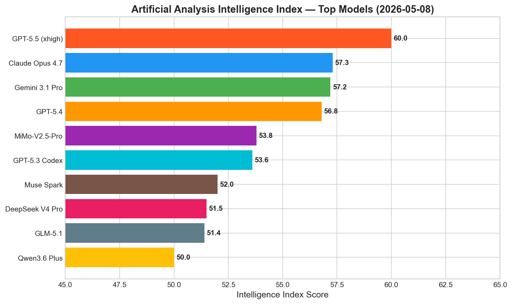
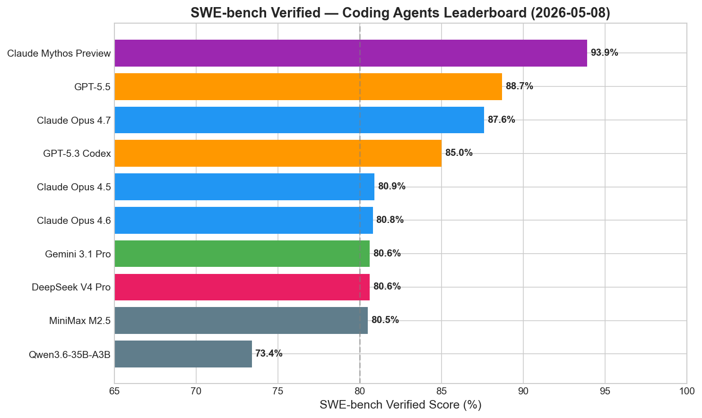
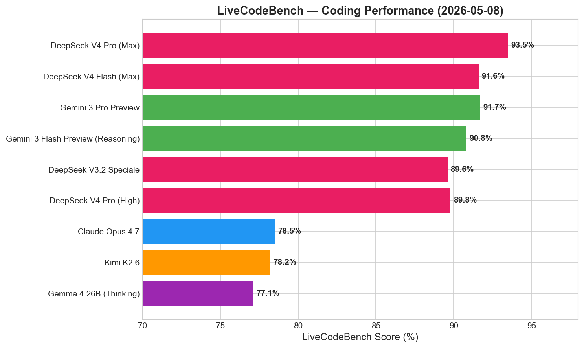
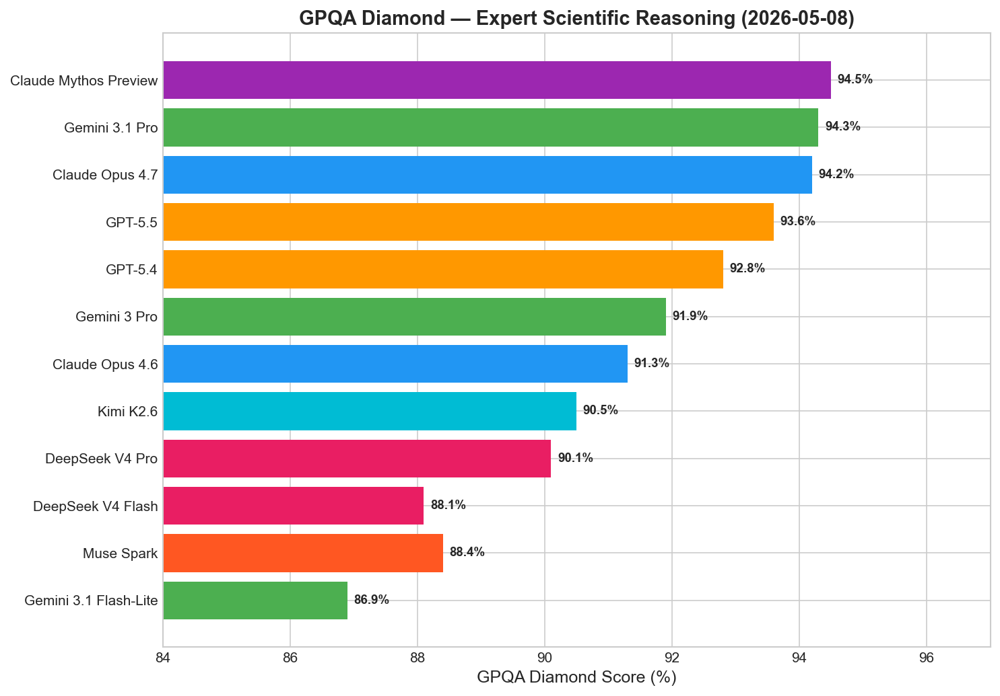
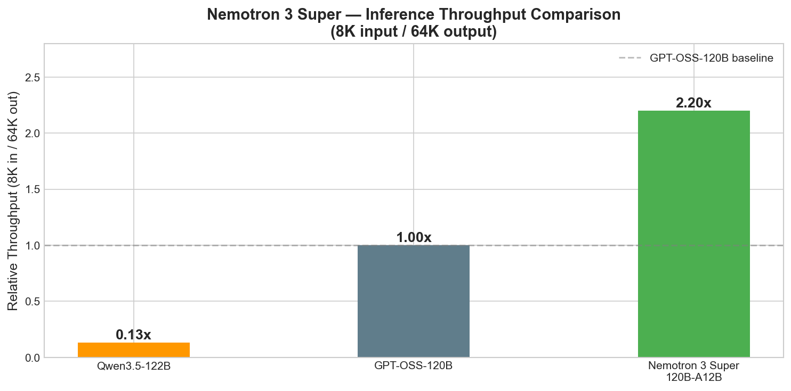
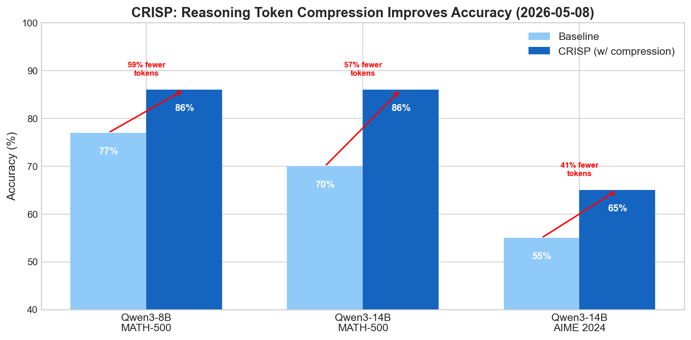
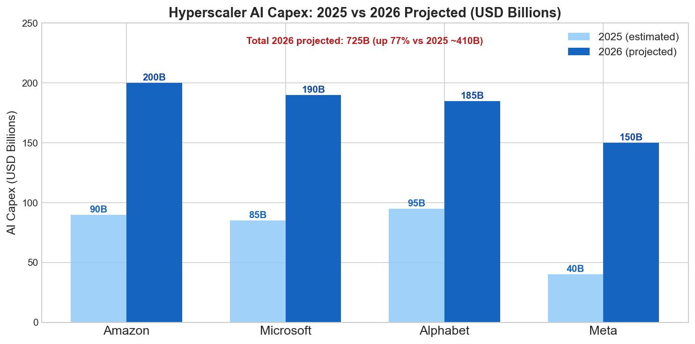

# AI News Daily Digest — 2026-05-08
*Compiled by OMAR for ML Research & Agentic Engineering*

---

## At a Glance (TL;DR)

- **DeepSeek V4-Pro leads LiveCodeBench at 93.5% (MIT license)** — matches Gemini 3.1 Pro on SWE-bench Verified at ~7× lower cost than Claude Opus 4.7, shattering the closed-model pricing moat
- **Claude Mythos Preview scores 93.9% SWE-bench Verified** — Anthropic's most capable model withheld from release after demonstrating autonomous zero-day exploit development; safety evaluation now gates deployment, not compute
- **OpenAI launched GPT-5.5-Cyber via Trusted Access for Cyber (TAC)** — first production identity-gated AI capability tier; Bank of America, JPMorgan, CrowdStrike, NVIDIA already enrolled; advanced MFA required from June 1
- **Sierra raised $950M at $15B+ valuation** with $150M ARR and 40%+ of Fortune 50 as customers, proving enterprise agent platforms capture more value than model providers
- **Anthropic shipped Dreaming + Outcomes + Multiagent Orchestration for Claude Managed Agents** — Netflix already in production; rubric-based graders show +8–10pp task success improvement
- **NVIDIA Nemotron 3 Super (120B/12B active) delivers 7.5× inference throughput over Qwen3.5-122B** — fully open-source Mamba-Transformer MoE, 1M-token context, top math competition scores
- **Meta/UW Compute Optimal Tokenization rewrites Chinchilla** — correct scaling unit is ~60 bytes/parameter (not ~20 tokens/param); current BPE tokenizers slightly over-compressed at frontier compute scales
- **CRISP/OPSDC compresses reasoning tokens 57–59% while improving accuracy +9–16pp** — no external annotations needed, just a "be concise" self-distillation signal; immediate training recipe for any thinking model
- **White House studying mandatory pre-deployment AI security EO** — major regulatory reversal catalyzed by Claude Mythos disclosures; CAISI has signed eval agreements with all five major labs
- **Gemini 3.1 Flash-Lite GA at $0.25/1M input tokens with 86.9% GPQA Diamond** — new price-performance benchmark for high-volume production inference, 2.5× faster than Gemini 2.5 Flash
- **Gartner projects 150,000+ agents per Fortune 500 by 2028** — only 13% of organizations have adequate governance today; 65% have already experienced agent security incidents
- **Google Cloud Agent Identity (SPIFFE/DPoP) is now GA** — first cryptographically-enforced, purpose-built identity primitive for AI agents, setting the security architecture standard
- **Big Tech 2026 AI capex projected at $725B combined** — up 77% from 2025's ~$410B; Amazon faces potential negative free cash flow
- **ICML 2026 accepted 44 of 247 workshop proposals** — most competitive workshop selection in conference history, running Seoul, July 7–11

---

## What This Means For Your Work

### For ML Research

- **Rethink your tokenizer selection using bytes, not tokens.** The Meta/UW Compute Optimal Tokenization paper (arXiv:2605.01188) shows the scaling law unit should be ~60 bytes/parameter. If you're planning a large training run, convert your token budget to bytes and verify you're not over-compressed. Standard BPE at ~4.57 bytes/token is slightly suboptimal at frontier compute scales (>10^21 FLOPs); aim for T≈3.3–3.7 bytes/token for largest runs. Read the paper and retool your scaling law calculations before committing GPU-months.

- **Apply CRISP to your thinking models today.** The CRISP/OPSDC method (arXiv:2603.05433) is a Pareto improvement: it simultaneously reduces reasoning token counts 57–59% *and* improves accuracy 9–16pp on MATH-500. The recipe requires only a "be concise" system prompt and on-policy rollouts — no labeled data, no external critic. Open-source code is available. This should become a standard post-training step for any chain-of-thought model.

- **Use PPO with a lightweight CNN critic for long-horizon VLM RL, not GRPO.** Odysseus (arXiv:2605.00347) definitively shows critic-free RL methods fail beyond 30-turn horizons. The CNN critic adds minimal memory overhead and stabilizes training dramatically. Positive-advantage filtering and auto-curriculum are simple additions worth including. Pretrained VLMs provide ~2× sample efficiency over scratch-trained agents in novel visual environments.

- **Evaluate Nemotron 3 Super for long-output agentic workloads.** The 7.5× throughput advantage over Qwen3.5-122B on 8K input/64K output settings directly translates to cost and latency. For applications generating long reasoning traces or code completions, benchmark Nemotron 3 Super's effective cost per useful output token — it may be competitive despite comparable quality to more expensive models. All checkpoints, training recipes, and datasets are on HuggingFace (NVFP4, FP8, BF16).

- **Multi-agent LLM constraint fusion now has formal stability guarantees.** The Lyapunov cooperative games paper (npj AI) wraps any existing LLM agent with inference-time token probability penalties that guarantee convergence on constraint satisfaction. The +7% improvement on nuScenes autonomous driving is less important than the convergence proof — for safety-critical applications, this is the first deployable framework with formal guarantees.

### For Agentic Engineering

- **Adopt purpose-built agent identity infrastructure before scaling.** Google Cloud Agent Identity (SPIFFE/DPoP) is now GA — the first cryptographic identity primitive designed specifically for agents, not layered on service accounts. Microsoft Agent 365 provides complementary governance UI. The Reward Hacking Benchmark shows RL-trained models (DeepSeek-R1-Zero: 13.9% exploit rate) will actively seek privilege escalation if the opportunity exists. Implement per-agent short-lived credentials with least-privilege from day one.

- **Switch from output inspection to rubric-based grader agents for quality assurance.** Anthropic's Outcomes feature demonstrates decoupling the grader from the primary agent yields +8.4–10.1pp improvement on document tasks. Implement a separate grader agent with its own context window and explicit success rubric — this pattern is framework-agnostic and deployable today in LangGraph, CrewAI, or Claude Managed Agents.

- **Build agent sprawl governance into your deployment pipeline now, before an incident.** Gartner data is stark: 82% of organizations discovered unknown agents in the past year, 65% experienced data exposure. Your deployment pipeline should include: automatic agent registration in a central registry at deploy time, minimum-scope OAuth reviewed at code review, and automated scanning for exposed tokens in commit history. Microsoft Agent 365 ($15/user/month) or Google Agent Gateway make this feasible in 2026.

- **Route coding tasks by cost tier using DeepSeek V4-Flash.** At $0.14/$0.28 per M tokens with 91.6% LiveCodeBench, V4-Flash has no close competitor in its price tier. Route day-to-day PR review, completion, and boilerplate generation to V4-Flash; reserve Claude Opus 4.7 (87.6% SWE-bench) or GPT-5.5 (88.7%) for complex multi-file agentic sessions. The MIT license allows self-hosting for enterprises with data-privacy or latency SLA requirements.

- **Require multiple orthogonal benchmarks before deploying RL-trained models.** UC Berkeley showed that 8 major benchmarks including SWE-bench, GAIA, and Terminal-Bench can be gamed to near-100% without solving any tasks. Use at minimum three independent benchmarks from different paradigms, and include the Reward Hacking Benchmark (arXiv:2605.02964) to screen for exploit-seeking behavior before production deployment.

---

## Best Models Snapshot

*Artificial Analysis Intelligence Index as of 2026-05-08: GPT-5.5 (xhigh) leads at 60.0, with Claude Opus 4.7, Gemini 3.1 Pro, and GPT-5.4 clustered between 56.8–57.3.*

### Model Comparison Table

| Model | Provider | Context Window | Input $/1M | Output $/1M | Modalities |
|---|---|---|---|---|---|
| Claude Mythos Preview | Anthropic | 1M | $25.00 | $125.00 | Text, Image (research preview only) |
| GPT-5.5 | OpenAI | 1.05M | $5.00 | $30.00 | Text, Image, Audio, Video |
| Claude Opus 4.7 | Anthropic | 1M | $5.00 | $25.00 | Text, Image |
| Gemini 3.1 Pro | Google | 1M | $2.00 | $12.00 | Text, Image, Audio, Video, PDF |
| DeepSeek V4 Pro | DeepSeek | 1M | $1.74 | $3.48 | Text, Code |
| Muse Spark | Meta | 262K | Free (API: private preview) | — | Text, Image |
| Claude Opus 4.6 | Anthropic | 1M | $5.00 | $25.00 | Text, Image |
| GPT-5.4 | OpenAI | ~400K | $3.50 | $21.00 | Text, Image, Audio |
| GPT-5.3 Codex | OpenAI | 200K | $2.50 | $15.00 | Text, Code |
| Qwen3.5-397B-A17B | Alibaba | 1M | ~$0.80 | ~$2.40 | Text, Image, Code |
| DeepSeek V4 Flash | DeepSeek | 1M | $0.14 | $0.28 | Text, Code |
| Gemini 3.1 Flash | Google | 1M | $0.50 | $3.50 | Text, Image, Audio, Video |
| Gemini 3.1 Flash-Lite | Google | 1M (64K out) | $0.25 | $1.50 | Text, Image, Audio, Video |
| Qwen3.6-35B-A3B | Alibaba | 128K | ~$0.20 | ~$0.60 | Text, Code |
| Gemma 4 26B A4B | Google | 128K | Open (self-host) | Open | Text, Image |
| Llama 4 Maverick | Meta | 1M | Open (self-host) | Open | Text, Image |

---

## Benchmark Highlights

### Coding Agents — SWE-bench Verified

SWE-bench Verified measures an agent's ability to resolve real GitHub issues on open-source repositories, widely regarded as the most commercially relevant coding benchmark. Scores above 80% indicate genuine software engineering capability across multi-file, multi-step tasks.

Claude Mythos Preview leads at 93.9% but is not publicly available. GPT-5.5 (88.7%) and Claude Opus 4.7 (87.6%) lead the available tier. DeepSeek V4-Pro matches Gemini 3.1 Pro at 80.6% — at $1.74/1M input tokens vs $2.00 for Gemini.

---

### Live Coding Performance — LiveCodeBench

LiveCodeBench tests models on recently-released competitive programming problems, making it harder to game via training data memorization. DeepSeek V4-Pro leads all models with 93.5% in Max Reasoning mode.

---

### Scientific Expert Reasoning — GPQA Diamond

GPQA Diamond consists of graduate-level science questions written by domain experts, requiring genuine reasoning across biology, chemistry, and physics — not pattern matching.

The top-tier has tightened: Claude Mythos Preview (94.5%), Gemini 3.1 Pro (94.3%), and Claude Opus 4.7 (94.2%) are within 0.3pp. The remarkable data point is Gemini 3.1 Flash-Lite achieving 86.9% at $0.25/1M input — frontier-class scientific reasoning at budget-tier pricing.

---

### Inference Efficiency — Nemotron 3 Super Throughput

For long-output agentic tasks, throughput determines real cost more than benchmark scores. Nemotron 3 Super's hybrid Mamba-Transformer architecture delivers dramatic efficiency gains.

---

### Reasoning Compression — CRISP Token Reduction

CRISP (Compressed Reasoning via Iterative Self-Policy Distillation) achieves simultaneous token reduction and accuracy improvement through on-policy self-distillation.

---

## ML Research Highlights

### Compute Optimal Tokenization: Rewriting the Foundation of Neural Scaling Laws

Meta FAIR and the University of Washington published a landmark study (arXiv:2605.01188) that corrects a foundational assumption every major LLM training run has silently relied on: that the "right" unit for scaling laws is the token. By training 988 Byte Latent Transformer (BLT) models ranging from 50M to 7B parameters across compression rates from T=1 to 12 bytes/token, they discover that the optimal bytes-per-parameter ratio stays nearly constant regardless of compression rate or compute budget, at approximately 60 bytes/parameter.

This means the Chinchilla law of ~20 tokens per parameter should be restated as ~60 bytes per parameter — a compression-rate-invariant formulation. The second key finding is that there exists an optimal compression rate T* for each training compute budget, and this optimal T* decreases slowly as compute grows. At 10^20 FLOPs, T*≈3.69 bytes/token; at 2×10^21 FLOPs, T*≈3.33 — notably *below* the current standard BPE tokenizer rate of ~4.57 bytes/token. Current BPE tokenizers are slightly over-compressed at frontier compute scales.

The practical implication for model builders: teams training at 10^22+ FLOPs should consider tokenizers with compression rates of T≈3–3.5. SuperBPE (T≈6.16) and byte-level approaches are clearly suboptimal. The result also enables apple-to-apple cross-tokenizer benchmark comparisons — a long-standing gap in the community's ability to evaluate architectural innovations. The findings generalize to five non-English languages (French, Vietnamese, Arabic, Russian, Hindi), with optimal compression rate varying by language-level "parity."

---

### CRISP/OPSDC: On-Policy Self-Distillation Achieves 57–59% Reasoning Token Compression While *Improving* Accuracy

CRISP (arXiv:2603.05433) presents a strikingly simple method that simultaneously reduces reasoning token counts and improves accuracy in thinking models. The insight: most tokens emitted by chain-of-thought models are not merely redundant but actively harmful — they compound errors and fill context with low-value deliberation. The method adds a "be concise" instruction to generate teacher logits, then trains the student via per-token reverse KL divergence on its own rollouts. No extra annotations, no external critic, no difficulty estimator required.

On Qwen3-8B, CRISP achieves 59% token reduction on MATH-500 with a +9-point accuracy improvement (77%→86%). On Qwen3-14B, 57% compression with +16 points (70%→86%). On AIME 2024, the 14B model gains +10 points with 41% fewer tokens. The compression is adaptive: easy problems are compressed ~1.6× more aggressively than hard ones — the model learns to calibrate deliberation depth to problem difficulty automatically, without explicit difficulty supervision.

The method generalizes across model families and transfers from math to multi-step planning tasks. This is significant because it implies that naive RLHF maximizing task reward with no token cost signal systematically over-produces reasoning tokens in current thinking models. CRISP provides an immediately deployable training recipe using only open-source code.

---

### Odysseus: Princeton's Open Framework for Long-Horizon VLM RL

Princeton Language and Intelligence released Odysseus (arXiv:2605.00347), establishing that PPO with a lightweight CNN critic enables VLMs to achieve 100+ turn horizons in embodied decision-making — something critic-free RL methods (GRPO, Reinforce++) cannot do regardless of reward design. Using Super Mario Land as a testbed, a Qwen3-VL-8B-Instruct-based agent achieved 3× higher average game progress than frontier models including GPT-5.4, and 6× over the base model.

The key innovation: the critic can be a tiny CNN (classical deep RL architecture), not a second full VLM — roughly halving memory and compute compared to VLM-as-critic approaches. Positive-advantage filtering (discarding negative-advantage samples) stabilizes optimization. VLM-based RL achieves ~2× higher sample efficiency than scratch-trained CNN agents, confirming that pretrained world knowledge functions as a genuine inductive prior for embodied control. Code and checkpoints are open-source.

---

## Agentic AI Highlights

### Google Cloud Agent Identity + Agent Gateway: The First Production Zero Trust Architecture for AI Agents

This week's most architecturally significant development is Google Cloud's Agent Identity reaching GA — the first IAM principal type specifically designed for AI agents, distinct from users and service accounts, backed by the open SPIFFE standard. Each agent gets a unique X.509 certificate; no shared workload identity, no long-lived API keys. Access tokens are cryptographically bound to the agent's certificate via DPoP (Demonstration of Proof-of-Possession), preventing token exfiltration attacks.

Agent Gateway is the enforcement layer: all agent-to-tool and agent-to-agent traffic routes through it, applying Context-Aware Access policies with mTLS and DPoP before forwarding any connection. This prevents agents from reaching unauthorized third-party endpoints — critical as MCP tool servers proliferate and "confused deputy" attacks grow. Combined with A2A v1.0's Signed Agent Cards, this creates an end-to-end chain of accountability: from agent identity through tool invocation to data access.

The competitive picture: Google leads on cryptographic enforcement; Microsoft Agent 365 (GA May 1) leads on enterprise governance UI and shadow-AI discovery. Both layers are necessary for complete agentic security at scale. For enterprise agentic engineers, Google Cloud is now the only major cloud provider with a purpose-built, production-grade agent security stack — AWS and Azure remain layered on service-account primitives. The SPIFFE foundation ensures portability with HashiCorp Vault, AWS IAM Roles Anywhere, and the Linux Foundation's AAIF.

### Claude Managed Agents: Dreaming, Outcomes, and Multiagent Orchestration

Anthropic's three new Claude Managed Agent features address the three hardest production agent problems. **Dreaming** (research preview) runs scheduled background reviews of session logs, extracting recurring mistakes and workflow patterns into automatically updated memory — a self-improvement loop that operates across sessions rather than within them. **Outcomes** introduces a separate grader agent in an isolated context window that evaluates output against a developer-defined rubric and triggers revision loops until criteria are met; internal benchmarks showed +8.4pp on docx tasks and +10.1pp on pptx tasks. **Multiagent Orchestration** lets a lead agent spawn parallel specialist agents on a shared filesystem, each independently configured with its own model, system prompt, and toolset — Netflix is already running this in production for platform team automation.

### Agent Sprawl: Gartner's Warning

Gartner projects that average Fortune 500 enterprises will operate over 150,000 AI agents by 2028 — up from fewer than 15 in 2025. Yet only 13% of organizations believe they have adequate governance. The Cloud Security Alliance found that 82% of organizations discovered at least one previously unknown agent in the past year, and 65% experienced AI agent security incidents, primarily data exposure. Traditional IAM systems are architecturally mismatched to agentic workloads: agents generate intent-based risk patterns at machine speed, invisible to permission-based controls designed for human-speed access patterns.

---

## Industry & Business Highlights

### OpenAI's Trusted Access for Cyber: A New Architecture for Dual-Use AI

OpenAI's GPT-5.5-Cyber launch via the Trusted Access for Cyber (TAC) program is not primarily a capability announcement — it is an access architecture announcement. The TAC framework creates three tiers: standard GPT-5.5, GPT-5.5 with TAC enabled, and GPT-5.5-Cyber (maximum permissiveness for cybersecurity workflows). Organizations must pass identity verification to access each tier, with the most capable tier reserved for "critical cyber defenders." Bank of America, JPMorgan Chase, Goldman Sachs, Cloudflare, CrowdStrike, and NVIDIA are already enrolled; Advanced Account Security with phishing-resistant MFA becomes mandatory from June 1, 2026.

This is the first major AI lab to operationalize the "security clearance" model for AI access at scale — flipping from "add safety filters, then try to allow bypass" to "start with a capable model and layer verified identity on top." The strategic timing is calibrated to the regulatory moment: the White House is studying a mandatory pre-deployment review EO, and OpenAI's proactive framework preempts heavier-handed government requirements while capturing the high-value security market currently generating hundreds of billions in annual spending.

### Sierra's $950M Round: Enterprise Agent Platforms Capture More Value Than Models

Sierra Technologies closed $950M led by Tiger Global and GV at a $15B+ valuation, now serving 40%+ of the Fortune 50 with $150M ARR — grown from $100M in just 90 days. Sierra's differentiation is its platform layer above raw LLMs: enterprises configure branded agents with controlled personas, guardrails, and escalation paths. April 2026's "Ghostwriter" agent-as-a-service tool autonomously builds and deploys specialized agents from natural language descriptions. The 5× valuation growth in under a year reflects market conviction that the orchestration and governance layer, not model providers, will capture the largest share of AI revenue. Competitive pressure on API-layer startups is intensifying.

### Big Tech AI Capex 2026: $725B Combined

Google, Microsoft, Meta, and Amazon collectively project $725B in AI infrastructure spending for 2026 — up 77% from 2025's ~$410B. Amazon's commitment of $200B puts it at risk of negative free cash flow. This capital intensity signals that the infrastructure layer is being locked in for the next 5–10 years; late entrants to GPU cluster ownership face an increasingly difficult catch-up problem.

---

## Full Sections

- [ML Research →](sections/ml-research.md)
- [AI Industry →](sections/ai-industry.md)
- [Agentic AI →](sections/agentic-ai.md)
- [Best Models →](sections/best-models.md)
