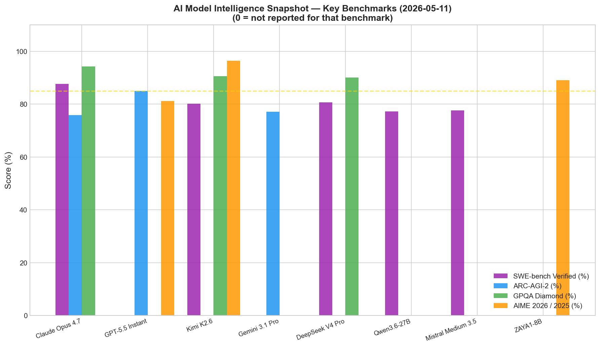
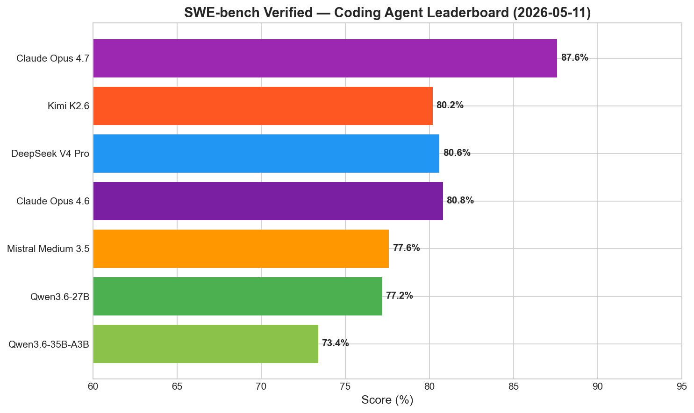
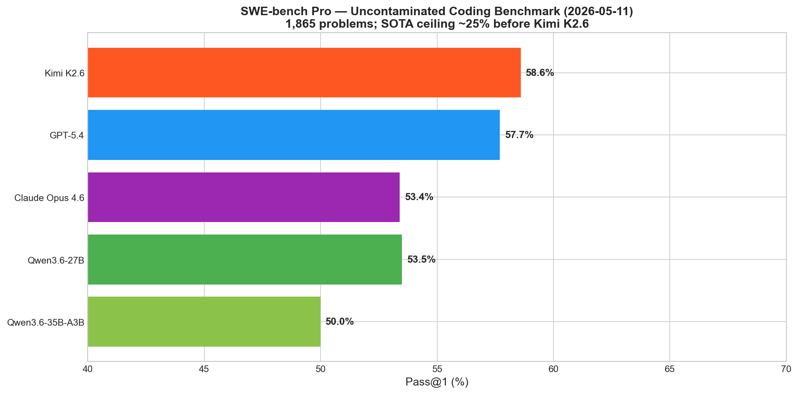
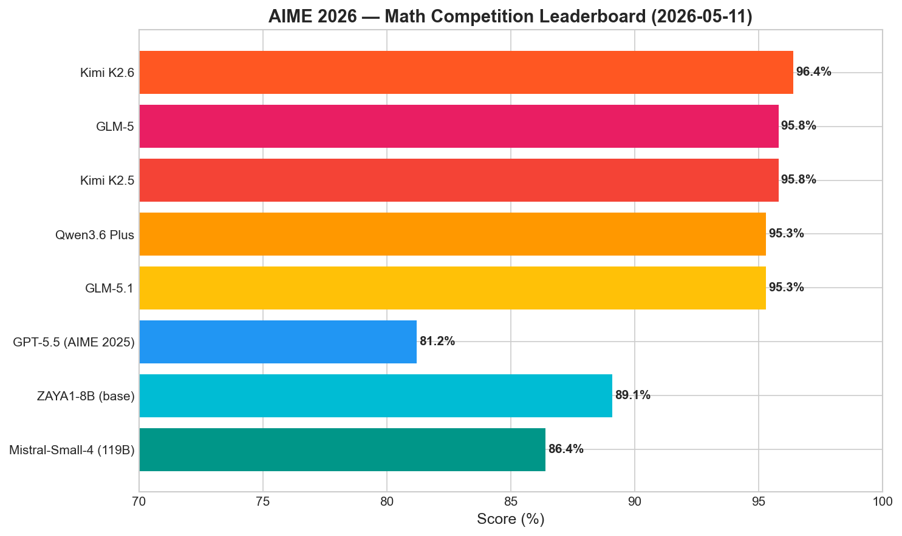
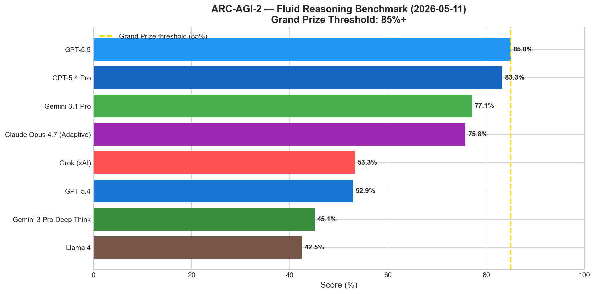
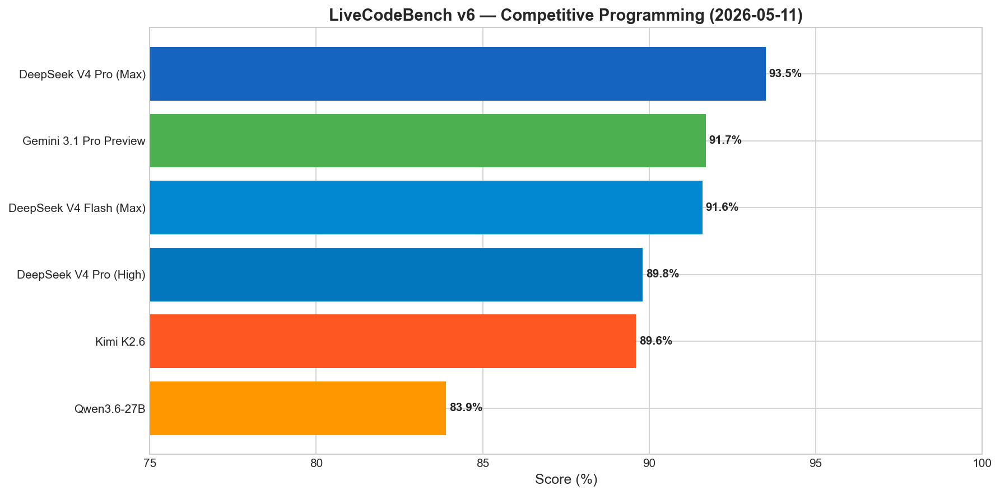
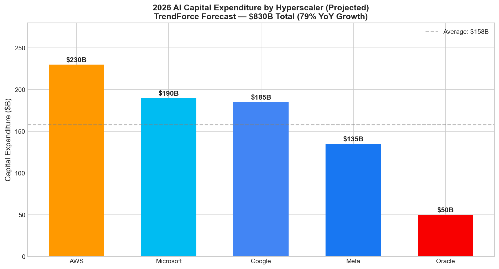
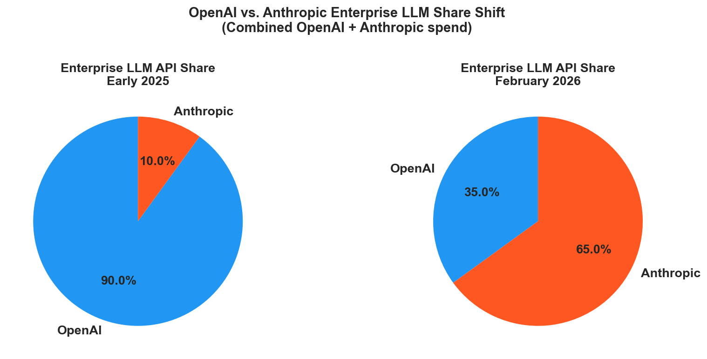

# AI News Daily Digest — 2026-05-11
*Compiled by OMAR for ML Research & Agentic Engineering*

---

## At a Glance (TL;DR)

- **GrandCode wins all three Codeforces Div. 1 live rounds** (March 2026, ranks 1st) — first AI to outperform all humans in a live competitive programming contest, enabled by Agentic GRPO with delayed-reward training
- **Kimi K2.6 leads AIME 2026 at 96.4%** and SWE-bench Pro at 58.6%, ships as open weights (Modified MIT), and is the first production model built for 12-hour autonomous agentic runs with 300-agent swarms
- **GPT-5.5 Instant cuts hallucinations 52.5%** versus its predecessor, is the new default ChatGPT model (May 5), and tops ARC-AGI-2 at 85% — crossing the grand prize threshold for the first time
- **Claude Opus 4.7 hits 87.6% SWE-bench Verified** (highest published), with 3.3× vision resolution upgrade bringing visual acuity to 98.5% and a new `xhigh` reasoning effort tier
- **AWS Managed MCP Server now GA**: first hyperscaler-managed MCP infrastructure with IAM governance + CloudTrail auditing — removes the primary enterprise production barrier for agentic deployments
- **OpenAI launched a $4B+ Deployment Company JV** with TPG, Bain, Brookfield to embed 150 FDEs inside enterprises — a direct counter-attack on Anthropic's surge to 65% of combined enterprise LLM spend
- **EU Digital Omnibus deal (May 7) delays high-risk AI compliance** to December 2027–August 2028 while adding a hard ban on AI-generated non-consensual intimate imagery by December 2026
- **TrendForce raised 2026 hyperscaler CapEx forecast to $830B** (79% YoY); AI servers will surpass general-purpose servers in electricity consumption in 2026 — a structural infrastructure crossover
- **Microsoft-OpenAI exclusivity ended April 27**: GPT-5.x models will now reach AWS Bedrock and Google Cloud, expanding enterprise distribution beyond Azure
- **SAP acquired Prior Labs for €1B+** to build Europe's frontier AI research lab; TabPFN-2.6 (tabular foundation models) leads TabArena, matching 4-hour AutoML pipelines instantly
- **Cola DLM (ByteDance, arXiv 2605.06548)** proposes hierarchical continuous latent diffusion as a viable non-autoregressive LM alternative, scaling cleanly to 2B parameters across 8 benchmarks
- **TIDE (Apple, arXiv 2605.06216)** injects token identity into every transformer layer, fixing Rare Token Problem and Contextual Collapse for +2.3% zero-shot accuracy at <1% parameter overhead
- **SWE-bench Verified is contaminated** — OpenAI stopped reporting it; use SWE-bench Pro (SOTA ~25% before Kimi K2.6) for real coding agent evaluation
- **WSO2 Agent Manager (Apache 2.0)** is the only open-source framework-agnostic agent control plane, covering identity + governance + observability — GA June 2026

---

## What This Means For Your Work

### For ML Research

- **Train reasoning models with Agentic GRPO, not standard PPO/GRPO.** GrandCode's breakthrough (arXiv 2604.02721) proves that standard GRPO's on-policy assumption breaks in agentic settings with delayed rewards. The key requirements are trajectory-level credit assignment (not step-level), importance-sampling correction for off-policy drift, and group relative advantage estimation. If you are running RL on multi-tool-call tasks without these modifications, expect reward hacking or unstable training. Read GrandCode before designing your next RL loop.

- **Cola DLM (arXiv 2605.06548) is the most complete recipe for non-autoregressive language generation.** ByteDance's hierarchical approach — Text VAE compresses text to continuous latents, then a Block-Causal Diffusion Transformer models those latents via Flow Matching — provides a clean inductive bias separating global semantic planning from local word choice. If you are working on long-form generation, multimodal unification, or alternatives to AR decoding, this paper is required reading. The latent drift prevention technique (gradient clipping on latent vectors) is a critical engineering detail not to overlook.

- **TIDE (arXiv 2605.06216) is a near-free drop-in improvement for any transformer architecture.** Apple's EmbeddingMemory mechanism — K token-indexed embedding tables injected at every layer via a depth-conditioned router — delivers +2.3% zero-shot accuracy at less than 1% parameter overhead. This is especially valuable for models with rare technical vocabulary (medical, legal, scientific). The implementation is straightforward: add K embedding tables, one depth-indexed router, and a null-opt-out bank. Expect wide adoption in fine-tuned models within the year.

- **"Transformers are Inherently Succinct" (ICLR 2026 Outstanding Paper, arXiv 2510.19315) sets a formal lower bound on AI safety auditing.** The paper proves transformers represent formal languages exponentially more succinctly than finite automata, and that verifying even simple transformer properties is EXPSPACE-complete. For interpretability researchers: this establishes that complete verification is computationally intractable in general. Partial interpretability methods are provably insufficient for full audits — a result that clarifies the scope and limitations of mechanistic interpretability research.

- **ZAYA1-8B's four-stage RL cascade is a reproducible MoE training recipe at the 8B scale.** Zyphra's AIME 2026 score of 89.1% with only 760M active parameters (8.4B total, ~9:1 sparsity) validates that the total-to-active parameter ratio in MoE is a first-class design choice for reasoning efficiency. The Markovian RSA test-time compute method — consistency voting over parallel reasoning traces accounting for intra-trace sequential dependencies — is worth implementing as a post-hoc improvement on any reasoning model (arXiv 2605.05365).

### For Agentic Engineering

- **Deploy the AWS Agent Toolkit immediately for any AWS-backed agent workload.** The managed MCP Server GA resolves the three compounding pain points of enterprise agent deployment: unaudited API calls, long-lived credentials, and self-hosted MCP infrastructure. CloudTrail integration means agent-initiated AWS API calls satisfy SOC 2, ISO 27001, and FedRAMP audit requirements out of the box. Setup is an IAM role attachment and an endpoint URL. The 40+ curated skills eliminate the "skill authoring tax" for standard AWS services.

- **Stop benchmarking coding agents on SWE-bench Verified above 85%.** OpenAI has stopped publishing SWE-bench Verified scores due to ~60% broken test contamination. Frontier model scores above 85% do not predict real-world task performance. Use SWE-bench Pro (Scale AI, 1,865 problems, GPL-licensed repos) — where the SOTA ceiling was ~25% before Kimi K2.6 (58.6%) — or your own internal eval on uncontaminated code. GPT-5 scores 23.3% on SWE-bench Pro despite posting 80%+ on the contaminated benchmark.

- **Adopt the Stateful Sandbox Execution pattern for any task requiring more than 10 sequential tool calls.** OpenAI Agents SDK v0.17 `SandboxAgent` with workspace snapshots enables pause/resume across failures — the critical capability for production long-horizon coding tasks. Manifest-defined workspaces enable reproducible environments for agent CI/CD. Eight hosted providers (E2B, Modal, Runloop, Vercel) are available out-of-the-box. Start building against this API now; LangGraph and MAF will ship equivalents within two quarters.

- **Evaluate WSO2 Agent Manager (Apache 2.0) before committing to vendor-specific governance.** Microsoft Agent 365 and ServiceNow AI Control Tower require their respective licensing. WSO2 Agent Manager (GA June 2026) is the only framework-agnostic, open-source control plane that governs LangGraph, CrewAI, AutoGen, and MAF agents without vendor lock-in. Zero-trust Kubernetes-native, OAuth 2.0 agent identity, and OpenTelemetry traces to any OTLP backend. GitHub repo is live for early access now.

- **ServiceNow Action Fabric MCP Server changes your integration architecture.** Previously, agents required custom REST wrappers for every ServiceNow workflow action. Action Fabric exposes the full ServiceNow system of action as MCP tools — any MCP-compliant agent can discover and invoke governed workflows with standard tool listing. This reduces integration code by ~80% while adding governance that was previously absent. If your agents interact with ServiceNow, re-architect to use Action Fabric rather than the REST API.

---

## Best Models Snapshot

*Side-by-side comparison of top frontier models across SWE-bench Verified (coding), ARC-AGI-2 (fluid reasoning), GPQA Diamond (graduate science), and AIME 2026 (math) as of 2026-05-11.*

### Model Comparison Table

| Model | Provider | Context Window | Input $/1M | Output $/1M | Modalities |
|---|---|---|---|---|---|
| GPT-5.5 Instant | OpenAI | 400K | $5.00 | $30.00 | Text, Image |
| GPT-5.4 Pro | OpenAI | 256K | $3.00 | $15.00 | Text, Image, Audio |
| Claude Opus 4.7 | Anthropic | 1M in / 128K out | $5.00 | $25.00 | Text, High-res Vision |
| Claude Opus 4.6 | Anthropic | 200K | $15.00 | $75.00 | Text, Vision |
| Gemini 3.1 Pro | Google | 2M (≤200K: $2/$12; >200K: $4/$18) | $2.00 | $12.00 | Text, Image, Audio, Video |
| Gemini 3.1 Flash-Lite | Google | 1M | $0.25 | ~$1.00 | Text, Image |
| DeepSeek V4 Pro | DeepSeek | 1M | ~$2.00 | ~$8.00 | Text |
| Mistral Medium 3.5 | Mistral | 256K | $1.50 | $7.50 | Text, Image |
| Mistral Medium 3.5 (Batch) | Mistral | 256K | $0.75 | $3.75 | Text, Image |
| Kimi K2.6 | Moonshot AI | 262K | TBD | TBD | Text, Vision (MoonViT) |
| Qwen3.6-27B | Alibaba | 262K (1M ext.) | Open weights | Open weights | Text |
| Qwen3.6-35B-A3B | Alibaba | 262K | Open weights | Open weights | Text, Vision |
| Qwen3.5-27B-FP8 | Alibaba | 1M | Open weights | Open weights | Text, Vision, 200+ languages |
| Llama 4 Maverick | Meta | 1M | Open weights | Open weights | Text, Vision |
| Gemma 4 | Google | 128K | Open weights | Open weights | Text, Vision |

---

## Benchmark Highlights

### Coding Agents — SWE-bench Verified

SWE-bench Verified tests models on 500 real GitHub issues from open-source Python repositories. Despite contamination concerns that have led OpenAI to stop reporting scores, it remains the most widely cited coding benchmark. Claude Opus 4.7 holds the top reported score at 87.6%, followed closely by DeepSeek V4 Pro (80.6%) and Kimi K2.6 (80.2%).

---

### Coding Agents — SWE-bench Pro (Uncontaminated)

SWE-bench Pro (Scale AI, 2026) is the hard successor: 1,865 problems from 41 actively maintained GPL-licensed and commercial repositories, averaging 107 lines across 4+ files, with minimal training data contamination. The SOTA ceiling was ~25% until Kimi K2.6 achieved 58.6% — a result that dramatically changes the landscape for agentic coding evaluation.

---

### Math Reasoning — AIME 2026

AIME 2026 is a 30-problem competition math benchmark. Kimi K2.6 leads at 96.4%, followed by a cluster of Chinese frontier models (GLM-5, Kimi K2.5 at 95.8%). ZAYA1-8B achieves a remarkable 89.1% with only 760M active parameters, beating models 10–100× larger.

---

### Fluid Reasoning — ARC-AGI-2

ARC-AGI-2 is the hardest public fluid-reasoning benchmark, designed to measure abstract pattern generalization that cannot be solved by memorization. GPT-5.5 becomes the first model to reach the grand prize threshold (85%+) at exactly 85.0%, while Claude Opus 4.7 (Adaptive) reaches 75.8%.

---

### Live Competitive Programming — LiveCodeBench v6

LiveCodeBench v6 draws problems from recent competitive programming contests, minimizing contamination. DeepSeek V4 Pro (Max) leads at 93.5%, with Gemini 3.1 Pro Preview and DeepSeek V4 Flash (Max) closely following. Kimi K2.6 ranks 5th at 89.6%, the highest among open-weight models.

---

### Industry — Hyperscaler Capital Expenditure

2026 marks a historic infrastructure inflection: TrendForce forecasts $830B in total CapEx across the top 9 cloud providers (79% YoY growth), with AI servers projected to surpass general-purpose servers in electricity consumption for the first time.

---

### Enterprise LLM Market Share Shift

Anthropic grew from ~10% to over 65% of combined OpenAI+Anthropic enterprise LLM spend between early 2025 and February 2026 — the market shift that directly catalyzed OpenAI's $4B+ Deployment Company launch.

---

## ML Research Highlights

### GrandCode: Agentic RL Crosses the Last Human Frontier in Algorithmic Problem-Solving

GrandCode, developed by the DeepReinforce Team ([arXiv 2604.02721](https://arxiv.org/abs/2604.02721)), is the first AI system to win live Codeforces competitive programming contests outright — placing 1st in three consecutive rounds (1087–1088–1089, March 2026) and first-solving all problems in each. Prior AI results were dramatically weaker: OpenAI o3 ranked approximately 175th globally; Google's Gemini 3 Deep Think reached only 8th place.

The system orchestrates four specialized modules: a **Hypothesis Generator** that proposes intermediate mathematical claims verified on small test cases before the main solver commits; a **Main Solver** handling full reasoning and solution generation; a **Summarization Module** compressing long reasoning traces into compact memory to prevent context overflow; and a **Test-Case Generator** synthesizing adversarial edge cases to stress-test solutions before submission. This division of cognitive labor mirrors how elite human competitors decompose hard problems, and the internal hypothesis-verify loop creates a self-adversarial process analogous to mathematical proof validation.

The training methodology centers on **Agentic GRPO** — a modified Group Relative Policy Optimization algorithm designed for multi-stage agentic rollouts. Standard GRPO assumes on-policy, single-step rewards. Competitive programming breaks this assumption in three ways: rewards are delayed across long tool-call sequences; multiple agents introduce credit assignment ambiguity; and evolving policy behavior creates off-policy drift. Agentic GRPO addresses all three by treating each full agentic episode as the unit of credit assignment, computing group relative advantages, and applying importance-sampling corrections (π_θ/π_ref) to handle distributional drift.

The broader implication is that the bottleneck in complex reasoning is **orchestration**, not raw intelligence. The hypothesis-verify-test pipeline — learned end-to-end via RL without hand-coded domain knowledge — is directly generalizable to automated theorem proving, scientific hypothesis generation, and chip design. The specific requirement is an automatic verifier: any domain with objective correctness criteria, multi-step exploration, and cheap intermediate verification is a candidate for the same approach. GrandCode also clarifies what remains beyond agentic RL: domains without automatic verifiers (novel scientific papers, physical experiments) require learned reward models that introduce their own reliability challenges.

---

### Cola DLM: Continuous Latent Diffusion Challenges the Autoregressive Paradigm

Cola DLM ([arXiv 2605.06548](https://arxiv.org/abs/2605.06548)), published May 7–8, 2026 by ByteDance researchers, proposes a fundamental departure from left-to-right autoregressive language modeling. Instead of predicting the next token, Cola DLM operates entirely in a continuous latent space: a causal Text VAE compresses text spans into dense latent vectors under combined reconstruction, BERT-style masked prediction, and KL-divergence losses; then a Block-Causal Diffusion Transformer models the distribution over those latent representations using Flow Matching.

From a generative modeling perspective, Cola DLM performs "latent prior transport rather than token-level observation recovery" — separating global semantic organization (what the response is about) from local textual realization (the exact words). This inductive bias more closely aligns with human generation: form a high-level semantic plan, then execute it linguistically. The paper demonstrates strong scaling on ~2B-parameter models up to approximately 2000 EFLOPs, matching autoregressive baselines and outperforming LLaDA (prior discrete diffusion LM) on 8 standard benchmarks. A critical engineering contribution is latent drift prevention via targeted gradient clipping on latent vectors — without this, diffusion updates corrupt the learned semantic geometry of the VAE's continuous space.

---

## Agentic AI Highlights

### AWS Agent Toolkit + Managed MCP Server: The First Production-Grade Hyperscaler MCP Infrastructure

AWS's dual release on May 6, 2026 — the Agent Toolkit for AWS and the GA of its managed MCP Server — is the most architecturally significant agentic development of the week. Until now, every enterprise team deploying MCP-conformant agents faced the same bootstrapping problem: where does the MCP server run, how are credentials managed, and who owns the audit trail? AWS has answered all three with a managed, IAM-integrated, CloudTrail-backed MCP endpoint — removing the last significant operational obstacle between "we have an agent framework" and "we have a production-grade agent deployment."

The platform provides a managed MCP Server endpoint (no infrastructure to provision), IAM-based guardrails enforcing least-privilege at the infrastructure layer, 40+ curated skills across IaC, data analytics, serverless, containers, and AI services, sandboxed Python execution for multi-step operations, CloudWatch metrics per skill, and CloudTrail audit trails giving agent-initiated API calls a full principal identity traceable to a human owner. Anonymous documentation search is supported without credentials, enabling agent-driven documentation lookup in CI pipelines.

The architectural significance extends beyond AWS: this establishes what will likely become the reference pattern for **hyperscaler-managed agentic infrastructure** — a managed protocol gateway that translates agent tool calls into governed, audited, least-privilege API calls against cloud services. This is a new infrastructure primitive, distinct from agent runtimes and frameworks: an **agentic API gateway**. ServiceNow's MCP Server GA at Knowledge 2026 the same week confirms the race is already underway, and pressure is building on Azure (Foundry MCP) and GCP (Vertex AI MCP) to ship equivalents.

The same week, OpenAI Agents SDK v0.17 shipped **Sandbox Agents** — persistent, snapshotted Unix workspaces (`SandboxAgent`, `Manifest`, `SandboxRunConfig`) that enable resumable, stateful execution across restarts. This closes the gap between agentic demos and production-grade deployments on multi-hour coding tasks. Eight hosted sandbox providers are available out-of-the-box; local Docker and remote storage mounts (S3, R2, GCS, Azure Blob) are also supported.

---

## Industry & Business Highlights

### OpenAI's $4B+ Deployment Company: The Consulting Firm Inside a Model Lab

OpenAI launched the OpenAI Deployment Company in early May 2026 — a majority-owned JV anchored by over $4 billion from 19 investment firms at a $10 billion pre-money valuation. TPG leads, joined by Advent International, Bain Capital, Brookfield, SoftBank, Goldman Sachs, and Warburg Pincus; consulting partners include Bain & Company, McKinsey, and Capgemini. The financial structure includes a guaranteed 17.5% annual return to PE investors over five years — a commitment that underscores the urgency behind the move.

The proximate cause is stark: Anthropic's enterprise API share grew from ~10% to over 65% of combined OpenAI+Anthropic enterprise LLM spend since early 2025, while OpenAI's overall API share fell from ~50% in 2023 to ~35% today. The response is not a model upgrade but a structural shift: ~150 Forward Deployed Engineers (acquired via London-based Tomoro) will be embedded directly inside customer organizations to redesign workflows, retrain staff, and integrate OpenAI systems — a model that creates switching costs no API price cut can overcome.

The broader implication for the industry: the enterprise AI value chain is moving from "build the best model" toward "integrate AI deeply enough that customers cannot leave." The PE consortium's portfolio companies serve as a captive first-wave customer base. For developers at AI startups, competitive positioning now includes professional services capacity and implementation track record alongside API quality. Pure API businesses without embedded implementation arms will face compressing margins as the consulting-model hybrid becomes the enterprise standard.

---

## Full Sections

- [ML Research →](sections/ml-research.md)
- [AI Industry →](sections/ai-industry.md)
- [Agentic AI →](sections/agentic-ai.md)
- [Best Models →](sections/best-models.md)
