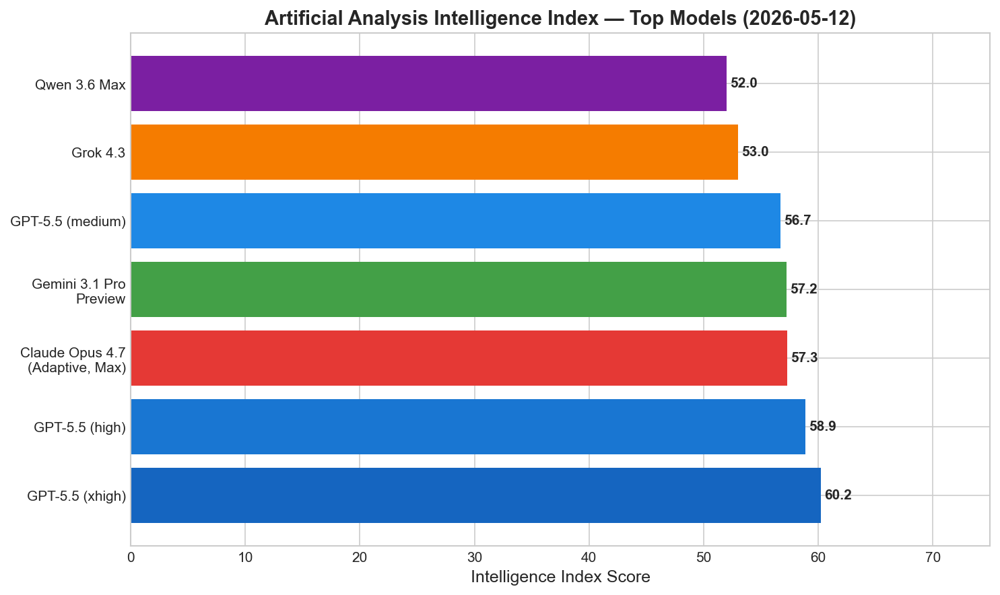
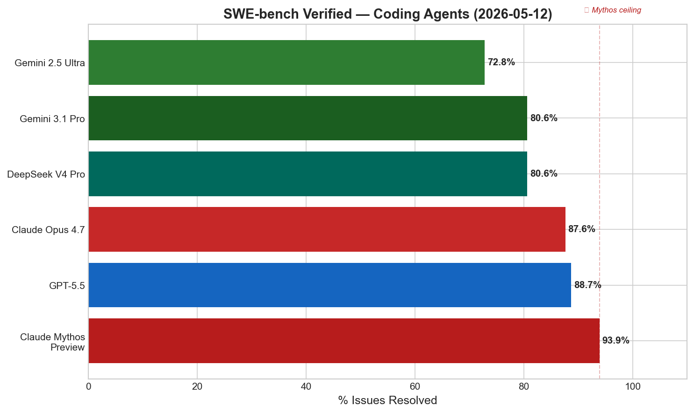
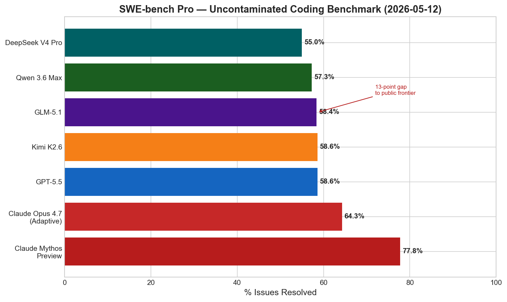
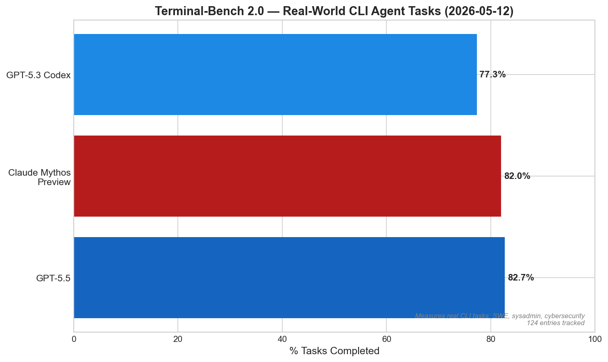
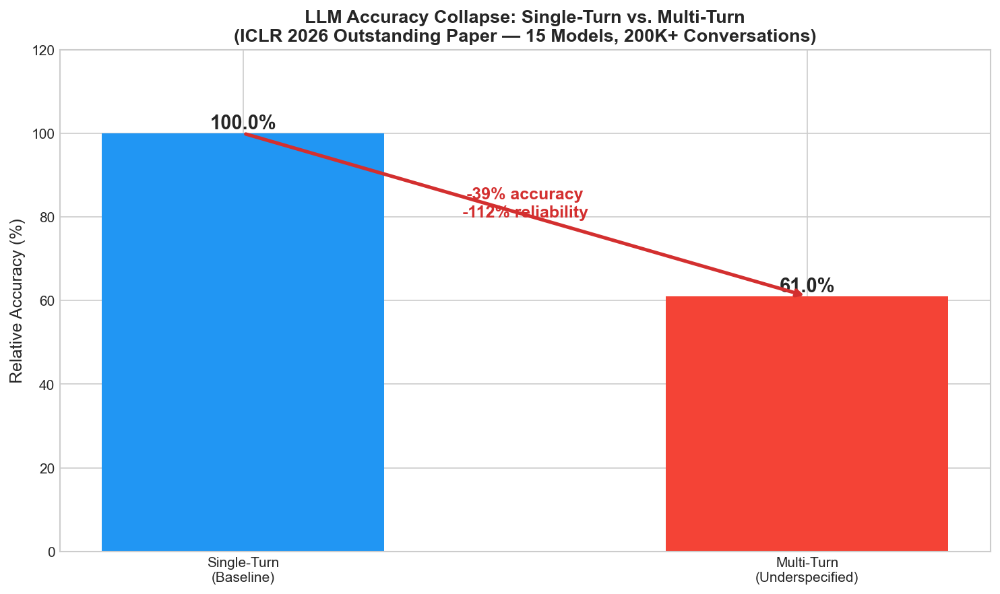

# AI News Daily Digest — 2026-05-12
*Compiled by OMAR for ML Research & Agentic Engineering*

---

## At a Glance (TL;DR)

- **OpenAI launched Daybreak** — a full-stack cybersecurity platform with 8 major security partners (Akamai, Cisco, Cloudflare, CrowdStrike, Fortinet, Oracle, Palo Alto, Zscaler), directly competing with Anthropic's Mythos and positioning GPT-5.5 as the enterprise defender standard
- **Anthropic committed $200B to Google Cloud over 5 years** + 3.5 GW of next-gen TPU capacity with Broadcom — the largest compute commitment in AI history, betting on TPUs over Nvidia GPUs
- **Sierra raised $950M at $15B valuation** with 40% of Fortune 50 as customers, $150M ARR growing at 228% YoY — enterprise vertical AI agents are the highest-velocity segment in software
- **Claude Mythos Preview holds the ceiling** at 93.9% SWE-bench Verified and 77.8% SWE-bench Pro — restricted to 52 vetted partners, creating a 13-point public/private frontier gap that cannot be closed without access
- **DeepSeek V4 Pro (open weights, 1.6T MoE)** tops LiveCodeBench at 93.5%, supports 1M-token context at $1.74 input — the best publicly accessible coding model
- **L2 weight decay is provably the Solomonoff prior** (arXiv:2605.10878, ETH Zürich) — first rigorous two-sided link between practical regularization and algorithmic information theory, with concrete implications for quantized training
- **DECO sparse MoE matches dense performance at 20% expert activation** (ICML 2026, Tsinghua) — 3× inference speedup on edge hardware within the same total parameter budget
- **LLMs lose 39% accuracy in multi-turn conversations** with underspecified instructions (ICLR 2026 outstanding paper, 15 models, 200K+ conversations) — single-turn benchmarks systematically overestimate real-world capability
- **SAP declared "Autonomous Enterprise"** at Sapphire 2026 with 200+ specialized AI agents, anchored by SAP Knowledge Graph — governance and business context as the defensible moat
- **Claude Managed Agents added multi-agent orchestration** with Dreaming (self-improvement) and Outcomes (grader-based self-correction, +10 points in A/B tests)
- **SLIM improves agentic RL by +7.6pp** over best baselines by treating the external skill set as a dynamic optimization variable with lifecycle management (retain/retire/expand)
- **Hyperscaler AI CapEx is on track for $830B in 2026** (79% YoY), with AWS alone exceeding $230B — AI infrastructure at unprecedented scale
- **China mandated human-in-the-loop review** for AI agents in healthcare, transportation, media, and public safety — first government to specifically regulate agentic (not just generative) AI
- **Perceptron Mk1 launched today** delivering frontier-competitive video understanding at $0.15/$1.50 per 1M tokens — 80–90% cheaper than GPT-5.5, Gemini, or Claude for video workloads

---

## What This Means For Your Work

### For ML Research

- **Weight decay is now theoretically justified as the optimal Bayesian prior.** The ETH Zürich paper (arXiv:2605.10878) proves a tight sandwich bound: L2 weight decay induces a prior over network outputs that matches Solomonoff's universal prior up to a logarithmic factor in any fixed-precision regime. This unifies MDL generalization theory, PAC-Bayes compression bounds, and neural network complexity into a single framework. The practical implication: int4/int8 quantized sparse training is a *more direct* implementation of the theoretically optimal prior than fp32 training — a strong argument for quantization-aware sparse fine-tuning in production models.

- **DECO (ICML 2026) solves the MoE storage bottleneck for edge deployment.** Prior sparse MoE models required trading total parameter count for inference savings; DECO achieves dense-comparable perplexity at 20% expert activation within the *same total parameter budget*, with a 3× speedup on Jetson AGX 64GB. The key innovations (ReLU-based differentiable routing, NormSiLU dual normalization, adaptive sparsity regularization) are drop-in improvements to any MoE architecture. Teams building on-device or edge inference pipelines should prioritize evaluating DECO's CUTLASS kernel.

- **The ICLR 2026 multi-turn accuracy collapse paper demands methodology changes in model evaluation.** A 39% accuracy drop across 15 models from 8 providers — held consistently regardless of model size or architecture — means that single-turn benchmark scores are systematically unreliable for predicting real-world performance. Any team evaluating models for customer service, coding assistant, or agentic use cases should replicate the multi-turn simulator methodology to get defensible estimates. The 112% reliability collapse (not just accuracy) means multi-turn failures are also highly non-deterministic, making per-run benchmarking especially deceptive.

- **Transformers' doubly-exponential succinctness over automata (ICLR 2026) explains why they generalize so efficiently.** The formal proof that a transformer of size n can describe languages requiring DFAs with ≥ 2^(2^Ω(n)) states provides a rigorous answer to "why transformers?" This has implications for prompt engineering: logically compact prompts should be easier for transformers to generalize from, consistent with the succinctness theory. The EXPSPACE-completeness of transformer verification also confirms that formal property checking is intractable — neural interpretability must proceed empirically, not formally.

- **SLIM's skill lifecycle framework (arXiv:2605.10923) is the right paradigm for agentic RL with external tools.** Rather than monotonically accumulating or eliminating skills, SLIM treats the active skill set as a trainable variable. The leave-one-skill-out Marginal External Contribution (MEC) signal is computationally cheap and directly actionable in any GRPO-based training loop. The +7.6pp improvement on ALFWorld and +5.1pp on SearchQA over best baselines demonstrates that the *dynamic* lifecycle (retain/retire/expand) is strictly better than the monotonic alternatives. Researchers building tool-augmented agents should adopt this framework.

### For Agentic Engineering

- **The AI cybersecurity stack is now a first-class engineering domain.** OpenAI's Daybreak launch (May 12) and Anthropic's Mythos position frontier models as cybersecurity infrastructure, not just research tools. Engineers building on these APIs should expect new specialized cybersecurity endpoints, audit logging requirements, and tiered access controls — similar to HIPAA-tier compliance for medical AI. The enterprise security market is restructuring around AI-native vulnerability detection and patch orchestration, with traditional SIEM/SOAR vendors potentially displaced.

- **Claude Managed Agents' Outcomes + Dreaming features are the first commercially hosted self-improving agent system.** The ability to grade outputs against developer-defined rubrics and self-correct (up to +10 points improvement in A/B tests), combined with Dreaming's extraction of patterns from past sessions, represents a qualitatively new runtime capability. Engineers should design agent systems with evaluation rubrics as first-class inputs — this pattern will spread to LangGraph, OpenAI evals-as-tool-calls, and Google ADK.

- **Event-driven dormancy is now the documented best practice for production long-running agents.** Google's ADK guide, Claude Managed Agents session checkpointing, and Hermes Agent all formalize the same pattern: agents go dormant (zero cost) waiting for external events rather than polling or sleeping. Engineers still building polling loops or sleeping threads in production agents are accumulating technical debt. Any agent that must wait for human approvals, webhook callbacks, or multi-day document signing flows should use event-driven dormancy gates with durable checkpoint-based resumption.

- **Regulatory divergence is creating a compliance patchwork for agentic deployments.** US (voluntary testing, no mandatory approval), EU (enforcement delayed to December 2027), and China (mandatory human-in-loop now for healthcare/transport/media/public safety) represent three fundamentally incompatible governance regimes. Any agent that autonomously executes in regulated sectors across jurisdictions needs jurisdiction-specific compliance architectures. Designing for China's CAC requirements first (strictest) and relaxing for less-regulated markets is the lowest-cost compliance path.

- **The A2A + MCP two-layer protocol stack has reached production stability.** With A2A v1.0 backed by AWS, Cisco, Google, IBM, Microsoft, Salesforce, SAP, and ServiceNow, and MCP's stateless transport roadmap targeting June 2026, the protocol stack is stable enough to build on. WSO2 Agent Manager (Apache 2.0) is the only framework-agnostic control plane covering identity, governance, and observability for multi-framework agent fleets — worth evaluating for any team running heterogeneous agent deployments.

---

## Best Models Snapshot

*GPT-5.5 leads the publicly accessible Intelligence Index at 60.2, with Claude Opus 4.7 and Gemini 3.1 Pro tightly clustered at 57; Claude Mythos Preview is not publicly indexed but would score materially higher based on benchmark data.*

### Model Comparison Table

| Model | Provider | Context Window | Input $/1M | Output $/1M | Modalities |
|---|---|---|---|---|---|
| Claude Mythos Preview | Anthropic | 1M | $25.00 | $125.00 | Text, code (restricted access) |
| GPT-5.5 (xhigh) | OpenAI | 1.05M | $10.00 | $60.00 | Text, images, code |
| GPT-5.5 (standard) | OpenAI | 1.05M | $5.00 | $30.00 | Text, images, code |
| Claude Opus 4.7 (Adaptive) | Anthropic | 1M | $5.00 | $25.00 | Text, images, code |
| Gemini 3.1 Pro | Google | 2M | $2.00 | $12.00 | Text, images, video, audio, code |
| Grok 4.3 | xAI | 1M | $1.25 | $2.50 | Text, images, video (≤5 min) |
| DeepSeek V4 Pro | DeepSeek | 1M | $1.74 | $3.48 | Text, code |
| ERNIE 5.1 | Baidu | 128K | $0.59 | $2.65 | Text |
| Qwen 3.6 Max | Alibaba | 256K | ~$1.50 | ~$6.00 | Text, code |
| GLM-5.1 | Z.AI (Zhipu) | 200K | ~$1.00 | ~$4.00 | Text, code |
| Kimi K2.6 | Moonshot AI | 1M | ~$2.00 | ~$8.00 | Text, code, agentic |
| Nemotron 3 Nano Omni | NVIDIA | 256K | Open weights | Open weights | Video, audio, image, text |
| Perceptron Mk1 | Perceptron Inc. | 32K | $0.15 | $1.50 | Video, text |
| GPT-Realtime-2 (audio) | OpenAI | 128K | $32.00 | $64.00 | Speech, text |

---

## Benchmark Highlights

### Coding Agents — SWE-bench Verified

SWE-bench Verified tests AI agents on real GitHub issues — submitting pull requests that pass all existing tests. It is the most widely cited benchmark for coding agent capability, though it has known contamination issues; SWE-bench Pro (below) is the uncontaminated successor. Claude Mythos Preview holds the all-time record at 93.9%, with GPT-5.5 and Claude Opus 4.7 closely clustered in the high 80s.

---

### Coding Agents — SWE-bench Pro (Uncontaminated)

SWE-bench Pro is the contamination-resistant successor to SWE-bench Verified, using issues that have not appeared in any model's training data. The 13-point gap between Claude Mythos Preview (77.8%) and the best publicly accessible model (Claude Opus 4.7 at 64.3%) represents a full generational lead — the largest observed frontier gap since GPT-4 vs. GPT-3. OpenAI stopped self-reporting SWE-bench Verified after contamination concerns, making Pro the credible baseline.

---

### Agentic CLI Tasks — Terminal-Bench 2.0

Terminal-Bench 2.0 evaluates agents on 124 real-world command-line tasks including software engineering, system administration, and cybersecurity scenarios. It is widely regarded as one of the most contamination-resistant benchmarks available. GPT-5.5 leads at 82.7% with Claude Mythos Preview close behind at 82.0%, indicating the frontier has converged on terminal-task performance.

---

### Real-World Production Impact — Multi-Turn Accuracy Collapse

The ICLR 2026 Outstanding Paper by Salesforce Research is arguably the most actionable finding for production engineers this year. Across 200,000+ simulated conversations with 15 models from 8 providers, LLMs lose an average of 39% accuracy when moving from single-turn to multi-turn settings with underspecified instructions. Reliability (consistency across runs) collapses by 112%, making multi-turn failures wildly non-deterministic. This finding holds across all model families and sizes — it is a structural deployment gap, not a capability gap of specific models.

---

## ML Research Highlights

### Neural Weight Norm = Kolmogorov Complexity — L2 Weight Decay Is the Solomonoff Prior

A single-author theoretical paper by Tiberiu Musat (ETH Zürich, arXiv:2605.10878, submitted May 12, 2026) provides the first mathematically rigorous, two-sided connection between L2 weight decay — used universally in deep learning — and Solomonoff's universal prior, the theoretically optimal Bayesian prior over computable functions. The main theorem proves a tight sandwich bound: in any fixed-precision regime, the neural complexity N(s) (minimum non-zero parameter count of a Turing-complete looped network outputting string s) satisfies N(s) ≤ K(s) ≤ c_d · N(s) · log N(s), where K(s) is the Kolmogorov complexity of s.

The key insight enabling this result is the *Lp collapse* in fixed-precision parameter spaces: every Lp norm to the p-th power is sandwiched between δ^p · ‖θ‖₀ and M^p · ‖θ‖₀, making all norm choices (L1, L2, squared-L2) equivalent up to constants. This means every regularizer that penalizes parameter magnitude is, in fixed precision, counting non-zero parameters — and therefore encoding program length — up to a logarithmic overhead. The Gaussian weight-decay prior π(θ) ∝ exp(−λ/2 ‖θ‖₂²) induces an output prior Q(s) that satisfies 2^{−K(s)−α} ≤ Q(s) ≤ 2^{−K(s)/(β log K(s))}, matching Solomonoff's universal prior M(s) ∝ 2^{−K(s)} within a logarithmic factor in the exponent.

The proof proceeds by two short reductions. For the lower bound, any shortest universal Turing machine program p for string s can be loaded into a fixed-precision looped network using exactly |p| ternary routing weights. For the upper bound, any W-weight fixed-precision network can be described by enumerating its (layer, source, target, value) tuples at O(log W) bits each, giving an O(W log W)-bit encoding. The logarithmic gap is shown to be tight via permutation encoding — encoding a permutation π:[N]→[N] requires Θ(N) ternary weights but has Kolmogorov complexity Θ(N log N).

The result has concrete, testable empirical predictions: int4/int8 quantized sparse models are *more direct* implementations of the theoretically optimal prior than fp32 training. A derived MDL generalization bound tighter than general PAC-Bayes bounds for well-regularized sparse models — Õ(√(W log W / m)) — makes this immediately actionable for model compression and post-training quantization research. This paper closes a 30-year gap between information-theoretic learning theory and empirical deep learning practice.

---

## Agentic AI Highlights

### SAP Autonomous Enterprise — Why Governance Wins in Agentic ERP

SAP's Sapphire 2026 announcement is the most consequential enterprise agentic AI development of the quarter. The platform deploys over 50 domain-specific Joule Assistants and 200+ specialized AI agents across finance, procurement, HR, supply chain, and customer operations — all operating autonomously. The flagship showcase was the Autonomous Close Assistant, which compresses financial close cycles from weeks to days. CEO Christian Klein's thesis is that the AI agent race in the enterprise is won at the **governance layer**, not the foundation model layer.

The architecture's competitive moat is the **SAP Knowledge Graph** — a semantic layer encoding relationships between business processes, data entities, compliance rules, and operational logic accumulated from SAP's 50+ years as ERP vendor for the Fortune 500. This graph provides agents with the business context to make decisions that are not just technically correct but operationally valid and legally compliant. Pure-play AI vendors (OpenAI, Anthropic, Google) can provide better foundation models but lack the operational context to safely automate decisions like approving a $2M purchase order or closing a financial quarter.

The architecture deploys narrow specialist agents (financial close, procurement, HR onboarding, supply chain resilience) each grounded in domain-specific rules extracted from the Knowledge Graph, orchestrated through the Joule conversational interface where users specify business outcomes rather than task sequences. A €100M partner fund signals an SI-led deployment model, acknowledging that the bottleneck for enterprise adoption is organizational change management and legacy integration, not model capability.

The timing is deliberate relative to Salesforce (Agentforce Operations, April 29), ServiceNow, Workday, and Oracle, all shipping agentic layers in 2026. The common pattern across all ERP/SaaS vendors is a pivot from "AI assistant for humans" to "AI agents that autonomously operate the enterprise" — with SAP's structural advantage being the 7.3 million data fields of business context already embedded in its systems.

---

## Industry & Business Highlights

### The AI Cybersecurity Arms Race — Mythos, Daybreak, and a New Attack Surface

OpenAI's Daybreak launch on May 12, 2026 crystallizes a strategic inflection point: frontier AI labs are no longer building general-purpose language models — they are building specialized cyberweapons and cyber-defense systems. Daybreak is architecturally distinct from Anthropic's Mythos: rather than a pure vulnerability discovery engine, it is an operational agentic platform (GPT-5.5 + Codex as harness) designed to scan, patch, and validate within enterprise CI/CD pipelines.

The launch partnerships — covering the full enterprise security stack from endpoint (CrowdStrike) to network (Cisco, Fortinet) to cloud (Cloudflare, Zscaler, Oracle) to application (Palo Alto, Akamai) — give Daybreak immediate enterprise reach that Mythos's controlled access cannot match. OpenAI is building a cybersecurity channel similar to how it built enterprise distribution through Azure. Meanwhile Anthropic's Mythos (April 2026) demonstrated autonomous zero-day discovery across all major OSes and browsers, including a 27-year-old OpenBSD TCP vulnerability — leading Anthropic to restrict access to 52 vetted organizations and price it at $25/$125 per 1M tokens.

The policy dimension accelerates this competitive dynamic. The Trump administration's draft AI security executive order — finalized this week — will not require mandatory model testing, instead expanding voluntary evaluation programs to include Google, Microsoft, and xAI alongside OpenAI and Anthropic. OpenAI's simultaneous announcement of GPT-5.5-Cyber access for EU government partners, while Anthropic has not granted EU review access to Mythos, suggests a deliberate race to establish regulatory credibility. Organizations that fail to integrate AI-native security tooling by 2027 will face an asymmetric threat landscape — adversaries using AI to find vulnerabilities faster than human defenders can patch them.

---

## Full Sections

- [ML Research →](sections/ml-research.md)
- [AI Industry →](sections/ai-industry.md)
- [Agentic AI →](sections/agentic-ai.md)
- [Best Models →](sections/best-models.md)
