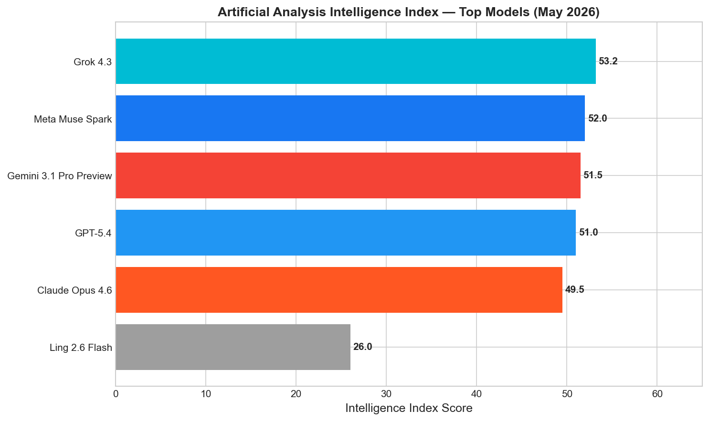
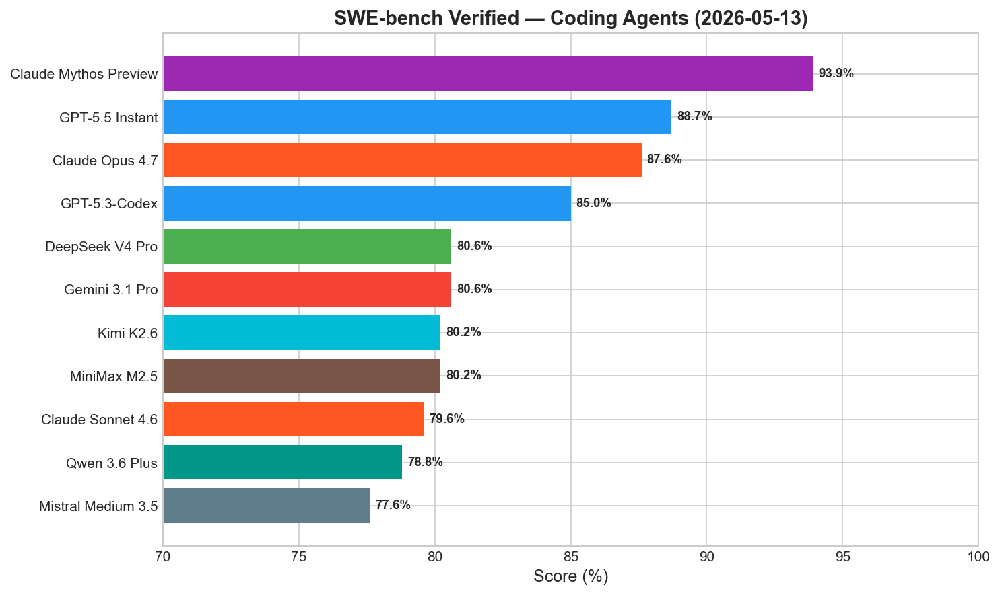
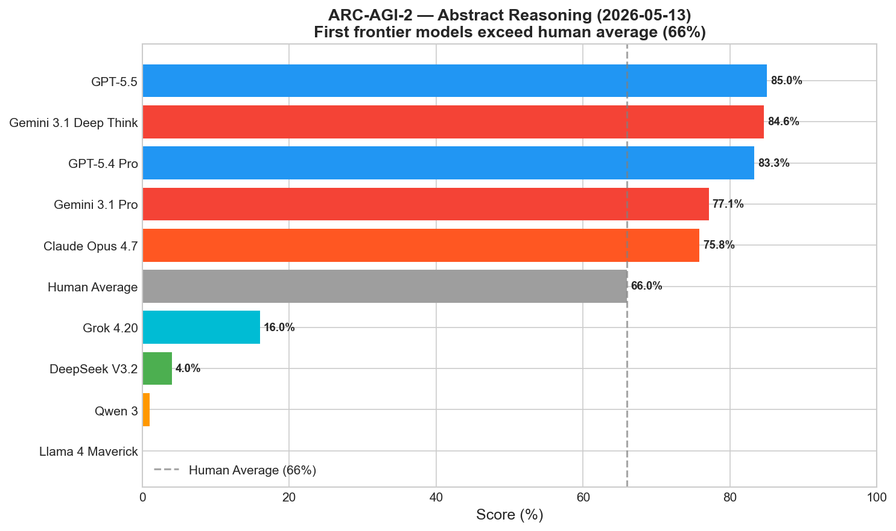
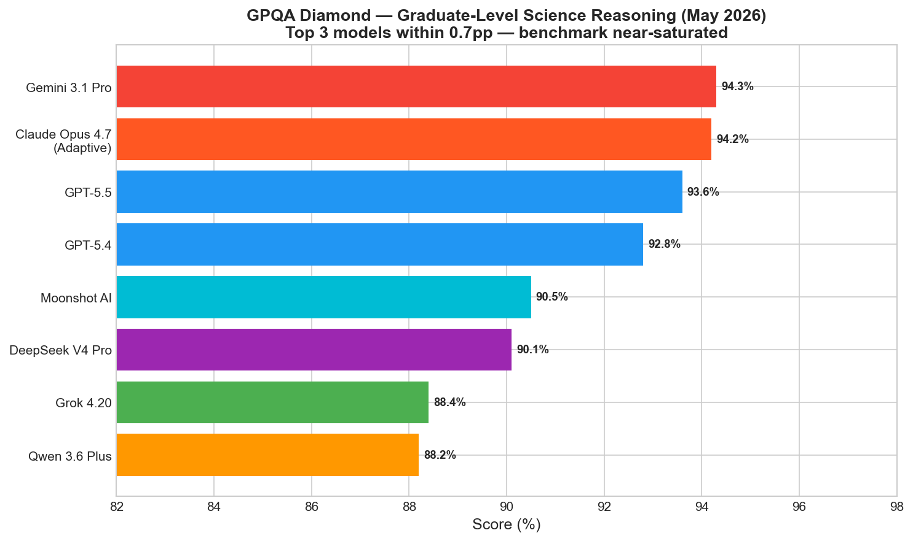
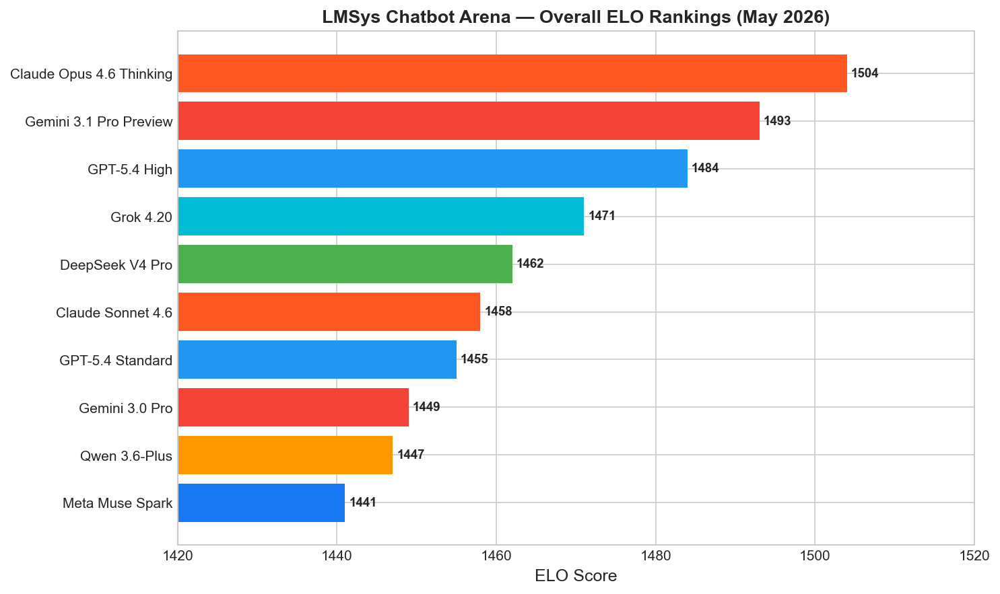
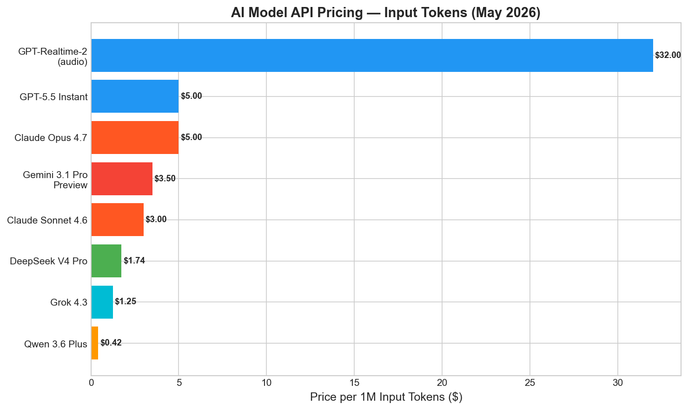
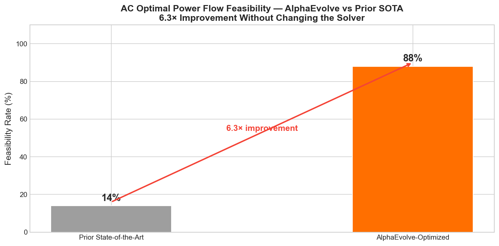
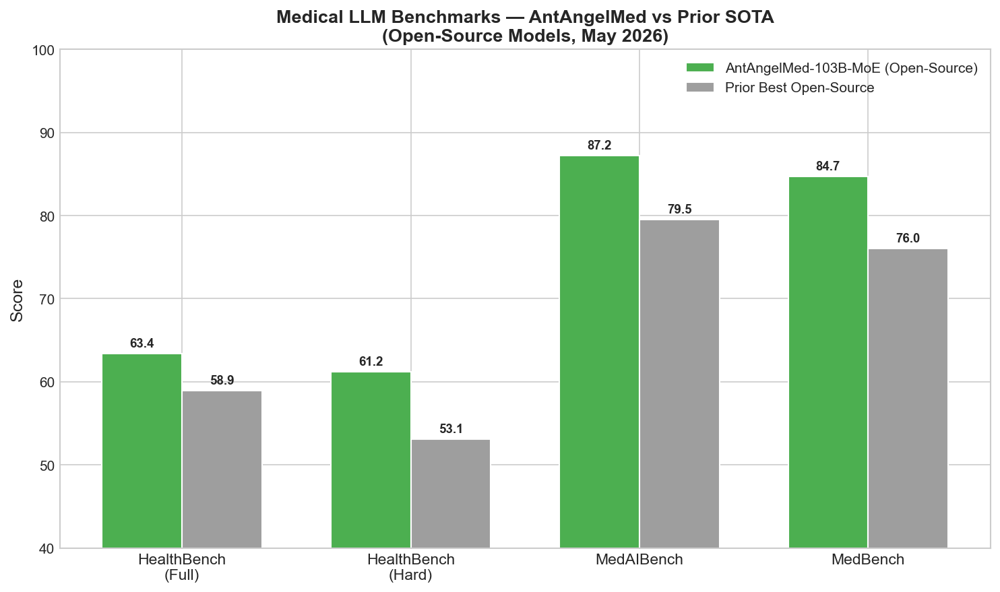
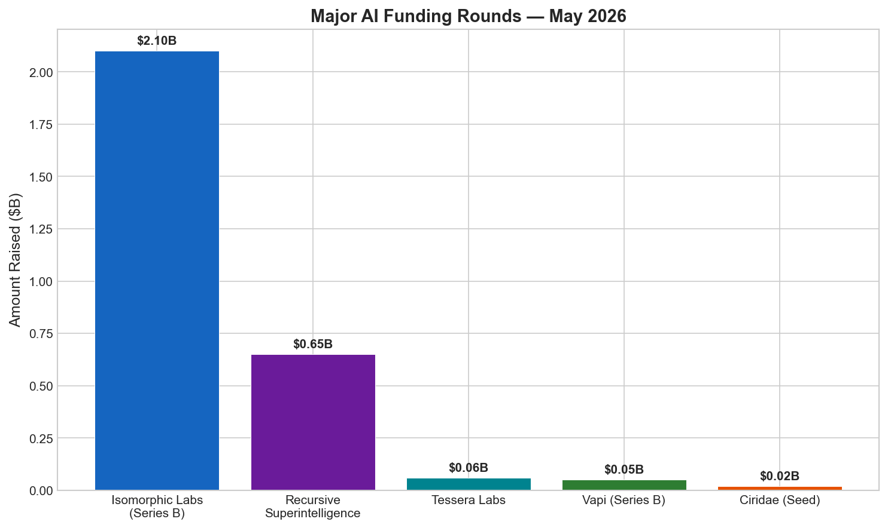

# AI News Daily Digest — 2026-05-13
*Compiled by OMAR for ML Research & Agentic Engineering*

---

## At a Glance (TL;DR)

- **GPT-5.5 Instant becomes default ChatGPT model** — tops SWE-bench Verified at 88.7% and ARC-AGI-2 at 85% (first model to exceed human average of 66%), while cutting hallucinations 52.5% on high-stakes queries in medicine, law, and finance
- **AlphaEvolve one-year report drops** — DeepMind's evolutionary coding agent improved matrix multiplication for first time in 56 years (48 vs. Strassen's 49 scalar ops) and raised AC Optimal Power Flow feasibility 6.3× (14% → 88%)
- **Recursive Superintelligence emerges from stealth with $650M at $4.65B valuation** — 5 months post-founding, backed by GV, Nvidia, and AMD, with zero public products; largest-ever pre-product raise for a self-improving AI lab
- **Isomorphic Labs closes $2.1B Series B** — second-largest biotech round in history, backed by Abu Dhabi, Singapore, and UK sovereign wealth funds; first clinical trials targeted by end of 2026
- **Anthropic launches Claude for Small Business** — 15 agentic workflows integrated into QuickBooks, PayPal, HubSpot, Slack, and 10 other SMB platforms at no extra cost, targeting 36 million US small businesses
- **NVIDIA Star Elastic: 3 model sizes from 1 training run at 360× lower cost** — elastic budget control delivers +16% accuracy and 1.9× lower latency vs. full model throughout chain-of-thought
- **PowerStep halves Adam optimizer memory, 8× with int8** — validated at 235B parameters with O(1/√T) convergence proof; open-source on GitHub
- **AntAngelMed (103B MoE, 6.1B active) leads HealthBench at 63.4** — open-source SOTA on all medical benchmarks under Apache 2.0, with 8.1-point lead on HealthBench-Hard
- **ServiceNow Build Agent GA** — "export-boundary governance" pattern now deployed across Cursor, Windsurf, Claude Code, and GitHub Copilot; governance applied at artifact export, not IDE
- **Cognizant OneCognizant validates multi-agent at 350,000-employee scale** — 50% efficiency gains, 50% ticket reduction via 80 specialized bounded-context agents in 50+ countries
- **EU AI Act Omnibus approved by Germany** — high-risk AI compliance deadline extended to December 2027; formal Parliament/Council adoption still pending before August 2
- **A2A Protocol v1.0 under Linux Foundation governance** — 150+ organizations including Azure, Bedrock, and Vertex AI; Signed Agent Cards add cryptographic agent identity

---

## What This Means For Your Work

### For ML Research

- **AlphaEvolve is now a production template for algorithm discovery.** The combination of Gemini Flash (breadth) + Gemini Pro (depth) + automated domain evaluator has produced verified breakthroughs in matrix algebra, power systems, genomics, and quantum circuits. If your research involves optimizing over discrete or continuous structured spaces — compiler passes, numerical methods, NAS — the AlphaEvolve paradigm is directly applicable. The key investment is building a high-quality automated evaluator, not the search methodology itself. Read the [Google DeepMind blog post](https://deepmind.google/blog/alphaevolve-impact/) and [GitHub results](https://github.com/google-deepmind/alphaevolve_results).

- **PowerStep is a drop-in Adam replacement for large-model training.** At 50% of Adam's optimizer memory (or 12.5% with int8 quantization), with zero quality degradation up to 235B parameters and a provable O(1/√T) convergence rate, PowerStep is the strongest memory-efficient optimizer result to date. At 235B scale, this translates to freeing ~470GB of optimizer state — equivalent to training a model roughly 2.8× larger on the same hardware. Caveat: results are from NVIDIA-affiliated researchers; await independent replication. Code at [github.com/yaolubrain/PowerStep](https://github.com/yaolubrain/PowerStep).

- **NVIDIA Star Elastic changes multi-size model economics.** If you deploy model families across hardware tiers (datacenter → edge → mobile), Star Elastic's 360× cost reduction vs. pretraining and elastic budget control (+16% accuracy at 1.9× lower latency by selecting submodels for thinking vs. answering phases) is directly applicable to any chain-of-thought inference stack. Read [arXiv:2605.07182](https://arxiv.org/html/2605.07182v1); models are available at [Hugging Face](https://huggingface.co/nvidia/NVIDIA-Nemotron-Labs-3-Elastic-30B-A3B-BF16).

- **AntAngelMed establishes the blueprint for domain-specialized open LLMs.** The combination of sparse MoE (1/32 activation, 6.1B active from 103B total) + three-stage training (continual pre-train → SFT → GRPO RL with task-specific reward models) is the strongest known recipe for open-weight domain specialization. With HealthBench SOTA at 63.4 under Apache 2.0, this is directly applicable to legal, financial, and scientific domains. See [GitHub](https://github.com/MedAIBase/AntAngelMed) and [Hugging Face](https://hf.co/MedAIBase/AntAngelMed).

- **G-Zero eliminates the LLM-as-judge bottleneck for open-ended tasks.** The Hint-δ intrinsic reward (measuring distributional shift between G(q) and G(q, hint)) enables verifier-free self-play without human-labeled data. With a provable best-iterate suboptimality bound, this is the most principled self-improvement approach for non-verifiable tasks published to date. Read [arXiv:2605.09959](https://arxiv.org/html/2605.09959v1).

### For Agentic Engineering

- **Adopt pydantic-ai's Native Tool Search before v2 lands in June.** As tool registries grow beyond ~10 entries, exhaustive enumeration at every invocation becomes a latency and cost bottleneck. v1.95.0 introduces semantic routing at the framework level for Anthropic and OpenAI, with custom strategies on any provider. Audit your `instrument=` parameter usage now — it is deprecated and changing to the `capabilities=` API in the June v2 release.

- **Implement export-boundary governance for enterprise platform development.** ServiceNow's Build Agent pattern — SDK-mediated agent integration constrained by the platform schema, with mandatory governance at the export boundary — is the production-viable answer to enterprise AI coding compliance. It scales when code review doesn't. If your platform has a formal data model (Salesforce, SAP, Workday), this pattern is directly applicable today.

- **Deploy Bounded Context Agents instead of monolithic agents for structured workflows.** Both Cognizant (80 specialized agents, 350K employees) and ServiceNow (In-App Agents per custom app) independently arrived at the same architecture: one agent per bounded context, narrow context windows, clear API contracts. Production evidence confirms that BCA outperforms general agents in high-volume auditable environments. Start with 5-10 specialized agents; add a routing layer for orchestration.

- **Use AWS MCP Server for any AWS-heavy agentic stack.** The IAM-native integration means existing SCPs, permission boundaries, and CloudTrail audit coverage apply to all agent-to-service calls automatically — no separate agent-IAM layer needed. The universal tool (any AWS API without pre-enumeration) and agent skills library (IaC, storage, analytics, serverless) eliminate the most common MCP deployment friction points. Available at no additional charge in us-east-1 and eu-central-1.

- **Adopt A2A v1.0 with Signed Agent Cards from day one.** With Linux Foundation governance and native hyperscaler support (Azure AI Foundry, Amazon Bedrock, Google Vertex AI), A2A is the lowest-risk standard for cross-vendor agent-to-agent communication. Cryptographic agent identity (Signed Agent Cards) is cheaper to implement at the start than to retrofit. The alternative — proprietary task-delegation protocols — requires custom adapters at every cross-vendor boundary.

---

## Best Models Snapshot

*Artificial Analysis Intelligence Index rankings for top frontier models as of May 2026, showing Grok 4.3, Meta Muse Spark, and Gemini 3.1 Pro clustered within 1.7 points at the top.*

### Model Comparison Table

| Model | Provider | Context Window | Input $/1M | Output $/1M | Modalities |
|---|---|---|---|---|---|
| GPT-5.5 Instant | OpenAI | 1,050,000 tokens | $5.00 | $30.00 | Text, Image |
| GPT-5.4 | OpenAI | 400K+ tokens | $2.50 | $15.00 | Text, Image |
| GPT-Realtime-2 | OpenAI | 128,000 tokens | $32.00 (audio) | $64.00 (audio) | Audio, Text, Image |
| Claude Opus 4.7 | Anthropic | 1,000,000 tokens | $5.00 | $25.00 | Text, Image, Video |
| Claude Sonnet 4.6 | Anthropic | 1,000,000 tokens | $3.00 | $15.00 | Text, Image |
| Gemini 3.1 Pro Preview | Google | 2,000,000 tokens | $3.50 | $10.50 | Text, Image, Audio, Video, Code |
| Grok 4.20 | xAI | 256,000 tokens (API) / 1M (app) | $3.00 | $15.00 | Text, Image |
| DeepSeek V4 Pro | DeepSeek | 1,000,000 tokens | $1.74 | $3.48 | Text, Image (open weights, MIT) |
| Qwen 3.6 Plus | Alibaba | 1,000,000 tokens | $0.33–$0.50 | $1.95–$3.00 | Text, Image, Video |
| Meta Muse Spark | Meta | Not disclosed | Not public | Not public | Text, Image, Voice |
| Mistral Medium 3.5 | Mistral | 128,000 tokens | ~$0.40 | ~$2.00 | Text |
| Perceptron Mk1 | Perceptron | 32,000 tokens | $0.15 | $1.50 | Video, Image, Text |
| GPT-5.3-Codex-Spark | OpenAI | 256,000 tokens | Not disclosed | Not disclosed | Text (>1,000 tok/s) |
| Llama 4 Scout | Meta | 10,000,000 tokens | Open weight | Open weight | Text, Image (Apache 2.0) |
| DeepSeek V4 Flash | DeepSeek | 1,000,000 tokens | $0.87 | $1.74 | Text, Image (open weights, MIT) |

---

## Benchmark Highlights

### Coding Agents — SWE-bench Verified

SWE-bench Verified measures how well AI agents resolve real GitHub issues without human guidance. It is currently the primary leaderboard for comparing frontier coding agents on production-relevant tasks. Performance above 85% is considered frontier-tier.

Claude Mythos Preview leads at 93.9% but is restricted to 52 vetted partners. Among broadly available models, GPT-5.5 Instant (88.7%) edges Claude Opus 4.7 (87.6%). The open-weight leader, DeepSeek V4 Pro, sits at 80.6% — just 8.1pp behind GPT-5.5 at 1/3 the API price.

---

### Abstract Reasoning — ARC-AGI-2

ARC-AGI-2 measures fluid abstract reasoning via novel visual grid puzzles designed to resist statistical memorization. It is the most widely cited benchmark for evaluating genuine compositional generalization. The human average baseline is 66%.

GPT-5.5 has crossed the symbolic threshold at 85%, exceeding the human average by 19 points. A tight cluster of frontier models (GPT-5.4 Pro 83.3%, Gemini 3.1 Deep Think 84.6%, Gemini 3.1 Pro 77.1%, Claude Opus 4.7 75.8%) follows closely. The drop-off below that is dramatic — Grok 4.20 scores only 16%, revealing that ARC-AGI-2 strongly differentiates frontier from near-frontier models.

---

### Graduate Science Reasoning — GPQA Diamond

GPQA Diamond contains expert-validated questions in biology, chemistry, and physics at PhD difficulty level. It is one of the last general reasoning benchmarks not yet saturated at the frontier.

The top three models — Gemini 3.1 Pro (94.3%), Claude Opus 4.7 Adaptive (94.2%), and GPT-5.5 (93.6%) — are within 0.7 percentage points of each other, suggesting GPQA Diamond is approaching saturation at the frontier. DeepSeek V4 Pro reaches 90.1% as the open-weight leader.

---

### Human Preference — LMSys Chatbot Arena ELO

LMSys Chatbot Arena ELO captures human preference in blind head-to-head model comparisons — the most direct measure of conversational quality and real-world usefulness.

Claude Opus 4.6 Thinking leads at 1504 ELO, with Gemini 3.1 Pro Preview (1493) and GPT-5.4 High (1484) close behind. Notably, GPT-5.5 Instant leads objective benchmarks but sits at ~1490 ELO on human preference — suggesting benchmark dominance and human preference are not fully correlated at the frontier.

---

### API Pricing — Cost per 1M Input Tokens

Grok 4.3 ($1.25/M) is the lowest-cost frontier model for text workloads — roughly 70% cheaper than GPT-5.5 ($5.00/M) and 28% cheaper than DeepSeek V4 Pro ($1.74/M). For reasoning-heavy workloads where GPT-5.5-class capability is not required, this pricing gap now demands a formal cost-vs-capability evaluation.

---

## ML Research Highlights

### AlphaEvolve's One-Year Impact Report: Closed-Loop Algorithm Discovery Now a Production Reality

Google DeepMind's AlphaEvolve, the Gemini-powered evolutionary coding agent introduced in May 2025, has released a comprehensive one-year retrospective documenting verified algorithmic breakthroughs across seven domains. The system operates end-to-end: it proposes algorithmic improvements, generates executable code, evaluates outputs using automated metrics, and iterates via an evolutionary loop — without human-written scaffolding per domain.

The most technically significant result is in matrix multiplication. AlphaEvolve found a 4×4 complex-valued matrix multiplication algorithm using 48 scalar multiplications — the first improvement over Strassen's 1969 result (49) in 56 years. The solution is expressed as a rank-48 tensor decomposition over ℂ (the noncommutative setting), which composes recursively for larger matrices, yielding O(N^2.7925) asymptotic complexity vs. Strassen's O(N^2.8074). Independent verification confirms correctness to machine precision (~10⁻¹⁶ relative error).

The most practically consequential result is AC Optimal Power Flow: AlphaEvolve raised solver feasibility from 14% to 88% — a 6.3× improvement — without changing the solver itself. It found problem-specific preprocessing transformations that condition the optimization landscape. Current power grid practice uses convex relaxations that often produce infeasible solutions requiring expensive heuristic repair; this result directly addresses a critical energy infrastructure bottleneck.

The closed feedback loop is AlphaEvolve's most significant long-term property: the system was used to improve data center scheduling efficiency at Google and to optimize its own LLM training pipeline — the first publicly documented case of a production AI system materially accelerating its own training through algorithmic discovery. Key open questions remain: what is the wall-clock speedup of the matrix multiplication improvement on real GPU/TPU hardware, and can AlphaEvolve generalize across domains without per-domain evaluator engineering?

---

### Medical LLM Benchmarks — AntAngelMed Sets Open-Source SOTA

AntAngelMed (103B MoE, 6.1B active parameters, Apache 2.0) leads all open-source models on OpenAI's HealthBench at 63.4, with an 8.1-point margin on the Hard subset — the largest margin ever recorded on this benchmark. The 1/32 activation ratio means it runs at 3× the throughput of 36B dense models on H20 hardware.

---

## Agentic AI Highlights

### ServiceNow Build Agent + Cross-IDE Governance: The "Build Anywhere, Governed Everywhere" Pattern

ServiceNow's Build Agent GA (May 6, 2026) operationalizes the most important governance pattern in enterprise AI coding: mandatory validation at the **export boundary** rather than at the IDE or runtime. Developers can now generate production-ready ServiceNow applications using natural language prompts inside Cursor, Windsurf, Claude Code, or GitHub Copilot — and every generated artifact is automatically routed through App Engine Management Center (AEMC) for security role, data model, and ACL validation before deployment. There is no bypass path.

The architectural significance extends beyond ServiceNow. The pattern introduces a new primitive — the **governed agent sandbox** — where the agent's action space is constrained by the platform schema at generation time, making invalid or non-compliant outputs structurally impossible rather than merely detected after the fact. This contrasts with post-hoc code review (which doesn't scale when agents produce thousands of lines in minutes) and runtime IAM controls (a later, weaker control point). The ServiceNow SDK enforces the platform's type system at generation time, providing the earliest possible control point.

The In-App Agents feature is the more durable architectural investment: each deployed custom application carries its own specialized agent scoped to that app's metadata, workflows, and data — implementing the Bounded Context Agent pattern. A compromised agent in App A cannot read data from App B. This "one agent per bounded context" principle is independently validated by Cognizant's OneCognizant (80 specialized agents) achieving 50% operational efficiency gains at 350,000-employee scale across 50+ countries within 5 months of deployment.

The competitive landscape makes this significant: Google/Microsoft apply governance at the runtime (IAM), Salesforce Agentforce bounds by the Salesforce data model but requires development within its ecosystem, and SAP Joule has not published cross-IDE support. ServiceNow's cross-IDE + export-boundary combination is uniquely positioned as a replicable pattern for any enterprise platform with a formal schema.

---

## Industry & Business Highlights

### Funding Surge: Isomorphic Labs ($2.1B) and Recursive Superintelligence ($650M) Signal Capital Concentration

Two major funding announcements today illustrate where AI capital is concentrating in mid-2026. Isomorphic Labs, the DeepMind spinout building the IsoDDE AI drug design engine on top of AlphaFold, closed a $2.1B Series B — the second-largest biotech round in history. The sovereign investor base (Abu Dhabi's MGX, Singapore's Temasek, UK Sovereign AI Fund alongside Alphabet) signals that governments are treating AI-accelerated drug discovery as critical national infrastructure. First clinical trials are now targeted for end of 2026. The total raise ($2.7B including Series A) rivals the R&D budgets of mid-size pharma companies, and the company remains pre-revenue.

Recursive Superintelligence's $650M raise at a $4.65B valuation — just 5 months after founding in December 2025, with zero public products — sets a record as the largest-ever pre-product raise for a self-improving AI lab. Co-founders Richard Socher (former Salesforce Chief Scientist) and Tim Rocktäschel (Google DeepMind) are backed by GV, Greycroft, Nvidia, and AMD simultaneously. The Nvidia + AMD joint participation is notable: hardware vendors are hedging across multiple AGI strategies. The thesis — automating the AI research loop itself to break the "information barrier" — is a direct bet that the architecture of AI research automation, not model scale alone, is the next frontier.

Meanwhile, Big Tech combined 2026 AI CapEx commitments total $650-700B (Amazon $200B, Alphabet $185B, Microsoft $168B, Meta $135B), and GPT-5.5 is now production-available in Microsoft Azure Foundry with enterprise compliance coverage (FedRAMP, SOC 2, HIPAA, ISO 27001).

---

## Full Sections

- [ML Research →](sections/ml-research.md)
- [AI Industry →](sections/ai-industry.md)
- [Agentic AI →](sections/agentic-ai.md)
- [Best Models →](sections/best-models.md)
