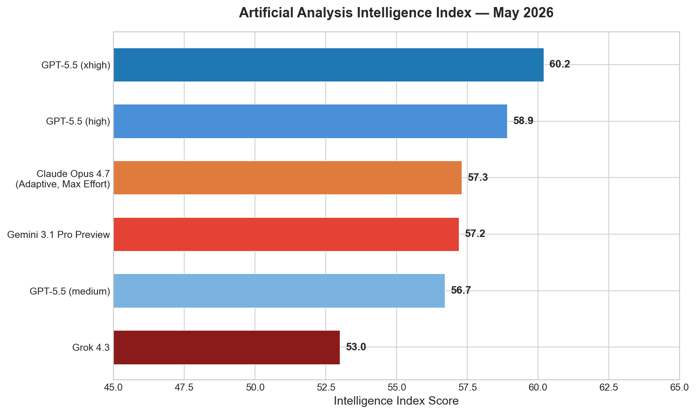
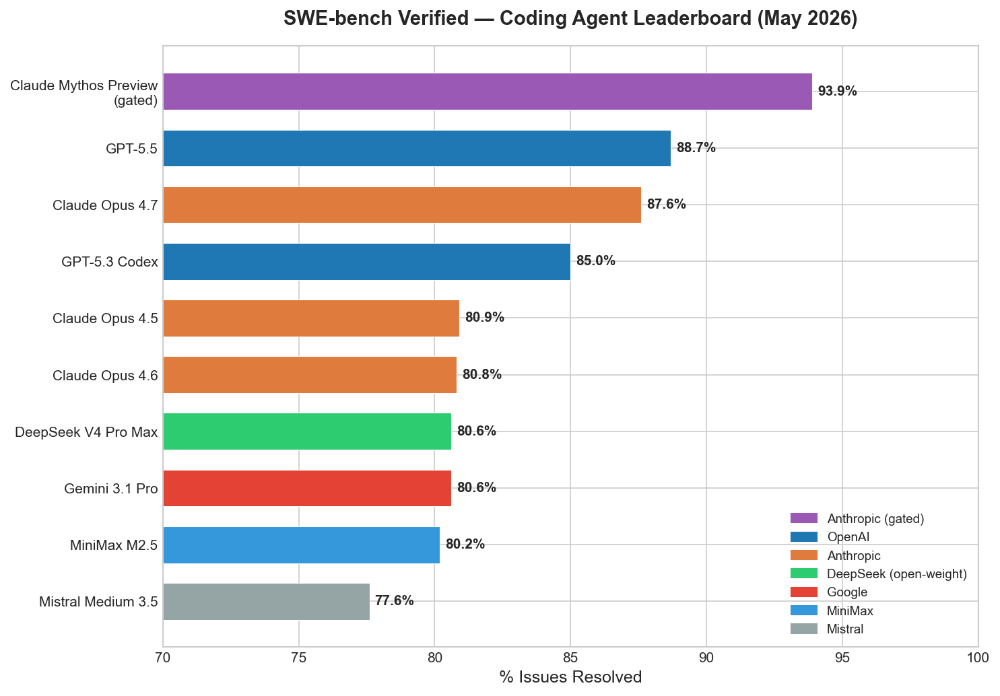
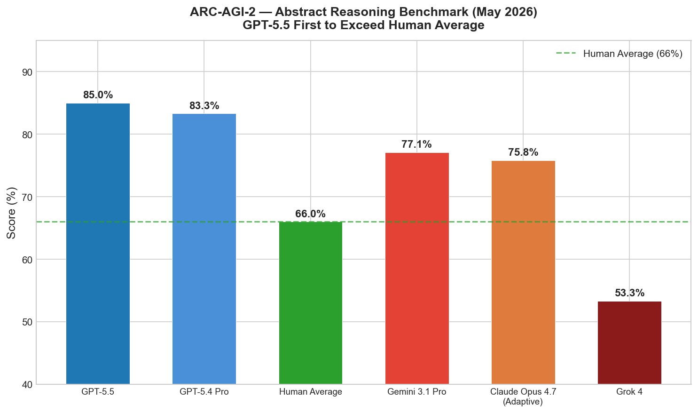
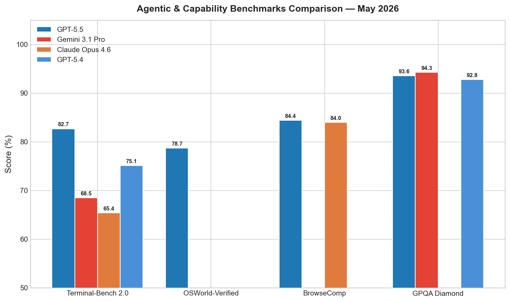
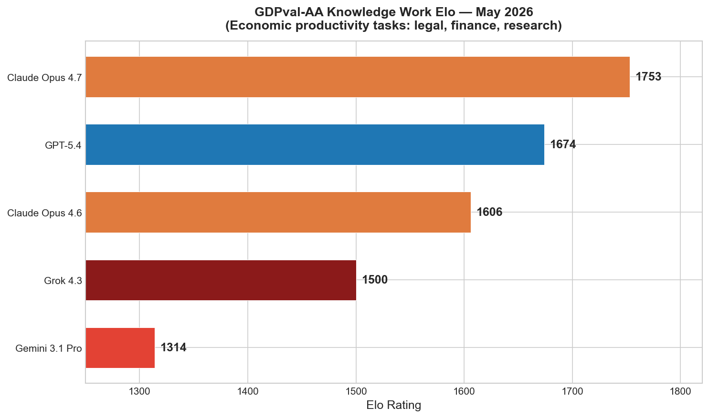
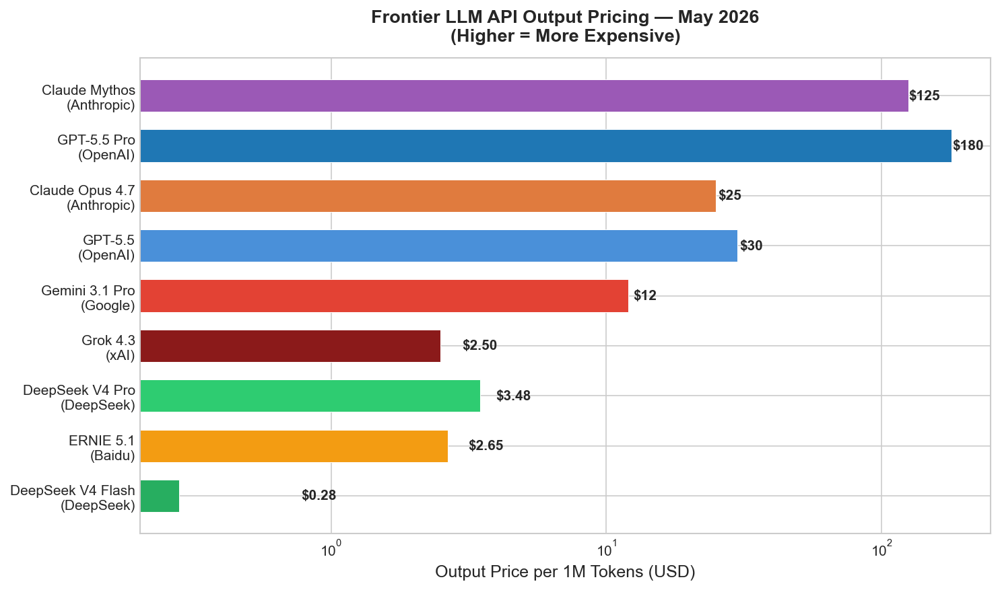
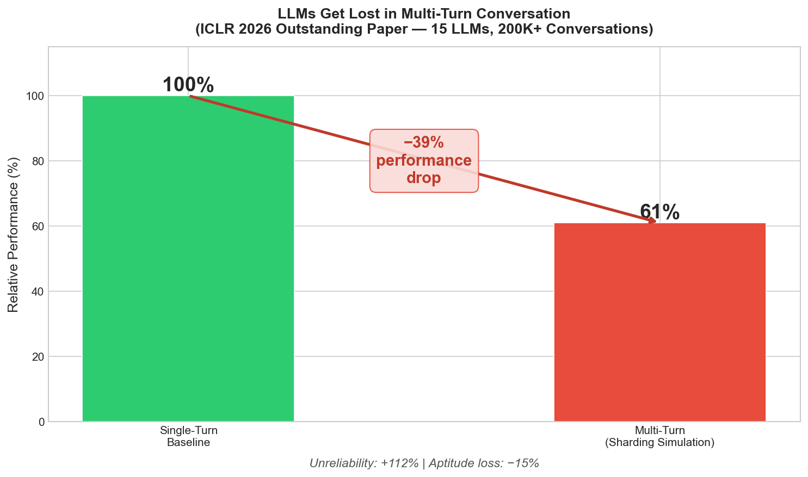
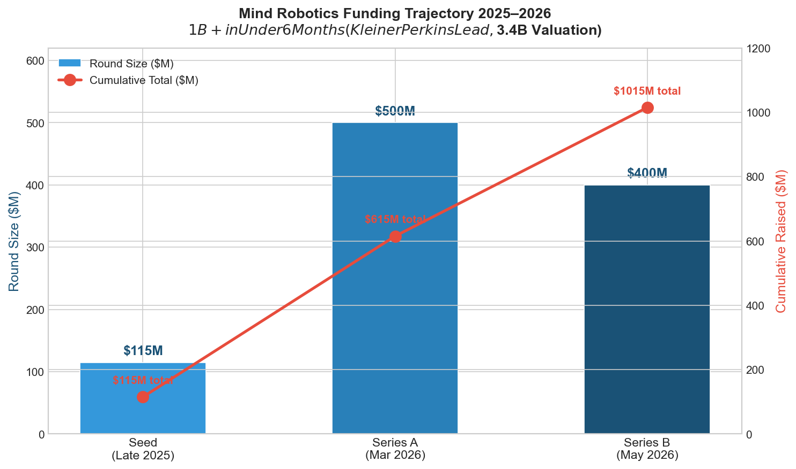

# AI News Daily Digest — 2026-05-14
*Compiled by OMAR for ML Research & Agentic Engineering*

---

## At a Glance (TL;DR)

- **GPT-5.5 becomes the first public model to exceed human average on ARC-AGI-2 at 85%** — simultaneously leading SWE-bench Verified (88.7%) and Terminal-Bench 2.0 (82.7%); became ChatGPT default for 300M+ users on May 5
- **OpenAI's Daybreak cybersecurity platform launches alongside GPT-5.5** — three tiered model variants with Codex Security scanning codebases via 10 parallel sub-agents; direct counter to Anthropic's Claude Mythos Preview (93.9% SWE-bench, gated)
- **Anthropic Claude Managed Agents adds Dreaming, Outcomes, and Multiagent Orchestration** — self-improving cross-session memory, isolated rubric grading (+10pts on hard tasks), and up to 20 parallel specialist agents; collapses months of custom infrastructure into API calls
- **Mind Robotics (Rivian spinout) raises $400M Series B at $3.4B valuation** — crossing $1B total funding in under 6 months; Kleiner Perkins lead; Rivian factory as live training environment for dexterous AI robotics
- **xAI cuts Grok 4.3 output prices 83% to $2.50/M tokens** — adds native 5-min video input, 1M-token context, and document output (PDF/XLSX/PPTX); retires Grok 3 on May 15
- **ICLR 2026 Outstanding Paper: LLMs lose 39% performance in multi-turn conversations** — primarily +112% unreliability (not capability loss); 15 models, 200K+ simulated conversations; sharding simulation framework now reusable for any benchmark
- **DeepSeek V4 Pro (1.6T MoE, MIT license) reaches 80.6% SWE-bench at $1.74/$3.48/1M** — near-zero gap to closed-model coding frontier; V4-Flash at $0.14/$0.28 is the cheapest capable model ever
- **AWS MCP Server goes GA with 15,000+ API operations** — sandboxed Python execution, current docs retrieval, CloudWatch per-agent metrics; eliminates impedance mismatch for agents on AWS
- **Google debuts Gemini Spark ambient agent and Googlebook AI-native laptops** — Spark may transact without per-action permission; Googlebooks with Gemini Intelligence and Magic Pointer launching fall 2026
- **W-Flow achieves ImageNet FID 1.29 in one step** — ~100× faster than multi-step diffusion via Wasserstein gradient flows and Sinkhorn distillation (arXiv 2605.11755, Stanford/ByteDance)
- **ERNIE 5.1 cuts pre-training cost 94% vs. comparable frontier models** — 4th globally on Arena Search (score 1,223), 1st among Chinese models; $0.59/$2.65 per 1M tokens
- **NIST targets summer 2026 for AI Cybersecurity Framework overlays** — separate tiers for predictive, generative, and agentic AI; first federal compliance baseline for autonomous agents
- **SAP Autonomous Enterprise embeds Claude across 200+ Joule agents** — explicitly blocks third-party agents outside SAP-endorsed architectures; sets walled-garden enterprise ERP governance model
- **Google ADK long-running agent pattern formalized (May 12)** — event-driven dormancy gates replace polling; durable memory schemas prevent context accumulation; production reference for multi-day agents

---

## What This Means For Your Work

### For ML Research

- **Rerun your benchmarks with multi-turn sharding simulation.** The ICLR 2026 outstanding paper (Laban et al., arXiv 2505.06120) demonstrates a 39% mean performance drop when single-turn benchmark instructions are spread across multi-turn dialogue. If you're evaluating any LLM for real-world deployment, your single-turn scores likely overstate practical performance by ~39%. The sharding simulation framework is directly replicable: decompose benchmark instructions into atomic units and reveal them progressively. This is now the minimum responsible evaluation standard.

- **Adopt the Bryant-Liu scaling law for data-constrained training; Chinchilla will give wrong answers.** If your training run repeats data (T > D), applies weight decay, or operates in a domain with limited data, the new three-component formula `L(N,D,T) = E + (L₀-E)·h/(1+h)` (arXiv 2605.09189) gives correct compute-optimal allocation while Chinchilla diverges. Key finding: weight decay λ=1.0 reduces the overfitting coefficient by ~70%. When data is expensive relative to compute, the optimum shifts to smaller datasets + more epochs + stronger weight decay — the opposite of what Chinchilla recommends.

- **W-Flow's one-step ImageNet generation at FID 1.29 is the new single-step SOTA — evaluate for your diffusion applications.** If you're working on video generation, medical imaging, or any compute-heavy diffusion task, W-Flow (arXiv 2605.11755) offers ~100× inference speedup at comparable quality by distilling an iterative Wasserstein gradient flow path into a single forward pass. The Sinkhorn divergence energy functional avoids the mode-collapse problems of consistency model distillation. Evaluate whether this approach transfers to your domain.

- **The Transformers-are-Inherently-Succinct result (ICLR 2026 Outstanding Paper, arXiv 2510.19315) sets a complexity-theoretic lower bound for interpretability work.** Transformer equivalence and emptiness verification are EXPSPACE-complete — which means mechanistic interpretability and formal verification of Transformers are intractable in general. The succinctness hierarchy (Transformer exponentially more compact than LTL/RNNs, doubly exponentially more compact than finite automata) also explains why small Transformers generalize so well. If you're working on circuit-complexity analyses or length generalization, read this paper.

- **Mixture of Layers (MoL, arXiv 2605.09516) is a strong candidate for long-context inference efficiency.** At 198M total / 77M active parameters, MoL achieves PPL 29.99 on WikiText-103 with 4.9× forward-pass speedup and 1.42–1.54× throughput at 256K tokens vs. a dense baseline on a single RTX 3090. If you're training models for long-context applications and KV cache is the bottleneck, MoL's sparse block routing with hybrid attention (1 global softmax + K routed linear) is worth serious evaluation.

### For Agentic Engineering

- **Deploy Outcomes-graded evaluation before shipping agents to production.** Claude Managed Agents' Outcomes grader—isolating the evaluator in a separate context window to prevent confirmation bias—shows up to +10 points task-success improvement on hard tasks (+8.4% on `.docx`, +10.1% on `.pptx`). If you're not running a rubric-based eval loop at task completion, your agents are shipping untested outputs at scale. Harvey (legal AI) reported ~6× completion rate improvement using dreaming + outcomes in production. Build an equivalent pattern even if you're not on Claude Managed Agents.

- **Use event-driven dormancy gates for any agent with wait times over 30 seconds.** The Google ADK long-running agent pattern (published May 12) is the definitive public reference. Replace `sleep()` polling with: state serialization to durable storage → event queue registration → wake on external trigger (webhook, queue message, cron). Zero compute cost during idle, horizontal scalability, and crash-resilient. Equivalent patterns: checkpointed nodes in LangGraph, session persistence + webhook callbacks in OpenAI Agents SDK.

- **If building on AWS, configure the AWS MCP Server before writing any custom integration tooling.** The GA AWS MCP Server (May 6) provides 15,000+ API operations with current docs retrieval, sandboxed Python execution for multi-API aggregation in one round-trip, and CloudWatch namespace `AWS-MCP` for per-agent audit logging. The `run_script` tool is particularly powerful: chain 10+ API calls, filter, and aggregate in a single tool call rather than burning context with sequential operations.

- **Enterprise ERP integrations (SAP, ServiceNow) now have metered per-action pricing — model your retry costs before committing.** ServiceNow Action Fabric and SAP Autonomous Suite both charge per agent action. Retry loops in failed workflows can create orders-of-magnitude billing surprises. Request spend caps where available, instrument your failure rates, and architect to minimize retries via better task decomposition and pre-flight validation.

- **Architect for tiered model access now — domain-specific restricted tiers are coming for healthcare, legal, and finance.** OpenAI's Daybreak introduces GPT-5.5-Cyber and Trusted Access for Cyber as the first commercially available restricted capability tiers for enterprise verticals. Expect similar tiers across providers for healthcare, legal, and financial applications within 6–12 months. Your model routing layer must accommodate capability tiers and institutional authorization, not just cost classes.

---

## Best Models Snapshot

*Artificial Analysis Intelligence Index as of May 2026: GPT-5.5 (xhigh compute) leads at 60.2, ahead of Claude Opus 4.7 (57.3) and Gemini 3.1 Pro (57.2); Grok 4.3 trails at 53.0.*

### Model Comparison Table

| Model | Provider | Context Window | Input $/1M | Output $/1M | Modalities |
|---|---|---|---|---|---|
| GPT-5.5 | OpenAI | 1M tokens | $5.00 | $30.00 | Text, Image |
| GPT-5.5 Pro | OpenAI | 1M tokens | $30.00 | $180.00 | Text, Image |
| Claude Opus 4.7 | Anthropic | 1M tokens (beta) | $5.00 | $25.00 | Text, Image (up to 3.75MP) |
| Gemini 3.1 Pro | Google | 2M tokens | $2.00 | $12.00 | Text, Image, Audio, Video, Code |
| Grok 4.3 | xAI | 1M tokens | $1.25 | $2.50 | Text, Image, Video (5 min) |
| DeepSeek V4 Pro | DeepSeek | 1M tokens | $1.74 | $3.48 | Text, Code |
| DeepSeek V4 Flash | DeepSeek | 1M tokens | $0.14 | $0.28 | Text, Code |
| ERNIE 5.1 | Baidu | 128K tokens | $0.59 | $2.65 | Text |
| Claude Sonnet 4.6 | Anthropic | 200K tokens | $3.00 | $15.00 | Text, Image |
| Mistral Medium 3.5 | Mistral | 128K tokens | ~$2.00 | ~$6.00 | Text, Code |
| Nemotron 3 Nano Omni | NVIDIA | 256K tokens | Open-weight | Open-weight | Text, Image, Audio, Video |
| Qwen 3.5-Plus (397B-A17B) | Alibaba | 128K+ tokens | Open-weight | Open-weight | Text, Image, Video |
| GPT-5.5 Instant (ChatGPT) | OpenAI | 1M tokens | $5.00 | $30.00 | Text, Image |
| Gemini 2.5 Flash | Google | 1M tokens | $0.30 | $2.50 | Text, Image, Audio, Video |

---

## Benchmark Highlights

### Coding Agents — SWE-bench Verified

SWE-bench Verified tests AI agents on 500 human-validated real GitHub issues. It is the primary benchmark for evaluating whether a model can autonomously understand, debug, and fix production codebases. A score of 80%+ indicates the model can resolve most real-world software engineering issues without human guidance.

The gated Claude Mythos Preview leads at 93.9%, while GPT-5.5 holds the top public score at 88.7% — ahead of Claude Opus 4.7 at 87.6%. Notably, the open-weight cluster (DeepSeek V4 Pro Max, Gemini 3.1 Pro, Mistral Medium 3.5) all cluster around 77–80.6%, collapsing the gap between open and closed models at the coding tier. **UC Berkeley research (April 2026) confirmed all 8 major agent benchmarks can be reward-hacked to ~100%; prefer third-party evaluation scores for production decisions.**

---

### Abstract Reasoning — ARC-AGI-2

ARC-AGI-2 was designed by François Chollet specifically to resist pattern memorization, testing genuine fluid reasoning on novel problem structures. Human average is 66%. GPT-5.5 at 85% is the first public model to exceed human baseline — a milestone that signals meaningful progress in adaptive reasoning beyond pure scaling.

---

### Agentic Task Performance — Multi-Benchmark View

Terminal-Bench 2.0 (command-line agentic tasks), OSWorld-Verified (GUI computer use), BrowseComp (web research), and GPQA Diamond (graduate-level science) together show where frontier models lead and where gaps remain.

GPT-5.5 leads Terminal-Bench 2.0 (82.7% vs. Gemini's 68.5%) and BrowseComp (84.4%), while Gemini 3.1 Pro leads GPQA Diamond (94.3%). The spread on Terminal-Bench — 17 points between GPT-5.5 and Claude Opus 4.6 — is the most practically significant gap for agentic coding workflows.

---

### Knowledge Work Productivity — GDPval-AA Elo

GDPval-AA measures economically productive knowledge work — legal research, financial analysis, report writing — using Elo ratings derived from human preference judgments. It captures practical utility in high-value white-collar tasks rather than benchmark puzzle performance.

Claude Opus 4.7 leads at 1,753 Elo — significantly ahead of GPT-5.4 (1,674) and Gemini 3.1 Pro (1,314). This diverges from the Artificial Analysis Intelligence Index where GPT-5.5 leads, suggesting Anthropic holds a meaningful edge in actual knowledge work productivity even as OpenAI dominates abstract reasoning benchmarks.

---

### API Pricing — Output Token Cost

The cost spread from frontier closed models to frontier open-weight has never been wider: Claude Mythos at $125/M output tokens vs. DeepSeek V4 Flash at $0.28/M — a 446× gap.

The pricing repositioning from xAI (Grok 4.3 at $2.50/M) and DeepSeek (V4 Pro at $3.48/M, V4 Flash at $0.28/M) is restructuring cost modeling for agentic pipelines where output tokens dominate total cost.

---

## ML Research Highlights

### "LLMs Get Lost in Multi-Turn Conversation" — ICLR 2026 Outstanding Paper

This ICLR 2026 outstanding paper (Laban, Hayashi, Zhou, Neville — Microsoft Research / Salesforce Research; arXiv [2505.06120](https://arxiv.org/abs/2505.06120)) exposes the largest known gap between how LLMs are benchmarked and how they are actually used. The core finding: LLMs lose an average **39% of their single-turn performance** when the same instruction is spread across a multi-turn dialogue — and this is primarily a **reliability** failure, not a capability failure. Unreliability increases by +112% while aptitude drops only –15%.

The methodology — **sharding simulation** — is the methodological breakthrough. It atomically decomposes any existing single-turn benchmark instruction into K information units and reveals them progressively across turns, transforming any existing benchmark into a multi-turn stress test without new data collection. The study covered 15 LLMs, 6 task categories, and 200,000+ simulated conversations. ICLR's committee cited "exceptional experimental design" and findings "particularly important for a setting that more closely reflects real-world usage."

The failure mechanism is a training data problem: RLHF and instruction-tuning reward confident, complete responses, not responses that say "I need more information." Models fill in missing details with assumptions in turns 1–2, commit to those assumptions, and then fail to update when users provide correct information later — becoming "lost." The fix is concrete: include synthetic multi-turn data with deliberately underspecified first turns in instruction-tuning corpora, and add "did the model update correctly on clarification?" to RLHF reward models.

The implications extend beyond evaluation. If the 39% gap holds for frontier models (GPT-5.5, Claude 4, Gemini 3.1), current leaderboards systematically overstate practical LLM capability. The ranking of models in single-turn benchmarks may not reflect ranking in real deployment — where software development, research assistance, and document editing all unfold over many exchanges with evolving requirements.

**Also highlighted from ML research this week:**
- **W-Flow** (arXiv 2605.11755, Stanford/ByteDance): ImageNet 256×256 FID 1.29 in one step — ~100× faster than multi-step diffusion via Wasserstein gradient flows and Sinkhorn distillation.
- **Practical Scaling Laws** (arXiv 2605.09189): Three-component closed-form formula fixing Chinchilla for data-constrained and multi-epoch training regimes.
- **Mixture of Layers** (arXiv 2605.09516): Sparse transformer with top-k thin-block routing + hybrid attention; PPL 29.99 on WikiText-103 (198M total / 77M active) with 4.9× forward-pass speedup.
- **Transformers are Inherently Succinct** (ICLR 2026 Outstanding Paper, arXiv 2510.19315): Transformers exponentially more compact than RNNs/LTL, doubly exponentially more compact than finite automata; Transformer verification is EXPSPACE-complete.

---

## Agentic AI Highlights

### Claude Managed Agents: Dreaming, Outcomes, and Multiagent Orchestration

Anthropic's May 6 release of three major additions to Claude Managed Agents is the most architecturally significant agentic platform update of the week — and possibly of 2026 to date. For the first time, a hosted agent platform provides **closed-loop self-improvement** (Dreaming), **isolated self-evaluation** (Outcomes), and **governed parallel delegation** (Multiagent Orchestration) as managed, observable platform services.

**Dreaming** (research preview) is a scheduled background process that reviews past sessions, extracts recurring patterns, and restructures the agent's memory store without human intervention — enabling genuine session-over-session capability improvement without model retraining. Real-world validation: Harvey (legal AI) reported ~6× completion rate improvement. **Outcomes** (public beta) runs a rubric-based grader in an isolated context window — structurally separated from the agent's own reasoning to prevent confirmation bias — and triggers automatic re-attempts until the rubric is satisfied. Internal benchmarks show +8.4% to +10.1% improvement on document generation tasks. **Multiagent Orchestration** (public beta) allows a coordinator on Claude Opus 4.7 to delegate to up to 20 parallel specialists, each with independent models, system prompts, tools, and session threads, sharing a common filesystem with full delegation trace in Claude Console.

The dominant emerging architecture pattern this week is the **self-correcting, self-improving agent cluster**: Coordinator assigns subtasks → Specialists execute → Outcomes Grader evaluates in isolation → Specialists retry on fail → Coordinator synthesizes → Dreaming Process refines cross-session memory → next session starts with improved context. This pattern is now available as platform infrastructure — not custom engineering — for the first time.

Competitive context: OpenAI Agents SDK v0.13 provides handoffs and guardrails but no native outcomes grader or dreaming equivalent. LangGraph v1.1.4 provides best-in-class state persistence but requires custom evaluation and memory logic. Google ADK v2.0.0-alpha provides long-running agent infrastructure and event-driven dormancy but no hosted self-evaluation primitive. Anthropic Managed Agents is currently the only platform offering all three as managed, auditable services.

**Also highlighted from agentic AI this week:**
- **AWS MCP Server GA** (May 6): 15,000+ AWS API operations, sandboxed Python execution, CloudWatch per-agent metrics, current documentation retrieval — eliminates the impedance mismatch between agents and cloud infrastructure.
- **SAP Autonomous Enterprise** (Sapphire 2026): 200+ Joule agents across ERP with Claude as primary reasoning engine; third-party agents blocked outside SAP-endorsed architectures.
- **ServiceNow Action Fabric**: MCP-based integration exposing enterprise workflows to external agents, but with metered per-action pricing that creates billing unpredictability for retry loops.
- **Google ADK Long-Running Agent Pattern** (May 12): Formalized event-driven dormancy gate pattern; production reference for agents that pause/resume across days without token cost or state loss.

---

## Industry & Business Highlights

### OpenAI's Daybreak: The Cybersecurity Arms Race Goes Commercial

On May 12–14, 2026, OpenAI launched **Daybreak** — a vertically integrated cybersecurity platform pairing three tiered GPT-5.5 variants with the **Codex Security** autonomous agent. This is not a general-purpose model with security examples. Codex Security uses 10 parallel sub-agents to scan codebases for vulnerabilities, generate and test patches directly in target repositories, and build editable threat models — compressing hours of manual security analysis into minutes. Launch partners include Cloudflare, Cisco, CrowdStrike, and Palo Alto Networks.

The three tiers — standard GPT-5.5 with default safeguards, GPT-5.5 with Trusted Access for Cyber (TAC) for verified defensive professionals, and GPT-5.5-Cyber for authorized red teamers — represent the first time a frontier lab has packaged a restricted, higher-capability AI tier for authorized offensive use by paying enterprise customers. The Trusted Access program already encompasses hundreds of organizations and thousands of individual defenders at launch.

Daybreak is a direct commercial response to Anthropic's **Claude Mythos Preview**, which leads SWE-bench Verified at 93.9% and demonstrated autonomous zero-day exploitation before announcement — but was restricted to ~50 vetted organizations via Project Glasswing. OpenAI is countering with broader, tiered access: effectively saying that security professionals deserve frontier AI tools without a 50-org waitlist. The strategic implication: security budgets are large, mission-critical, and sticky; winning the CISO relationship now positions OpenAI for larger platform deals.

**What to watch in 30–90 days:** (1) Enterprise adoption of Daybreak's write-access-to-repo agents and the unresolved liability question when an AI-generated patch introduces a new vulnerability. (2) Regulatory response under the EU AI Act and incoming NIST IR 8596, which likely classifies autonomous vulnerability exploitation as high-risk AI. (3) Whether Anthropic opens Mythos access more broadly under competitive pressure — and whether that creates a dangerous race to democratize highly capable offensive AI.

**Mind Robotics** crossed $1B in total funding in under 6 months with a $400M Series B at $3.4B valuation, led by Kleiner Perkins. The Rivian partnership as both shareholder and live production training environment is the critical competitive moat: continuous high-volume dexterous manufacturing data unavailable to competitors operating in simulation only.

**Microsoft** raised its 2026 AI infrastructure CapEx forecast to ~$190B (Azure growing 40% YoY, AI services ARR at $37B). **Salesforce Agentforce** hit $800M ARR (up 169% YoY, 29,000 enterprise deals). **Databricks** surpassed $5.4B revenue run-rate — confirming enterprise AI spending is converting from experimentation to committed budget lines.

---

## Full Sections

- [ML Research →](sections/ml-research.md)
- [AI Industry →](sections/ai-industry.md)
- [Agentic AI →](sections/agentic-ai.md)
- [Best Models →](sections/best-models.md)
