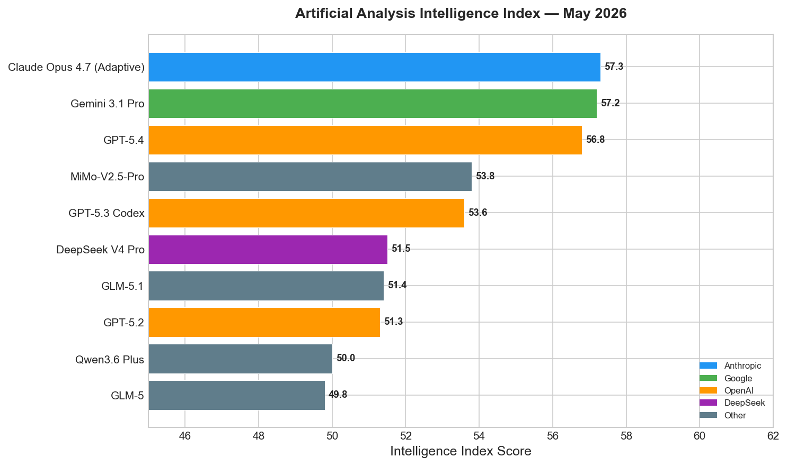
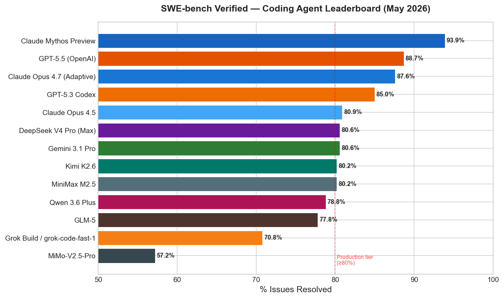
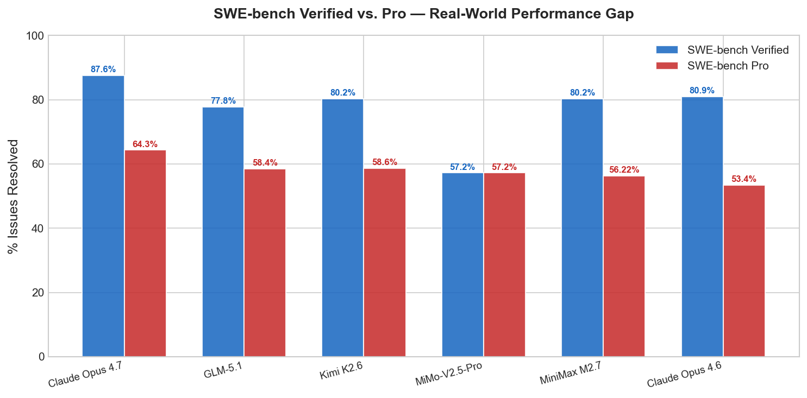
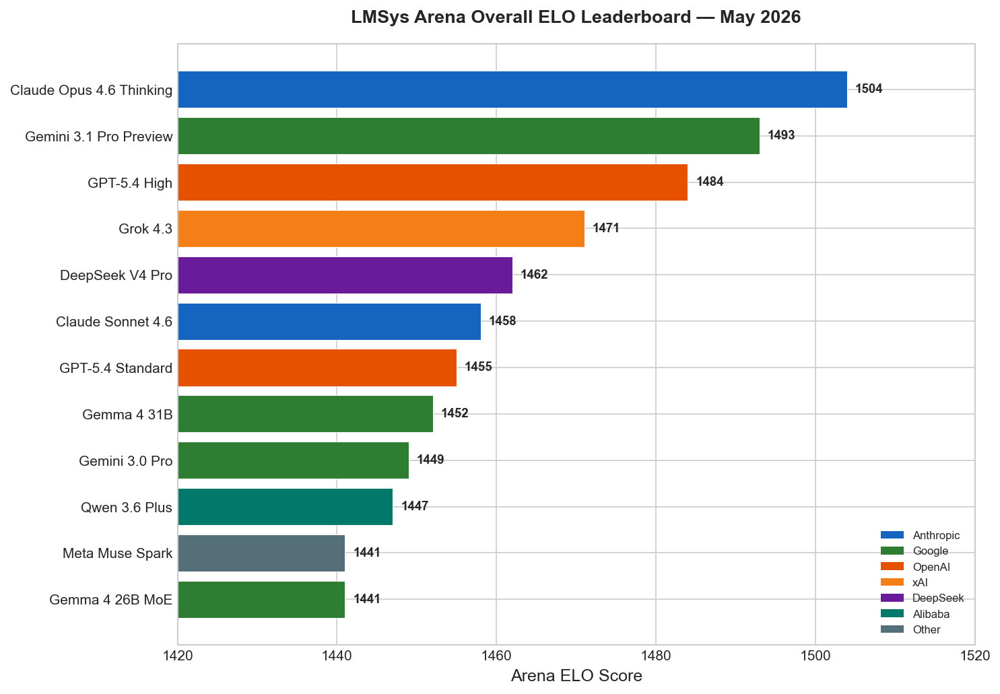
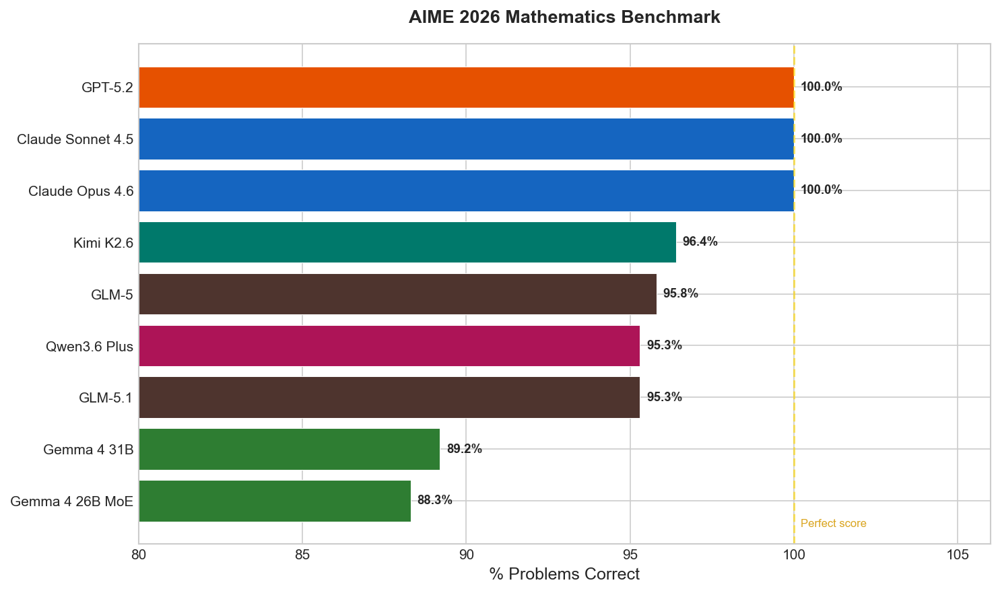
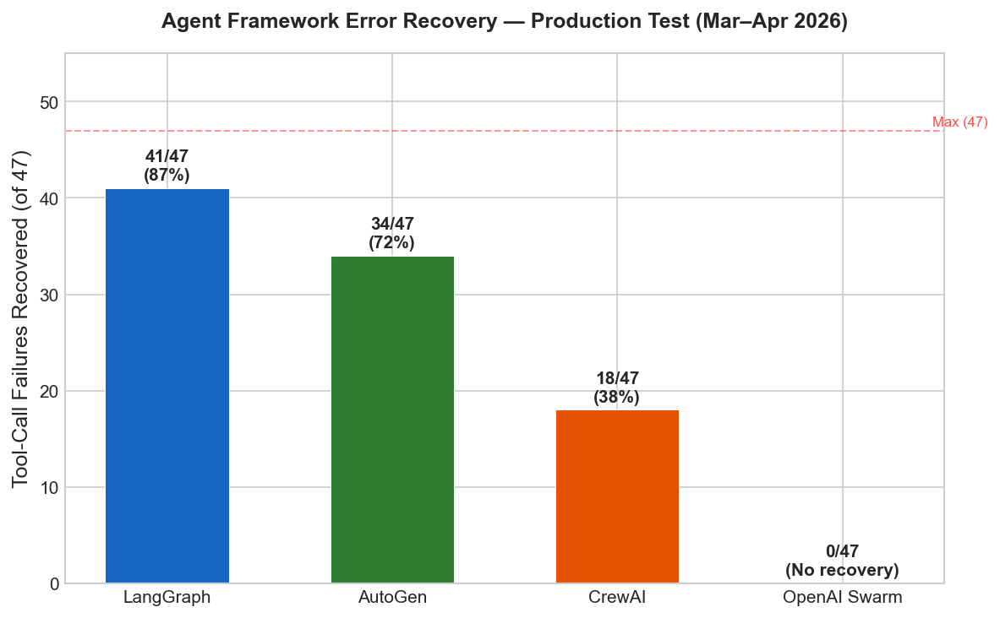
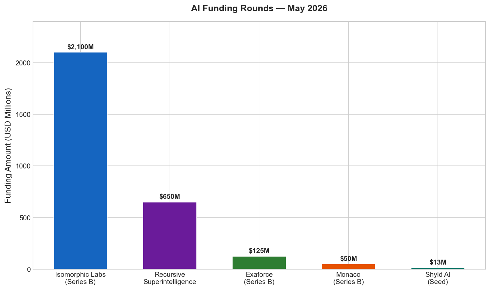
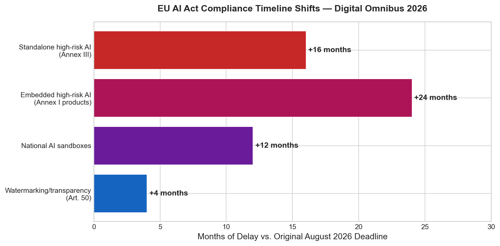

# AI News Daily Digest — 2026-05-15
*Compiled by OMAR for ML Research & Agentic Engineering*

---

## At a Glance (TL;DR)

- **G-Zero (arXiv 2605.09959) enables verifier-free LLM self-improvement** using Hint-δ intrinsic reward — the first provably-grounded framework for open-ended tasks, no external judge required; could unlock continuous self-improvement at deployment
- **Parcae achieves 1.3B Transformer quality with a 770M looped model** — first stable looped-LM scaling laws; 770M Parcae ≈ 1.3B Transformer, +2.99 pts CORE benchmark, 6.3% lower perplexity
- **Anthropic + PwC dramatically expand partnership**: 30,000 professionals certified on Claude; up to 70% delivery time reduction already live across insurance, cybersecurity, and software engineering; Claude Code + Cowork rolling out globally
- **Isomorphic Labs closes $2.1B Series B** — second-largest biotech round ever; AlphaFold-based drug design engine targeting first clinical trials by end of 2026; UK Sovereign AI Fund and Abu Dhabi's MGX among investors
- **Recursive Superintelligence exits stealth at $4.65B valuation on $650M** with <30 employees; GV, Greycroft, Nvidia, AMD back self-improving AI thesis aimed at automating scientific discovery
- **xAI Grok Build enters early beta** — 8 parallel subagents in isolated worktrees, 70.8% SWE-bench Verified, local-first (no cloud execution); completes the set of top-5 lab terminal coding agents
- **Experian + ServiceNow embed certified decisioning natively into agentic workflows** — resolves the data-trust bottleneck blocking 8 in 10 organizations from scaling agentic AI in regulated industries
- **Claude Agent SDK v0.1.74 ships hook event streaming, deferred tool use, and strict MCP config** — provides production security primitives: observable tool decisions, non-blocking HITL, CVE-2025-6514 mitigation
- **EU rewrites AI Act via Digital Omnibus (May 7)**: standalone high-risk AI delayed 16 months to Dec 2027; embedded high-risk AI delayed 24 months to Aug 2028; SME relief for firms under 750 employees
- **US-China AI safety protocol agreed at Trump-Xi Beijing summit** — bilateral dialogue on frontier model guardrails; Jensen Huang joined Trump delegation in parallel H200 chip access talks
- **ICML 2026 accepted 6,352 from 23,918 submissions (26.6%)** — PFlowNet sets new SOTA 90.6% V* Bench (ICML 2026 accepted); D-VLA achieves linear node-scaling for trillion-parameter VLA RL training
- **Gemma 4 31B reaches #3 Arena AI under Apache 2.0** — first Google open model with unrestricted commercial use at top-10 quality; AIME 2026 89.2%, LiveCodeBench 80.0%
- **SWE-bench Pro reveals 24-point real-world gap**: Claude Opus 4.7 drops from 87.6% (Verified) to 64.3% (Pro) — benchmark Verified scores no longer sufficient for production readiness assessment
- **LangSmith Fleet + LLM Gateway establish inline governance as the 2026 production standard** — inline PII detection, spend enforcement, HITL Inbox; validated in pharma (Axtria GxP compliance)

---

## What This Means For Your Work

### For ML Research

- **Read G-Zero (arXiv 2605.09959) before your next RLHF or self-improvement project.** The Hint-δ intrinsic reward — measuring KL divergence between hinted and unassisted model responses — opens RL-based self-improvement to arbitrary natural language tasks beyond math/code. The theoretical coverage + noise conditions on the guarantee are non-trivial; understanding them will help you assess whether your domain satisfies them. The co-evolutionary Proposer/Generator architecture is implementable today without special infrastructure.

- **Run InfoLaw (arXiv 2605.02364) before your next pretraining data recipe sweep.** InfoLaw predicts pretraining loss with 0.15% mean absolute error across unseen data recipes and confirms that scarce target data can be safely repeated 15–20× in a mixture (vs. the prior 4× ceiling). This means you may have significantly more flexibility than assumed — and you can query the InfoLaw predictor to find optimal recipes without expensive ablations. Pair with the Scaling Laws for Mixture Pretraining (arXiv 2605.12715) for full coverage of the data-mixture landscape.

- **If you work on VLA or embodied AI: D-VLA (arXiv 2605.13276) is the infrastructure paper of the week.** Plane Decoupling + Swimlane Pipeline eliminate the serialization bottleneck between environment simulation and gradient computation, achieving linear node-scaling at trillion-parameter scale. If your VLA pipeline serializes sim and grad computation today, you are leaving throughput on the table — review D-VLA's system design before your next large-scale run.

- **Parcae (arXiv 2604.12946) makes looped models a serious alternative to distillation for edge deployment.** The spectral norm constraint (negative diagonal reparameterization) is a simple fix, and the new scaling laws give you principled compute budget allocation. A 770M Parcae matches a 1.3B standard Transformer — if you have a compute-constrained deployment environment, looped models are now validated at scale. The Together AI blog post has practical training setup details.

- **PFlowNet (arXiv 2605.02730, ICML 2026) reveals a counterintuitive insight for multimodal training**: the most geometrically precise expert annotations (DINO/SAM) hurt visual reasoning via "tunnel vision effect." Before blindly upcycling detection/segmentation annotations as VRL supervision, read PFlowNet and consider vicinal geometric shaping + multi-dimensional reward mixing as a better route.

### For Agentic Engineering

- **Adopt LangSmith Fleet + LLM Gateway now for any production agent deployment.** The LLM Gateway's inline PII/secrets detection and spend enforcement is now required by several financial services compliance frameworks — post-hoc audit logging is not sufficient. The HITL Inbox pattern in Fleet formalizes pause-queue-review-resume as a managed service, not custom middleware. The Axtria pharma GxP deployment is the reference architecture for regulated verticals. One-line adoption via `base_url` swap.

- **Update to Claude Agent SDK v0.1.74 immediately if you're on the Anthropic stack.** `strict_mcp_config` prevents runtime MCP server injection (CVE-2025-6514, CVSS 9.6 attack class). `include_hook_events` lets external monitoring observe every tool permission decision in real time. `"defer"` hook decision enables non-blocking HITL — intercept, queue, replay with modified arguments without stalling parallel tool calls. These were custom middleware requirements before v0.1.74.

- **Use SWE-bench Pro scores — not Verified — when evaluating coding agents for production.** Claude Opus 4.7's drop from 87.6% (Verified) to 64.3% (Pro) is the most important calibration signal this week. For teams running high-volume automated PR workflows, Kimi K2.6 at 80.2% SWE-bench Verified / $0.95 per 1M input tokens delivers within 8 points of Claude Opus 4.7 at 1/6th the output cost — use it for batch workflows, reserve Opus for high-stakes tasks.

- **If building agents for regulated industries, the Experian-ServiceNow Certified Data Capability Injection pattern is the template.** Work with your enterprise platform vendor to pre-register regulated data providers as native skills with built-in audit trails. Calling external data sources as generic tool calls cannot satisfy the chain-of-custody documentation regulators require for autonomous decisions. The pattern collapses multi-step API integration into a single certified skill invocation with provenance tracking included.

- **For new multi-agent system builds: implement A2A v1.0 signed Agent Cards + MCP v2 OAuth 2.1 from day one.** The joint MCP/A2A specification under Linux Foundation governance is planned for Q3 2026 and will likely become mandatory for enterprise procurement. Signed Agent Cards prevent spoofing attacks; `strict_mcp_config` locks the MCP server set. Don't build with the old unsigned card pattern and retrofit later.

---

## Best Models Snapshot

*Artificial Analysis Intelligence Index as of May 2026: Claude Opus 4.7 (Adaptive) leads at 57.3, with Gemini 3.1 Pro and GPT-5.4 within 0.5 points — effectively a three-way tie at the frontier.*

### Model Comparison Table

| Model | Provider | Context Window | Input $/1M | Output $/1M | Modalities |
|---|---|---|---|---|---|
| Claude Opus 4.7 | Anthropic | 1M tokens | $5.00 | $25.00 | Text, Image |
| GPT-5.5 | OpenAI | 1.05M tokens | $5.00 | $30.00 | Text, Image, Audio, Code, Computer Use |
| Gemini 3.1 Pro | Google | 2.0M tokens | $2.00 | $12.00 | Text, Audio, Image, Video, Code |
| Kimi K2.6 | Moonshot AI | 262K tokens | $0.95 | $4.00 | Text, Image, Video |
| MiMo-V2.5-Pro | Xiaomi | 1M tokens | $1.00 | $3.00 | Text, Image, Audio, Video |
| GLM-5.1 | Z.AI | 200K tokens | $1.40 | $4.40 | Text, Code |
| DeepSeek V4 Pro | DeepSeek | 1M tokens | $1.74 ($0.44 promo) | $3.48 ($0.87 promo) | Text, Code |
| Qwen 3.6 Plus | Alibaba | 1M tokens | ~$0.40 | ~$2.40 | Text, Code, Image |
| Qwen 3.5 Plus | Alibaba | 1M tokens | $0.40 | $2.40 | Text, Code |
| Gemma 4 31B | Google (self-host) | 128K+ | Free (Apache 2.0) | Free | Text, Audio, Image, Video |
| Gemma 4 26B MoE | Google (self-host) | 128K+ | Free (Apache 2.0) | Free | Text, Audio, Image, Video |
| Llama 4 Maverick | Meta (self-host / API) | 1M tokens | $0.27 | $0.85 | Text, Image |
| Llama 4 Scout | Meta (self-host / API) | 10M tokens | $0.08 | $0.30 | Text, Image |
| GLM-5 | Z.AI | 200K tokens | $1.40 | $4.40 | Text, Code |
| MiniMax M2.5 | MiniMax | — | ~$1.00/hr (100 tok/s) | — | Text, Code |

---

## Benchmark Highlights

### Coding Agents — SWE-bench Verified

The canonical coding agent benchmark continues to compress at the top: GPT-5.5 (88.7%) and Claude Opus 4.7 (87.6%) are within noise margin, while a 6-model cluster sits at 80–81% (Claude Opus 4.5, DeepSeek V4 Pro, Gemini 3.1 Pro, Kimi K2.6). The unreported Claude Mythos Preview (93.9%) is a preview model not yet generally available.

---

### Coding Agents — Verified vs. Pro Performance Gap

The most important calibration this week: SWE-bench Pro (enterprise-scale codebases) exposes a 20–24 point drop vs. Verified for most frontier models. Claude Opus 4.7 leads Pro at 64.3%, but that is a 23-point gap from its Verified score. Use Pro scores for production estimates.

---

### Overall Model Quality — Arena ELO

The LMSys human-preference Arena remains the gold standard for overall model quality. Claude Opus 4.6 Thinking leads at 1504 ELO, with Gemini 3.1 Pro Preview at 1493 and GPT-5.4 High at 1484. Notably, Gemma 4 31B (Apache 2.0, open-weight) sits at 1452 — #5 overall, ahead of many closed frontier models.

---

### Mathematics — AIME 2026

AIME 2026 is effectively saturated at the frontier: GPT-5.2, Claude Opus 4.6, and Claude Sonnet 4.5 all achieve 100%. Kimi K2.6 (open-weight, Modified MIT) reaches 96.4%. Gemma 4 31B (Apache 2.0) achieves 89.2% — remarkable for a self-hosted open model. GPQA Diamond (94.3% Gemini 3.1 Pro) and ARC-AGI-2 (85% GPT-5.5) remain the most differentiating held-out benchmarks.

---

### Agent Framework Reliability

In the March–April 2026 production test on 50 real GitHub issues, LangGraph recovered 41/47 tool-call failures (87%), more than double AutoGen (34/47, 72%). CrewAI recovered 18/47 (38%). OpenAI Swarm recovered 0/47 — it has no built-in error recovery. For production workflows where reliability matters, LangGraph is the clear default choice.

---

### AI Funding — May 2026

May 2026 brought two marquee raises: Isomorphic Labs ($2.1B Series B, second-largest biotech round ever) and Recursive Superintelligence ($650M, $4.65B valuation, <30 employees). National sovereign wealth funds (UK, Abu Dhabi) are now treating AI-native biotech as strategic infrastructure.

---

### EU AI Act Compliance — Digital Omnibus Delays

The May 7 Digital Omnibus agreement materially rewrites the EU AI Act compliance timeline. Standalone high-risk AI systems gain 16 months (to December 2027); embedded high-risk AI gains 24 months (to August 2028). SME relief is significant for teams under 750 employees / €150M revenue.

---

## ML Research Highlights

### G-Zero: The First Verifier-Free Self-Play Framework with Provable Self-Improvement Guarantees

G-Zero (arXiv 2605.09959) is the most important theoretical advance in ML research this week. Every prior LLM self-improvement method requires either external verifiers (code execution, math checkers), human labels, or LLM-as-judge — each with fundamental ceiling problems. G-Zero breaks this with a framework that works on *any* generation task, has provable convergence properties, and is fully self-contained. If it scales, it represents a path to LLM self-improvement that doesn't bottleneck on humans or task-specific verifiers.

The framework operates through a three-phase co-evolution cycle. A **Proposer** model (trained via GRPO) generates challenging queries paired with informative hints that target the Generator's demonstrated blind spots. For each query-hint pair, an unassisted response is compared to a hint-conditioned response; the predictive shift δ — measured as KL divergence between the two response distributions — serves as the reward signal without any external judge. The **Generator** is then trained via DPO to internalize hint-induced improvements so that at test time it can produce better responses without any hint. This alternates: a better Generator forces the Proposer to find harder blind spots.

The key theoretical result is a best-iterate suboptimality guarantee for an idealized DPO variant of G-Zero, provided the Proposer achieves sufficient exploration coverage and data filtration keeps pseudo-label noise low. The guarantee bounds suboptimality as `O(σ_noise / √T_DPO + 1/√|D_challenge|)` — improving with more DPO steps and more challenge data. This is the first provable guarantee for open-domain LLM self-improvement without an external oracle.

G-Zero sits at the intersection of two major arcs in ML research: the push toward self-improving AI systems without constant human feedback, and the recognition that most real-world tasks are not verifiable. Combined with growing compute budgets for inference-time scaling, this could enable LLMs to improve continuously on deployed tasks without labeling infrastructure — with implications across creative writing, scientific reasoning, education, and customer service.

---

### Parcae: Looped Language Models — New Architecture Frontier

Parcae (arXiv 2604.12946, Sandy Research + Together AI) solves the long-standing training instability problem for looped language models by mathematically analyzing looping as a nonlinear time-variant dynamical system. The instability root cause is large spectral norms in the "injection parameters" that re-enter activations each loop — the fix is elegantly simple: constrain spectral norm via discretizing a negative diagonal parameterization.

With stability solved, the first scaling laws for looped models show that compute-optimal training requires jointly scaling loop count and data for a fixed FLOP budget. At test time, looped models scale predictably via a saturating exponential decay — more quality by running more loops without retraining. The empirical result: a 770M-parameter Parcae matches a 1.3B standard Transformer trained on the same data, with +2.99 CORE benchmark points and 6.3% lower validation perplexity vs. prior looped SOTA at 1.3B scale.

---

## Agentic AI Highlights

### Experian + ServiceNow: Trusted Data as a First-Class Agentic Primitive

The Experian-ServiceNow partnership announced May 15 is the most architecturally significant agentic development of the day because it resolves the data-trust bottleneck that has limited agentic AI to low-stakes tasks in regulated industries. The partnership embeds Experian's certified credit, fraud, identity, and regulatory decisioning models directly into the ServiceNow AI Platform runtime — enabling autonomous agents to invoke verified data sources inline, without human handoff, without leaving the workflow, and with full auditability.

This introduces a new enterprise-agentic pattern: **Certified Data Capability Injection**. Instead of an agent calling external data as a tool (with associated auth/latency/audit complexity), a certified data provider's models are pre-authorized, pre-authenticated, and pre-registered as native skills in the agent runtime. The agent invokes them identically to any other skill, but the runtime handles provenance tracking, rate limiting, compliance logging, and billing transparently. This collapses a multi-step integration into a single certified skill invocation with chain-of-custody documentation.

The production implications are significant for financial services, insurance, and healthcare — exactly the sectors where agentic AI has been stuck in supervised pilots because regulatory data provenance requirements couldn't be met. The ecosystem signal is clear: specialized data providers (Bloomberg, LexisNexis, clinical data networks) will face pressure to build similar native integrations, as the old "expose an API" model cannot satisfy the governance and observability requirements regulated agentic workloads impose.

---

### xAI Grok Build — Parallel Subagent Architecture and Local-First Privacy

Grok Build (early beta, May 14) makes xAI the last top-5 lab to field a terminal-native coding agent, directly competing with Claude Code, OpenAI Codex CLI, Gemini CLI, and Kimi Code. The 8-parallel-subagents-in-isolated-worktrees architecture addresses a specific pain point no competitor has fully resolved: the combination of parallelism *and* local-first execution (no cloud backend, credentials never transmitted). At 70.8% SWE-bench Verified, it's in the competitive bracket below the Opus/GPT-5 tier but functional for production use. The upcoming Arena Mode — multiple agents competing on the same task with algorithmic ranking — will introduce diversity-of-approach as a first-class correctness mechanism.

---

## Industry & Business Highlights

### Anthropic's Enterprise Playbook: From API Provider to Operating System for Professional Services

The PwC-Anthropic partnership is more than a large customer win. It's a template for how AI labs are repositioning from model vendors into something closer to enterprise operating systems — and how professional services is responding to the existential challenge AI poses to the traditional labor-arbitrage model.

What makes this different from prior enterprise AI deals: this is fundamentally about wholesale workflow replacement and new product creation, not incremental assistant deployment. Engineering teams use Claude Code to ship production software in weeks rather than quarters. New service offerings — the "Office of the CFO" finance group, AI-native deal-making — are products PwC couldn't sell at all without Claude. Active production deployments already show 10-week insurance underwriting cycles compressed to 10 days, cybersecurity work from hours to minutes, and up to 70% reduction in delivery times.

For the broader market: enterprise AI partnerships are now winner-take-most for a given firm. The cost and complexity of retraining thousands of professionals on a second model is prohibitive once the first is embedded. PwC's single-model commitment to Anthropic across Code, Cowork, and custom vertical agents creates a reference architecture that Deloitte, EY, Accenture, and IBM will feel pressure to match or counter. The certification of 30,000 PwC professionals creates a measurable adoption milestone — watch for competing announcements from OpenAI and Google targeting the same professional services firms over the next 30–90 days.

---

## Full Sections

- [ML Research →](sections/ml-research.md)
- [AI Industry →](sections/ai-industry.md)
- [Agentic AI →](sections/agentic-ai.md)
- [Best Models →](sections/best-models.md)
