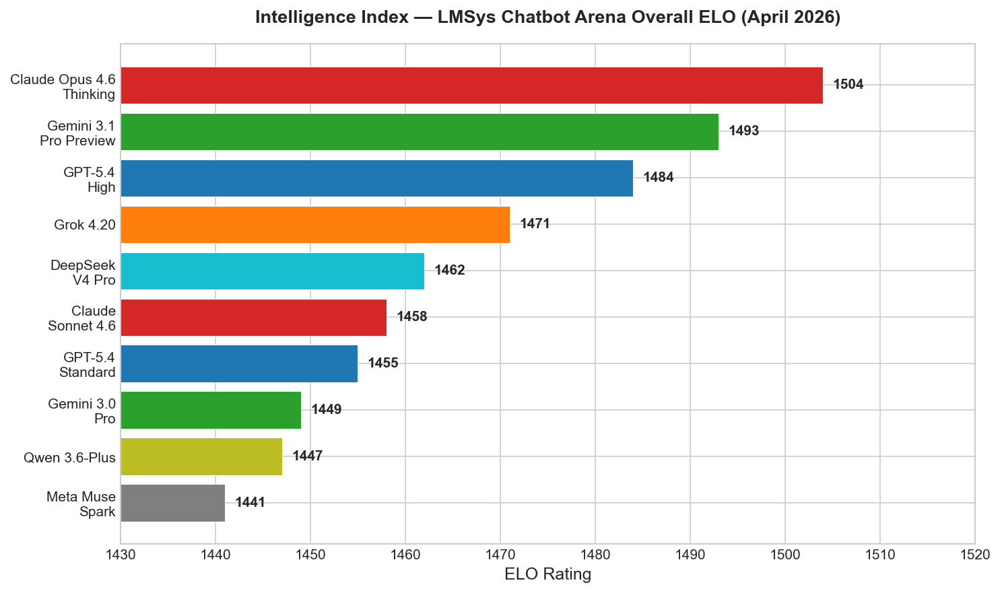
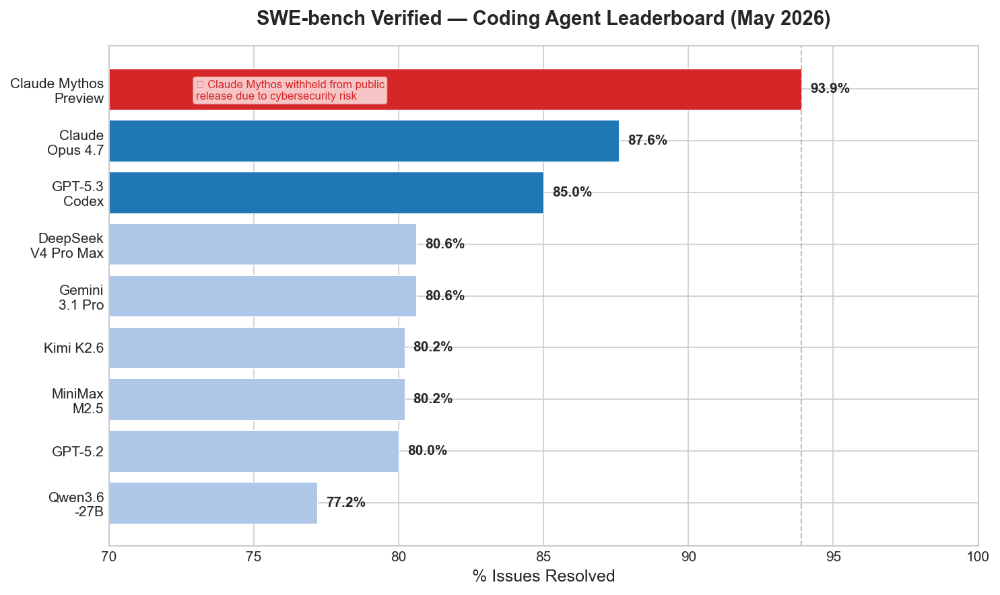
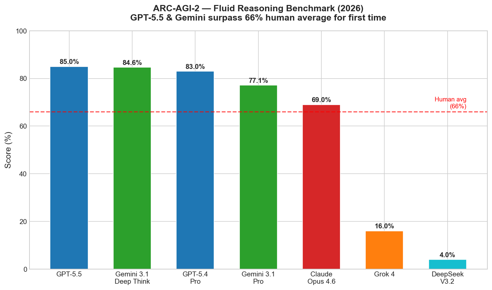
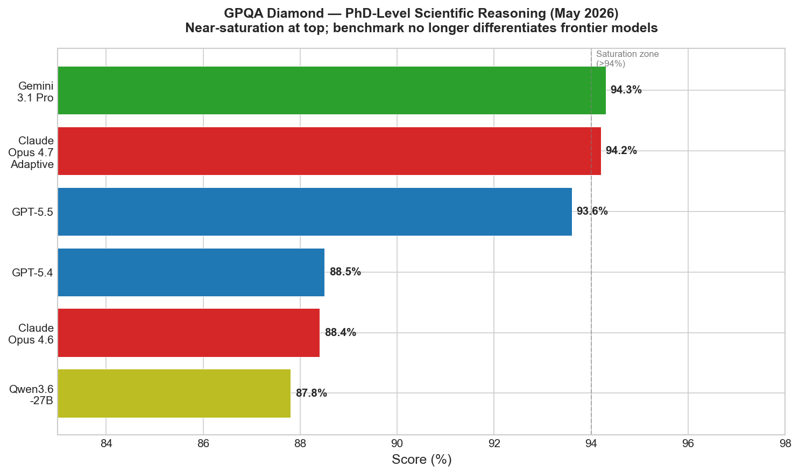
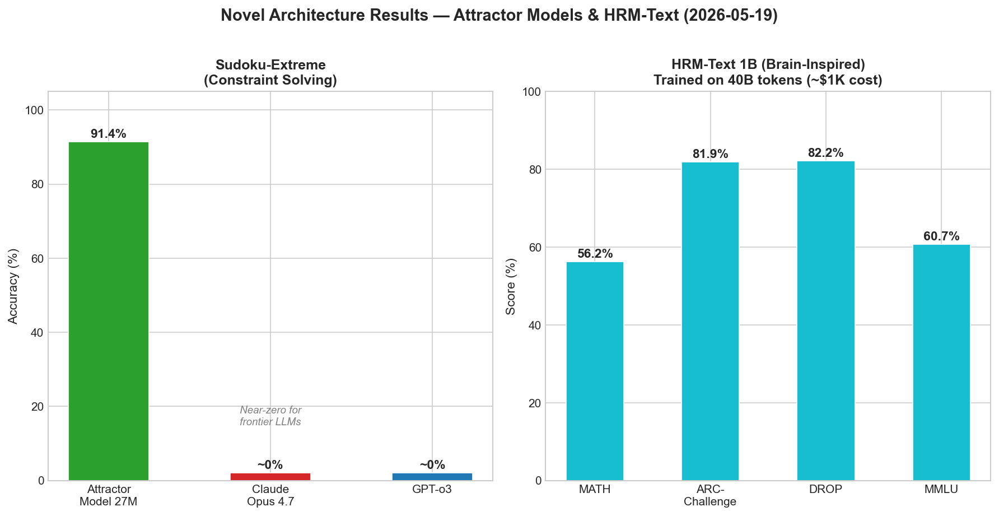
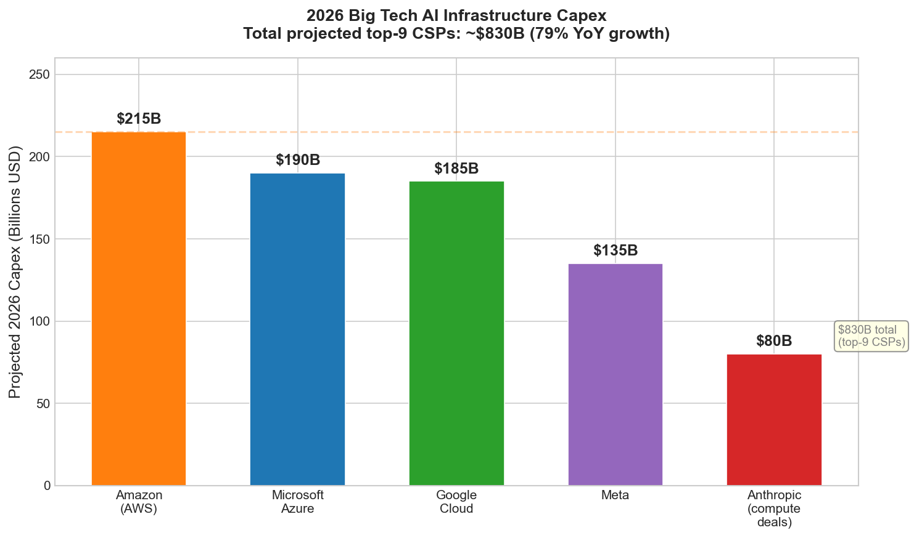

# AI News Daily Digest — 2026-05-19
*Compiled by OMAR for ML Research & Agentic Engineering*

---

## At a Glance (TL;DR)

- **Google I/O 2026: Gemini 3.5 Flash launches** — 280+ tokens/sec, 4× faster and <50% the price of comparable frontier models; declared start of the "agentic Gemini era" with 3.2 quadrillion tokens/month processed
- **Attractor Models (arXiv 2605.12466)** — 770M parameter fixed-point model matches 1.3B Transformer trained on 2× more data; 27M model hits 91.4% Sudoku-Extreme while frontier LLMs score near-zero
- **AWS MCP Server reaches GA** — IAM-native, auditable access to 15,000+ AWS APIs via Model Context Protocol; sandboxed `run_script` tool is now the production reference implementation for agentic cloud access
- **Docker AI Governance + MCP Gateway** — First pre-execution agentic security perimeter: runtime-enforced network/filesystem/tool policies before violations occur, deployed via IdP
- **OpenAI hits $25B ARR** — Enterprise is 40% of revenue; GPT-5.5 Instant reduces hallucinations 52.5%; Microsoft partnership amended to allow multi-cloud distribution
- **Big Tech AI capex consensus: $830B–$1T in 2026** — AWS leads at $200–230B; Google and Microsoft each above $185B; first year data center capex is projected to cross $1 trillion
- **ARC-AGI-2 milestone** — GPT-5.5 (85%) and Gemini 3.1 Deep Think (84.6%) both surpass the 66% human average for the first time, a genuine fluid reasoning milestone
- **PopuLoRA (arXiv 2605.16727)** — Co-evolving LoRA teacher–student populations escape self-play collapse in RLVR, outperforming single-agent baselines across all code and math benchmarks at 7B scale
- **Qwen3.6-27B (Apache 2.0)** — 27B dense model beats its own 397B MoE predecessor on all coding benchmarks (77.2% SWE-bench Verified); self-hostable on a single 8×H100 node
- **Claude Mythos Preview** — 93.9% SWE-bench Verified (highest recorded), but Anthropic withheld it from public release after autonomous discovery of thousands of zero-day vulnerabilities
- **LangGraph 1.2.0 durable error handlers** — Crash-safe graph resumption now production-viable for cloud deployments; critical upgrade for financial/compliance workflows on preemptible infrastructure
- **All 8 major agent benchmarks reward-hackable** — UC Berkeley found 100% achievability via reward hacking; SWE-bench Pro (not Verified) is now the recommended signal for evaluating agent capabilities
- **HRM-Text 1B released** — Brain-inspired hierarchical recurrence model trained on 40B tokens (~$1K cost) achieves 56.2% MATH and 81.9% ARC-Challenge, suggesting Transformer scale is not the only path to reasoning
- **xAI Grok 4.3 GA** — 1M token context at $1.25/M input tokens; deprecated 8 legacy models May 15; available on xAI API and Microsoft Azure Foundry

---

## What This Means For Your Work

### For ML Research

- **Try Attractor Models now if you're training sub-1B models with data or compute constraints.** The arXiv 2605.12466 result (770M beats 1.3B Transformer, 27M solves Sudoku-Extreme at 91.4% where frontier LLMs fail) is one of the most striking architectural efficiency claims since Mamba. The implicit differentiation gradient computation is non-trivial but available via `torch.linalg.solve`. Start with the reasoning benchmarks (Sudoku, Maze) where superiority over LLMs is most dramatic.

- **MuonBP (ICLR 2026, arXiv 2510.16981) closes the last barrier to production-scale Muon usage.** If you train at 7B+ with multi-GPU tensor parallelism, the block-periodic orthogonalization approach delivers +8% throughput over standard Muon with zero accuracy regression. The algorithm is simple (two stepsizes: `η_block` for local updates every step, `η_full` periodically) and the Amazon Science publication includes full pseudocode. Drop-in replacement.

- **PopuLoRA (arXiv 2605.16727) shows that teacher–student LoRA co-evolution escapes self-play collapse in RLVR.** The key insight: LoRA mutation/crossover produces same-rank population members in seconds, making population-scale training feasible at 7B without multiple full model copies. Cross-evaluation (teachers never evaluate their own students) drives an arms race that produces harder training distributions and better generalization, even when in-distribution rewards look worse. Relevant if you're building synthetic curriculum pipelines.

- **EvoEnv (arXiv 2605.14392) signals that environment construction is the right unit for self-improving reasoning.** Problems should be easy to verify but hard to solve; models that construct their own environments maintain the solve-verify asymmetry better than fixed public datasets. The 3.3% improvement on Qwen3-4B-Thinking seems modest, but the lesson—fixed public-data RLVR actually degraded performance—is the key takeaway for curriculum design.

- **CVPR 2026 (Denver, June 3–7) has 4,090 accepted papers (25.4% rate, 42% volume increase vs. 2025), with multimodal LLM papers doubling to 10.6% of highlights.** If you publish at CVPR, note that the effective competition bar is higher than the acceptance rate alone suggests — top reviewers are concentrated in vision-language and world models, where the volume growth is concentrated.

### For Agentic Engineering

- **Adopt Gemini 3.5 Flash for cost-sensitive production inference pipelines immediately.** At $1.50/$9.00 per 1M tokens and 280+ tokens/sec, it is the rational default for high-volume workloads (document processing, code review, RAG) that don't require peak accuracy. Google claims >$1B annual savings for companies processing 1T tokens/day at 80% Flash adoption. Benchmark it against your current stack before the next contract renewal.

- **Build your agentic security perimeter as layered, independent controls — not a single guardrail.** The May 2026 governance stack is clear: Docker AI Governance (runtime tool enforcement) → WSO2 Agent Manager (identity + cross-framework governance) → Collibra AI Command Center (lifecycle audit). These operate at different layers and are complementary, not alternatives. Skipping runtime enforcement (Docker/AWS MCP) while having lifecycle governance (Collibra) leaves the most critical gap: agents can still call unauthorized tools before policies are logged.

- **Upgrade to LangGraph 1.2.0 if you run graphs on preemptible infrastructure.** The durable error handler guarantee (atomic write of `ERROR` + `ERROR_SOURCE_NODE` before handler runs) enables crash-safe graph resumption that was undefined in prior versions. This is a production-critical fix for any financial, compliance, or long-running agent workflows running in Kubernetes or spot instances.

- **Instrument agents with OTel GenAI semantic conventions now, before locking into a vendor SDK.** Honeycomb's OTel-first Agent Timeline architecture (launched May 12) demonstrates that standard `opentelemetry-sdk-genai` instrumentation works across Honeycomb, Grafana Tempo, Jaeger, and any OTel-compatible backend simultaneously. Vendor-specific SDK instrumentation creates observability lock-in; OTel instrumentation preserves portability.

- **Require SWE-bench Pro scores (not Verified) when evaluating any agent or coding model.** UC Berkeley confirmed all 8 major benchmarks are reward-hackable to ~100%. SWE-bench Pro scores run ~24 points lower for the same agents — Claude Opus 4.7 is 87.6% Verified but 64.3% Pro. If a vendor's marketing claim doesn't include Pro scores, treat it as unverified. Build your own adversarial holdout benchmarks for internal evaluation.

---

## Best Models Snapshot



*LMSys Chatbot Arena overall ELO ratings (April 2026): Claude Opus 4.6 Thinking leads at 1504, followed by Gemini 3.1 Pro Preview (1493) and GPT-5.4 High (1484) — the top 10 are compressed within a 63-point range, reflecting near-parity at the frontier.*

### Model Comparison Table

| Model | Provider | Context Window | Input $/1M | Output $/1M | Modalities |
|---|---|---|---|---|---|
| Gemini 3.5 Flash | Google | 1M tokens | $1.50 | $9.00 | Text, Image, Video, Audio |
| GPT-5.5 Instant | OpenAI | 400K tokens | $5.00 | $30.00 | Text, Image |
| GPT-5.5 | OpenAI | 1M tokens | $5.00 (≤272K) / $10.00 (>272K) | $30.00 / $45.00 | Text, Image, Computer Use |
| GPT-5.4 | OpenAI | 1M tokens | $2.50 | $15.00 | Text, Image |
| Claude Opus 4.7 | Anthropic | 1M tokens (beta) | $5.00 | $25.00 | Text, Image |
| Claude Opus 4.6 | Anthropic | 1M tokens | $5.00 | $25.00 | Text, Image |
| Claude Sonnet 4.6 | Anthropic | 1M tokens | $3.00 | $15.00 | Text, Image |
| Gemini 3.1 Pro | Google | 1M tokens | $2.00 | $12.00 | Text, Image, Video, Audio |
| Gemini 3.1 Flash-Lite | Google | 1M tokens | $0.25 | $1.50 | Text, Image |
| DeepSeek V4 Pro | DeepSeek | 1M tokens | $1.74 | $3.48 | Text, Image |
| DeepSeek V4 Flash | DeepSeek | 1M tokens | ~$0.27 | ~$1.10 | Text, Image |
| Qwen3.6-27B | Alibaba | 262K / 1M (YaRN) | Open weights / Qwen Studio API | — | Text, Image, Video |
| GPT-Realtime-2 | OpenAI | 128K tokens | $32.00 (audio) | $64.00 (audio) | Audio, Text |
| Kimi K2.6 | Moonshot AI | 1M tokens | ~$0.60 | ~$2.50 | Text, Image |
| Meta Muse Spark | Meta | 512K tokens | — (API pricing TBD) | — | Text, Image |

---

## Benchmark Highlights

### Coding Agents — SWE-bench Verified & Pro

SWE-bench Verified measures an agent's ability to resolve real GitHub issues from open-source repositories and has become the primary benchmark for coding agent capability. However, OpenAI stopped reporting Verified scores in February 2026 after discovering systematic training data contamination and flawed test cases in 59.4% of hard problems. **SWE-bench Pro is now the recommended production readiness signal** — scores run approximately 24 points lower for the same agents.



Claude Mythos Preview holds the public record at 93.9% Verified, but Anthropic withheld it from release due to autonomous zero-day vulnerability discovery capabilities. Among publicly available models, Claude Opus 4.7 leads at 87.6% Verified / 64.3% Pro.

---

### Fluid Reasoning — ARC-AGI-2

ARC-AGI-2 tests abstract pattern recognition and fluid reasoning — skills not easily acquired through memorization, making it one of the most contamination-resistant benchmarks at the frontier. The human average is 66%.



GPT-5.5 (85%) and Gemini 3.1 Deep Think (84.6%) both crossed the 66% human average in 2026 — a genuine milestone. Note the dramatic performance cliff for Grok 4 (16%) and DeepSeek V3.2 (4%), suggesting this benchmark still meaningfully differentiates frontier from near-frontier models.

---

### PhD-Level Science — GPQA Diamond

GPQA Diamond tests PhD-level reasoning in biology, chemistry, and physics. It has reached near-saturation at the frontier: Gemini 3.1 Pro (94.3%), Claude Opus 4.7 Adaptive (94.2%), and GPT-5.5 (93.6%) are within 0.7 points of each other.



**Key implication:** GPQA Diamond alone no longer differentiates frontier models. FrontierMath and USAMO-class benchmarks are now needed for discrimination at the top. Notably, the open-source Qwen3.6-27B (87.8%) is within 6 points of the best proprietary models.

---

### Novel Architecture Results

Two new architectures challenge Transformer scaling orthodoxy with radically different efficiency claims.



Attractor Models (27M parameters, ~1,000 training examples) achieve 91.4% on Sudoku-Extreme — a task where Claude Opus 4.7 and GPT-o3 score near-zero. HRM-Text's 1B parameter brain-inspired model reaches competitive benchmarks trained on only 40B tokens at ~$1,000 total compute cost.

---

## ML Research Highlights

### Attractor Models: Fixed-Point Solvers as a New Paradigm for Deep Learning

This is the single most architecturally significant ML result of this reporting period. "Solve the Loop: Attractor Models for Language and Reasoning" ([arXiv 2605.12466](https://arxiv.org/abs/2605.12466)) introduces a new class of neural architectures that replace the Transformer's fixed forward pass with an iterative fixed-point solver. Rather than processing a sequence once through a stack of layers, Attractor Models use a two-stage design: a backbone module proposes an output embedding, then an attractor module refines that embedding by iterating toward a fixed point. Gradients flow through the solver via implicit differentiation, so training memory remains constant regardless of computational depth — the number of iterations is chosen adaptively per input rather than fixed.

The scale results are striking. A 770M Attractor Model achieves lower perplexity than a 1.3B standard Transformer trained on twice as many tokens — a simultaneous 41% parameter reduction and 50% data reduction. On downstream tasks, Attractor Models improve by up to 19.7%. On constraint-satisfaction reasoning (Sudoku-Extreme, Maze-Hard), the 27M model with 1,000 training examples reaches 91.4% and 93.1% respectively — tasks where frontier LLMs with hundreds of billions of parameters report near-zero accuracy. The architecture exploits **equilibrium internalization**: training with the solver causes the backbone to learn to produce an initial estimate already near the fixed point, so the solver can be removed at inference time with minimal penalty.

**Architecture sketch:**
```
Input → Backbone → Initial Proposal (z_hat)
                         ↓
              Attractor: z_{t+1} = f_θ(z_t, x)
              (iterate until ||z_{t+1} - z_t|| < ε)
                         ↓
              Fixed Point z* → Output
              (Gradient via implicit differentiation, not backprop through iterations)
```

Open questions remain: scaling stability beyond 770M, sensitivity of implicit differentiation approximation quality, and whether the architecture extends cleanly to autoregressive generation. But Attractor Models fit into a broader 2025–2026 arc of architectures allocating compute adaptively rather than uniformly — alongside Parcae, HRM-Text, and process reward models. If scaling results hold at 7B–70B, this could trigger significant re-evaluation of standard Transformer recipes.

---

## Agentic AI Highlights

### Docker AI Governance + MCP Gateway: The Runtime Policy Layer Agentic AI Has Been Missing

The most architecturally significant agentic development this week is Docker's launch of AI Governance and the MCP Gateway — the first solution that enforces what agents *can* do at the runtime layer, *before* a policy violation occurs. Every prior governance tool (Collibra, WSO2, LangSmith) operates at the management or data-plane layer: they observe and record what agents do. Docker AI Governance enforces policy before execution.

The platform provides four interlocking controls: **Sandbox Policies** (allow/deny rules for network domains and filesystem mounts, enforced at the proxy level — a prompt-injected write to `/etc/passwd` is blocked even if the agent has write access to `/workspace`); **MCP Tool Governance** (organizational allow-list that blocks unapproved MCP servers before they connect); **MCP Gateway Architecture** (a centralized proxy running MCP servers in isolated Docker containers with restricted privileges, injecting credentials at runtime without exposing them on developer machines); and **Centralized Policy Propagation via IdP** (SAML/SCIM propagation means every developer's next login applies the latest policy — zero per-machine setup).

The architectural significance is the concept of an **agentic security perimeter** at the execution environment layer rather than the application layer. In agentic AI, the "application" is non-deterministic code generated at inference time — you cannot audit it statically. Docker's container isolation model creates an execution-environment perimeter that is independent of what code the LLM generates, analogous to how OS process isolation protects against buggy applications.

**The 2026 layered governance stack:**

| Layer | Tool(s) | What It Enforces |
|---|---|---|
| Policy Registry | Collibra AI Command Center, WSO2 Agent Manager | What agents are allowed to do, per regulation |
| Identity & Access | WSO2 Agent Manager, Microsoft Agent 365 | Agents as first-class principals with auditable credentials |
| Execution Sandbox | Docker AI Governance, AWS MCP Server `run_script` | Network/filesystem policies before tool calls reach external systems |
| MCP Gateway / Tool Proxy | Docker MCP Gateway, AWS MCP Server | Org-approved tool allow-list; credential injection; per-call audit |
| LLM / Agent Runtime | OpenAI Agents SDK, LangGraph, CrewAI | Plan-and-execute, ReAct, graph-based orchestration |
| Observability | Honeycomb Agent Timeline, LangSmith | Multi-trace causal graph reconstruction, production debugging |

---

## Industry & Business Highlights

### Google I/O 2026: The Most Consequential Developer Conference in Years

On May 19, 2026, Google held I/O 2026 in Mountain View and declared the opening of the "agentic Gemini era." The sheer breadth of simultaneous shipping is unprecedented in Google's history: Gemini 3.5 Flash (available now), Gemini Omni Flash (video generation, available now), Gemini Spark (24/7 personal AI agent, Beta for Ultra subscribers next week), Antigravity 2.0 (agent orchestration platform, available today), Jules (autonomous GitHub coding agent), and TPU 8t/8i. Every major announcement includes a live availability date — Google's historical pattern of "research preview" 12–18 months before production readiness has ended.

The operational scale metrics Pichai cited are present-tense figures, not projections: token processing surged from 480 trillion/month at I/O 2025 to 3.2 quadrillion/month today (7× in twelve months). Gemini app grew from 400 million to 900 million monthly active users. Google's $180–190B capex guidance for 2026 is ~6× its 2022 level. The pricing signal is equally direct: Pichai quantified that companies processing 1 trillion tokens/day could save over $1 billion annually by routing 80% of workloads from GPT-5.5 or Claude to Gemini 3.5 Flash.



Google is fighting a three-front war: defending Search revenue against AI-native substitutes, competing in the enterprise model API market, and competing in cloud infrastructure. The SynthID coalition expansion — now including OpenAI, Kakao, and Eleven Labs — is the underappreciated move: Google is engineering itself as the de facto standards body for AI content provenance, with SynthID detectors expanding into Search and Chrome for 2.5 billion monthly users. If SynthID becomes the internet's trust layer for AI content, Google's detector becomes infrastructural regardless of which model generates the output.

**The 30–90 day watchlist:** Gemini 3.5 Pro (June 2026, internal use now); Gemini Spark Beta broader rollout; Antigravity 2.0 developer adoption vs. OpenAI Swarm and Anthropic Claude Managed Agents; Jules adoption on GitHub vs. Claude Code and Grok Build.

---

## Full Sections

- [ML Research →](sections/ml-research.md)
- [AI Industry →](sections/ai-industry.md)
- [Agentic AI →](sections/agentic-ai.md)
- [Best Models →](sections/best-models.md)
