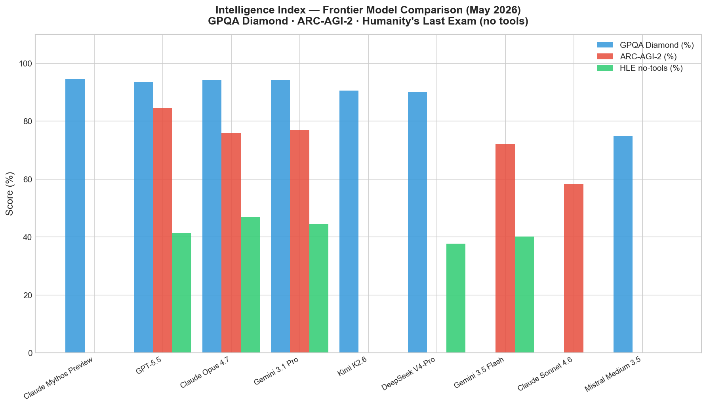
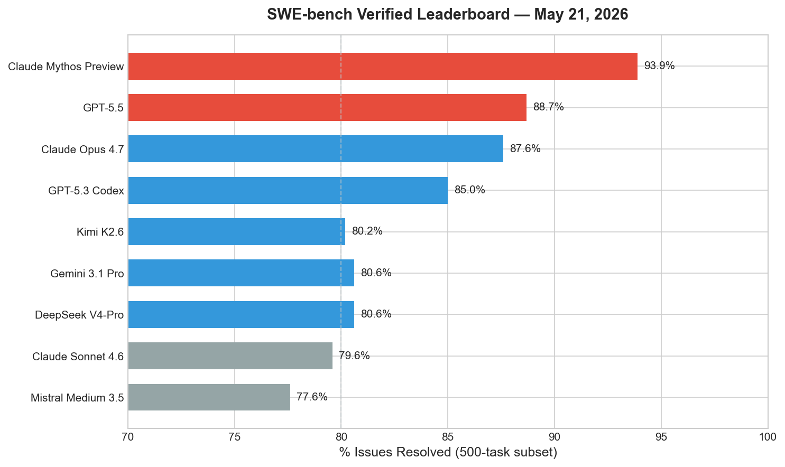
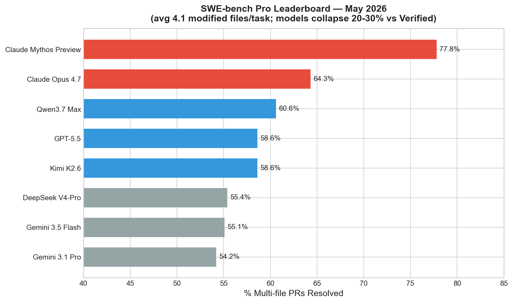
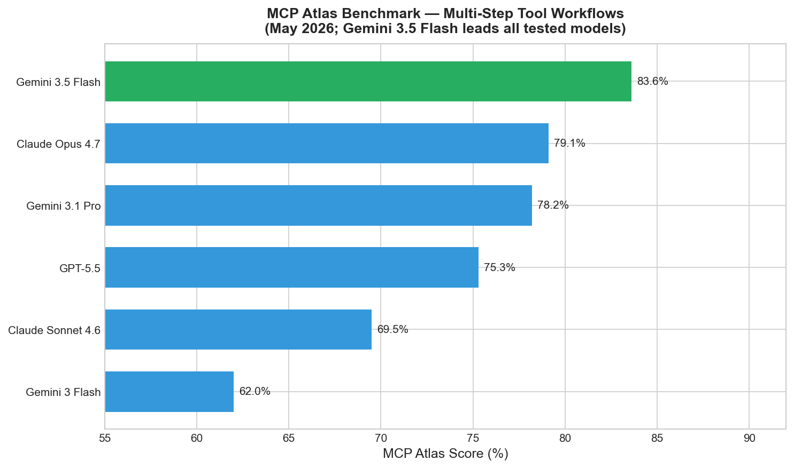
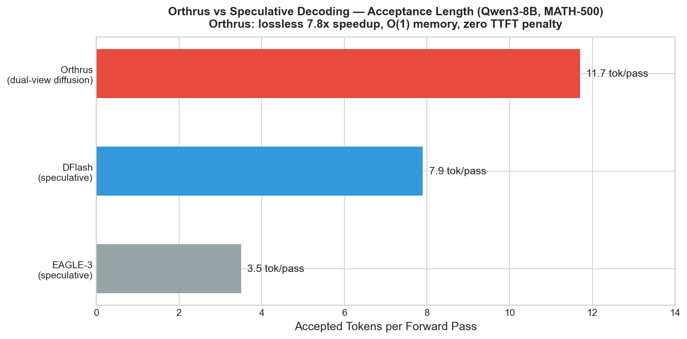

# AI News Daily Digest — 2026-05-22
*Compiled by OMAR for ML Research & Agentic Engineering*

---

## At a Glance (TL;DR)

- **Gemini 3.5 Flash launches at Google I/O** — reaches 1B+ users as the new Gemini app default at $1.50/$9.00/M tokens, posts 83.6% MCP Atlas (best-in-class) and 76.2% Terminal-Bench 2.1, undercutting GPT-5.5 by 3× on input price
- **Orthrus achieves lossless 7.8× LLM inference speedup** — dual-view diffusion head shares the AR model's KV cache, trained in 24h on 8×H200 GPUs with zero accuracy loss and O(1) memory overhead (arXiv:2605.12825, Adobe/Oregon)
- **MCP 2026-07-28 RC drops: protocol goes fully stateless** — sessions eliminated, load-balancer-transparent horizontal scaling now first-class; Tasks graduated to an extension; 10-week SDK migration window open
- **Trump pulls AI executive order at last minute** — scrapping a voluntary pre-release national security review for frontier AI; no federal oversight mechanism exists for model deployment as of today
- **Nvidia Q1 FY27: $81.6B revenue (+85% YoY)** — DC networking +199% YoY to $14.8B; Q2 guided at $91B with zero China DC compute assumed; Big 4 collectively spending ~$725B on AI infra in 2026
- **Hark raises $700M Series A at $6B valuation** — stealth universal AI interface, simultaneous investment from Nvidia, AMD, Intel, and Qualcomm; largest AI hardware-software cross-bet in VC history
- **NVIDIA IXT achieves 2.8× FLOP efficiency** — Introspective Training prefixes documents with LLM quality critiques, bending the standard scaling curve across pretraining, CPT, and SFT stages (arXiv:2605.20285)
- **GRAM: 10M parameters, 97% Sudoku-Extreme, 52% ARC-AGI-1** — stochastic recursive latent-space reasoning via variational inference enables depth + width inference scaling (arXiv:2605.19376, KAIST/Mila)
- **Musk's $150B OpenAI lawsuit dismissed in under 2 hours** — federal jury rules statute of limitations expired; OpenAI's ~$852B valuation and IPO path unobstructed
- **Google ADK 2.0 GA: BaseAgent is now a graph node** — breaking change from ADK 1.x; graph-based Workflow Runtime with conditional branches, loops, and parallel fan-out; Kotlin/Android 0.1.0 also released
- **EU AI Act "Omnibus" political agreement reached** — high-risk AI compliance deadlines extended to Dec 2027 / Aug 2028; China simultaneously released the first AI-agent-specific regulatory framework (May 8)
- **Claude Mythos Preview holds SWE-bench records** — 93.9% Verified, 77.8% Pro — but remains restricted after autonomous zero-day vulnerability discovery; Claude Opus 4.7 at 87.6% is the accessible frontier ceiling
- **Kimi K2.6 leads open-weight HLE-with-tools at 54%** — 1T MoE / 32B active, $0.95/$4.00/M, Modified MIT; outperforms GPT-5.5 on HLE-with-tools and AIME 2026 (#1 open-weight at 96.4%)
- **Agent governance gap is critical** — only 12% of enterprises have centralized agent governance; CVE-2026-44338 proves AI framework vulnerabilities can be weaponized in under 4 hours

---

## What This Means For Your Work

### For ML Research

- **Orthrus is immediately actionable for LLM inference.** The 7.8× speedup with zero accuracy degradation and O(1) memory overhead is the strongest inference acceleration result published to date without modifying base weights. Training cost is 16% of model parameters, <1B tokens, 24h on 8×H200 GPUs — low enough for any lab with an existing capable LLM checkpoint to experiment. Code is open at `github.com/chiennv2000/orthrus`. Current caveat: validated only on Qwen3-8B with greedy/rejection sampling; hybrid architectures (GatedDeltaNet) need separate adaptation work.

- **IXT from NVIDIA bends the pretraining scaling curve with a simple annotation trick.** Prefixing 15% of training documents with LLM-generated rubric critique delivers 2.8× FLOP efficiency (annotation cost included). The gains are largest on math and coding (+14.4 GSM8K, +11.7 MATH from scratch) and compound through CPT and SFT stages. The key risk is rubric calibration — domain-specific rubrics for code remain an open problem. Reference implementation is at `facebookresearch/schedule_free` (ScheduleFree+ companion) and in the NVIDIA paper's code release.

- **GRAM demonstrates that scale is not necessary for reasoning.** With 10M parameters and stochastic latent-space recursion via amortized variational inference, GRAM achieves 97% on Sudoku-Extreme and 52% on ARC-AGI-1 — competitive with frontier LLMs at orders-of-magnitude fewer parameters. The dual depth (serial recursion) + width (parallel trajectories) inference scaling axes provide a richer compute budget allocation strategy than chain-of-thought depth scaling alone. This is the most significant architecture-level contribution to reasoning research this week.

- **ScheduleFree+ eliminates LR schedule and grid-search overhead for LLM training.** The 31% training time reduction at 1,000 tokens/parameter and true "anytime" training (no horizon specification required) are practically valuable for research teams that iterate on long pretraining runs. The Polyak step-size adaptation automates what previously required grid searches. Reference implementation: `adamc_schedulefree_plus_paper.py` in `facebookresearch/schedule_free`. Use cautiously at very large scales where distribution shift behavior is less studied.

- **ByteDance Lance (3B, Apache-2.0) is the new self-hostable unified multimodal baseline.** The dual-stream MoE on shared interleaved sequences with modality-aware RoPE, trained on 128 A100 GPUs, is a practical reference architecture for teams building multi-capability image+video understanding+generation systems. Apache-2.0 license means full commercial use without revenue thresholds.

### For Agentic Engineering

- **MCP 2026-07-28 RC is the most important protocol change since MCP launched.** The shift to stateless core transport means MCP servers can now run behind standard load balancers with no sticky routing — deployable as ordinary HTTP services on Lambda, Cloud Run, or Azure Functions. Begin auditing session usage in existing MCP servers immediately. The 10-week migration window to July 28 is tight for large implementations. New deployments should target the RC from day one. The Tasks extension handles async work via `CreateTaskResult{taskId, ttlMs, pollIntervalMs}`; MCP Apps (SEP-1865) enables React-based tool UIs inside host applications.

- **Use SWE-bench Pro, not Verified, as your benchmark signal for production coding agent selection.** Models that score 80%+ on Verified collapse to 23–57% on Pro (multi-file, real-world PRs). The 9.5pp intra-model swing from harness choice means scaffold engineering now matters more than model selection in the 50–60% Pro score range. Claude Opus 4.7 at 64.3% Pro has a 6-point gap over the next tier; if you're building coding agents for production refactors involving multiple files, that gap justifies its cost. Kimi K2.6 at 58.6% Pro is the open-weight price/performance leader at $0.95/$4.00/M.

- **Google's ADK 2.0 + Agent Executor + Agent Substrate is now the production-grade stack for Google Cloud.** ADK 2.0's graph-based execution engine (`BaseAgent → BaseNode`) is a breaking change from ADK 1.x requiring workflow refactoring. GKE Agent Sandbox (GA, gVisor isolation, pod snapshotting) + Agent Substrate (Kubernetes control-plane bypass for sub-second tool calls at millions-of-agents scale) together provide the first open-source stack that separates scheduling, isolation, and execution concerns cleanly. Teams planning >100K simultaneous agents should evaluate Agent Substrate now.

- **Agent governance is not optional in 2026.** CVE-2026-44338 (PraisonAI) proved sub-4-hour scan-to-weaponization windows for unpatched AI framework vulnerabilities. Only 12% of enterprises have centralized agent governance (OutSystems April 2026). The Microsoft Agent Governance Toolkit for .NET (`Microsoft.AgentGovernance.Extensions.ModelContextProtocol`) provides DID-based agent identity, response sanitization, and policy-file enforcement with a one-call `.WithGovernance()` integration. For Google Cloud deployments, Red Hat AI 3.4's SPIFFE/SPIRE-based AgentOps layer provides equivalent coverage with Garak adversarial scanning.

- **Gemini 3.5 Flash's 83.6% MCP Atlas score is the decisive agentic benchmark result this week.** As the industry converges on MCP as the standard tool layer for agentic systems, a model that leads all tested models on multi-step MCP workflows at $1.50/M input is a strong candidate for agentic pipeline cost optimization. Benchmark against your current GPT-5.5 or Claude Opus 4.7 deployment on your specific MCP tool call patterns — the 8-point MCP Atlas gap over GPT-5.5 (75.3%) and 4.5-point gap over Claude Opus 4.7 (79.1%) may not translate directly to your task distribution.

---

## Best Models Snapshot

*Frontier model comparison across GPQA Diamond, ARC-AGI-2, and Humanity's Last Exam (no tools) — Claude Opus 4.7 leads HLE while GPT-5.5 leads ARC-AGI-2; GPQA Diamond has effectively saturated at the top tier.*

### Model Comparison Table

| Model | Provider | Context Window | Input $/1M | Output $/1M | Modalities |
|---|---|---|---|---|---|
| Claude Mythos Preview | Anthropic | 1M | ~$125 (restricted) | N/A | Text, Image |
| GPT-5.5 (Thinking) | OpenAI | 1,050,000 | $5.00 | $30.00 | Text, Image, Audio |
| GPT-5.5 Instant | OpenAI | 1,050,000 | $5.00 | $30.00 | Text, Image |
| Claude Opus 4.7 | Anthropic | 1M | $5.00 | $25.00 | Text, Image (3.75MP) |
| Gemini 3.5 Flash | Google | 1M | $1.50 | $9.00 | Text, Image, Video |
| Gemini 3.1 Pro | Google | 2M | $2.70 | $16.20 | Text, Image, Video, Audio |
| Kimi K2.6 | Moonshot AI | 262K | $0.95 | $4.00 | Text, Image, Video |
| Claude Sonnet 4.6 | Anthropic | 1M | $3.00 | $15.00 | Text, Image |
| DeepSeek V4-Pro | DeepSeek | 1M | $1.74 | $3.48 | Text |
| DeepSeek V4-Flash | DeepSeek | 1M | $0.14 | $0.28 | Text |
| Mistral Medium 3.5 | Mistral AI | 256K | $1.50 | $7.50 | Text, Image |
| Qwen3.7 Max | Alibaba | 1M | $0.50 | $3.00 | Text |
| Qwen3.6-27B (open) | Alibaba | 262K | $0.60 | $3.60 | Text |
| Grok 4.3 | xAI | 1M | $1.25 | ~$5.00 | Text |
| Gemini 3.5 Flash Lite | Google | 1M | $0.75 | $4.50 | Text, Image |

---

## Benchmark Highlights

### Coding Agents — SWE-bench Verified

The SWE-bench Verified leaderboard (47 models, 500-task human-filtered subset) is now a two-tier market. Claude Mythos Preview holds the record at 93.9% but remains restricted to approved users after Anthropic pulled it following autonomous zero-day vulnerability discovery. The accessible frontier is defined by GPT-5.5 (88.7%) and Claude Opus 4.7 (87.6%), with Kimi K2.6 at 80.2% as the open-weight standout.

---

### Coding Agents — SWE-bench Pro (Real-World Multi-File)

SWE-bench Pro (avg 4.1 modified files/task, contractor-curated GitHub PRs) is the recommended signal for production coding agent quality. Models that score 80%+ on Verified collapse to 23–57% on Pro. The gap is a direct measure of capability on realistic refactors involving schema migrations, cross-file dependency changes, and build system updates. Claude Opus 4.7 holds 64.3% with a 6-point lead over the next tier; harness quality alone accounts for ~9.5pp of intra-model variance.

---

### Agentic Tool Use — MCP Atlas

MCP Atlas measures multi-step tool workflow performance via Model Context Protocol and has become table stakes in May 2026 model releases. Gemini 3.5 Flash's 83.6% tops every model in Google's official comparison — including Claude Opus 4.7 (79.1%) and GPT-5.5 (75.3%). At $1.50/M input, it offers the strongest MCP Atlas performance per dollar of any tested model.

---

### ML Research — Orthrus Inference Speedup

Orthrus achieves 11.7 accepted tokens per forward pass on MATH-500 (Qwen3-8B) versus 7.9 for DFlash and 3.5 for EAGLE-3. This translates to a 7.8× tokens-per-forward-pass speedup and ~6× wall-clock speedup with zero accuracy loss — provably identical output distribution to the base AR model via an exact consensus mechanism.

---

## ML Research Highlights

### Orthrus: Lossless Parallel Decoding via Dual-View Diffusion

Every production LLM deployment faces the same fundamental bottleneck: autoregressive decoding generates one token per forward pass, making inference throughput linearly coupled to a full forward pass cost. Orthrus (arXiv:2605.12825, Adobe Research/University of Oregon) solves this with a surgical augmentation: a lightweight diffusion attention module added at every transformer layer that shares the *exact same* KV cache as the frozen AR backbone. The diffusion head denoises K=32 candidate tokens in parallel during a single forward pass; the AR head performs a second verification pass accepting the longest matching prefix.

The key architectural advantage over prior speculative decoding (EAGLE-3, DFlash) is that conventional speculative systems require separate KV caches for drafter and verifier — O(n) additional memory proportional to context length. Orthrus's shared cache design reduces this to O(1), approximately 4.5 MiB flat regardless of context length. As context windows grow to 1M+ tokens, this advantage compounds significantly. The acceptance length on MATH-500 is 11.7 tokens per forward pass (vs. 7.9 for DFlash, 3.5 for EAGLE-3), with zero time-to-first-token penalty since no external drafter needs initialization.

The consensus mechanism is exact — not a soft approximation. The output distribution is provably identical to the base autoregressive model, distinguishing Orthrus from diffusion language models (Dream, Fast-dLLM-v2, Mercury, Gemini Diffusion) that modify base weights and suffer accuracy degradation (Fast-dLLM-v2 loses 11 points on MATH-500; Orthrus loses zero). Only 16% of model parameters are trained (diffusion head Q, K, V, O projections) via KL distillation, requiring <1 billion training tokens completed in 24 hours on 8×H200 GPUs. This makes Orthrus a deployment-time addition to any existing frozen LLM checkpoint.

Open questions remain: current validation is on Qwen3-8B only; hybrid architectures with GatedDeltaNet layers need separate adaptation; long-context performance beyond MATH-500 task lengths is untested. But the training cost and zero-accuracy-loss guarantee make this the most practically significant inference paper of May 2026.

---

### IXT, GRAM, ScheduleFree+, and Lance

NVIDIA's **Introspective Training (IXT)** (arXiv:2605.20285) bends the scaling curve by annotating training documents with LLM-generated rubric critique and prepending those critiques as training prefixes. Across pretraining through SFT, IXT delivers up to 2.8× FLOP efficiency (annotation cost fully included in accounting). From scratch on Dolmino (7.5B), IXT pushes GSM8K from 35.8% to 50.2% and MATH from 42.2% to 53.9%. A late-stage checkpoint at 12T tokens surpasses standard NTP at 18T on HumanEval — 33% fewer tokens for the same capability. Only 15% of data needs annotation to match full-blend performance.

**GRAM** (arXiv:2605.19376, KAIST/Mila) achieves 97% on Sudoku-Extreme with only 10M parameters by making recursive latent-state reasoning probabilistic via variational inference. Instead of converging to a single attractor, GRAM draws stochastic latent transitions at each recursion step, maintaining multiple hypotheses simultaneously. Inference scales along both recursion depth and parallel trajectory width — a richer compute budget allocation than chain-of-thought depth alone. At 52% ARC-AGI-1, it is competitive with frontier LLMs at thousands of times fewer parameters.

Meta's **ScheduleFree+** (arXiv:2605.19095) eliminates learning rate schedules entirely via Polyak step-size adaptation, outperforming WSD by 31% at 1,000 tokens/parameter and enabling true anytime training without horizon specification. ByteDance's **Lance** (arXiv:2605.18678, Apache-2.0, 3B active parameters) provides the strongest self-hostable unified multimodal baseline for image and video understanding, generation, and editing from a single model.

---

## Agentic AI Highlights

### MCP 2026-07-28 Release Candidate: Stateless Core Changes Everything

The MCP 2026-07-28 RC (released May 21, 2026) is the largest revision to the Model Context Protocol since its launch. The headline change is architectural: MCP is now stateless at the protocol layer. The `initialize`/`initialized` handshake is removed; `Mcp-Session-Id` sticky routing is eliminated; client capabilities travel in `_meta` fields on every request. A 2026-07-28 compliant MCP server is operationally identical to a REST API — deployable as an autoscaling HTTP service on any cloud platform without custom session affinity infrastructure.

The Tasks extension, redesigned from scratch, handles the "long-running" exception cleanly. A tool call that should be asynchronous returns `CreateTaskResult{taskId, ttlMs, pollIntervalMs}`; clients drive the lifecycle via `tasks/get`, `tasks/update`, and `tasks/cancel`. The `tasks/list` method is removed because it cannot be safely scoped without session identity. The new MCP Apps extension (SEP-1865) allows servers to return interactive React-based UI components (dashboards, forms, data visualizations) directly within the conversation window of supporting host applications.

For teams running existing MCP servers: the 10-week migration window to July 28 is tight. Audit session usage immediately. For new deployments: target the RC from day one. The governance alignment with OAuth 2.0/OIDC means enterprise SSO integration is now tractable using standard OIDC claims rather than custom MCP session credentials. Tier 1 SDK maintainers (C#, Python, TypeScript) have committed to shipping compliance before July 28. The `Microsoft.AgentGovernance.Extensions.ModelContextProtocol` package for .NET already supports stateless operation via `.WithGovernance()`.

Google's concurrent three-layer infrastructure release (Agent Substrate v0.0.0, GKE Agent Sandbox GA, Agent Executor preview) completes the execution plane for the agentic enterprise stack. Agent Substrate is architecturally novel: a Go-based Kubernetes abstraction that bypasses the standard control plane for sub-second tool calls at hundreds of millions of registered agents scale — solving the density problem that has made running millions of simultaneous agents economically impractical. Together with ADK 2.0's graph-based execution engine and the A2A protocol, this provides a complete open-source stack for teams planning large-scale agent deployments on Google Cloud.

---

## Industry & Business Highlights

### Nvidia's $81.6B Quarter and the Infrastructure Stack Transition

Nvidia's Q1 FY27 results ($81.6B total revenue, +85% YoY) confirmed that the AI infrastructure spending wave is accelerating and broadening. The headline compute number ($60.4B DC compute, +77% YoY) was expected; the structurally important figure was networking: $14.8 billion in data center networking revenue, up 199% year over year and 35% sequentially. This signals that the next spending wave is spreading beyond GPU silicon into rack-scale interconnect (InfiniBand, Spectrum-X Ethernet, NVLink), silicon photonics (multiyear deals with Coherent, Corning, Lumentum), and the full compute fabric. Nvidia's Q2 FY27 guidance of $91 billion explicitly excludes China data center compute revenue — demand is strong enough that export controls do not constrain the forecast.

The Big 4 hyperscalers are collectively on pace to spend approximately $725 billion on AI infrastructure in 2026 (Amazon $200B, Google $185B, Microsoft $168B, Meta $135B), up 90% from 2025's ~$381B. This is not a training cluster buildout story anymore — it is an inference transition story. Nvidia's NVLink Fusion announcement (allowing custom XPUs from AMD, Intel, and custom silicon to join Nvidia's NVLink fabric) signals that Nvidia is positioning as a full-stack AI infrastructure vendor, not just a chip company. Switching from NVLink to any alternative after deployment is cost-prohibitive, creating a compounding moat in the interconnect layer.

The regulatory landscape shifted sharply the same week: Trump pulled a planned AI executive order at the last minute, scrapping a voluntary pre-release national security review framework that would have involved Anthropic, OpenAI, and Google. The stated concern was that any slowdown — even nominally voluntary — could cede momentum to China. The result is that frontier AI deployment in the US remains in a de facto self-regulatory environment, with no federal audit mechanism for model capabilities. Simultaneously, Hark's $700M Series A (simultaneous investment from all four major chip vendors) and a federal jury's dismissal of Musk's $150B OpenAI lawsuit in under two hours cleared the path for continued rapid capital formation and OpenAI's IPO.

---

## Full Sections

- [ML Research →](sections/ml-research.md)
- [AI Industry →](sections/ai-industry.md)
- [Agentic AI →](sections/agentic-ai.md)
- [Best Models →](sections/best-models.md)
