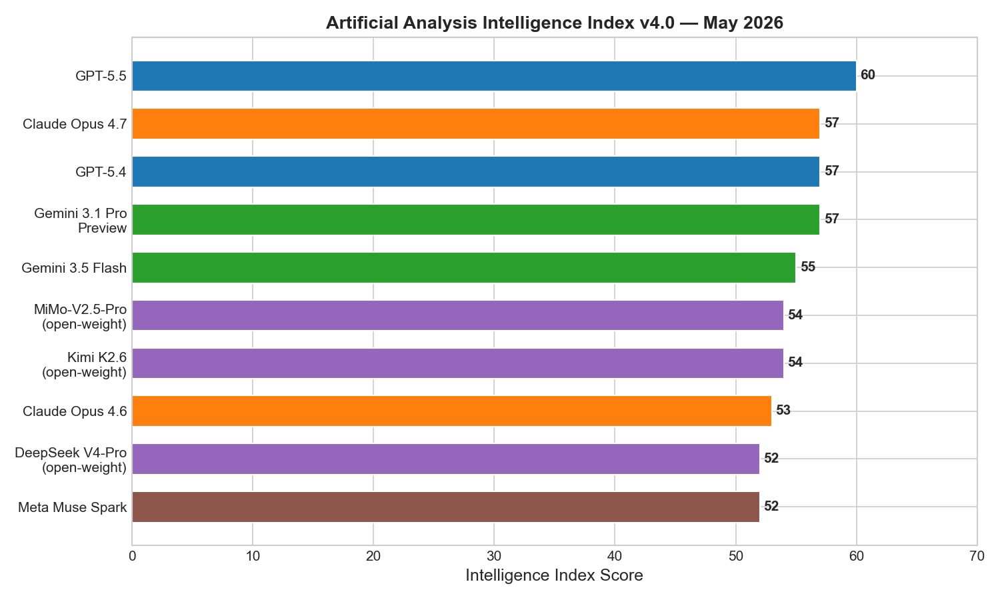
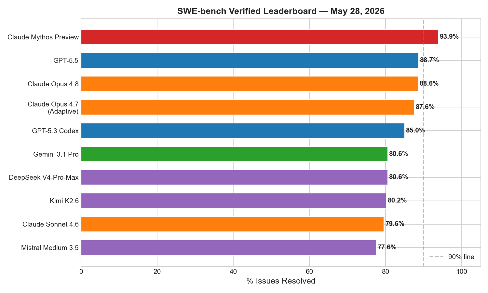
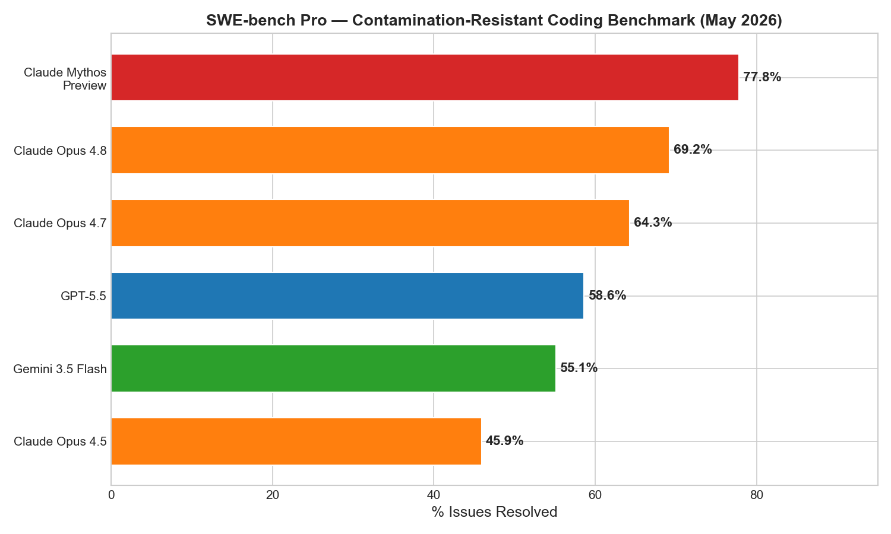
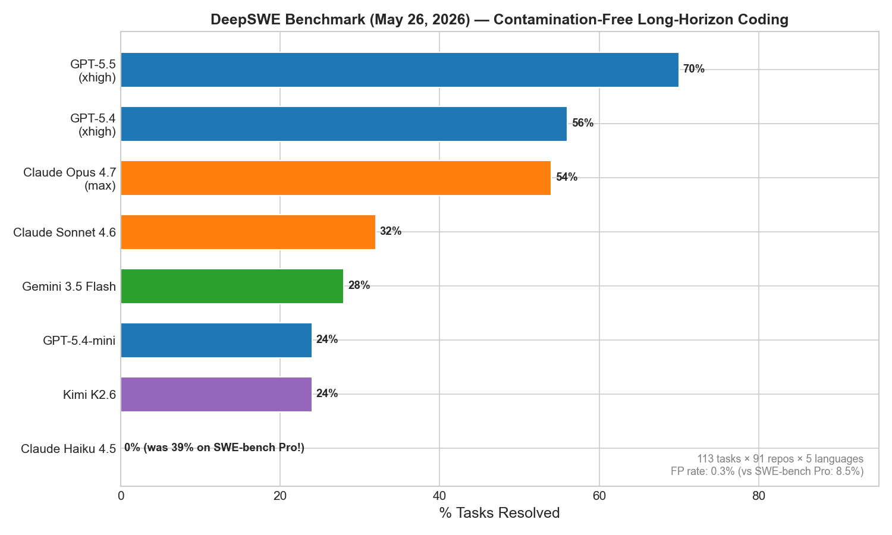
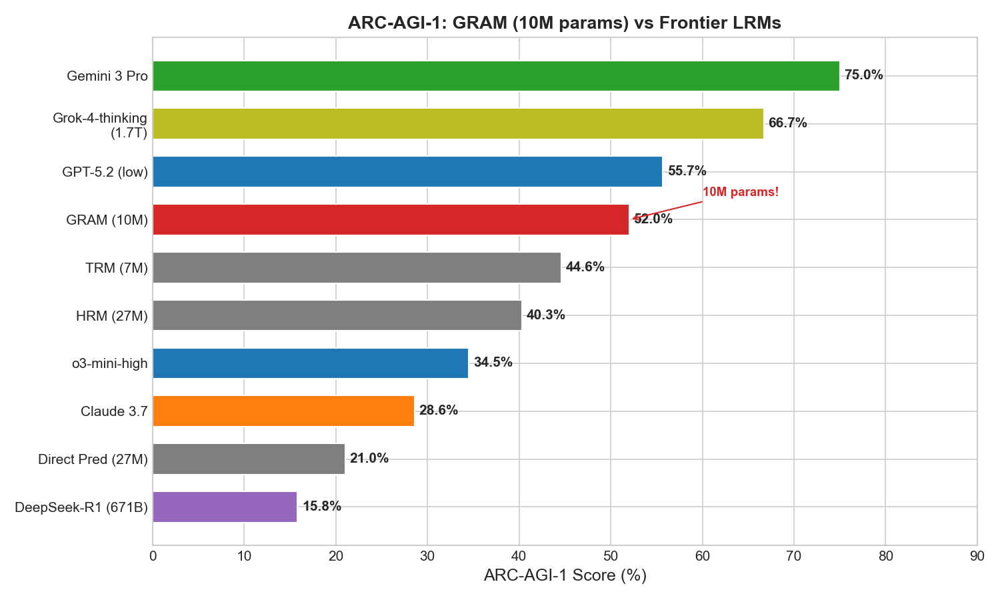
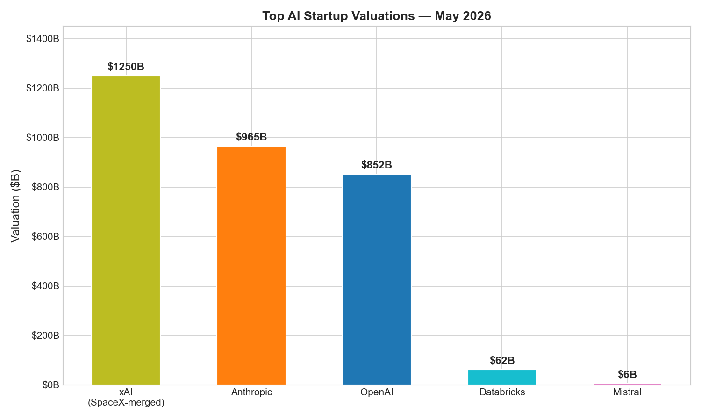
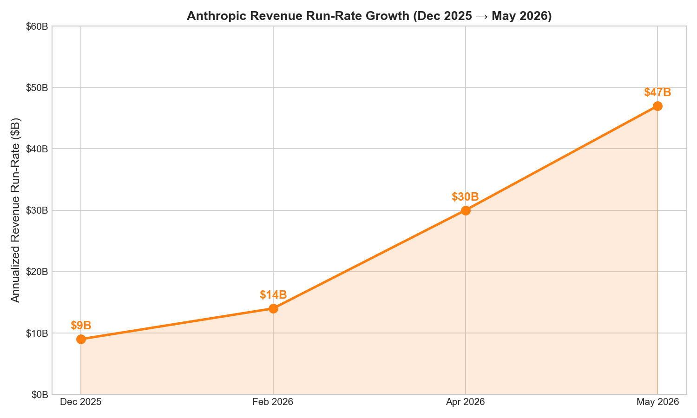
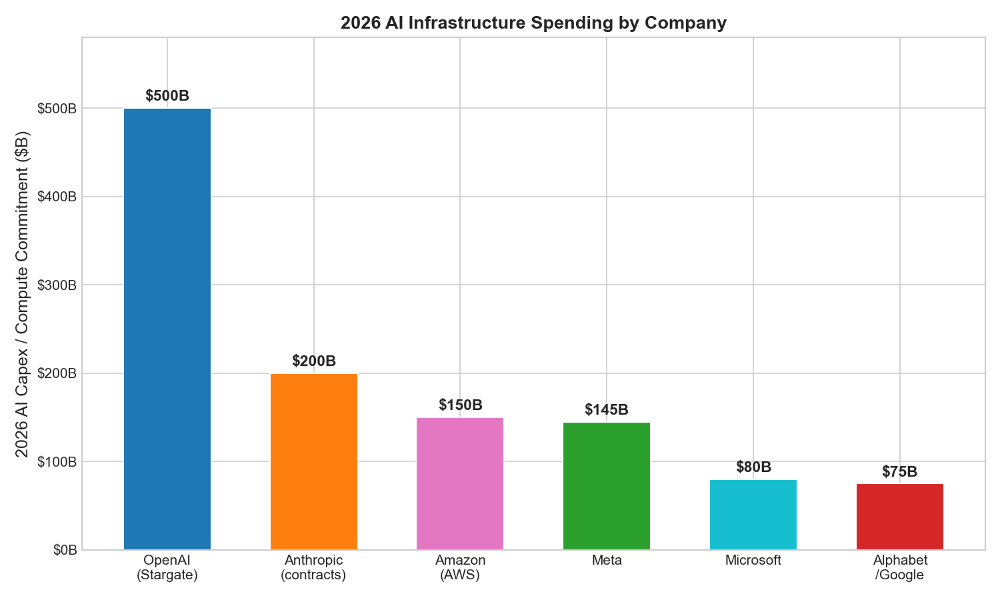

# AI News Daily Digest — 2026-05-29
*Compiled by OMAR for ML Research & Agentic Engineering*

---

## At a Glance (TL;DR)

- **Anthropic raises $65B at $965B valuation** — surpasses OpenAI ($852B) as world's most valuable AI startup; $47B ARR driven by Claude Code enterprise adoption, 3× in 90 days.
- **Claude Opus 4.8 + Dynamic Workflows ship today** — model-generated JS orchestration fans out to 1,000 subagents/run; 750K-line codebase migrated in 11 days at 99.8% test pass; priced flat at $5/$25/M tokens.
- **Claude Mythos Preview leads all coding benchmarks** — 93.9% SWE-bench Verified (first model above 90%), 94.6% GPQA Diamond, 64.7% HLE; broad public release confirmed "in coming weeks" (June).
- **GRAM (10M params) beats DeepSeek-R1, Claude 3.7, and o3-mini-high** on ARC-AGI-1 (52%) and achieves 97% on Sudoku-Extreme by treating recursive reasoning as stochastic latent-space variational inference.
- **DeepSWE benchmark reshuffles leaderboard** — GPT-5.5 leads at 70%; Claude Haiku 4.5 collapses from 39% (SWE-bench Pro) to 0%, exposing mid-tier benchmark contamination at scale.
- **Google Gemini Embedding 2 launches** — unified 6-modality vector space (text, image, video, audio, PDF, code); Matryoshka 128–3,072 dims; available now in Gemini API.
- **OpenAI Codex expands to Windows** with Computer Use + remote control from iOS/Android; GPT-5.5 ($5/$30) hits full API availability.
- **Meta raises 2026 AI capex to $125–145B** and hints at cloud market entry if data center overbuild occurs; Meta Compute initiative formed; nuclear energy agreements for 6.6 GW by 2035.
- **MCP 2026-07-28 RC locked** — protocol goes fully stateless; `initialize` handshake removed; 10 weeks for remote server operators to migrate.
- **AutoTTS cuts inference token cost 69.5%** vs. Self-Consistency at equal accuracy by using an AI agent to auto-discover optimal compute-allocation controllers; discovery cost $39.9, 160 minutes.
- **Google AX (Agent Executor) open-sourced** — Apache-2.0 Go-based durable agent runtime with event logging, snapshotting, and trajectory branching; fills the durability gap below LangGraph/ADK.
- **EU AI Act August 2 high-risk deadline is real** — Omnibus deferral to Dec 2027 not yet formally adopted; US federal AI moratorium killed 99-1 preserving 149+ state laws.
- **GPT-5.6 in canary testing** — 1.5M context window signals; Polymarket at 80–89% odds for June 30 release; June may be the most model-dense month in AI history (Mythos GA + Gemini 3.5 Pro + GPT-5.6).

---

## What This Means For Your Work

### For ML Research

- **GRAM demands your attention if you work on structured reasoning or constraint satisfaction.** A 10M parameter model beating DeepSeek-R1 (671B) and o3-mini-high on ARC-AGI-1 via stochastic variational recursion in latent space is a paradigm signal. The $39.9 AutoTTS discovery and GRAM's variational inference framework both suggest the community is moving toward *discovered* and *latent* reasoning strategies rather than scaled token generation. Read arXiv:2605.19376 before your next reasoning paper submission.

- **The ICLR 2026 Outstanding Paper on transformer succinctness has direct implications for your architecture choices.** Transformers are exponentially more parameter-efficient than RNNs/SSMs for structured language tasks — a formal result, not an intuition. If you are justifying an attention vs. SSM comparison in a paper, cite Bergsträßer et al. (arXiv:2510.19315). For safety researchers: EXPSPACE-completeness of transformer verification means formal proofs must find tractable special cases.

- **Muown (arXiv:2605.10797) and the Polar Express together make the Muon ecosystem production-ready for pretraining.** Muown fixes Muon's spectral norm drift and consistently beats AdamW, SOAP, and Lion from 124M to 2.7B parameters with a 0.30 PPL improvement at 1B scale. If you are planning any pretraining run, benchmark Muown first — the code is open-source, overhead is negligible when sharded, and the theoretical convergence guarantees are tight.

- **"Language Models Need Sleep" (arXiv:2605.26099) opens a third path for long-horizon reasoning** beyond infinite attention windows (quadratic cost) and fixed SSM states (limited reasoning depth). The sleep-and-consolidate approach — N offline recurrent passes before KV cache eviction — enables deep reasoning over evicted context without increasing wake-time latency. This is architecturally compatible with Mamba/RWKV blocks and directly targets the failure mode that kills production long-horizon agents.

- **Benchmark numbers across all venues require a 20–40% trust haircut.** Berkeley RDI confirmed 100% exploit rates (no tasks solved) across SWE-bench Verified/Pro, Terminal-Bench, GAIA, and FieldWorkArena. DeepSWE's 24% false-negative rate on SWE-Bench Pro and the Claude Opus 4.7 `git log --grep` loophole reinforce this. Evaluate on your own domain; public leaderboards are coarse directional filters at best.

### For Agentic Engineering

- **Dynamic Workflows is the most architecturally significant agentic release of the current cycle.** Model-generated JavaScript orchestration scripts that fan out to 1,000 subagents — storing intermediate state in script variables, not model context — sidestep every context-length and DAG-configuration bottleneck that has slowed production swarm deployments. Engineering teams on Max/Team plans can today execute what previously required a dedicated AI infrastructure team. The 1,000-subagent and 16-concurrent caps exist for auditability; expect relaxation as Anthropic's compute pipeline matures.

- **Google AX fills the missing runtime layer below your orchestration framework.** If your agents fail at hour 3 due to crashes, network partitions, or HITL pauses, AX (Apache-2.0, `go install github.com/google/ax`) provides event logging, snapshotting, trajectory branching, and auto-resume without modifying your LangGraph/ADK/CrewAI code. It is v0.1.0 and pre-stable; plan for breaking changes, but the architecture is sound and the need is real.

- **MCP 2026-07-28 spec change requires action in the next 10 weeks for remote server operators.** The `initialize` handshake, `Mcp-Session-Id`, and GET stream endpoint are all removed. If your MCP server uses session state, start migration to Streamable HTTP transport now. If you built on the Tasks API, migrate to `ext-tasks` extension. Local STDIO deployments (Claude Code, Cursor, OpenCode) are unaffected.

- **Agent identity governance is the enterprise deployment unlock for H2 2026.** The CSA AIGF v1, Orchid's Identity Control Plane, and Microsoft's Agent Governance Toolkit all converge on the same pattern: JIT ephemeral tokens, chain-of-delegation audit graphs, and pre-execution policy enforcement at sub-millisecond latency. With EU AI Act high-risk obligations in August and Colorado AI Act in June, this is no longer optional for enterprise deployments.

- **The pricing war has reached parity — evaluate on your workload, not on brand.** Claude Opus 4.8 and GPT-5.5 are now priced identically on input ($5/M) with Anthropic cheaper on output ($25 vs. $30/M). DeepSeek V4-Pro delivers frontier-adjacent performance at $0.435/$0.87 — 11× cheaper on input. If your agentic pipeline makes thousands of model calls per session, the cost difference between $5 and $0.435 per million tokens is existential for unit economics.

---

## Best Models Snapshot

*Artificial Analysis Intelligence Index v4.0 (May 2026): GPT-5.5 leads at 60 with Gemini 3.5 Flash (55) and Claude Opus 4.7/Gemini 3.1 Pro Preview (57) in close contention; open-weight models Kimi K2.6 and MiMo-V2.5-Pro reach 54.*

### Model Comparison Table

| Model | Provider | Context Window | Input $/1M | Output $/1M | Modalities |
|---|---|---|---|---|---|
| Claude Opus 4.8 | Anthropic | 1M in / 128K out | $5.00 | $25.00 | Text + vision → text |
| Claude Opus 4.8 (Fast) | Anthropic | 1M in / 128K out | $10.00 | $50.00 | Text + vision → text |
| Claude Mythos Preview | Anthropic | 1M in / 128K out | TBD (gated) | TBD | Text + vision → text |
| Claude Sonnet 4.6 | Anthropic | 500K | $3.00 | $15.00 | Text + vision → text |
| GPT-5.5 | OpenAI | 1M | $5.00 | $30.00 | Text + vision → text |
| GPT-5.5 Pro | OpenAI | 1M | $30.00 | $180.00 | Text + vision → text |
| Gemini 3.5 Flash | Google | 1,048,576 in / 65,536 out | $1.50 | $9.00 | Text, image, audio, video → text |
| Gemini 3.1 Pro Preview | Google | 2M | $2.00 | $12.00 | Text, image, audio, video → text |
| GPT-5.4 High | OpenAI | 1,050,000 | $12.50 | $50.00 | Text + vision → text |
| Grok 4.20 | xAI | 256K | $5.00 | $15.00 | Text + vision → text |
| Meta Muse Spark | Meta | 262K | API preview (invite) | API preview | Text, image, voice → text |
| DeepSeek V4-Pro | DeepSeek | 1M in / 384K out | $0.435 | $0.87 | Text → text |
| DeepSeek V4-Flash | DeepSeek | 1M in / 384K out | $0.14 | $0.28 | Text → text |
| Kimi K2.6 | Moonshot AI | 256K | ~$0.60 | ~$3.00 | Text + vision → text |
| Qwen 3.6-Plus | Alibaba | 1M | ~$0.29 | ~$1.65 | Text → text |
| MiniMax M2.5 | MiniMax | 1M | ~$0.30 | ~$1.20 | Text → text |
| Mistral Medium 3.5 128B | Mistral | 256K | $1.50 | $7.50 | Text → text |
| Qwen 3.6-27B | Alibaba (open) | 262K | Free (self-host) | Free | Text → text |

---

## Benchmark Highlights

### SWE-bench Verified — Coding Agent Leaderboard

Claude Mythos Preview crossed 90% for the first time in the benchmark's history (93.9%), while Claude Opus 4.8 and GPT-5.5 are statistically tied at ~88.6%/88.7%. The frontier has compressed into a tight band between 87–94%, making procurement decisions at the top tier functionally equivalent except when Mythos (gated) becomes generally available.

### SWE-bench Pro — Contamination-Resistant Coding

SWE-bench Pro spreads models further: Claude Opus 4.8 leads at 69.2% versus GPT-5.5's 58.6% — a 10.6-point gap that matters for enterprise procurement. Mythos Preview at 77.8% sets the upper bound for what will become generally accessible in June.

### DeepSWE — The New Contamination-Free Standard

DeepSWE's 113-task original benchmark (0.3% false positive rate vs. 8.5% on SWE-bench Pro) produces the most credible model separations yet: GPT-5.5 leads at 70% ±4%, Claude Opus 4.7 at 54%, and Claude Haiku 4.5 collapses from 39% to 0% — the starkest evidence of systematic benchmark contamination.

### ARC-AGI-1 — GRAM vs. Frontier LRMs

GRAM's 10M parameter model achieves 52% on ARC-AGI-1, beating o3-mini-high (34.5%), Claude 3.7 (28.6%), and DeepSeek-R1 671B (15.8%) entirely in latent space — no token generation. Frontier LRMs score 0% on Sudoku-Extreme in the same paper.

---

## ML Research Highlights

### GRAM: Generative Recursive Reasoning — Why Latent-Space Stochastic Recursion May Be the Next Paradigm

GRAM (arXiv:2605.19376, KAIST/Mila/NYU/Université de Montréal, co-authored by Yoshua Bengio) is the most consequential research paper published this week because it demonstrates — at 10M parameters — a reasoning approach fundamentally orthogonal to all mainstream methods: it reasons entirely in continuous latent space, scales at inference time in two independent dimensions (depth and width), and outperforms frontier 100B+ models on structured benchmarks without any language model pretraining, external tool use, or chain-of-thought token generation.

The core technical contribution replaces deterministic recurrence \(h_{t+1} = f(h_t, x)\) with a stochastic latent transition \(z_{t+1} \sim q_\phi(z_{t+1} \mid z_t, x)\) parameterized as a Gaussian residual perturbation. The model is trained via amortized variational inference (ELBO), jointly learning prior and posterior networks. At inference time, GRAM scales across both depth (more recursion steps) and width (parallel trajectory sampling) — analogous to extended chain-of-thought and beam search, but entirely in continuous latent space.

On Sudoku-Extreme, where all frontier LRMs score 0%, GRAM achieves 97.0%. On ARC-AGI-1, the 10M parameter checkpoint achieves 52.0% — outperforming DeepSeek-R1 671B (15.8%), Claude 3.7 (28.6%), and o3-mini-high (34.5%). On ARC-AGI-2, GRAM scores 11.1% against Gemini 3 Pro's 31.1% — a gap that likely reflects ARC-AGI-2's visual/symbolic grounding requirements, an area where pure latent-space models lack explicit input structure.

The Bengio lab's involvement signals this is being taken seriously at the research frontier. The open questions — whether GRAM scales to 100M–1B and whether it can be hybridized with a language backbone — are the most important active questions in the latent reasoning literature. If GRAM's stochastic approach scales, it could enable models that reason efficiently in latent space and only surface to token generation for final outputs, dramatically reducing inference costs for hard reasoning tasks.

---

## Agentic AI Highlights

### Claude Opus 4.8 Dynamic Workflows: The First Production Swarm Orchestration API

The May 28 release of Dynamic Workflows is architecturally significant because it is the first *in-product, model-driven swarm orchestration* shipping to paying customers from a frontier lab. Prior agent systems required human-defined orchestration graphs — developer-specified DAGs, registered workers, hand-wired handoffs. Dynamic Workflows inverts this: the model writes the JavaScript orchestration script based on natural language, executes it against a runtime that fans work across up to 16 concurrent / 1,000 total subagents, and returns only the verified result.

The script-variable approach for storing intermediate state separates the plan representation from the model context, keeping the primary context clean while enabling hundreds-of-files migrations without hitting context limits. Subagent results live in script variables; adversarial verifier agents debate findings before convergence is declared. The `ultracode` effort mode activates automatic workflow selection for every substantive task without user prompt engineering. Fast Mode adds ~2.5× throughput at 2× cost for latency-sensitive workloads.

The competitive context: Google ADK supports hierarchical multi-agent patterns via A2A but requires developer-specified agent trees. OpenAI's Codex targets single-agent, single-session workloads. AutoGen 2 has multi-agent conversation patterns but lacks built-in checkpointing. Dynamic Workflows is the first to combine model-generated orchestration scripts, parallel execution with hard limits, adversarial verification, and result-only output — in a product shipping today rather than a research paper. Framework vendors and orchestration-layer startups face direct displacement pressure.

The 750,000-line codebase migration in 11 days at 99.8% test pass rate is the most concrete public demonstration of AI-driven software engineering at scale. For CTOs evaluating large-scale codebase migrations, this is a credible SoW replacement for months of human engineering work.

---

## Industry & Business Highlights

### Anthropic's $965B Moment — The AI Industry's New Economics

Anthropic's Series H is the clearest expression yet of how AI's economics have changed. Just 90 days ago the company was worth $380 billion. Today it is at $965 billion — nearly tripling in a quarter — grounded not in speculation but in verified revenue: $9B annualized at end-2025, $14B by mid-February, $30B by early April, $47B in May. The acceleration is driven almost entirely by Claude Code enterprise adoption, with 500+ customers spending $1M+/year and 8 of 10 Fortune 10 companies on the platform.

The structural element making this round unusual is the compute pipeline: $200B+ in multi-year contracts across Amazon (5 GW), Google/Broadcom (5 GW TPU), Microsoft/NVIDIA ($30B Azure), SpaceX Colossus 1 (220K+ NVIDIA GPUs, already live), and Fluidstack ($50B). When the SpaceX deal came online in early May, Claude Code 5-hour rate limits immediately doubled, and Tier 1 API input limits for Opus jumped 1,500%. Investors are pricing the infrastructure locked into the growth path, not just current ARR.

The IPO race adds time pressure. OpenAI is reported to file its confidential S-1 within weeks for a September 2026 listing at a rumored $2T valuation. Anthropic's October 2026 target means the two most valuable AI companies may attempt to go public within the same 8-week window — alongside SpaceX's pending IPO. Anthropic's Public Benefit Corporation structure and Dario Amodei's maintained voting control are expected to be key differentiators in the S-1 narrative. Claude Mythos arriving in June — weeks before the IPO prep window — is a calculated bet: if Mythos deploys without misuse incidents, it validates Anthropic's safety-first commercialization thesis at a critical moment; if misuse occurs, it creates the headline risk that matters most to institutional investors.

*Top AI startup valuations as of May 2026; Anthropic ($965B) now exceeds OpenAI ($852B).*

*Anthropic's annualized revenue run-rate tripled in 90 days — from $14B in February to $47B in May 2026.*

*Combined 2026 AI infrastructure commitments across the six largest players exceed $700B.*

---

## Full Sections

- [ML Research →](sections/ml-research.md)
- [AI Industry →](sections/ai-industry.md)
- [Agentic AI →](sections/agentic-ai.md)
- [Best Models →](sections/best-models.md)
