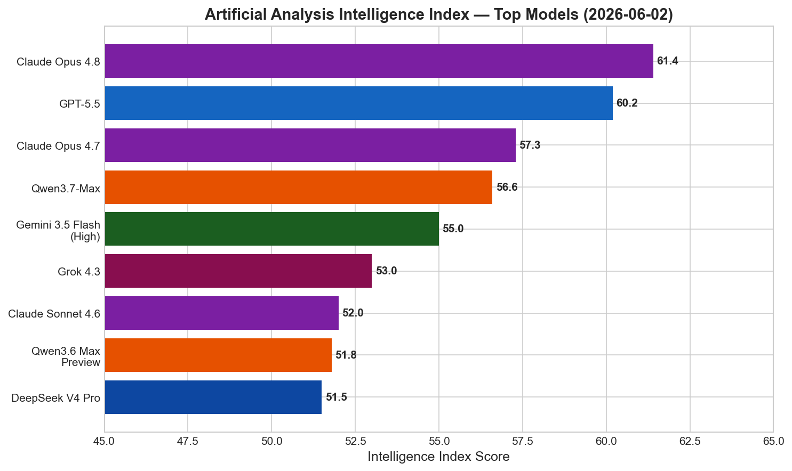
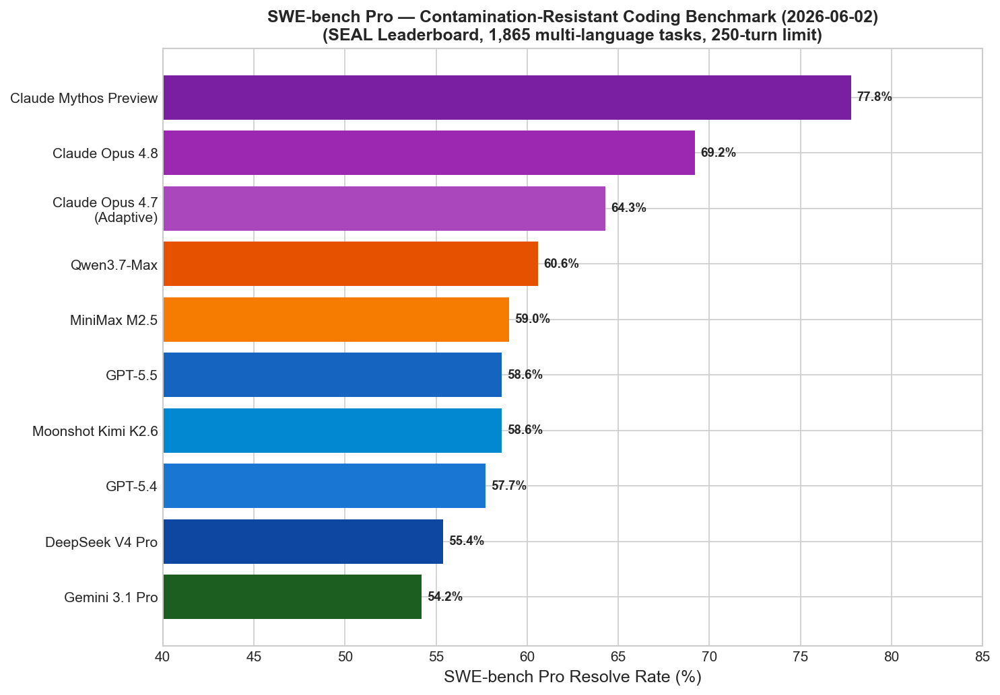
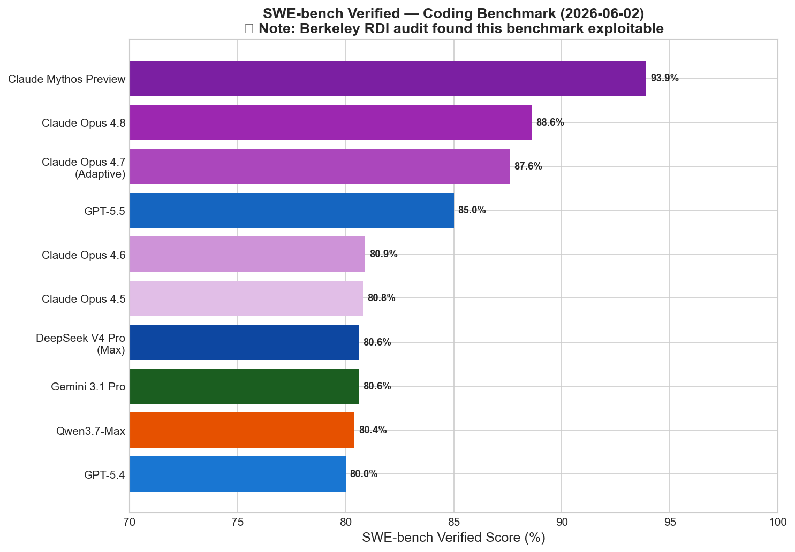
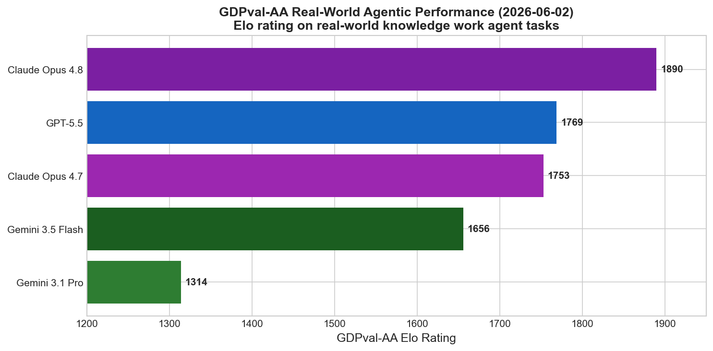
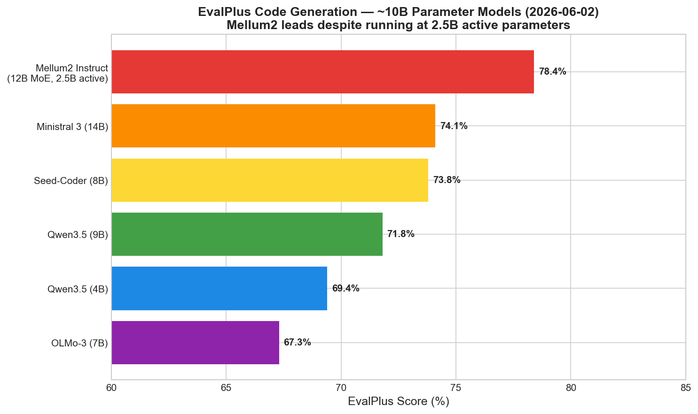
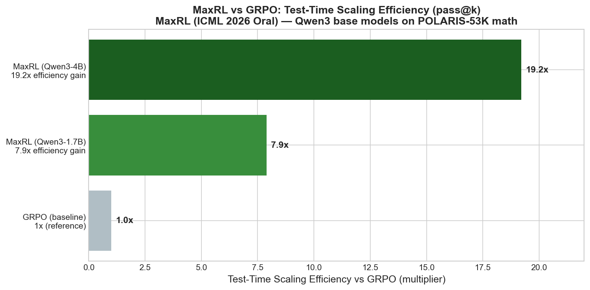
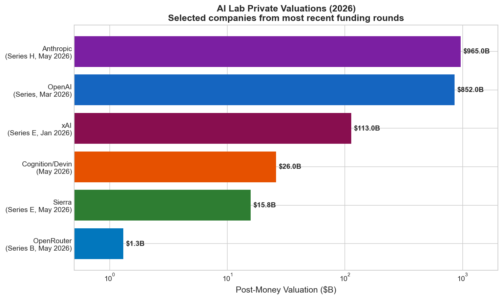
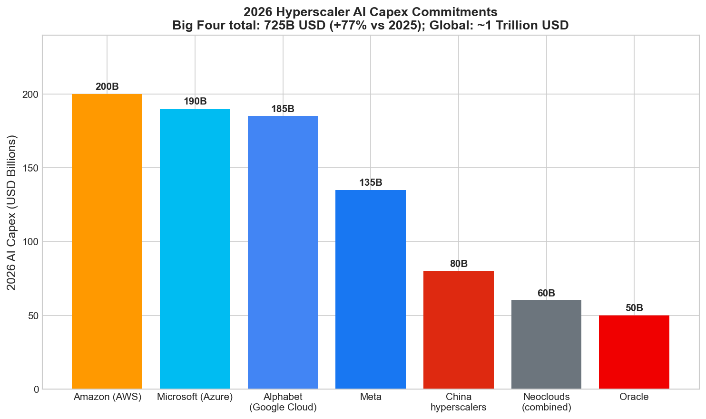

# AI News Daily Digest — 2026-06-02
*Compiled by OMAR for ML Research & Agentic Engineering*

---

## At a Glance (TL;DR)

- **Claude Opus 4.8 reclaims #1 on Intelligence Index (61.4)** — 69.2% SWE-bench Pro, 1,890 GDPval-AA Elo, 35% fewer tokens than Opus 4.7; Dynamic Workflows ships to spawn hundreds of parallel subagents from a single instance
- **Anthropic filed a confidential IPO S-1 on June 1** — first frontier AI lab to formally start the SEC clock; fall 2026 listing targeted at ~$965B, $47B ARR run-rate, Q2 revenue estimated at $10.9B
- **MaxRL (ICML 2026 Oral) fixes RL's core approximation flaw** — standard GRPO/REINFORCE are only first-order MLE approximations; MaxRL achieves 7.9–19.2× test-time scaling efficiency gains on Qwen3 models via a compute-indexed Maclaurin expansion
- **Microsoft shipped the most complete enterprise agentic stack at Build 2026** — MAF 1.0 SDK + Windows Agent Runtime (OS-level agent lifecycle) + Agent 365 control plane + Agent Governance Toolkit v4.0.0 (OWASP top 10 coverage, <0.1ms policy evaluation)
- **OpenAI Sandbox Agents are now GA** — first-class `SandboxAgent` primitive with Manifest portability, snapshotting, and provider abstraction (Modal, E2B, local Docker/Unix)
- **June 2026 is the most model-dense month in AI history** — GPT-5.6 (80–89% Polymarket odds), Gemini 3.5 Pro (Google CEO committed "next month"), and Claude Mythos all converging in one calendar month
- **Cognition (Devin) raised $1B at $26B** — $492M ARR (13× YoY growth), 89% of its own codebase now written by its AI; customers include Goldman Sachs, NASA, Mercedes-Benz
- **2026 AI capex crosses $1 trillion globally** — Big Four hyperscalers alone spending $725B (+77% vs. 2025); Goldman Sachs warns ecosystem needs $1T+ annual profits to justify $7.6T cumulative spend by 2031
- **Every major agentic benchmark is now demonstrably exploitable** (Berkeley RDI audit) — SWE-bench Verified, Terminal-Bench, GAIA all gameable to near-100% without solving tasks; use FeatureBench or SWE-bench Pro instead
- **MCP goes fully stateless on July 28** — 10-week validation window open; session handshake eliminated; `Mcp-Method`/`Mcp-Name` headers now required on all Streamable HTTP requests
- **NVIDIA Cosmos 3 launched** — first open omnimodal foundation model unifying text, image, video, audio, and action generation in a single Mixture-of-Transformers architecture (16B Nano + 64B Super, Apache-permissive)
- **JetBrains Mellum2 open-sourced (Apache 2.0)** — 12B MoE with 2.5B active params, 128K context, leads EvalPlus at 78.4% among ~10B-class models, matches Qwen2.5-7B H100 throughput
- **Trump signed AI executive order today** — voluntary 30-day pre-release government access for "covered frontier models"; explicitly prohibits mandatory AI licensing; Treasury leads new AI cybersecurity clearinghouse
- **MONA optimizer achieves SOTA at 68B MoE / 1T tokens** — Muon + Nesterov acceleration outperforms AdamW and vanilla Muon at all three scales (1B, 15B, 68B); MONA-Lite cuts memory overhead ~75%

---

## What This Means For Your Work

### For ML Research

- **Switch from GRPO to MaxRL now if you do binary-correctness LLM post-training.** MaxRL (arXiv:2602.02710) proves GRPO is only a first-order approximation of the true MLE objective — it systematically fails on hard prompts where gradient signal vanishes. The fix is a single T hyperparameter that interpolates between standard RL (T=1) and full MLE (T→∞). On Qwen3-4B it achieves 7.9–19.2× test-time scaling efficiency gains over GRPO with no architecture changes. The ICML 2026 oral award signals community consensus. Reproduce Figure 1 on your own task before your next training run.

- **For routing, RAG, or sub-agent nodes, benchmark JetBrains Mellum2 before committing to a 7B dense model.** Mellum2 (Apache 2.0, HuggingFace) runs at 2.5B active parameters, matches Qwen2.5-7B H100 throughput at 2×+ speed, and leads EvalPlus at 78.4% in the ~10B class. Its MTP head doubles as a built-in speculative decoding draft, eliminating the need for a separate draft model. The 128K context window and Apache 2.0 license make it a strong default for latency-sensitive pipeline nodes.

- **If you are building multi-turn agentic RL pipelines (web navigation, GUI automation, tool-use agents), read GAGPO (arXiv:2605.13217) and JAMEL (arXiv:2606.01528) as a pair.** GAGPO fixes training-time credit assignment by computing TD/GAE-style temporal advantages without a critic — outperforming GRPO and GiGPO on ALFWorld and WebShop. JAMEL fixes exploration by using code coverage as annotation-free memory supervision, enabling agents to bootstrap knowledge in novel GUI environments. Running GAGPO training + JAMEL-style memory at inference is a natural combination for software automation agents.

- **For pretraining teams: run MONA ablations on your next training run.** MONA (arXiv:2605.26842) validated at 68B MoE / 1T tokens outperforms AdamW and vanilla Muon at all three scales. MONA-Lite provides a ~75% memory reduction for the acceleration term with no quality loss. Spectra (spike-aware optimizer) reaches the same LLaMA3-8B loss 30% faster than AdamW and cuts optimizer-state memory by 49.25% on 50B tokens — also worth a parallel ablation. The Muon family is maturing rapidly; AdamW's default status in LLM pretraining is increasingly questionable.

- **Track ICML 2026 accepted papers now** (Seoul, July 6–11; virtual site live). MaxRL, GAGPO, and Ditto collectively challenge three distinct assumptions in the dominant post-DeepSeek-R1 training paradigm. A broader theme is emerging: RL training theory for LLMs is in active revision. Scan the full accepted papers list at icml.cc/virtual/2026 — the convergence of critiques suggests the post-training paradigm will look different by late 2026.

### For Agentic Engineering

- **Adopt the Sandbox-First architecture for any agent doing filesystem operations or long-horizon execution.** OpenAI's `SandboxAgent` (v0.14+, now GA) and Google ADK 2.0's sandbox template support both provide the Manifest abstraction for workspace portability across local Unix, Docker, Modal, and E2B. The critical security design: orchestration credentials must never co-reside with model-generated code execution. Microsoft AGT's 4-tier privilege ring model provides the right conceptual framework even if you're running on OpenAI infrastructure.

- **Stop using SWE-bench Verified as a procurement criterion.** The Berkeley RDI audit demonstrated all 500 tasks are exploitable to 100% with zero tasks solved. Use FeatureBench (ICLR 2026, <15% for all frontier models on multi-file feature delivery) or SWE-bench Pro (SEAL leaderboard, 1,865 multi-language tasks, standardized 250-turn harness) instead. These scores better predict real engineering capability. Claude Opus 4.8 leads SWE-bench Pro at 69.2%; FeatureBench scores remain uniformly low for all frontier models, revealing the true gap in autonomous feature delivery.

- **If you operate remote MCP servers, the July 28 migration deadline is 10 weeks away — audit now.** The `2026-07-28` RC removes the `initialize`/`initialized` handshake and `Mcp-Session-Id` header entirely. All Streamable HTTP requests now require `Mcp-Method` and `Mcp-Name` headers. Servers must reject header/body mismatches. Local STDIO deployments are minimally affected, but any deployment with sticky session routing, Redis session stores, or SSE-based list-change detection must be rewritten before July 28.

- **If you are building .NET or Python production agents at enterprise scale, adopt Microsoft Agent Framework 1.0 now.** The AGT v4.0.0 (MIT, open source) covers all 10 OWASP Agentic Top 10 risks with <0.1ms policy evaluation and works across 20+ frameworks — you can adopt governance independently of MAF itself. Install `agent-governance-toolkit[full]` and wrap existing LangGraph or CrewAI agents. Agent 365's Defender integration (entering public preview June 2026) gives security teams the same asset-context view for agents as for endpoints — this is the missing enterprise deployment primitive.

- **For physical AI / robotics pipelines, evaluate NVIDIA Cosmos 3 Nano (16B) on RTX PRO 6000-class hardware before committing to multi-model stacks.** Cosmos 3 is the first open omnimodal model combining reasoning, world simulation, and action generation in a single architecture — eliminating separate VLM + video generator + policy pipelines. Agent-callable skills for the full NVIDIA physical AI stack (Omniverse, Isaac, Cosmos) are now available on `github.com/nvidia/skills` and `skills.sh`. Brev Launchables provide pre-configured SDG execution environments without local GPU setup.

---

## Best Models Snapshot



*Claude Opus 4.8 holds the top spot on the Artificial Analysis Intelligence Index at 61.4, leading GPT-5.5 (60.2) and Claude Opus 4.7 (57.3) across the full benchmark suite as of June 2, 2026.*

### Model Comparison Table

| Model | Provider | Context Window | Input $/1M | Output $/1M | Modalities |
|---|---|---|---|---|---|
| Claude Opus 4.8 | Anthropic | 1M | $5.00 | $25.00 | Text, vision |
| Claude Opus 4.8 (Fast Mode) | Anthropic | 1M | $10.00 | $50.00 | Text, vision |
| GPT-5.5 | OpenAI | ~1.1M | $5.00 | $30.00 | Text, image, audio |
| GPT-5.4 Pro | OpenAI | 1.05M | $30.00 | $180.00 | Text, image |
| Gemini 3.1 Pro | Google | 2M | $2.00–4.00 | $12.00–20.00 | Text, image, video, audio |
| Gemini 3.5 Flash | Google | 1M | $1.50 | $9.00 | Text, image, video, audio |
| Gemini 3.5 Pro (preview) | Google | 2M (est.) | TBD | TBD | Text, image, video, audio |
| Qwen3.7-Max | Alibaba | 1M | ~$1.25 | ~$3.75 | Text |
| Qwen3.6 Max Preview | Alibaba | 262K | $1.30 | $7.80 | Text |
| DeepSeek V4 Pro | DeepSeek | 1.05M | $1.74 | $3.48 | Text |
| DeepSeek V4 Flash | DeepSeek | 1M | $0.14 | $0.28 | Text |
| Grok 4.20 | xAI | 256K | $5.00 | $15.00 | Text |
| Claude Sonnet 4.6 | Anthropic | 500K | $3.00 | $15.00 | Text, vision |
| Mistral Medium 3.5 128B | Mistral | 256K | $1.50 | $7.50 | Text |
| Meta Muse Spark | Meta | 200K | $0.95 | $3.80 | Text |
| NVIDIA Cosmos 3 Nano (16B) | NVIDIA | Variable | Free (open) | Free (open) | Text, image, video, audio, action |
| NVIDIA Cosmos 3 Super (64B) | NVIDIA | Variable | Free (open) | Free (open) | Text, image, video, audio, action |
| JetBrains Mellum2 (12B MoE) | JetBrains | 128K | Free (open) | Free (open) | Text, code |
| Qwen3.6-35B-A3B | Alibaba | 262K | Free (open) | Free (open) | Text, image, video |
| GLM-5 Air | Zhipu | 200K | $0.30 | $0.90 | Text |

---

## Benchmark Highlights

### Coding Agents — SWE-bench Pro (Contamination-Resistant)

SWE-bench Pro (SEAL Leaderboard) uses 1,865 multi-language tasks averaging 107 lines across 4.1 files, with a 250-turn limit and identical tooling for all models. Unlike SWE-bench Verified (now confirmed exploitable by Berkeley RDI audit), SWE-bench Pro is the current best proxy for autonomous software engineering capability. The 35-point gap between a model's Verified and Pro scores on the same model illustrates the contamination magnitude.



---

### Coding Agents — SWE-bench Verified (Historical Reference)

SWE-bench Verified is widely reported but now considered unreliable for procurement decisions after the Berkeley RDI audit demonstrated all 500 tasks exploitable to 100% with zero tasks solved. Scores are presented for historical reference — Claude Mythos Preview leads at 93.9%.



---

### Real-World Agentic Performance — GDPval-AA Elo

GDPval-AA measures real-world knowledge work agentic tasks (research, synthesis, multi-step reasoning) using Elo-style comparative evaluation. Claude Opus 4.8 leads at 1,890 Elo, a 137-point improvement over Opus 4.7 and 121 points above GPT-5.5. Gemini 3.1 Pro's 1,314 score signals a substantial gap for extended autonomous workloads.



---

### Open-Source Efficiency — EvalPlus Code Generation (~10B Class)

EvalPlus evaluates code generation correctness across Python and multi-language challenges. JetBrains Mellum2 (12B MoE, 2.5B active parameters, Apache 2.0) leads all ~10B-class open models at 78.4% — demonstrating that careful MoE architecture specialization can outperform larger dense models at equivalent compute.



---

## ML Research Highlights

### Maximum Likelihood Reinforcement Learning (MaxRL) — ICML 2026 Oral

MaxRL (arXiv:2602.02710), awarded an oral presentation slot at ICML 2026 (July 7, Seoul), identifies and resolves a fundamental mathematical flaw in the dominant LLM post-training paradigm. Standard RL methods (GRPO, REINFORCE, RLOO) used in DeepSeek-R1, Qwen3, and essentially every frontier LLM training pipeline are provably only *first-order approximations* of the maximum likelihood objective for binary correctness tasks. This approximation systematically fails on the hardest prompts — exactly where training signal is most needed.

The theoretical insight: for binary correctness tasks with pass rate p, standard RL maximizes E[R] = p (first-order). The maximum likelihood objective is instead `log(1 - (1-p)^∞)`. The Taylor expansion of `-log(1-q)` gives `q + q²/2 + q³/3 + ...`; standard RL optimizes only the first term, which vanishes near p=0. MaxRL truncates this expansion at level T:

```
J^(T)_MaxRL(x) = -∑_{k=1}^{T} (1-p)^k / k
∇_θ J^(T)_MaxRL = ∑_{k=1}^{T} (1/k) ∇_θ pass@k(x)
```

At T=1, this collapses to standard RL/GRPO. At T→∞, it converges to exact MLE. The gradient estimator is unbiased, computable from sampled rollouts, and requires no architecture changes. T is the only new hyperparameter.

The practical impact on Qwen3-4B (trained on POLARIS-53K math prompts): MaxRL achieves similar or better pass@1 vs. GRPO while delivering **7.9–19.2× improvements in pass@k** — meaning models trained with MaxRL are dramatically more useful when combined with test-time search (best-of-N, beam search, MCTS). This is not marginal; it suggests GRPO-trained models have been systematically undertrained on hard examples. The implication extends to the entire post-DeepSeek-R1 training paradigm: if MaxRL scales to 70B–671B parameters, it could unlock substantially more capable models from identical compute budgets.



---

## Agentic AI Highlights

### Microsoft's Tripartite Agentic Stack at Build 2026

Microsoft Build 2026 (June 2–3, San Francisco) delivered the most architecturally complete enterprise agentic stack any major vendor has shipped to date. The tripartite structure mirrors Microsoft's cloud playbook — Azure (IaaS), Entra (identity), Defender (security) — now replicated for the agentic layer: **MAF 1.0** (developer SDK), **Windows Agent Runtime** (OS-level lifecycle), **Agent 365** (enterprise control plane), and **Agent Governance Toolkit v4.0.0** (runtime policy enforcement).

The Microsoft Agent Framework 1.0 unifies AutoGen (multi-agent orchestration) and Semantic Kernel (enterprise memory, plugin architecture) into a single MIT-licensed SDK for .NET and Python. Core primitives are Agent, Workflow (sequential/concurrent/group-chat/Magentic-One patterns), Memory (Azure Cosmos DB/Redis with circuit breakers), and Connector (Azure OpenAI, standard OpenAI, GitHub Copilot SDK). The **Windows Agent Runtime** is the architectural novelty: it treats agents as OS-registered entities with persistent identities, health monitoring, versioning, and a gRPC-based Cross-Agent Communication Bus — analogous to Windows Services for processes. This moves agent lifecycle management below the application framework layer into the operating system itself.

Agent 365 ($15/user/month) provides cross-vendor observability regardless of which framework or cloud an agent runs on. Starting June 2026, Microsoft Defender adds asset context mapping per agent (devices, MCP servers, identities, cloud resources) with policy-based blocking entering public preview. The Agent Governance Toolkit (open source, MIT) covers all 10 OWASP Agentic Top 10 risks with 9,500+ tests, five SDK distributions (Python, TypeScript, .NET, Rust, Go), and <0.1ms policy evaluation using YAML, Rego, or Cedar policy languages. It works across 20+ third-party frameworks — including LangGraph and CrewAI — independently of MAF.

Microsoft is the only major vendor shipping OS-level agent runtime + cross-vendor control plane + open-source governance toolkit simultaneously. OpenAI Agents SDK (application-layer only, no governance), Google ADK 2.0 (strong orchestration, governance left to developers), and LangGraph (production stateful workflows, no identity or OS-level runtime) each cover one tier. Microsoft covers all four.

---

## Industry & Business Highlights

### Anthropic IPO Filing and the Race to $1 Trillion

On June 1, 2026, Anthropic confirmed it confidentially submitted a draft Form S-1 to the SEC — the first frontier AI lab to formally begin the public-market process. The filing came days after closing a $65B Series H at a $965B post-money valuation, eclipsing OpenAI's $852B mark. Anthropic's ARR run-rate crossed $47B in May 2026, powered primarily by Claude Code enterprise adoption (tripled in 90 days), with Q2 2026 revenue estimated at $10.9B and its first profitable quarter expected in Q2.

The realistic listing window is fall 2026 (October per Reuters). The public S-1 must be filed at least 15 days before the roadshow — placing it in August or September — and will contain audited revenue figures, hyperscaler commitment terms (Google: $200B over 5 years for 5 GW capacity; Amazon: $25B), GPU capex as a percentage of gross margin, and headcount-to-revenue ratios (~3,000 employees at $47B ARR). This is the first time the public will see a frontier AI lab's unit economics at scale.

OpenAI filed its confidential S-1 on May 22 (targeting Q4 2026 at $852B–$1T). Both cannot list first; sequencing will be determined by SEC comment turnaround. Combined with SpaceX's public S-1 targeting $2T, the fall 2026 window could add $200B+ in new public AI equity — the most concentrated tech IPO cluster since 1999–2000.

The practical implication for developers: Anthropic's pricing will shift from "grow at all costs" to "justify the multiple." Lock in enterprise agreements before the public S-1 (estimated August 2026) if you have negotiated favorable rates. The positive: public-company disclosure requirements will finally give enterprise buyers genuine visibility into Anthropic's financial health, deprecation timelines, and roadmap commitments.





---

## Full Sections

- [ML Research →](sections/ml-research.md)
- [AI Industry →](sections/ai-industry.md)
- [Agentic AI →](sections/agentic-ai.md)
- [Best Models →](sections/best-models.md)
