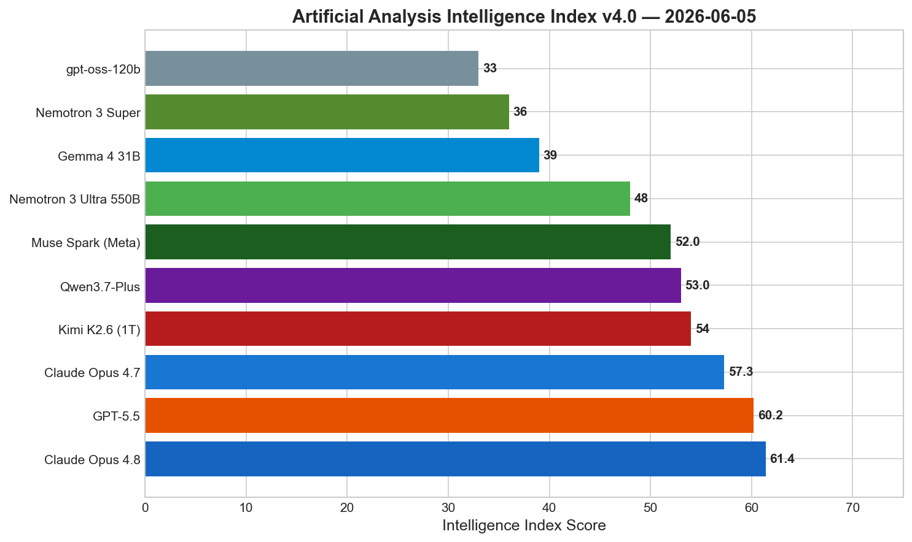
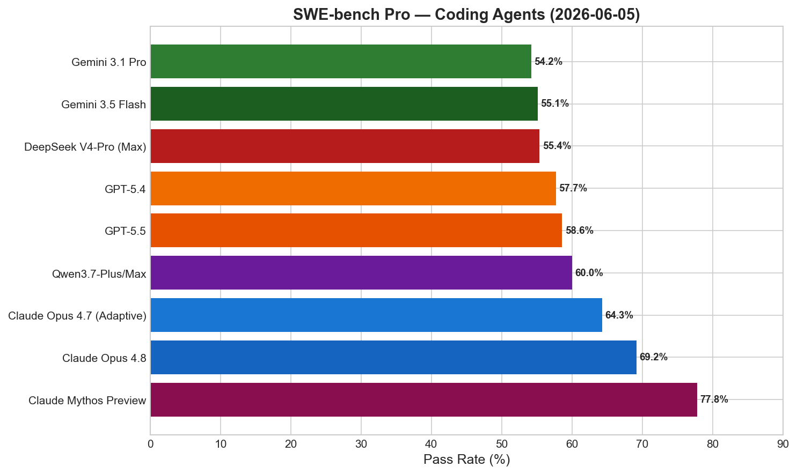
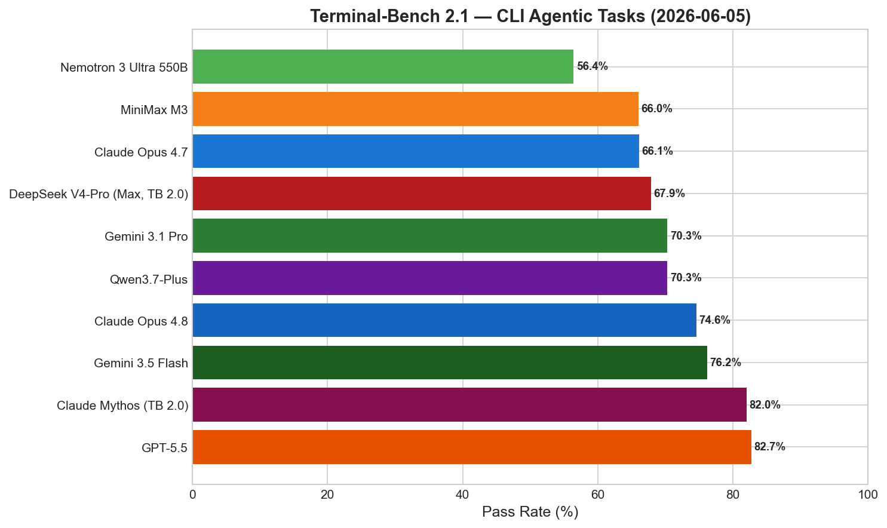
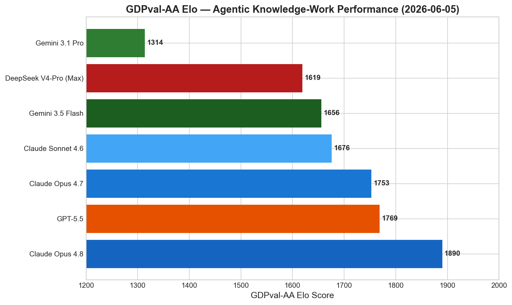
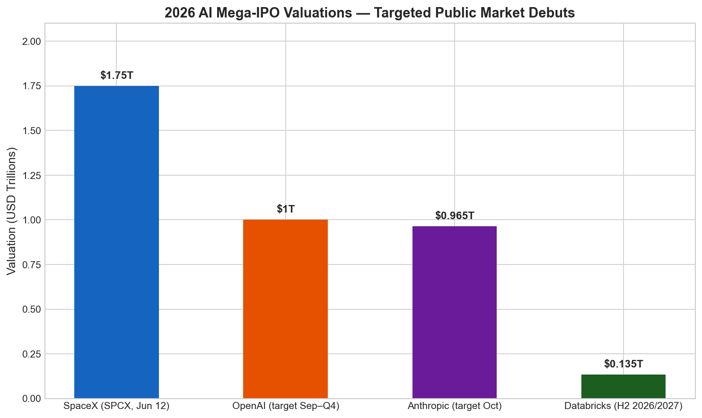
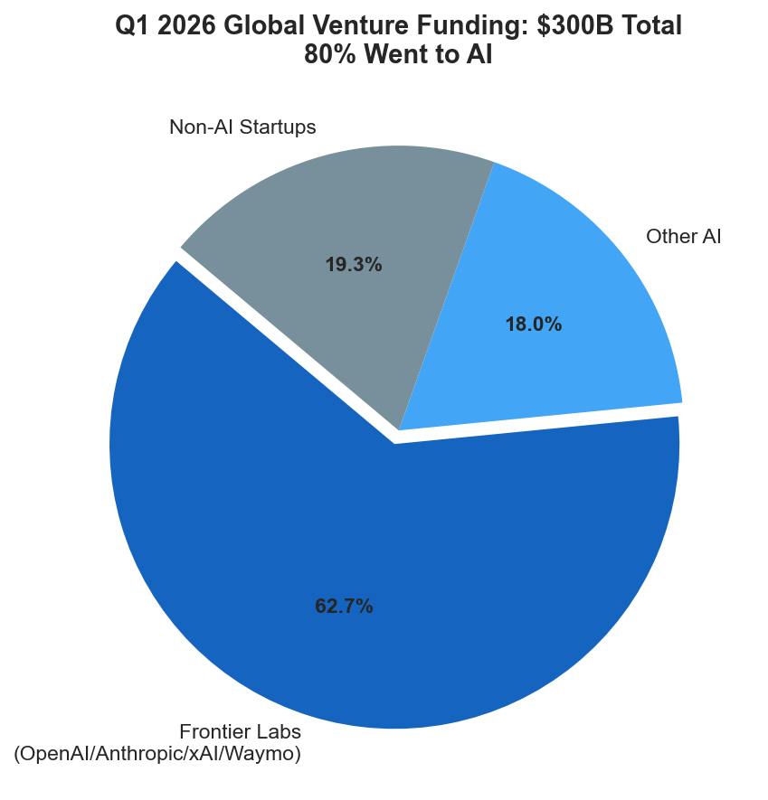

# AI News Daily Digest — 2026-06-05
*Compiled by OMAR for ML Research & Agentic Engineering*

---

## At a Glance (TL;DR)

- **NVIDIA Nemotron 3 Ultra (550B/55B active)** sets a new US open-weights intelligence record at 48 on the AA Intelligence Index — 5–6× inference throughput advantage over comparable open models, 30% lower per-agentic-task cost, 1M-token context, fully open under OpenMDW-1.1.
- **Claude Opus 4.8 holds the #1 spot overall on AA Intelligence Index at 61.4** — 69.2% SWE-bench Pro, 1,890 GDPval-AA Elo, 57.9% HLE (with tools); Dynamic Workflows ship alongside enabling 1,000-subagent parallelism.
- **Claude Code Dynamic Workflows (research preview)** lets Claude write its own JavaScript orchestration harness — up to 16 concurrent subagents per step, model-routing per step, adversarial verification loops, and saveable reusable slash commands.
- **Gemini 3.5 Flash is GA at $1.50/M input** and beats the previous Pro flagship on 11 of 15 benchmarks, including a 342-point GDPval-AA swing — the biggest agentic-performance jump in Google's model history.
- **SpaceX launched the world's largest-ever IPO roadshow on June 4** — $75B at $1.75T valuation, with orbital AI data centers as the primary growth thesis; Nasdaq debut (SPCX) set for June 12.
- **Congress released the bipartisan Great American AI Act on June 4** — 269-page draft that would preempt state AI model laws for 3 years, create a $300M CAISI at NIST, and mandate frontier risk disclosures.
- **MiniMax M3** is the first open-weight model unifying frontier coding (SWE-bench Pro 59%), 1M context, and native multimodality; its MSA architecture achieves 9.7× faster prefill and 15.6× faster decode at 1M context vs. prior generation.
- **Microsoft launched seven in-house MAI models at Build 2026** — MAI-Thinking-1 (97% AIME 2025), MAI-Code-1-Flash (5B active, GitHub Copilot-integrated) — breaking reliance on OpenAI at the model layer.
- **CVPR 2026 is live** (June 5–7, Nashville) — SAM 3D (Meta, Best Paper Honorable Mention) and D4RT (Google DeepMind, Award Candidate) both presenting oral sessions today, redefining 3D/4D reconstruction with unified Transformer architectures.
- **OmniOPD enables black-box distillation from proprietary APIs** (Claude, Gemini, GPT) without logit access — +45% relative gain over white-box OPD on math; removing KL anchor causes 69% → 8% catastrophic collapse.
- **OpenAI expanded GPT-Rosalind globally on June 3** — first domain-specific frontier model for life sciences uses 31% fewer tokens than GPT-5.5 for genomics tasks; partners include Amgen, Moderna, Allen Institute.
- **A2A protocol v1.0.1 is in production with 150+ organizations** (Salesforce, SAP, ServiceNow, Workday, Microsoft, AWS) — MCP + A2A is now the de-facto agent interoperability stack.
- **Q1 2026 global VC funding hit $300B** — 80% went to AI, with $188B going to the top 4 frontier labs; the $3.5T AI IPO supercycle (SpaceX + Anthropic + OpenAI) is now live.
- **AutoGen is in maintenance mode** as of April 2026 — Microsoft MAF 1.0 (AutoGen + Semantic Kernel merged) is the official successor; OWASP published the 4-level Enterprise Adoption Maturity Model for agentic AI governance.

---

## What This Means For Your Work

### For ML Research

- **Long-context inference is now practically viable at open-weights scale.** Nemotron 3 Ultra's Ruler@1M = 95% with 5–6× throughput advantage makes it the first open-weight model credibly deployable at 1M token context for production systems. MiniMax M3's MSA architecture (9.7× faster prefill, 15.6× faster decode, 1/20 the per-token compute at 1M context) demonstrates that GQA block-selection with "KV outer gather Q" is the current hardware-optimal sparse attention design. If you are implementing custom attention kernels, the decode speedup exceeding prefill speedup is a principled result from different compute profiles — replicate it.

- **OmniOPD removes the last barrier to proprietary-model distillation.** The requirement for white-box logit access has blocked researchers from using Claude, Gemini, or GPT as distillation teachers. OmniOPD's Monte Carlo rollout-based semantic verification solves this, yielding +45.31% relative gains over standard white-box OPD on math. The critical engineering insight: removing the base-model KL anchor on unaudited tokens causes policy collapse from 69% → 8% — sparse supervision signals over long trajectories require explicit regularization or the policy degenerates.

- **CVPR 2026's top results (SAM 3D, D4RT) signal unified Transformer architectures are displacing task-specific decoders in 3D/4D vision.** SAM 3D's 5:1 human-preference win rate over prior SOTA, and D4RT's linear-complexity query-based decoder that jointly handles depth, correspondence, and camera parameters in one forward pass, both demonstrate the same principle: scale (data + model size) drives consistent gains when the architecture is unified. Researchers building 3D/4D systems should move away from encoder-decoder separation.

- **Evaluation methodology is shifting under frontier researchers' feet.** Nemotron 3 Ultra's PinchBench (90.0) was scored once on the final model — the right methodology following Berkeley RDI's April 2026 findings on SWE-bench Verified exploitability. Treat any model score on standard benchmarks (SWE-bench Verified, GAIA, Terminal-Bench) as potentially inflated. Prefer held-out proprietary evaluations, SWE-bench Pro, or vals.ai's minimal bash-only harness for production-predictive numbers.

- **NVFP4 pre-training at 550B scale is a landmark for training-stack research.** E2M1 format with 2D block quantization is now demonstrated as stable at frontier scale. Combined with LatentMoE routing and on-policy distillation, the convergence of native FP4 training, MoE sparsity, SSM long-context efficiency, and MOPD suggests the next generation of competitive open models needs all four.

### For Agentic Engineering

- **Claude Code Dynamic Workflows collapses the gap between bespoke orchestration frameworks and the default single-agent loop.** The meta-harness primitive — intent → AI-generated JS orchestration script → runtime-executed parallel subagents → synthesized result — means orchestration expertise is no longer a prerequisite. But governance is essential: generated scripts can spawn hundreds of subagents and consume 10–50× tokens of a standard session. Audit every generated workflow before production use; implement token budget guardrails and filesystem scope restrictions.

- **Ephemeral credential brokering for agent identity is now a compliance requirement, not a nice-to-have.** OWASP EAMM Level 2 requires it; NIST is moving toward regulatory codification. The canonical pattern is task-scoped credentials issued by a broker (Ephyr, Strata Maverics, Workday ASOR) at spawn time — cryptographically bound to a private key, 5-minute TTL for SSH certificates, scope that can only narrow as delegation flows to subagents. Every agent spawn should be a credential issuance event.

- **The MCP + A2A interoperability stack is now enterprise reality, not experiment.** A2A v1.0.1 (May 28) is in production with 150+ organizations. MCP handles agent-to-tool access; A2A handles agent-to-agent orchestration via JSON-RPC 2.0 + SSE + Agent Cards. If you are building multi-agent systems in 2026, implement both; the roadmap adds `QuerySkill()` for runtime capability introspection and dynamic mid-task UX negotiation.

- **Use SWE-bench Verified via vals.ai minimal bash-only harness for fair comparisons.** The gap between scaffold-assisted numbers (Claude Mythos Preview: 93.9%) and minimal-harness numbers (GPT-5.5: 82.6%, Claude Opus 4.7: 82.0%) is the scaffolding delta — your production agent will look like the minimal-harness numbers, not the lab-reported numbers. SWE-bench Pro is now the preferred production evaluation.

- **Enterprise SaaS procurement should renegotiate contracts around consumption or outcome-based pricing immediately.** Salesforce ($0.10/action), ServiceNow (AI-specific ARR targeting $1B in 2026), and Workday (Flex Credits) have already pivoted. Per-seat models are structurally misaligned as agents do the work previously done by named human users. Define what "action" means in your contract before signing any renewal.

---

## Best Models Snapshot

*AA Intelligence Index v4.0: Claude Opus 4.8 leads at 61.4; Kimi K2.6 tops open-weights at 54; Nemotron 3 Ultra is the best US open-weights model at 48.*

### Model Comparison Table

| Model | Provider | Context Window | Input $/1M | Output $/1M | Modalities |
|---|---|---|---|---|---|
| Claude Opus 4.8 | Anthropic | 1M | $5.00 | $25.00 | Text, Image |
| Claude Opus 4.7 | Anthropic | 1M | $5.00 | $25.00 | Text, Image |
| GPT-5.5 | OpenAI | 1M | $5.00 | $30.00 | Text, Image, Audio, Video |
| GPT-5.5 Pro | OpenAI | 1M | $30.00 | $180.00 | Text, Image, Audio, Video |
| Gemini 3.5 Flash | Google | 1M | $1.50 | $9.00 | Text, Image, Video, Audio, PDF |
| Gemini 3.1 Pro | Google | 1M | $2.00 | $12.00 | Text, Image, Video, Audio |
| Grok 4.3 | xAI | 1M (est.) | ~$3.00 | ~$15.00 | Text, Image |
| DeepSeek V4-Pro | DeepSeek | 1M | $1.74 | $3.48 | Text |
| DeepSeek V4-Flash | DeepSeek | 1M | $0.14 | $0.28 | Text |
| Qwen3.7-Plus | Alibaba | 1M | $0.40 | $1.60 | Text, Image, Video |
| Qwen3.7-Max | Alibaba | 1M | $2.50 | $7.50 | Text only |
| Meta Muse Spark | Meta | N/A (API preview) | Not disclosed | Not disclosed | Text, Image (multimodal) |
| Claude Mythos Preview | Anthropic | 1M | $25.00 | $125.00 | Text, Code (gated) |
| Gemini 3.5 Pro (pending) | Google | 2M (projected) | ~$15.00 (est.) | ~$60.00 (est.) | Text, Image, Video, Audio |
| Mistral Medium 3.5 | Mistral | 256K (est.) | ~$2.00 | ~$6.00 | Text |

---

## Benchmark Highlights

### Intelligence Index & Overall Model Ranking

Claude Opus 4.8 tops the Artificial Analysis Intelligence Index v4.0 at 61.4, edging out GPT-5.5 (60.2) by 1.2 points. Among open-weight models, Kimi K2.6 leads at 54, followed by NVIDIA Nemotron 3 Ultra at 48 — the highest score ever recorded for a US-origin open-weights model, closing the gap with the Chinese-led open-weights frontier substantially.

---

### SWE-bench Pro — The New Standard for Coding Agents

SWE-bench Pro is supplanting SWE-bench Verified as the primary coding benchmark following Berkeley RDI's April 2026 findings that Verified is gameable. Claude Mythos Preview (restricted to critical-infrastructure partners) holds the ceiling at 77.8%; Claude Opus 4.8 is the best publicly accessible model at 69.2%.

---

### Terminal-Bench 2.1 — CLI Agentic Tasks

GPT-5.5 leads terminal/shell-intensive autonomous workflows at 82.7%, making it the strongest choice for pure CLI-driven agents despite trailing Claude Opus 4.8 on most other benchmarks. MiniMax M3 and Kimi K2.6 cluster at 66–67%, while Nemotron 3 Ultra scores 56.4% — a relative weakness despite its overall intelligence lead.

---

### GDPval-AA Elo — Agentic Knowledge-Work

GDPval-AA measures real-world agentic knowledge-work quality via Elo. Claude Opus 4.8 dominates at 1,890 Elo, a 121-point lead over GPT-5.5 (1,769). Gemini 3.5 Flash's 1,656 Elo — achieved at $1.50/M — is the most striking value proposition on this chart: it outperforms the previous Gemini 3.1 Pro (1,314) by 342 Elo points at 25% lower cost.

---

## ML Research Highlights

### NVIDIA Nemotron 3 Ultra — The Watershed Moment for US Open-Weights AI

Released June 4, 2026, NVIDIA Nemotron 3 Ultra is a 550B-parameter Mixture-of-Experts model with only 55B active parameters — the largest and most capable US-origin open-weights model available today, scoring 48 on the Artificial Analysis Intelligence Index. This closes the significant capability gap that previously existed between US open-weights releases (GPT-oss-120B at 33, Gemma 4 31B at 39) and the Chinese-led open frontier (Kimi K2.6 at 54).

The model's architecture combines three compounding innovations: hybrid Mamba-Transformer layers for linear-complexity long-context processing, LatentMoE for dense expert routing in compressed latent space, and native NVFP4 quantization enabling a single checkpoint to deploy across Hopper, Blackwell, and Ampere GPUs. Two Multi-Token Prediction (MTP) heads with shared parameters enable native speculative decoding, producing the 5.9× throughput advantage over GLM-5.1 measured on GB200 (8K input / 64K output). The NVFP4 pre-training at 550B scale is the largest demonstration of stable E2M1 training published to date.

For production agentic workloads, Nemotron 3 Ultra reduces per-turn cost by up to 30% vs. models at comparable accuracy, with a 1M-token context window achieving Ruler@1M = 95%. Its AA-Omniscience score of 78.7 — the highest non-hallucination score in its comparison set — suggests materially lower confabulation rates on knowledge tasks. The model is fully open under OpenMDW-1.1: weights, data (where redistribution rights exist), training recipes, and software.

The training methodology centered on Multi-Teacher On-Policy Distillation (MOPD) from ten specialized domain-teacher models, combined with multi-environment RL. This positions Nemotron 3 Ultra as the convergence proof that MoE sparsity, linear-complexity SSMs, native low-precision training, and on-policy distillation can be combined stably at frontier scale — with full openness. Organizations previously forced to use proprietary APIs for frontier performance now have a credible open alternative for agentic workloads.

---

### MiniMax M3 — First Open-Weight Model Unifying Frontier Coding, 1M Context, and Multimodality

Released June 1, 2026, MiniMax M3 is the first open-weight model to simultaneously achieve frontier-level coding (59.0% SWE-Bench Pro), a 1M-token context window, and native multimodal inputs (text, image, video). The enabling technology is MiniMax Sparse Attention (MSA), a block-level KV-cache selection architecture that cuts per-token compute at 1M context to 1/20th of the prior generation.

MSA's core mechanism operates on uncompressed GQA key-value pairs, preserving precision and prefix-caching compatibility — unlike latent-compression approaches. At 1M context, MSA achieves 9.7× faster prefill and 15.6× faster decode than M2. The decode speedup exceeding prefill speedup is principled: during decode each query touches only selected KV blocks (~6–7% of 1M), while prefill requires scanning all tokens. Output speed reaches ~100 tokens/sec, approximately 3× faster than Claude Opus. Weights and technical report are due within 10 days of the June 1 launch.

---

### CVPR 2026 — SAM 3D and D4RT Redefine 3D/4D Reconstruction

CVPR 2026 is live in Nashville (June 5–7). Two papers with oral sessions today set new benchmarks for 3D vision. SAM 3D (Meta AI, Best Paper Honorable Mention) achieves single-image 3D object reconstruction by combining a human-and-model-in-the-loop annotation pipeline with multi-stage training (synthetic pre-training + real-world alignment fine-tuning), achieving a ≥5:1 human preference win rate over prior SOTA. D4RT (Google DeepMind, Award Candidate) provides unified feedforward 4D reconstruction from a single video using a query-based decoder that scales linearly with the number of queried points — handling depth, spatio-temporal correspondence, and camera parameters in one forward pass without task-specific decoders.

---

## Agentic AI Highlights

### Claude Code Dynamic Workflows — When the Agent Writes the Orchestrator

Claude Code v2.1.154+ ships a research-preview feature that fundamentally rethinks what a coding agent session means. When you ask Claude to "create a workflow" or invoke `ultracode` mode, Claude writes a JavaScript orchestration script that fans work across up to 16 concurrent subagents (up to 1,000 total per run), each in its own isolated context window. The script — not the conversation — holds intermediate results, preventing context bleed even on 500-file migrations.

The architectural shift is that Claude moves from executor to planner. Common patterns that emerge include fan-out-and-synthesize, adversarial verification (one agent challenges another's output), loop-until-done, and classify-and-act with model routing (Haiku for bulk steps, Opus 4.8 for reasoning-heavy stages). Successful workflow scripts save to `~/.claude/workflows/` and become reusable slash commands shareable across teams.

This closes the gap between bespoke orchestration systems (LangGraph, CrewAI) and the default single-agent loop. The competitive implication: Anthropic now has the strongest "agent-writes-the-agent-framework" story in the market — more AI-native than LangGraph (developer writes the graph), more opinionated than OpenAI Sandbox Agents (engineer writes the SandboxAgent + Manifest). The governance caveat is real: generated scripts can spawn hundreds of subagents and consume 10–50× tokens without mid-run human checkpoints. Enterprise deployments should audit every workflow script before allowing broad scheduling use.

### OWASP Agentic AI Security: Enterprise Adoption Maturity Model

OWASP published "State of Agentic AI Security and Governance v2.01" and debuted the Enterprise Adoption Maturity Model (EAMM) at InfoSecurity Europe (June 4). EAMM is a two-axis diagnostic (deployment scope × governance maturity) with four levels: Level 0 (unaware/ad hoc), Level 1 (experimentation without guardrails), Level 2 (policy-defined with HITL and AI-SBOM), Level 3 (integrated continuous oversight with real-time behavioral monitoring, kill switches, governance-as-code, ephemeral credentials, and cryptographic attestation per action). The framework cross-maps to the OWASP Top 10 for Agentic Applications 2026 and the AIUC-1 Crosswalk identifying 8 priority gap areas.

---

## Industry & Business Highlights

### SpaceX $75B IPO — The AI Infrastructure Bet That Sets the Market Temperature

SpaceX launched its formal investor roadshow on June 4, targeting $75 billion at a fixed $135/share — a $1.75 trillion valuation for a June 12 Nasdaq debut under SPCX. The fixed-price structure (breaking with demand-testing range convention), the all-primary structure (no secondary shares), and the AI narrative as primary valuation lever ($7.7B of $10.1B Q1 capex went to the xAI AI division vs. $930M for Starship) make this the most unconventional mega-IPO in history.

The critical context: Morningstar values SpaceX at $780B — a 55% discount to the ask — and $62.8B of the $75B raised is committed to repaying Musk-related vendor and investor debt before capital reaches AI ambitions. The long-run orbital data center thesis has multi-decade payback periods. However, the competitive implications are significant regardless of whether SPCX sustains its valuation: a successful debut sets the benchmark that makes Anthropic's $965B October target and OpenAI's ~$1T September target look achievable, potentially accelerating both timelines and increasing total capital available to frontier AI labs. If SPCX trades down materially, the risk-off signal could delay both listings and tighten private funding markets for mid-tier AI startups.

### Q1 2026 Venture Funding: 80% of $300B Goes to AI

---

## Full Sections

- [ML Research →](sections/ml-research.md)
- [AI Industry →](sections/ai-industry.md)
- [Agentic AI →](sections/agentic-ai.md)
- [Best Models →](sections/best-models.md)
